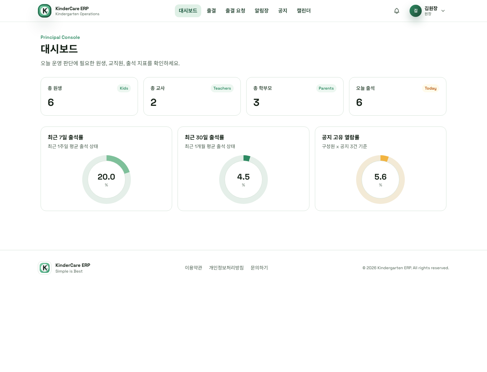
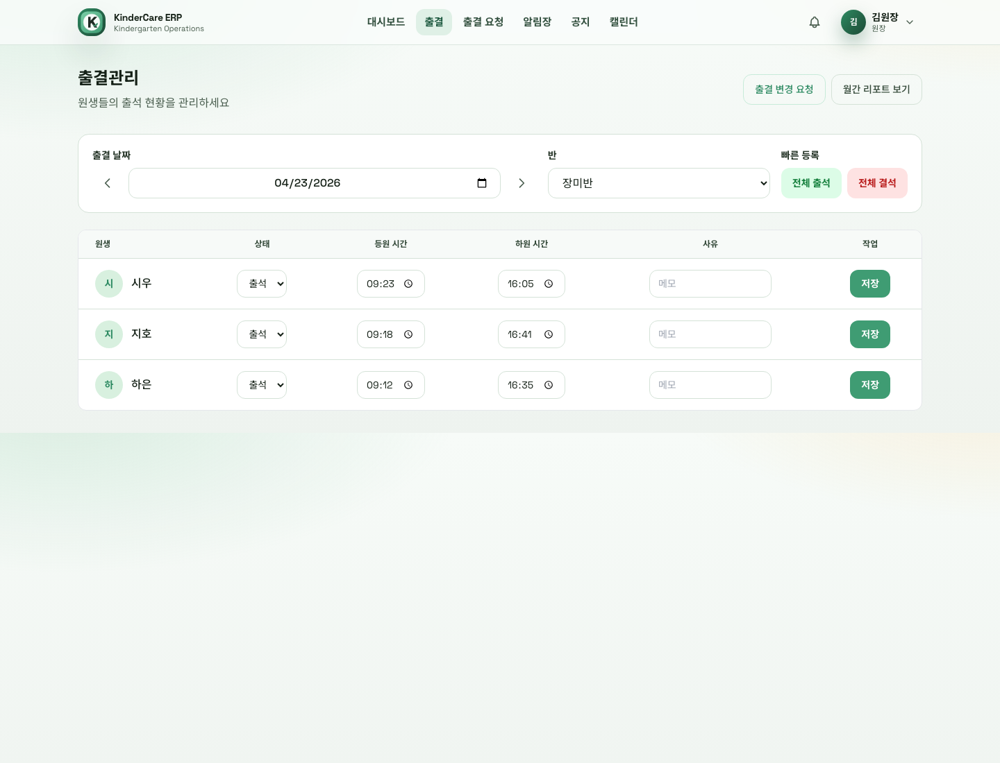
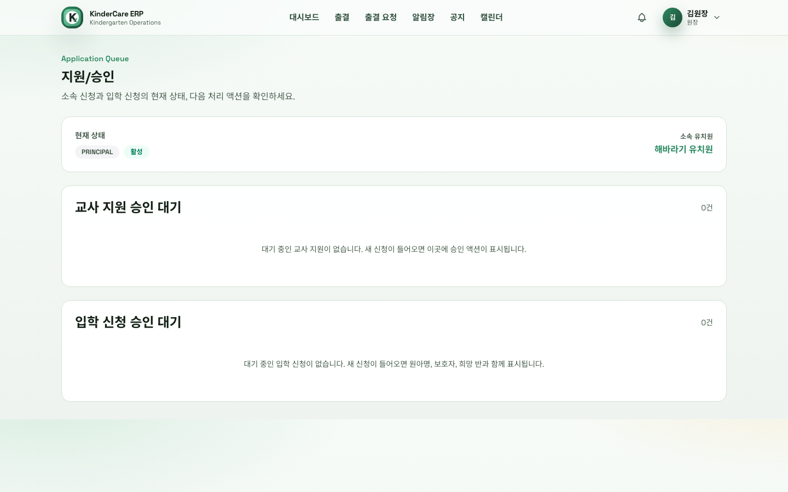
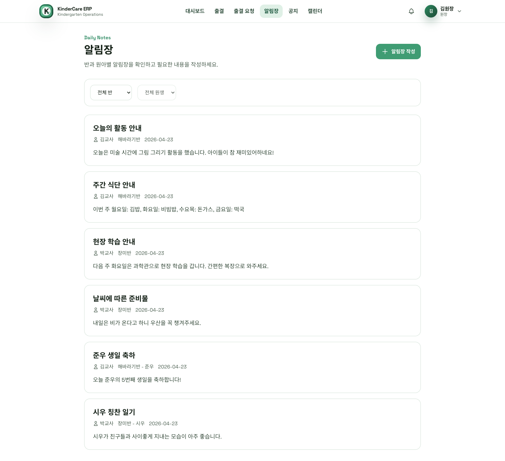
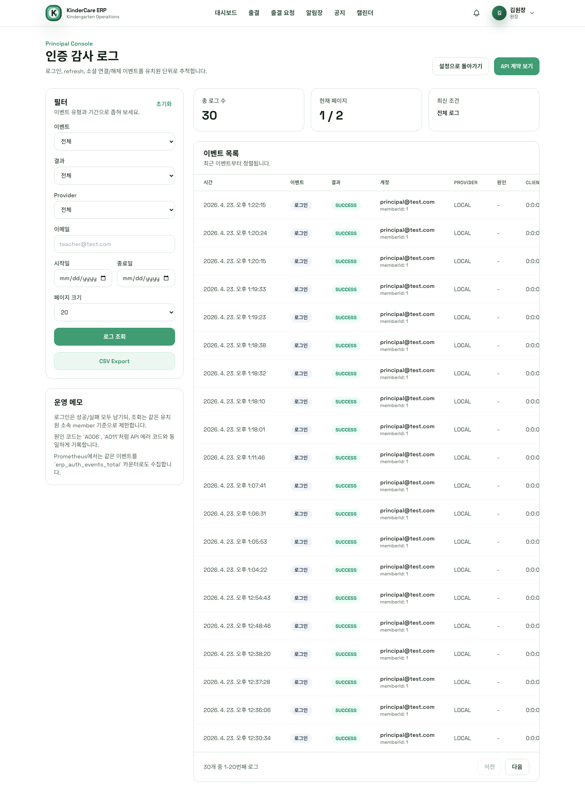
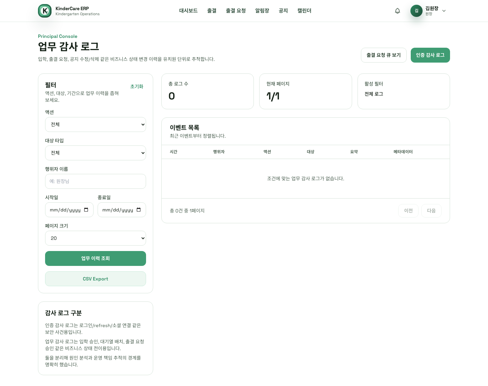

# Kindergarten ERP

> 유치원 운영 ERP를 주제로, 인증/권한/상태 전이/감사/관측성을 끝까지 다룬 Spring Boot 백엔드 포트폴리오입니다.

[](https://openjdk.org/)
[](https://spring.io/projects/spring-boot)
[](https://www.mysql.com/)
[](https://redis.io/)
[](https://github.com/answndud/Kindergarten_ERP/actions/workflows/ci.yml)

## 한눈에 보기

| 항목 | 내용 |
|------|------|
| 프로젝트 성격 | 백엔드 포트폴리오 프로젝트 |
| 포트폴리오에서 강조한 역량 | 백엔드 설계/구현, 보안, 테스트/CI, 운영 관측성 |
| 핵심 사용자 | `PRINCIPAL`, `TEACHER`, `PARENT` |
| 핵심 기술 | Java 21, Spring Boot 3.5.9, MySQL 8, Redis, JPA, QueryDSL |
| 실행 프로필 | `local`, `demo`, `prod` |
| 바로 볼 문서 | [`docs/COMPLETED.md`](./docs/COMPLETED.md), [`docs/guides/developer-guide.md`](./docs/guides/developer-guide.md), [`docs/guides/env-contract.md`](./docs/guides/env-contract.md), [`docs/guides/deployment-guide.md`](./docs/guides/deployment-guide.md) |

## 바로 확인할 것

- [5분 실행 / 검증](#5분-실행--검증): `demo` 프로파일과 시연 계정으로 빠르게 재현할 수 있습니다.
- [수치로 검증한 개선](#수치로-검증한-개선): 쿼리 수와 응답 시간 기준 개선 결과를 먼저 볼 수 있습니다.
- [화면](#화면): 대시보드, 신청 처리 큐, 인증 감사 로그, 업무 감사 로그 화면을 바로 확인할 수 있습니다.
- [docs/COMPLETED.md](./docs/COMPLETED.md): 배치별 구현, 검증, 후속 리스크를 archive 형태로 추적할 수 있습니다.

## 왜 이 저장소를 열어볼 만한가

- 단순 CRUD가 아니라 tenant 권한 경계, 세션 수명주기, 승인 워크플로우, 감사 로그 같은 운영형 백엔드 문제를 다뤘습니다.
- 기능을 추가하는 데서 멈추지 않고 Testcontainers, CI 분리, Prometheus/Grafana, structured logging까지 연결했습니다.
- 성능 작업은 "느린 지점을 찾고, 수치로 검증하고, 개선 후 다시 측정"하는 방식으로 정리했습니다.
- 학부모, 교사, 원장이 실제로 상호작용하는 서비스 흐름과 운영 도구가 한 저장소 안에서 닫히는 구조입니다.

## 핵심 문제와 해결

| 문제 | 적용한 방식 | 확인 포인트 |
|------|-------------|-------------|
| 멀티테넌시 권한 경계 | 역할 기반 인가 + `kindergarten_id` 기준 접근 제어 + fail-closed 기본값 유지 | principal/teacher/parent 권한 차등, 감사 로그 tenant 필터 |
| JWT 세션 수명주기 | HTTP-only cookie JWT + Redis refresh session rotation + 활성 세션 레지스트리 | 세션 조회, 개별 종료, 다른 기기 로그아웃, 즉시 revoke |
| 운영형 상태 전이 | waitlist/offer/offer expiry, 출결 변경 요청 승인/거절, 공지/알림 워크플로우 | 승인 상태 전이, scheduler, domain audit log |
| 운영 가시성 부족 | auth audit log, domain audit log, management plane, Prometheus/Grafana, structured logging | 조회/export API, 운영 화면, readiness/metrics |
| 테스트 신뢰성 부족 | MySQL/Redis Testcontainers 통합 테스트 + `fast/integration/performanceSmoke` CI 분리 | GitHub Actions 배지, 테스트 태스크, smoke 검증 |

## 수치로 검증한 개선

| 대상 | 개선 전 | 개선 후 | 핵심 개선 |
|------|--------:|--------:|----------|
| Notepad 목록 조회 | queries 22, 15ms | queries 4, 4ms | 읽음 수 N+1 제거, 다건 집계 쿼리 전환 |
| Dashboard 통계 | queries 13, 30ms | queries 5, 9ms | 정확도 보정 + 집계 쿼리 통합 |
| Dashboard 반복 조회 | queries 5, 12ms | queries 0, 0ms | 60초 TTL 캐시 적용 (`dashboardStatistics`) |

- k6 부하 테스트 결과
  - Notepad list: avg 20.72ms, p95 45.32ms, error 0.00%
  - Dashboard stats: avg 12.46ms, p95 27.88ms, error 0.00%
  - 전체 `http_req_duration` p95: 294.44ms
- 상세 배경, 측정 조건, 변경 배치는 [`docs/COMPLETED.md`](./docs/COMPLETED.md) archive에 정리했습니다.

## 화면

2026-04-23 기준 desktop-first 화면입니다.

| 원장 대시보드 | 출석 관리 |
|---|---|
|  |  |

| 신청 처리 큐 | 알림장 |
|---|---|
|  |  |

| 인증 감사 로그 | 업무 감사 로그 |
|---|---|
|  |  |

## 서비스가 실제로 어떻게 닫히는가

1. 학부모는 입학 신청이나 출결 변경 요청을 만들고, 시스템은 이를 tenant 경계 안에서 저장합니다.
2. 교사와 원장은 반 정원, 승인 대기 큐, 출석, 알림장, 공지, 일정 같은 운영 업무를 처리합니다.
3. 인증 이벤트는 `auth audit log`, 업무 상태 전이는 `domain audit log`에 기록되고 export API로 이어집니다.
4. 원장은 대시보드, 시스템 알림, 활성 세션 제어, Prometheus/Grafana를 통해 운영 상태를 확인합니다.

## 대표 기능

### 원장

- 교사 지원 승인/거절, 학부모 입학 신청 승인, waitlist, offer 발행, offer expiry 관리
- 인증 감사 로그와 업무 감사 로그 조회 및 CSV export
- 활성 세션 조회, 개별 세션 종료, 다른 기기 로그아웃
- 출석/회원/공지 지표 기반 대시보드 확인
- 로그인 이상 징후 시스템 알림 확인

### 교사

- 일별 출석 체크, 등원/하원/결석 처리, 월간 리포트 조회
- 학부모 출결 변경 요청 승인/거절
- 알림장 작성, 공지 작성, 일정 관리
- 반 정원과 배정 상태를 고려한 원생 운영

### 학부모

- 원생 입학 신청, offer 수락, 출결 변경 요청 생성/취소
- 원생별 알림장 확인 및 읽음 처리
- 내 원생 정보와 출석 상태 조회

### 공통 백엔드 기능

- Google/Kakao OAuth2 로그인, 명시적 소셜 계정 연결, provider 충돌 정책
- 로그인/refresh rate limit, trusted proxy 기반 client IP 해석
- `notification_outbox` 기반 비동기 알림 전달과 retry/backoff/dead-letter 처리
- auth audit/domain audit archive-purge scheduler

## 아키텍처 요약

- Spring Boot 모놀리식 구조이지만 `domain/*`와 `global/*`로 역할을 분리했습니다.
- JPA + QueryDSL을 사용하고, OSIV는 `OFF`로 유지합니다.
- 인증은 JWT를 HTTP-only cookie로 전달하고, refresh session은 Redis TTL로 관리합니다.
- 활성 access token은 Redis 세션 레지스트리에 연결해 로그아웃/세션 종료 시 즉시 revoke합니다.
- UI는 Thymeleaf + HTMX + Alpine.js 조합으로 SSR 중심으로 구성했습니다.
- 운영 관측성은 Actuator, Prometheus, Grafana, correlation id, structured logging까지 포함합니다.

```text
erp/
├── src/
│   ├── main/java/com/erp/
│   │   ├── global/                  # config, security, exception, common
│   │   └── domain/                  # auth, member, kid, attendance, notification...
│   ├── main/resources/
│   │   ├── application*.yml
│   │   └── db/migration/            # Flyway migration
│   └── test/                        # unit/integration/performance smoke tests
├── docker/                          # local infra + monitoring overlay
├── docs/
│   ├── README.md                    # 문서 시작점
│   ├── PLAN.md                      # active plan
│   ├── PROGRESS.md                  # active progress
│   ├── COMPLETED.md                 # completed archive
│   ├── guides/                      # env/developer/user/deployment guide
│   └── assets/readme/               # README screenshots
└── blog/                            # 구현 배경과 설계 설명 글
```

## 5분 실행 / 검증

### 1. 저장소 클론

```bash
git clone https://github.com/answndud/Kindergarten_ERP.git
cd Kindergarten_ERP
```

### 2. 로컬 infra 실행

```bash
cp docker/.env.example docker/.env
docker compose --env-file docker/.env -f docker/docker-compose.yml up -d
docker ps
```

### 3. 데모 프로파일 실행

```bash
SPRING_PROFILES_ACTIVE=demo ./gradlew bootRun
```

| 역할 | 계정 |
|------|------|
| 원장 | `principal@test.com / test1234!` |
| 교사 | `teacher1@test.com / test1234!` |
| 학부모 | `parent1@test.com / test1234!` |

### 4. 시연 시 바로 볼 경로

- Swagger UI: `http://localhost:8080/swagger-ui.html`
- 출결 요청 화면: `http://localhost:8080/attendance-requests`
- 인증 감사 로그 화면: `http://localhost:8080/audit-logs`
- 업무 감사 로그 화면: `http://localhost:8080/domain-audit-logs`
- Prometheus scrape: `http://localhost:8080/actuator/prometheus`

### 5. 테스트 실행

```bash
./gradlew test
./gradlew fastTest
./gradlew integrationTest
./gradlew performanceSmokeTest
```

- 통합 테스트는 MySQL/Redis Testcontainers 기반입니다.
- 실행 전 필수 환경 변수는 [`docs/guides/env-contract.md`](./docs/guides/env-contract.md)를 확인하면 됩니다.

## 현재 상태

| 항목 | 상태 |
|------|------|
| Core backend MVP | 인증, 출석, 알림장, 공지, 지원/승인, 감사 로그, 대시보드까지 완료 |
| Demo | `demo` 프로파일과 seed 계정으로 로컬 시연 가능 |
| Verification | `test`, `fastTest`, `integrationTest`, `performanceSmokeTest`, GitHub Actions 구성 완료 |
| Operations | auth/domain audit, management plane, Prometheus/Grafana overlay, active session control 포함 |
| Deployment package | `Dockerfile`, `deploy/*`, [`docs/guides/deployment-guide.md`](./docs/guides/deployment-guide.md) 기준 배포 자산 정리 |
| Active work | 현재 없음. [`docs/PLAN.md`](./docs/PLAN.md), [`docs/PROGRESS.md`](./docs/PROGRESS.md)는 비운 상태로 유지 |

## API / 운영 문서

- Swagger UI: `http://localhost:8080/swagger-ui.html`
- OpenAPI JSON: `http://localhost:8080/v3/api-docs`
- 위 경로는 `local`/`demo`에서만 열고, `prod`에서는 비활성화합니다.
- 전체 API 계약은 Swagger/OpenAPI를 기준으로 확인하는 것을 권장합니다.

| 영역 | 대표 엔드포인트 | 포인트 |
|------|------------------|--------|
| Auth | `/api/v1/auth/login`, `/api/v1/auth/refresh`, `/api/v1/auth/sessions` | refresh rotation, active sessions |
| Member | `/api/v1/members/me`, `/api/v1/members/password` | 자기 정보/보안 설정 |
| Kid / Classroom | `/api/v1/kids`, `/api/v1/classrooms` | 원생/반 관리 |
| Attendance | `/api/v1/attendance`, `/api/v1/attendance-requests/*` | 출석 처리, 승인 워크플로우 |
| Application | `/api/v1/kid-applications/*`, `/api/v1/kindergarten-applications/*` | 입학/교사 지원 워크플로우 |
| Audit | `/api/v1/auth/audit-logs/export`, `/api/v1/domain-audit-logs` | 운영 감사/CSV export |
| Dashboard | `/api/v1/dashboard/statistics` | 캐시 기반 통계 조회 |

## 테스트 & CI

- 로컬 기본 검증은 `./gradlew test`입니다.
- 통합 테스트는 H2 대체가 아니라 MySQL/Redis Testcontainers를 사용합니다.
- GitHub Actions는 `fastTest`, `package-smoke`, `integrationTest`, `performanceSmokeTest`를 분리해 실행합니다.
- `package-smoke`는 `bootJar` 생성, JAR 구조 확인, compose config 해석까지 검증합니다.
- Swagger/OpenAPI 공개 경로와 Prometheus scrape도 회귀 검증합니다.
- 실패 시 테스트 리포트를 artifact로 업로드하도록 구성했습니다.

## 문서

| 문서 | 설명 |
|------|------|
| [`docs/README.md`](./docs/README.md) | 문서 인덱스 |
| [`docs/PLAN.md`](./docs/PLAN.md) | active plan |
| [`docs/PROGRESS.md`](./docs/PROGRESS.md) | active progress |
| [`docs/COMPLETED.md`](./docs/COMPLETED.md) | 완료 archive |
| [`docs/guides/developer-guide.md`](./docs/guides/developer-guide.md) | 개발자 가이드 |
| [`docs/guides/env-contract.md`](./docs/guides/env-contract.md) | 환경 변수 계약 |
| [`docs/guides/user-guide.md`](./docs/guides/user-guide.md) | 사용자 가이드 |
| [`docs/guides/deployment-guide.md`](./docs/guides/deployment-guide.md) | 배포 가이드 |
| [`blog/README.md`](./blog/README.md) | 구현 배경과 글 시리즈 인덱스 |

## 라이선스

MIT License
