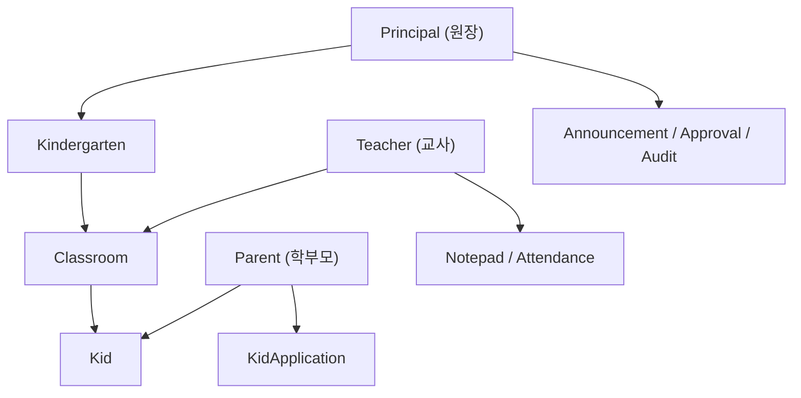
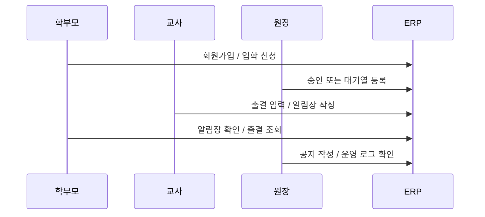

# [Spring Boot 포트폴리오] 01. 왜 첫 백엔드 포트폴리오 주제로 유치원 ERP를 골랐는가

## 1. 이번 글에서 풀 문제

백엔드 취업 준비를 시작하면 가장 먼저 부딪히는 질문이 있습니다.

- 어떤 주제로 프로젝트를 만들어야 할까?
- 쇼핑몰, 게시판, 채팅, 예약 시스템 중 무엇이 더 좋을까?
- 기능이 많아 보이는 주제를 고르면 무조건 유리할까?

Kindergarten ERP 프로젝트는 이 질문에 “유치원 운영”이라는 도메인으로 답했습니다.

처음에는 단순히 CRUD 연습용처럼 보일 수 있습니다. 하지만 실제로는 그렇지 않습니다.

- 원장, 교사, 학부모라는 **역할 차이**
- 승인, 배정, 대기열, 읽음 처리 같은 **상태 전이**
- 같은 유치원끼리만 데이터가 보이게 해야 하는 **테넌트 경계**
- 출결, 알림장, 공지, 신청, 감사 로그 같은 **운영형 문제**

가 자연스럽게 들어오기 때문입니다.

이 글에서는 왜 이 도메인이 첫 포트폴리오 주제로 좋은지, 그리고 실제 저장소가 어떤 방향으로 성장했는지를 설명합니다.

## 2. 먼저 알아둘 개념

### 2-1. 좋은 포트폴리오 주제

좋은 주제는 “기능이 많아 보이는 주제”가 아닙니다.  
오히려 아래를 자연스럽게 만들 수 있는 주제가 좋습니다.

- 역할 기반 권한
- 상태 전이
- 데이터 정합성
- 운영 화면
- 테스트와 문서화

### 2-2. 도메인 모델

도메인은 “기능 목록”이 아니라 “문제 공간”입니다.

예를 들어 이 프로젝트의 핵심 도메인은 아래 관계에서 시작합니다.

- 유치원
- 반
- 원생
- 교사
- 학부모

즉, 유치원 ERP는 게시판처럼 독립적인 글 목록이 아니라  
**사람과 조직, 승인 흐름, 권한 경계가 얽혀 있는 시스템**입니다.

### 2-3. 운영형 백엔드

운영형 백엔드는 CRUD만 돌아가는 시스템이 아닙니다.

- 누가 무엇을 바꿨는지 남아야 하고
- 잘못된 접근을 막아야 하고
- 장애가 났을 때 상태를 볼 수 있어야 하고
- 테스트가 실제 운영 스택과 닮아 있어야 합니다.

이 프로젝트는 결과적으로 여기까지 확장됐고, 그 출발점이 바로 도메인 선택이었습니다.

## 3. 이번 글에서 다룰 파일

```text
- README.md
- docs/archive/legacy/project-idea.md
- docs/archive/legacy/project-plan.md
- docs/guides/user-guide.md
- BLOG_PLAN.md
- src/main/java/com/erp/domain/member/entity/Member.java
- src/main/java/com/erp/domain/kindergarten/entity/Kindergarten.java
- src/main/java/com/erp/domain/classroom/entity/Classroom.java
- src/main/java/com/erp/domain/kid/entity/Kid.java
- src/main/java/com/erp/domain/member/entity/MemberRole.java
```

이번 글은 구현 세부보다, **왜 이 주제가 설계 연습과 취업 포트폴리오에 유리한가**를 설명하는 글입니다.

## 4. 설계 구상

이 프로젝트가 유치원 ERP를 고른 이유는 크게 네 가지였습니다.

1. 역할이 분명하다.
2. 상태 전이가 많다.
3. 현실적인 권한 경계가 필요하다.
4. 나중에 운영형 기능으로 확장하기 좋다.

이 도메인을 그림으로 그리면 아래처럼 볼 수 있습니다.



### 왜 이 구조가 좋은가

이 한 장 안에 이미 백엔드에서 중요한 문제가 다 들어 있습니다.

- 원장은 전체를 볼 수 있지만 학부모는 자기 자녀만 봐야 한다
- 교사는 반 단위로는 관리하지만 유치원 전체를 마음대로 보면 안 된다
- 입학 신청은 `신청 -> 대기열 -> 제안 -> 수락/만료` 흐름을 가진다
- 승인/거절/수정은 감사 로그로 남겨야 한다

즉, 이 도메인은 기능 수보다 **설계 난이도**가 좋은 프로젝트입니다.

## 5. 코드 설명

### 5-1. 초기 기획 문서가 이미 도메인 방향을 잡고 있었다

초기 아이디어 문서인 `docs/archive/legacy/project-idea.md`를 보면  
프로젝트 철학이 처음부터 `Simple is Best`로 잡혀 있습니다.

그리고 타겟 사용자를 아래 세 역할로 고정합니다.

- 원장
- 교사
- 학부모

이 세 역할은 지금 코드에서도 그대로 살아 있습니다.

- `MemberRole.PRINCIPAL`
- `MemberRole.TEACHER`
- `MemberRole.PARENT`

즉, 도메인 선택이 단순한 README 문구가 아니라 실제 코드 구조의 시작점이었습니다.

### 5-2. 초기 계획 문서는 구현 순서를 역할/업무 기준으로 나눴다

`docs/archive/legacy/project-plan.md`를 보면 초기 단계도 단순히 “게시판 만들기” 식이 아니라

- 인증
- 유치원/반
- 원생
- 출석
- 알림장
- 공지사항

처럼 실제 업무 흐름 중심으로 쪼개져 있습니다.

이건 입문자에게 중요한 포인트입니다.

프로젝트 기획을 할 때 기능 이름만 늘어놓지 말고,  
**사용자 역할이 어떤 일을 순서대로 하게 될지** 먼저 보는 편이 낫습니다.

### 5-3. 현재 유저 가이드는 이 도메인이 충분히 확장됐음을 보여준다

현재 `docs/guides/user-guide.md`를 보면 이 시스템은 이미 아래를 포함합니다.

- 회원가입/로그인
- 유치원/반/원생 관리
- 출결
- 알림장
- 공지사항
- 교사 지원/학부모 입학 신청 승인
- 일정/캘린더
- 알림센터

즉, 처음에는 단순해 보였던 도메인이  
점점 “운영형 백엔드” 서사를 만들 수 있는 구조로 성장했습니다.

### 5-4. 이 도메인은 나중에 자연스럽게 고도화된다

이 글에서 구현 세부를 길게 다루지는 않겠습니다.
다만 유치원 ERP를 고르면 아래 축으로 확장할 여지가 처음부터 생깁니다.

- 입학 신청과 승인 같은 상태 전이
- 역할별 권한과 테넌트 경계
- 출결, 알림장, 공지 같은 운영 기능
- 감사 로그, 운영 콘솔, 관측성 같은 후반 고도화

즉, 1편의 핵심은 “이미 완성된 기능 목록”이 아니라
**나중에 어디까지 자랄 수 있는 도메인을 처음에 골랐는가**입니다.

상세 구현은 뒤 글에서 차례대로 다룹니다.

- 입학/지원 워크플로우: `10`, `22`편
- 멀티테넌시 보안: `13`편
- 인증 감사 로그: `19`, `24`편
- 운영 문서/데모 패키지: `26`편

## 6. 실제 흐름

유치원 ERP라는 도메인은 실제 사용자 흐름도 명확합니다.



이 흐름이 좋은 이유는 한 사용자만으로 끝나지 않기 때문입니다.

- 학부모의 행동이 원장의 승인과 연결되고
- 교사의 입력이 학부모 조회와 연결되며
- 원장의 운영 행위가 감사 로그와 연결됩니다

즉, **사용자 간 상호작용이 있는 도메인**이라서 설명할 거리가 많습니다.

## 7. 테스트로 검증하기

이 글은 설계 중심 글이지만, 도메인이 실제로 어떻게 검증되는지도 같이 봐야 합니다.

예를 들어 현재 저장소에는 아래 통합 테스트가 있습니다.

- `KidApiIntegrationTest`
- `AttendanceApiIntegrationTest`
- `KidApplicationApiIntegrationTest`
- `KindergartenApplicationApiIntegrationTest`
- `NotepadApiIntegrationTest`
- `AnnouncementApiIntegrationTest`

즉, 이 도메인은 “아이디어만 좋은 주제”가 아니라  
실제로 API와 테스트로 계속 확장 가능한 주제였습니다.

## 8. 회고

처음 프로젝트 주제를 잡을 때 흔히 하는 실수는 두 가지입니다.

1. 너무 거대한 주제를 잡는다
2. 너무 단순한 주제를 잡는다

유치원 ERP는 그 중간 지점이 좋았습니다.

- 쇼핑몰처럼 결제, 정산, 재고까지 한 번에 끌고 가지 않아도 되고
- 게시판처럼 권한과 상태 전이가 부족하지도 않습니다

즉, **첫 포트폴리오로는 충분히 현실적이면서도 설계 연습이 잘 되는 도메인**입니다.

## 9. 취업 포인트

면접에서 “왜 이 주제를 골랐나요?”라는 질문은 자주 나옵니다.

이때 좋은 답은 “관심 있어서요”보다 아래에 가깝습니다.

- “원장, 교사, 학부모라는 역할이 분명해서 권한 모델을 설계하기 좋았습니다.”
- “입학 신청, 승인, 대기열, 알림장, 공지처럼 상태 전이와 운영 기능을 자연스럽게 확장할 수 있는 도메인이었습니다.”
- “CRUD만 있는 프로젝트보다 멀티테넌시, 감사 로그, 운영 콘솔까지 이야기할 수 있는 주제를 원했습니다.”

즉, 이 도메인을 고른 이유 자체가  
**프로젝트의 설계 깊이와 포트폴리오 방향을 미리 정한 결정**이었다고 설명할 수 있어야 합니다.
