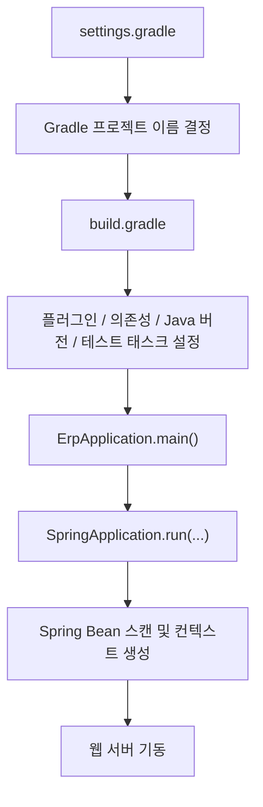

# [Spring Boot 포트폴리오] 02. `settings.gradle`, `build.gradle`, `ErpApplication`으로 프로젝트를 시작하는 법

## 1. 이번 글에서 풀 문제

Spring Boot 프로젝트를 처음 시작할 때 가장 흔한 실수는 두 가지입니다.

1. 일단 IntelliJ가 만들어준 기본 프로젝트를 띄운 뒤, 왜 그렇게 생겼는지 이해하지 못한 채 기능부터 붙이는 것
2. 반대로 너무 많은 기술을 한 번에 넣어서, 어떤 설정이 왜 필요한지 설명하지 못하는 것

이 글에서는 Kindergarten ERP 프로젝트의 실제 코드를 기준으로, 프로젝트를 시작할 때 가장 먼저 만들어야 하는 세 파일을 설명합니다.

- `settings.gradle`
- `build.gradle`
- `src/main/java/com/erp/ErpApplication.java`

그리고 더 중요한 질문도 같이 다룹니다.

- 왜 프로젝트 이름은 `settings.gradle`에 따로 두는가?
- 왜 Java 17, Spring Boot 3.5.9, Gradle 조합으로 시작했는가?
- 왜 `build.gradle`은 시간이 지나면서 점점 커지게 되는가?
- 왜 나중에는 `fastTest`, `integrationTest`, `performanceSmokeTest` 같은 태스크까지 붙였는가?

이 글을 다 읽고 나면, 적어도 Spring Boot 프로젝트를 시작할 때 **어떤 파일부터 만들고, 어떤 기준으로 의존성을 넣고, 어디까지를 초반 뼈대로 봐야 하는지** 감이 잡히게 만드는 것이 목표입니다.

## 2. 먼저 알아둘 개념

### 2-1. Gradle

Gradle은 자바 프로젝트의 빌드 도구입니다.  
쉽게 말하면 아래 일을 대신해 줍니다.

- 라이브러리 다운로드
- 컴파일
- 테스트 실행
- 패키징
- 실행

즉, `build.gradle`은 “이 프로젝트를 어떻게 조립할 것인가”를 적는 파일입니다.

### 2-2. Plugin

Gradle plugin은 빌드 도구에게 기능을 추가하는 확장 모듈입니다.

예를 들어

- `java` 플러그인은 자바 컴파일과 테스트 실행을 가능하게 하고
- `org.springframework.boot` 플러그인은 Spring Boot 애플리케이션 실행과 패키징을 편하게 해 줍니다.

### 2-3. Dependency

dependency는 프로젝트가 사용하는 외부 라이브러리입니다.

예를 들어

- `spring-boot-starter-web`은 HTTP API를 만들 때 필요하고
- `spring-boot-starter-data-jpa`는 DB를 사용할 때 필요하고
- `spring-boot-starter-security`는 인증과 권한 처리를 할 때 필요합니다.

### 2-4. Entry Point

Spring Boot 애플리케이션은 보통 `main()` 메서드 하나에서 시작합니다.  
이 프로젝트의 시작점은 `ErpApplication.main()`입니다.

## 3. 이번 글에서 다룰 파일

```text
- settings.gradle
- build.gradle
- src/main/java/com/erp/ErpApplication.java
- .github/workflows/ci.yml
- docs/decisions/phase16_github_actions_ci.md
- docs/decisions/phase44_tagged_ci_readiness_and_hiring_pack.md
```

이 중 핵심은 앞의 3개 파일이고, 뒤의 문서와 CI 설정은 “처음 만든 뼈대가 나중에 어떻게 확장됐는가”를 설명하는 근거로 같이 씁니다.

## 4. 설계 구상

이 프로젝트는 처음부터 “유치원 ERP의 모든 기능”을 한 번에 넣는 방식으로 출발하면 안 됐습니다.  
오히려 처음에는 아래 질문부터 고정하는 게 중요했습니다.

1. 프로젝트 이름을 무엇으로 둘 것인가
2. 자바 버전은 무엇을 쓸 것인가
3. 어떤 프레임워크와 스타터를 최소 단위로 가져갈 것인가
4. 앞으로 기능이 커져도 `build.gradle`이 감당할 수 있는 구조인가

그래서 구조를 이렇게 잡았습니다.

- `settings.gradle`
  - 프로젝트 이름만 담당
- `build.gradle`
  - 플러그인, 자바 버전, 의존성, 테스트 태스크, 컴파일 옵션 담당
- `ErpApplication.java`
  - 애플리케이션 실행 진입점 담당

즉, 각 파일이 한 가지 책임을 갖도록 나눈 것입니다.

### 왜 이 구성이 중요한가

처음 프로젝트를 시작할 때는 파일 수를 줄이는 것이 중요해 보입니다.  
하지만 실제로는 “역할을 분리해 두는 것”이 더 중요합니다.

예를 들어 프로젝트 이름까지 `build.gradle`에 섞어 넣으면 당장은 편하지만,  
점점 의존성, 태스크, 플러그인이 늘어날수록 설정 파일의 역할이 흐려집니다.

이 프로젝트는 나중에 아래까지 확장됐습니다.

- JPA
- Redis
- OAuth2
- JWT
- Flyway
- QueryDSL
- Actuator
- OpenAPI
- Prometheus
- Testcontainers
- GitHub Actions
- `fastTest`, `integrationTest`, `performanceSmokeTest`

즉, **초반 뼈대는 작게 시작하되, 나중에 커질 수 있는 방향으로 설계**해야 했습니다.

## 5. 코드 설명

### 5-1. `settings.gradle`: 프로젝트 이름은 여기서 시작한다

파일:

```groovy
rootProject.name = 'erp'
```

겉보기에는 아주 단순합니다. 하지만 이 한 줄은 생각보다 중요합니다.

#### 이 파일의 책임

- Gradle에게 이 프로젝트의 루트 이름이 무엇인지 알려줍니다.

#### 왜 `build.gradle`이 아니라 여기 두는가

프로젝트 이름은 “빌드 전략”이 아니라 “프로젝트 정체성”에 가깝습니다.  
그래서 의존성, 플러그인, 테스트 태스크가 몰려 있는 `build.gradle`과 분리해 두는 편이 읽기 쉽습니다.

#### 현재 이름이 `erp`인 이유

현재 저장소 이름과 실제 서비스 이름 사이에는 차이가 있습니다.

- 저장소 / Gradle 루트 이름: `erp`
- 실제 서비스 설명: Kindergarten ERP

이건 입문자에게도 좋은 교훈입니다.  
처음 프로젝트를 시작할 때는 이름이 다소 단순할 수 있지만, README와 문서에서 제품 이름을 더 명확하게 발전시킬 수 있습니다.

즉, **빌드 시스템 이름과 포트폴리오 브랜딩 이름은 꼭 완전히 같을 필요는 없습니다.**

### 5-2. `ErpApplication`: Spring Boot의 시작점

파일:

```java
package com.erp;

import org.springframework.boot.SpringApplication;
import org.springframework.boot.autoconfigure.SpringBootApplication;

@SpringBootApplication
public class ErpApplication {

    public static void main(String[] args) {
        SpringApplication.run(ErpApplication.class, args);
    }
}
```

이 클래스는 작지만, Spring Boot 프로젝트의 출발점입니다.

#### 클래스 책임

- 애플리케이션을 부팅한다.
- 컴포넌트 스캔의 기준 패키리를 제공한다.

#### 핵심 메서드: `main(String[] args)`

- 입력
  - 실행 인자 `args`
- 출력
  - 직접 반환값은 없음
- 내부 흐름
  - `SpringApplication.run(...)`이 호출되면
  - Spring Boot가 애플리케이션 컨텍스트를 만들고
  - `@Configuration`, `@Service`, `@Controller`, `@Repository` 등을 스캔해서 빈으로 등록합니다.

#### 왜 `com.erp` 패키지 루트에 두는가

`@SpringBootApplication`은 내부적으로 컴포넌트 스캔의 시작점을 제공합니다.  
이 클래스가 `com.erp` 루트에 있어야

- `com.erp.global.*`
- `com.erp.domain.*`

아래의 컴포넌트들이 자연스럽게 함께 스캔됩니다.

만약 이 클래스를 더 깊은 하위 패키지에 두면, 일부 빈이 스캔되지 않을 수 있습니다.

이건 입문자가 자주 겪는 문제입니다.

### 5-3. `build.gradle`: 이 프로젝트의 빌드 설계서

이 파일이 실제로 가장 중요합니다.

현재 최종 `build.gradle`은 단순한 입문 프로젝트보다 훨씬 큽니다.  
그 이유는 프로젝트가 성장하면서 기능과 운영 요구가 늘었기 때문입니다.

그래서 이 글에서는 두 층으로 설명하겠습니다.

1. 처음 시작할 때 꼭 필요한 최소 구조
2. 현재 이 프로젝트가 어떤 이유로 여기까지 커졌는가

#### 5-3-1. Plugin 블록

```groovy
plugins {
    id 'java'
    id 'org.springframework.boot' version '3.5.9'
    id 'io.spring.dependency-management' version '1.1.7'
}
```

##### `id 'java'`

자바 컴파일, 테스트, 기본 빌드 lifecycle을 열어 줍니다.

##### `id 'org.springframework.boot'`

Spring Boot 실행과 패키징을 위한 핵심 플러그인입니다.

예를 들어 아래 같은 작업이 가능해집니다.

- `./gradlew bootRun`
- `./gradlew bootJar`

##### `id 'io.spring.dependency-management'`

Spring Boot 버전에 맞는 의존성 버전을 비교적 안전하게 맞춰 줍니다.  
입문자 입장에서는 “라이브러리 버전 지옥”을 줄여주는 장치라고 이해하면 됩니다.

#### 5-3-2. 프로젝트 메타데이터

```groovy
group = 'com.erp'
version = '0.0.1-SNAPSHOT'
description = 'erp'
```

이 값들은 패키징, 식별, 배포 버전 관리에 쓰입니다.

지금 단계에서 가장 중요한 것은 `group`입니다.

- 자바 패키지 구조 `com.erp`
- Gradle 메타데이터 `group = 'com.erp'`

이 둘을 맞춰 두면 프로젝트 전체가 훨씬 읽기 쉬워집니다.

#### 5-3-3. Java Toolchain

```groovy
java {
    toolchain {
        languageVersion = JavaLanguageVersion.of(17)
    }
}
```

이 설정은 “이 프로젝트는 Java 17 기준으로 컴파일한다”는 뜻입니다.

##### 왜 Java 17인가

- 현재 LTS 버전이라 안정적입니다.
- Spring Boot 3.x와 잘 맞습니다.
- record, var 같은 현대적 문법을 사용할 수 있습니다.

취업용 프로젝트에서는 너무 오래된 버전도, 너무 실험적인 버전도 피하는 편이 좋습니다.  
Java 17은 그 균형이 좋은 선택입니다.

#### 5-3-4. `compileOnly`와 `annotationProcessor`

```groovy
configurations {
    compileOnly {
        extendsFrom annotationProcessor
    }
}
```

이 설정은 특히 Lombok, QueryDSL 같은 annotation processor와 관련이 있습니다.

##### 왜 필요한가

- Lombok은 컴파일 시점에 코드를 생성합니다.
- QueryDSL도 QClass 생성이 필요합니다.

즉, 런타임 라이브러리와 별도로 **컴파일 타임 도구**가 필요한 경우가 있습니다.

입문자 입장에서는 이 정도만 기억하면 됩니다.

- `implementation`: 실행할 때도 필요한 라이브러리
- `compileOnly`: 컴파일할 때만 필요한 라이브러리
- `annotationProcessor`: 컴파일 중 코드 생성에 필요한 도구

#### 5-3-5. Repository

```groovy
repositories {
    mavenCentral()
}
```

이 프로젝트에서 쓸 라이브러리를 Maven Central에서 받아오겠다는 뜻입니다.

처음 프로젝트에서는 이 한 줄이면 충분한 경우가 많습니다.

#### 5-3-6. Dependencies: 왜 이렇게 나뉘어 있는가

현재 `build.gradle`의 dependency 블록은 다음과 같이 성장했습니다.

##### Spring Boot Starters

```groovy
implementation 'org.springframework.boot:spring-boot-starter-data-jpa'
implementation 'org.springframework.boot:spring-boot-starter-data-redis'
implementation 'org.springframework.boot:spring-boot-starter-oauth2-client'
implementation 'org.springframework.boot:spring-boot-starter-security'
implementation 'org.springframework.boot:spring-boot-starter-thymeleaf'
implementation 'org.springframework.boot:spring-boot-starter-validation'
implementation 'org.springframework.boot:spring-boot-starter-web'
implementation 'org.springframework.boot:spring-boot-starter-mail'
implementation 'org.springframework.boot:spring-boot-starter-cache'
implementation 'org.springframework.boot:spring-boot-starter-actuator'
```

이 프로젝트는 현재 단순 CRUD 앱이 아니라 운영형 포트폴리오이기 때문에 스타터도 많습니다.

하지만 처음 시작할 때 입문자 관점에서 최소 구성은 보통 이 정도로 생각하면 됩니다.

- `spring-boot-starter-web`
- `spring-boot-starter-data-jpa`
- `spring-boot-starter-validation`
- `spring-boot-starter-security`
- `spring-boot-starter-thymeleaf`

그리고 프로젝트가 커지면서 아래가 붙었습니다.

- Redis
- OAuth2 client
- mail
- cache
- actuator

이 지점이 중요합니다.  
**처음부터 모든 스타터를 한 번에 넣는 것이 아니라, 기능이 생길 때마다 책임에 맞는 스타터가 추가되는 구조**라는 점입니다.

##### OpenAPI / Thymeleaf Extras / Cache / Metrics

```groovy
implementation 'org.springdoc:springdoc-openapi-starter-webmvc-ui:2.8.16'
implementation 'org.thymeleaf.extras:thymeleaf-extras-springsecurity6'
implementation 'com.github.ben-manes.caffeine:caffeine'
implementation 'io.micrometer:micrometer-registry-prometheus'
```

이 의존성들은 프로젝트가 “운영 가능한 상태”로 커졌기 때문에 들어왔습니다.

- `springdoc`
  - Swagger UI / OpenAPI 계약 문서
- `thymeleaf-extras-springsecurity6`
  - 템플릿에서 인증 상태와 권한을 다루기 위함
- `caffeine`
  - 캐시
- `micrometer-registry-prometheus`
  - 운영 메트릭 수집

즉, 이 프로젝트의 `build.gradle`은 **최초 상태의 최소 뼈대**이면서 동시에 **프로젝트가 어디까지 성장했는지 보여주는 증거**이기도 합니다.

##### QueryDSL

```groovy
implementation 'com.querydsl:querydsl-jpa:5.0.0:jakarta'
annotationProcessor 'com.querydsl:querydsl-apt:5.0.0:jakarta'
annotationProcessor 'jakarta.annotation:jakarta.annotation-api'
annotationProcessor 'jakarta.persistence:jakarta.persistence-api'
```

이건 동적 쿼리를 위해 들어간 구성입니다.

입문자는 처음부터 QueryDSL을 바로 넣지 않아도 됩니다.  
하지만 이 프로젝트처럼

- 대시보드 통계
- 감사 로그 필터링
- 복잡한 검색 조건

이 늘어나면 QueryDSL이 점점 필요해집니다.

##### JWT

```groovy
implementation 'io.jsonwebtoken:jjwt-api:0.12.6'
runtimeOnly 'io.jsonwebtoken:jjwt-impl:0.12.6'
runtimeOnly 'io.jsonwebtoken:jjwt-jackson:0.12.6'
```

JWT 라이브러리는 나중에 인증을 붙이면서 들어왔습니다.  
여기서 입문자가 배워야 할 포인트는 의존성을 한 덩어리로 생각하지 않는 것입니다.

- API
- 구현체
- Jackson 연동

처럼 역할이 나뉘기도 합니다.

##### Flyway

```groovy
implementation 'org.flywaydb:flyway-core'
implementation 'org.flywaydb:flyway-mysql'
```

이 프로젝트는 DB 스키마를 초반부터 Flyway로 관리했습니다.  
그래서 나중에

- OAuth 컬럼 추가
- auth audit 로그 추가
- outbox 추가
- domain audit 추가

같은 스키마 변경을 전부 SQL migration으로 남길 수 있었습니다.

##### Lombok

```groovy
compileOnly 'org.projectlombok:lombok'
annotationProcessor 'org.projectlombok:lombok'
```

입문자는 Lombok을 처음 쓰면 “편하다”만 느끼기 쉽습니다.  
하지만 빌드 도구 관점에서는 “컴파일 시점에 코드를 생성하는 라이브러리”라는 점을 이해하는 게 더 중요합니다.

##### Database Driver

```groovy
runtimeOnly 'com.mysql:mysql-connector-j'
```

MySQL 드라이버는 실행 시점에만 필요합니다.  
그래서 `implementation`이 아니라 `runtimeOnly`로 둡니다.

##### Test Dependencies

```groovy
testImplementation 'org.springframework.boot:spring-boot-starter-test'
testImplementation 'org.springframework.security:spring-security-test'
testImplementation 'org.testcontainers:testcontainers'
testImplementation 'org.testcontainers:junit-jupiter'
testImplementation 'org.testcontainers:mysql'
testRuntimeOnly 'org.junit.platform:junit-platform-launcher'
```

이 부분이 이 프로젝트의 취업 포인트 중 하나입니다.

처음에는 보통 `spring-boot-starter-test` 하나로 시작합니다.  
그런데 프로젝트가 커지면서 아래가 필요해졌습니다.

- Security 테스트
- Testcontainers 기반 통합 테스트
- JUnit Platform launcher

즉, `build.gradle`을 보면 테스트 전략이 얼마나 진지한지도 함께 드러납니다.

#### 5-3-7. 컴파일 옵션: `-parameters`

```groovy
tasks.withType(JavaCompile).configureEach {
    options.compilerArgs += ['-parameters']
}
```

이 옵션은 런타임에 메서드 파라미터 이름을 더 정확히 사용할 수 있게 해 줍니다.

입문 단계에서는 눈에 잘 안 띄지만, 아래 같은 곳에서 도움이 됩니다.

- Spring MVC 바인딩
- 리플렉션
- 문서화 도구

즉, “지금은 티가 안 나지만 나중을 위한 설정”에 해당합니다.

#### 5-3-8. 기본 테스트 설정

```groovy
tasks.named('test') {
    useJUnitPlatform()
}
```

현재 자바 테스트 생태계에서 JUnit 5는 사실상 기본입니다.  
그래서 `test` 태스크가 JUnit Platform을 사용하도록 고정해 둡니다.

#### 5-3-9. 이 프로젝트가 나중에 붙인 핵심 태스크

```groovy
tasks.register('fastTest', Test) { ... }
tasks.register('integrationTest', Test) { ... }
tasks.register('performanceSmokeTest', Test) { ... }
```

이 부분은 초반 뼈대보다 한참 뒤에 추가된 확장입니다.  
하지만 오히려 입문자가 초반부터 이 방향을 알아두면 좋습니다.

##### `fastTest`

- 빠른 단위 / 서비스 테스트
- 자주 돌릴 수 있는 테스트

##### `integrationTest`

- MySQL / Redis Testcontainers 기반 통합 테스트
- 실제 운영 스택과 가까운 테스트

##### `performanceSmokeTest`

- 운영 경로가 비정상적으로 느려지지 않는지 확인하는 스모크 테스트

이건 `build.gradle`이 단순 의존성 목록이 아니라 **프로젝트 검증 체계를 담는 파일**이기도 하다는 뜻입니다.

## 6. 실제 흐름

프로젝트를 처음 실행할 때 흐름은 아래처럼 이어집니다.



조금 더 실무적으로 보면 이런 의미입니다.

1. `settings.gradle`이 루트 프로젝트 이름을 정합니다.
2. `build.gradle`이 어떤 라이브러리와 빌드 규칙을 사용할지 정합니다.
3. `ErpApplication.main()`이 실행되면 Spring Boot가 애플리케이션을 부팅합니다.
4. 이후 `application.yml`, `@Configuration`, `@Controller`, `@Service`들이 연결됩니다.

즉, 이 세 파일은 프로젝트의 “가장 작은 뼈대”입니다.

## 7. 테스트로 검증하기

이 글에서 다루는 파일들은 특정 기능 API처럼 “하나의 통합 테스트 클래스”로 검증되지는 않습니다.  
대신 프로젝트 전체의 빌드와 실행 체계로 검증됩니다.

### 로컬 검증

```bash
./gradlew compileJava compileTestJava
./gradlew test
./gradlew fastTest
./gradlew integrationTest
./gradlew performanceSmokeTest
```

### CI 검증

이 프로젝트는 현재 [`.github/workflows/ci.yml`](/Users/alex/project/kindergarten_ERP/erp/.github/workflows/ci.yml) 기준으로 아래 3개 job을 분리해서 실행합니다.

- `Fast Checks`
- `Integration Suite`
- `Performance Smoke`

이건 처음부터 있던 구조는 아닙니다.  
결정 로그 [phase16_github_actions_ci.md](/Users/alex/project/kindergarten_ERP/erp/docs/decisions/phase16_github_actions_ci.md) 와 [phase44_tagged_ci_readiness_and_hiring_pack.md](/Users/alex/project/kindergarten_ERP/erp/docs/decisions/phase44_tagged_ci_readiness_and_hiring_pack.md) 를 보면,

- 처음에는 전체 `./gradlew test`
- 나중에는 태그 기반 분리

로 발전한 과정을 볼 수 있습니다.

이 지점이 중요합니다.  
프로젝트를 시작할 때는 작은 뼈대였지만, 그 뼈대가 나중에 CI 구조까지 감당할 수 있어야 합니다.

## 8. 회고

처음 Spring Boot 프로젝트를 만들 때 가장 많이 하는 실수는 `build.gradle`을 그냥 복사해 오는 것입니다.  
그러면 프로젝트는 돌아갈 수는 있어도, 왜 그렇게 설정됐는지 설명하지 못하게 됩니다.

이 프로젝트를 다시 보면 초반 뼈대에서 중요한 것은 “많이 넣는 것”이 아니었습니다.

- 역할을 분리한 것
- 자바 버전을 일관되게 고정한 것
- 의존성을 책임별로 쌓아 올릴 수 있게 만든 것
- 나중에 테스트 태스크와 CI까지 확장할 수 있게 만든 것

즉, 좋은 시작이란 “작게 시작하는 것”이면서 동시에 “커질 수 있는 방향으로 시작하는 것”입니다.

다음 글에서는 여기서 한 걸음 더 나아가, 왜 애플리케이션보다 먼저 Docker로 MySQL / Redis 환경부터 준비해야 하는지를 다루겠습니다.

## 9. 취업 포인트

이 글은 면접에서 아래 질문으로 이어질 가능성이 큽니다.

- 왜 Java 17과 Spring Boot 3.x를 선택했나요?
- 왜 Gradle을 썼나요?
- `build.gradle`에서 테스트 태스크를 왜 분리했나요?
- 처음부터 어떤 의존성을 넣고, 어떤 것은 나중에 추가했나요?

답변할 때는 이렇게 설명하면 좋습니다.

- `처음에는 web, jpa, validation, security, thymeleaf 같은 최소 뼈대로 시작했고, 프로젝트가 커지면서 Redis, OAuth2, Flyway, Actuator, Prometheus, Testcontainers를 책임에 맞게 단계적으로 추가했습니다.`
- `build.gradle을 단순 라이브러리 목록이 아니라 빌드와 검증 체계를 담는 파일로 관리했고, 나중에는 fast/integration/performance smoke 태스크까지 분리해 CI와 연결했습니다.`

즉, 이 글의 핵심은 “Gradle 문법 설명”이 아닙니다.  
**프로젝트를 시작할 때 어떤 뼈대를 잡아야 나중에 운영형 백엔드로 성장시킬 수 있는가**를 이해하는 것입니다.

## 10. 시작 상태

- 빈 Spring Boot 저장소이거나, 최소한 Git 저장소만 있는 상태를 가정합니다.
- Java 17과 Gradle wrapper를 사용할 수 있어야 합니다.
- 아직 Docker, DB, Redis는 없어도 됩니다. 이 글의 목표는 **프로젝트가 부팅되는 최소 뼈대**를 만드는 것입니다.

## 11. 이번 글에서 바뀌는 파일

```text
- 새 파일:
  - settings.gradle
  - build.gradle
  - src/main/java/com/erp/ErpApplication.java
- 이후 확장 참고:
  - .github/workflows/ci.yml
```

## 12. 구현 체크리스트

1. `settings.gradle`에 루트 프로젝트 이름을 정의합니다.
2. `build.gradle`에 Java / Spring Boot / dependency 관리 플러그인과 starter 의존성을 넣습니다.
3. `src/main/java/com/erp/ErpApplication.java`를 만들어 `main()` 진입점을 만듭니다.
4. `./gradlew tasks`로 Gradle wrapper와 태스크 구성이 정상인지 확인합니다.
5. `./gradlew bootRun`으로 최소 부팅이 되는지 확인합니다.

## 13. 실행 / 검증 명령

```bash
./gradlew tasks
./gradlew bootRun
```

성공하면 확인할 것:

- `./gradlew tasks`가 Gradle 태스크 목록을 출력한다
- `./gradlew bootRun` 시 Spring Boot 애플리케이션이 예외 없이 뜬다
- 기본적으로 `Tomcat started on port 8080`에 해당하는 로그가 보인다

## 14. 글 종료 체크포인트

- 프로젝트 루트에 `settings.gradle`, `build.gradle`이 존재한다
- `src/main/java/com/erp/ErpApplication.java`가 존재한다
- Gradle wrapper로 애플리케이션이 기동된다
- 아직 기능이 없어도 “부팅 가능한 Spring Boot 뼈대”가 완성돼 있다

## 15. 자주 막히는 지점

- 증상: `ErpApplication`이 실행되지 않음
  - 원인: 패키지 위치가 `com.erp` 루트가 아니어서 컴포넌트 스캔 기준이 꼬일 수 있습니다
  - 확인할 것: `src/main/java/com/erp/ErpApplication.java` 경로인지 확인

- 증상: `./gradlew bootRun`에서 Java 버전 오류 발생
  - 원인: 로컬 Java가 17이 아니거나 Gradle 설정과 맞지 않을 수 있습니다
  - 확인할 것: `java -version`, `build.gradle`의 자바 버전 설정 확인
