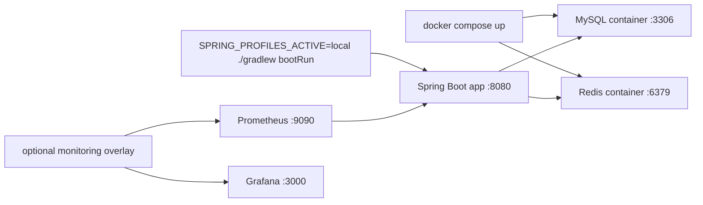

# [Spring Boot 포트폴리오] 03. Docker로 MySQL, Redis, monitoring overlay 개발 환경 만들기

## 1. 이번 글에서 풀 문제

Spring Boot 프로젝트를 처음 만들 때 많은 사람이 애플리케이션 코드부터 작성합니다.
그런데 실제로는 코드보다 먼저 고정해야 할 것이 있습니다.

- DB는 무엇을 쓸 것인가
- 캐시는 무엇을 쓸 것인가
- 로컬 개발 환경을 팀원이나 면접관도 같은 방식으로 재현할 수 있는가
- 관측성 도구는 애플리케이션과 어떻게 분리할 것인가

Kindergarten ERP 프로젝트는 이 문제를 다음 방식으로 풀었습니다.

- 애플리케이션은 로컬 호스트에서 실행
- MySQL / Redis는 Docker Compose로 실행
- 모니터링은 별도 overlay compose로 선택적으로 추가

이 글에서는 왜 이런 구조를 택했는지, 그리고 실제 파일이 어떻게 연결되는지 설명합니다.

이 글을 읽고 나면 아래 질문에 답할 수 있어야 합니다.

- 왜 DB와 Redis를 Docker로 띄우는가?
- 왜 애플리케이션까지 컨테이너에 넣지 않았는가?
- 왜 `docker-compose.yml`과 `docker-compose.monitoring.yml`을 분리했는가?
- 왜 `application-local.yml`은 `localhost:3306`, `localhost:6379`를 바라보는가?

## 2. 먼저 알아둘 개념

### 2-1. Container

컨테이너는 “애플리케이션 실행에 필요한 환경을 묶어 둔 실행 단위”라고 생각하면 됩니다.

예를 들어 MySQL을 로컬 컴퓨터에 직접 설치하면

- 버전 차이
- 설정 차이
- 삭제 / 재설치 문제

가 생길 수 있습니다.

반면 Docker 컨테이너로 띄우면, 같은 이미지와 같은 설정으로 다시 실행하기가 쉬워집니다.

### 2-2. Docker Compose

Docker Compose는 여러 컨테이너를 한 번에 정의하고 실행하는 도구입니다.

이 프로젝트에서는 Compose로 아래를 다룹니다.

- MySQL
- Redis
- Prometheus
- Grafana

### 2-3. Volume

volume은 컨테이너를 껐다 켜도 데이터를 유지하게 해 주는 저장 공간입니다.

MySQL과 Redis를 매번 빈 상태로 시작하면 개발이 불편하므로, volume을 붙여 둡니다.

### 2-4. Overlay Compose

overlay compose는 “기본 스택 위에 추가 기능만 덧붙이는 compose 파일”이라고 이해하면 됩니다.

이 프로젝트에서는

- 기본 스택: MySQL + Redis
- 추가 스택: Prometheus + Grafana

로 나눴습니다.

즉, 모든 개발자가 항상 Grafana까지 띄울 필요는 없고, 필요할 때만 켤 수 있게 한 것입니다.

## 3. 이번 글에서 다룰 파일

```text
- docker/docker-compose.yml
- docker/docker-compose.monitoring.yml
- docker/.env.example
- docker/monitoring/prometheus/prometheus.yml
- src/main/resources/application.yml
- src/main/resources/application-local.yml
- docs/portfolio/demo/demo-preflight.md
- README.md
```

핵심은 `docker/docker-compose.yml`과 `src/main/resources/application-local.yml`의 연결입니다.
즉, “컨테이너 환경”과 “Spring Boot 로컬 설정”이 서로 어떻게 맞물리는지가 제일 중요합니다.

## 4. 설계 구상

이 프로젝트는 처음부터 아래 세 가지를 같이 만족해야 했습니다.

1. 입문자도 로컬에서 빠르게 실행할 수 있어야 한다.
2. DB / Redis 버전 차이로 인한 환경 문제를 줄여야 한다.
3. 나중에 monitoring 같은 운영 도구를 자연스럽게 얹을 수 있어야 한다.

그래서 구조를 이렇게 잡았습니다.

- `docker/docker-compose.yml`
  - 개발에 반드시 필요한 MySQL / Redis만 담당
- `docker/docker-compose.monitoring.yml`
  - Prometheus / Grafana 같은 선택 기능만 담당
- `application-local.yml`
  - 로컬에서 실행되는 Spring Boot 앱이 위 컨테이너를 바라보도록 설정

즉, 이 구조는 “앱도 Docker에 넣는 구조”가 아니라
**앱은 호스트에서 편하게 개발하고, 의존 인프라만 컨테이너로 고정하는 구조**입니다.

### 왜 앱까지 Docker에 넣지 않았는가

입문자 입장에서는 “그냥 다 Docker에 넣으면 더 깔끔한 거 아닌가?”라는 생각이 들 수 있습니다.

하지만 개발 초기에는 아래 이유로 앱을 호스트에서 실행하는 편이 더 단순합니다.

- IntelliJ 디버깅이 쉽다
- 코드 수정 후 즉시 재실행이 쉽다
- Gradle과 로그를 바로 보기 쉽다
- Dockerfile, image build, bind mount 문제를 초반에 다룰 필요가 없다

즉, 이 시점의 목표는 “배포 환경 완성”이 아니라 **개발 환경 재현성 확보**입니다.

### 왜 monitoring을 별도 compose로 분리했는가

Prometheus와 Grafana는 유용하지만, 처음부터 모든 개발자가 항상 필요로 하지는 않습니다.

그래서 운영 관측이 필요한 시점에만 아래처럼 얹을 수 있게 했습니다.

- 기본 스택: `docker-compose.yml`
- 추가 스택: `docker-compose.monitoring.yml`

이 구조는 나중에 “운영성”을 설명할 때도 좋습니다.
초반 개발 환경과 후반 운영 관측 환경을 **같은 Compose 체계 안에서 점진적으로 확장**했다는 이야기가 되기 때문입니다.

## 5. 코드 설명

### 5-1. `docker/docker-compose.yml`: 개발의 기본 스택

이 파일은 현재 이렇게 구성돼 있습니다.

- MySQL 8.0
- Redis 7
- volume
- 공통 network

#### `name: kindergarden`

파일 상단에는 compose project name이 있습니다.

```yaml
name: kindergarden
```

이 값은 Docker Compose가 생성하는 리소스를 묶는 기준입니다.
실무에서는 프로젝트 이름과 완전히 일치시키는 경우도 있고, 조금 다른 이름을 쓰기도 합니다.

입문 단계에서 중요한 건 철자보다 역할입니다.
**“이 compose가 어떤 스택을 묶는가”를 정하는 이름**이라는 점을 이해하면 됩니다.

### 5-2. MySQL 서비스

주요 설정은 아래와 같습니다.

```yaml
mysql:
  image: mysql:8.0
  environment:
    MYSQL_ROOT_PASSWORD: ${MYSQL_ROOT_PASSWORD}
    MYSQL_DATABASE: ${MYSQL_DATABASE}
    MYSQL_USER: ${MYSQL_USER}
    MYSQL_PASSWORD: ${MYSQL_PASSWORD}
    TZ: Asia/Seoul
  ports:
    - "3306:3306"
  volumes:
    - mysql_data:/var/lib/mysql
    - ./init:/docker-entrypoint-initdb.d
```

#### 왜 `mysql:8.0`인가

이 프로젝트의 메인 DB가 MySQL 8이기 때문입니다.
중요한 것은 Spring Boot 코드보다 먼저 **DB 버전을 고정**했다는 점입니다.

나중에

- Flyway
- Testcontainers
- production profile

도 모두 이 기준을 공유하게 됩니다.

#### 왜 환경변수를 `.env.example -> .env` 흐름으로 관리하는가

처음에는 예제 파일을 복사합니다.

```bash
cp docker/.env.example docker/.env
```

그리고 local 인프라용 값은 `docker/.env`에서 읽습니다.

이 방식의 장점은 두 가지입니다.

- compose 파일이 너무 길어지지 않는다
- 비밀번호나 DB 이름을 한 곳에서 관리할 수 있다

#### 왜 `ports: "3306:3306"`인가

호스트의 `3306` 포트를 컨테이너의 `3306`과 연결합니다.
그래서 로컬에서 실행 중인 Spring Boot 앱은 그냥 `localhost:3306`으로 접근할 수 있습니다.

이게 바로 `application-local.yml`과 연결됩니다.

#### 왜 volume을 붙이는가

```yaml
volumes:
  - mysql_data:/var/lib/mysql
```

이 설정이 없으면 컨테이너를 내렸다 올릴 때마다 데이터가 날아갑니다.

개발 중에는

- 회원가입 데이터
- 시드 데이터
- 테스트용 데이터 확인

같은 것을 유지할 때가 많아서 volume이 필요합니다.

#### `./init:/docker-entrypoint-initdb.d`는 왜 있는가

MySQL 컨테이너는 이 경로에 초기화 스크립트를 넣어 둘 수 있습니다.
현재 `docker/init` 폴더는 비어 있지만, 이 마운트는 **나중에 로컬 초기화 SQL이나 bootstrap 스크립트를 넣을 여지**를 남겨 둔 것입니다.

즉, 지금 당장 사용하지 않더라도 “확장 포인트”로 설계해 둔 셈입니다.

#### 왜 문자셋과 timezone을 따로 고정하는가

```yaml
command:
  - --character-set-server=utf8mb4
  - --collation-server=utf8mb4_unicode_ci
  - --default-time-zone=+09:00
```

이건 초심자가 초반에 자주 놓치는 부분입니다.

- 한글 저장 문제
- 정렬 / 비교 문제
- 시간대 불일치 문제

는 프로젝트가 커지고 나서 찾으면 훨씬 고칩니다.
그래서 초반에 바로 고정하는 편이 낫습니다.

### 5-3. Redis 서비스

Redis 설정은 더 단순합니다.

```yaml
redis:
  image: redis:7-alpine
  ports:
    - "6379:6379"
  volumes:
    - redis_data:/data
  command: redis-server --appendonly yes
```

#### 왜 Redis를 같이 띄우는가

이 프로젝트는 나중에 Redis를 아래에 사용합니다.

- JWT refresh token 저장
- 세션 레지스트리
- rate limit
- 캐시

즉, Redis는 “나중에 필요할 것 같아서”가 아니라
프로젝트가 인증과 운영성을 다루는 순간 거의 필수 인프라가 됩니다.

#### 왜 `redis:7-alpine`인가

- 가볍고
- 로컬 개발에서 충분히 빠르고
- 최신 Redis 계열 기능을 사용하는 데 무리가 없습니다.

#### 왜 `--appendonly yes`인가

Redis는 메모리 기반이지만, append-only file을 켜면 데이터 지속성이 조금 더 좋아집니다.

입문자 관점에서는 이렇게 이해하면 됩니다.

- MySQL은 기본 저장소
- Redis는 빠른 보조 저장소
- 그래도 개발 중에는 껐다 켰을 때 상태가 조금 유지되는 편이 편하다

### 5-4. 공통 network와 volume

```yaml
volumes:
  mysql_data:
  redis_data:

networks:
  erp-network:
    driver: bridge
```

여기서 중요한 건 “컨테이너를 서로 연결할 기반을 만든다”는 점입니다.

현재 앱은 호스트에서 실행되므로 network를 직접 크게 의식하지 않아도 됩니다.
하지만 monitoring overlay가 붙으면 Prometheus와 Grafana도 같은 network를 공유하게 됩니다.

즉, **초반 기본 compose가 나중에 추가 컨테이너를 받을 수 있는 바닥판** 역할을 합니다.

### 5-5. `docker-compose.monitoring.yml`: 운영 도구는 overlay로 분리한다

이 파일은 기본 스택 위에 Prometheus와 Grafana를 얹습니다.

#### Prometheus

```yaml
prometheus:
  image: prom/prometheus:v2.54.1
  ports:
    - "9090:9090"
  volumes:
    - ./monitoring/prometheus/prometheus.yml:/etc/prometheus/prometheus.yml:ro
```

Prometheus는 메트릭을 주기적으로 수집합니다.

실제 scrape 대상은 [docker/monitoring/prometheus/prometheus.yml](../docker/monitoring/prometheus/prometheus.yml) 에 적혀 있습니다.

```yaml
scrape_configs:
  - job_name: "kindergarten-erp"
    metrics_path: /actuator/prometheus
    static_configs:
      - targets:
          - host.docker.internal:8080
```

여기서 중요한 점은 하나입니다.

**Prometheus 컨테이너가 호스트에서 실행 중인 Spring Boot 앱의 `8080` 포트를 긁는다**는 점입니다.

즉,

- DB / Redis는 컨테이너
- 앱은 호스트
- Prometheus는 다시 컨테이너

이 구조가 서로 연결되도록 `host.docker.internal`을 사용합니다.

#### Grafana

```yaml
grafana:
  image: grafana/grafana-oss:11.5.2
  ports:
    - "3000:3000"
```

Grafana는 Prometheus가 모은 메트릭을 시각화합니다.

이 프로젝트에서는 대시보드를 미리 provisioning하는 구조까지 들어가 있지만,
입문자는 우선 아래만 이해해도 충분합니다.

- Prometheus는 수집
- Grafana는 시각화

### 5-6. `application-local.yml`: Spring Boot 앱은 어디를 바라보는가

이 파일이 Docker와 애플리케이션을 연결합니다.

#### MySQL 연결

```yaml
spring:
  datasource:
    url: jdbc:mysql://localhost:3306/erp_db?...
    username: ${DB_USERNAME:root}
    password: ${DB_PASSWORD:root1234}
```

중요한 점:

- 앱은 컨테이너 안에서 도는 것이 아니다
- 그래서 DB 주소는 `mysql` 같은 컨테이너 이름이 아니라 `localhost:3306`이다

이 부분을 입문자가 정말 많이 헷갈립니다.

정리하면:

- **앱도 Docker 안에 있으면** 컨테이너 이름으로 접근
- **앱이 호스트에서 실행되면** `localhost`로 접근

이 프로젝트는 두 번째 구조입니다.

#### Redis 연결

```yaml
spring:
  data:
    redis:
      host: localhost
      port: 6379
```

Redis도 같은 방식입니다.

#### 왜 `ddl-auto: validate`인가

```yaml
spring:
  jpa:
    hibernate:
      ddl-auto: validate
```

이건 매우 중요합니다.

초기 개발에서도 스키마를 JPA가 마음대로 만들게 하지 않고,
Flyway migration과 실제 DB 구조가 맞는지만 검증하게 했습니다.

즉, Docker로 MySQL을 띄워도 “대충 개발용 DB”로 쓰지 않고,
**운영형 DB 관리 흐름**을 초반부터 맞췄습니다.

#### Thymeleaf 캐시 비활성화

```yaml
spring:
  thymeleaf:
    cache: false
```

이건 SSR 개발에서 편의를 위한 설정입니다.

- 템플릿 수정
- 새로고침
- 즉시 반영

이 흐름이 빨라야 프론트-백엔드 통합 개발이 수월합니다.

## 6. 실제 흐름

이 프로젝트의 로컬 개발 흐름은 아래처럼 이해하면 됩니다.



실행 순서를 실제 명령으로 적으면 이렇습니다.

### 기본 개발 스택

```bash
cp docker/.env.example docker/.env
docker compose -f docker/docker-compose.yml up -d
./gradlew bootRun --args='--spring.profiles.active=local'
```

여기서 중요한 점은 두 가지입니다.

- `local`은 명시적으로 선택한 개발 모드입니다.
- 시드 데이터는 기본으로 올라오지 않으며, 필요하면 `APP_SEED_ENABLED=true`로 따로 켭니다.

### monitoring까지 보고 싶을 때

```bash
cp docker/.env.example docker/.env
docker compose -f docker/docker-compose.yml -f docker/docker-compose.monitoring.yml up -d
./gradlew bootRun --args='--spring.profiles.active=demo'
```

여기서 `demo` 프로파일은 `local` 설정을 포함합니다.
즉, 개발 기본값 위에 시연용 seed와 공개 management surface를 같이 올리는 방식입니다.

이 흐름은 [demo-preflight.md](../docs/portfolio/demo/demo-preflight.md) 에도 그대로 정리돼 있습니다.

## 7. 테스트로 검증하기

이번 글은 Docker Compose 파일 자체를 테스트 클래스로 직접 검증하는 글은 아닙니다.
대신 실행 재현성과 운영 연결성을 아래 근거로 설명할 수 있습니다.

### 실행 명령 근거

- [AGENTS.md](../AGENTS.md)
- [README.md](../README.md)
- [docs/guides/developer-guide.md](../docs/guides/developer-guide.md)
- [docs/portfolio/demo/demo-preflight.md](../docs/portfolio/demo/demo-preflight.md)

### 운영 연결 근거

- 앱은 `localhost:8080`
- MySQL은 `localhost:3306`
- Redis는 `localhost:6379`
- Prometheus는 `http://localhost:9090`
- Grafana는 `http://localhost:3000`

즉, Compose는 단순 실행 스크립트가 아니라
**문서, Spring 설정, 데모 흐름, 운영 관측과 모두 연결된 실행 계약**입니다.

## 8. 회고

초기 프로젝트에서 DB를 로컬에 직접 설치해 시작할 수도 있습니다.
하지만 그렇게 하면 나중에 이런 문제가 자주 생깁니다.

- 내 로컬에서는 되는데 다른 사람은 안 됨
- DB 버전이 달라서 migration이 다르게 동작함
- Redis가 꺼져 있어서 인증 기능이 부분적으로만 동작함
- 모니터링 도구를 붙일 때 실행 방식이 또 따로 생김

이 프로젝트는 그 문제를 피하려고 **인프라를 코드로 고정**했습니다.

그리고 중요한 점이 하나 더 있습니다.
이 글의 목적은 “Docker를 멋지게 썼다”가 아닙니다.

오히려 핵심은 이것입니다.

- 앱은 개발하기 쉬운 방식으로 호스트에서 돌린다
- DB / Redis는 재현 가능한 방식으로 컨테이너로 고정한다
- 운영 관측 도구는 overlay로 점진적으로 붙인다

즉, 개발 편의성과 재현성을 균형 있게 잡은 구조입니다.

다음 글에서는 여기서 한 단계 더 나아가, `application.yml`과 profile을 어떻게 설계해야 local / demo / prod가 서로 충돌하지 않고 공존할 수 있는지를 다루겠습니다.

## 9. 취업 포인트

이 글은 면접에서 아래 질문으로 이어지기 좋습니다.

- 왜 DB와 Redis를 Docker로 띄웠나요?
- 왜 앱까지 컨테이너화하지 않았나요?
- 왜 monitoring을 별도 compose로 분리했나요?
- 로컬 설정과 Docker 설정은 어떻게 맞췄나요?

답변은 이렇게 정리할 수 있습니다.

- `개발 초기에는 애플리케이션까지 컨테이너화하기보다, DB와 Redis만 Compose로 고정해서 재현성을 확보하고 앱은 로컬에서 빠르게 개발하는 방식을 택했습니다.`
- `이후 운영 관측이 필요해지면서 Prometheus와 Grafana는 별도 overlay compose로 분리해 점진적으로 확장했습니다.`
- `application-local.yml이 localhost:3306, localhost:6379를 바라보도록 맞춰 앱 실행 방식과 인프라 실행 방식을 분리했습니다.`

즉, 이 글의 취업 포인트는 “Docker를 사용했다”가 아니라
**개발 환경을 어떻게 설계해야 프로젝트가 커져도 흔들리지 않는가**를 설명할 수 있다는 점입니다.

## 10. 시작 상태

- `02` 글까지 따라와서 Spring Boot 프로젝트 뼈대가 있어야 합니다.
- Docker Desktop 또는 Docker Engine이 실행 중이어야 합니다.
- 아직 애플리케이션에서 DB/Redis를 실제로 쓰지 않아도 됩니다. 이 글의 목표는 **의존 인프라 실행 환경을 먼저 고정하는 것**입니다.

## 11. 이번 글에서 바뀌는 파일

```text
- 새 파일:
  - docker/docker-compose.yml
  - docker/docker-compose.monitoring.yml
  - docker/.env.example
  - docker/monitoring/prometheus/prometheus.yml
- 참고 연결 파일:
  - src/main/resources/application.yml
  - src/main/resources/application-local.yml
```

## 12. 구현 체크리스트

1. MySQL과 Redis가 들어 있는 `docker/docker-compose.yml`을 작성합니다.
2. local 인프라 값은 `docker/.env.example -> docker/.env` 흐름으로 분리합니다.
3. Prometheus와 Grafana는 `docker/docker-compose.monitoring.yml`로 분리합니다.
4. `docker compose -f docker/docker-compose.yml up -d`로 기본 스택을 실행합니다.
5. 필요하면 monitoring overlay를 추가로 띄웁니다.

## 13. 실행 / 검증 명령

```bash
cp docker/.env.example docker/.env
docker compose -f docker/docker-compose.yml up -d
docker compose -f docker/docker-compose.yml ps
docker compose -f docker/docker-compose.yml -f docker/docker-compose.monitoring.yml up -d
docker compose -f docker/docker-compose.yml -f docker/docker-compose.monitoring.yml ps
```

성공하면 확인할 것:

- MySQL과 Redis 컨테이너가 `Up` 상태다
- monitoring overlay를 켰다면 Prometheus와 Grafana도 `Up` 상태다
- 호스트에서 `localhost:3306`, `localhost:6379`를 사용할 수 있다

## 14. 글 종료 체크포인트

- `docker/docker-compose.yml`만으로 기본 개발 스택을 띄울 수 있다
- monitoring overlay는 별도 compose로 선택적으로 켤 수 있다
- 로컬 앱이 이후 `localhost` 기준으로 MySQL/Redis에 붙을 준비가 됐다

## 15. 자주 막히는 지점

- 증상: MySQL 컨테이너가 바로 죽음
  - 원인: `docker/.env` 값이 비어 있거나 root/user/password 조합이 꼬였을 수 있습니다
  - 확인할 것: `docker compose -f docker/docker-compose.yml logs mysql`

- 증상: 포트 충돌
  - 원인: 로컬에 이미 MySQL이나 Redis가 떠 있을 수 있습니다
  - 확인할 것: `lsof -i :3306`, `lsof -i :6379`
