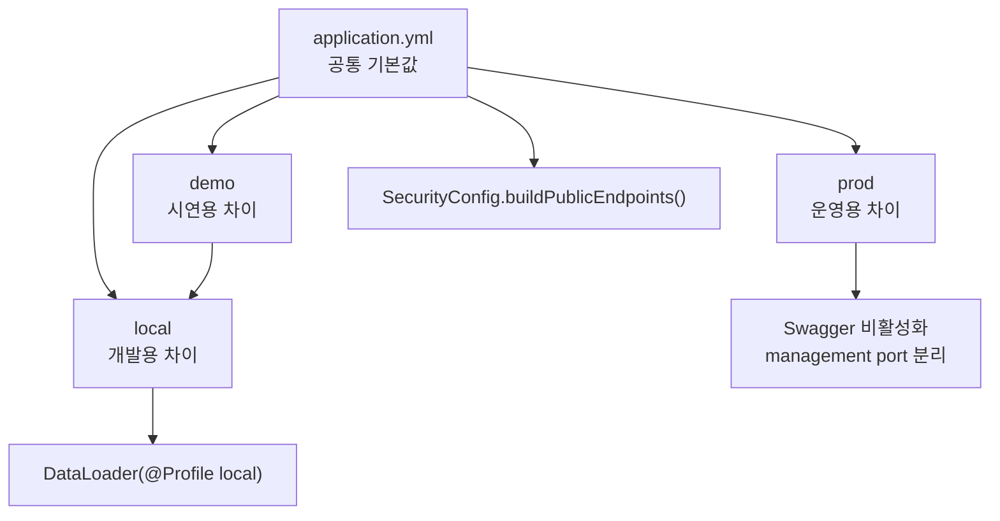
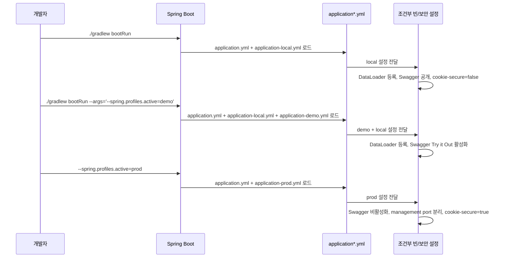

# [Spring Boot 포트폴리오] 04. `application.yml`, `application-local.yml`, `application-demo.yml`, `application-prod.yml`로 프로파일 전략 세우기

## 1. 이번 글에서 풀 문제

Spring Boot를 처음 배울 때 많은 사람이 `application.yml` 파일 하나에 모든 설정을 몰아넣습니다.

처음에는 편합니다. 그런데 프로젝트가 조금만 커지면 바로 문제가 생깁니다.

- 로컬에서는 `localhost:3306`을 써야 하는데 운영에서는 환경변수를 써야 한다
- 로컬에서는 Swagger를 켜고 싶지만 운영에서는 닫고 싶다
- 로컬에서는 더미 데이터가 자동으로 들어가면 편하지만 운영에서는 절대 그러면 안 된다
- 로컬에서는 JWT 쿠키 `Secure=false`여야 테스트가 되지만 운영에서는 `Secure=true`가 맞다

Kindergarten ERP 프로젝트도 똑같은 문제를 겪었습니다.  
그래서 설정을 이렇게 나눴습니다.

- `application.yml`
  - 모든 환경의 공통 기본값
- `application-local.yml`
  - 개발자가 내 컴퓨터에서 실행할 때 필요한 차이
- `application-demo.yml`
  - 면접 시연용으로 local 위에 아주 얇게 덧씌우는 차이
- `application-prod.yml`
  - 운영에서 반드시 달라야 하는 보안/배포 차이

그리고 중요한 점이 하나 더 있습니다.

이 글은 단순히 YAML 파일을 소개하는 글이 아닙니다.  
**설정 파일이 실제 자바 코드와 어떻게 연결되어 런타임 동작을 바꾸는지**까지 같이 설명합니다.

이 글을 읽고 나면 아래 질문에 답할 수 있어야 합니다.

- 왜 `application.yml` 하나로 끝내면 안 되는가?
- 왜 `demo`는 `local`의 복사본이 아니라 `profile group`으로 설계했는가?
- 왜 `prod`에서는 Swagger, Prometheus, management port 정책이 달라지는가?
- 왜 `DataLoader`, `OpenApiConfig`, `SecurityConfig`까지 같이 봐야 프로파일 전략이 완성되는가?

## 2. 먼저 알아둘 개념

### 2-1. Profile

Spring Profile은 “같은 코드베이스에서 환경별로 다른 설정과 빈을 활성화하는 장치”입니다.

예를 들어

- `local` 프로파일에서는 로컬 MySQL, 로컬 Redis를 사용하고
- `prod` 프로파일에서는 환경변수 기반 설정을 사용하고
- 어떤 빈은 `@Profile("local")`일 때만 등록되게 만들 수 있습니다.

### 2-2. Override

Spring Boot는 `application.yml`과 `application-{profile}.yml`을 합쳐서 최종 설정을 만듭니다.

쉽게 말하면

1. `application.yml`의 공통값을 먼저 읽고
2. 활성 프로파일 파일이 같은 키를 가지고 있으면 그 값으로 덮어씁니다.

즉, 프로파일 파일은 “전체 설정 복사본”이 아니라 **차이만 적는 파일**로 쓰는 편이 좋습니다.

### 2-3. Profile Group

profile group은 “한 프로파일을 켰을 때 다른 프로파일도 같이 켜지게 하는 장치”입니다.

이 프로젝트는 아래처럼 설정했습니다.

```yaml
spring:
  profiles:
    group:
      demo:
        - local
```

즉, `demo`를 활성화하면 `local`도 함께 활성화됩니다.

이 설계 덕분에

- demo도 로컬 DB/Redis를 그대로 쓰고
- `@Profile("local")` 빈도 같이 활성화되고
- 시드 데이터도 재사용할 수 있습니다.

### 2-4. Conditional Bean

환경별 차이는 YAML만으로 끝나지 않습니다.

예를 들어 이 프로젝트의 [OpenApiConfig.java](/Users/alex/project/kindergarten_ERP/erp/src/main/java/com/erp/global/config/OpenApiConfig.java)는 아래 조건으로만 로드됩니다.

```java
@ConditionalOnProperty(
        name = "springdoc.api-docs.enabled",
        havingValue = "true",
        matchIfMissing = true
)
```

즉, `application-prod.yml`에서 `springdoc.api-docs.enabled=false`로 두면  
Swagger 관련 빈 자체가 올라오지 않습니다.

이런 식으로 **설정 파일과 자바 조건부 로딩을 같이 설계**해야 진짜 프로파일 전략이 됩니다.

## 3. 이번 글에서 다룰 파일

```text
- src/main/resources/application.yml
- src/main/resources/application-local.yml
- src/main/resources/application-demo.yml
- src/main/resources/application-prod.yml
- src/main/resources/logback-spring.xml
- src/main/java/com/erp/global/config/DataLoader.java
- src/main/java/com/erp/global/config/OpenApiConfig.java
- src/main/java/com/erp/global/config/SecurityConfig.java
- src/main/java/com/erp/global/security/ManagementSurfaceProperties.java
- src/test/java/com/erp/integration/ObservabilityIntegrationTest.java
- docs/portfolio/demo/demo-preflight.md
- docs/decisions/phase13_security_hardening.md
- docs/decisions/phase36_api_contract_observability_demo.md
- docs/decisions/phase39_management_plane_and_active_session_control.md
```

핵심은 앞의 4개 YAML이지만, 뒤의 자바 파일을 같이 봐야 “설정이 실제로 어떻게 동작하는지”를 설명할 수 있습니다.

## 4. 설계 구상

이 프로젝트에서 프로파일 전략을 세울 때 기준은 네 가지였습니다.

1. 공통값은 한 곳에 모은다.
2. 환경별 파일에는 차이만 둔다.
3. demo는 local을 복사하지 않고 재사용한다.
4. 운영에서 위험한 노출면은 prod에서 닫는다.

이 기준을 그림으로 표현하면 아래와 같습니다.



여기서 중요한 포인트를 하나씩 보면 이렇습니다.

### 4-1. `application.yml`은 “공통 기본값”만 둔다

예를 들어 아래 값은 local, demo, prod 모두에게 의미가 있습니다.

- `spring.application.name`
- `spring.jpa.open-in-view=false`
- `hibernate.default_batch_fetch_size=100`
- `jwt.access-token-validity`
- `management.endpoint.health.group.readiness`

이런 값은 특정 환경의 차이가 아니라 애플리케이션 자체의 기본 정책이므로 공통 파일에 둡니다.

### 4-2. local에는 개발 편의만 둔다

local에서만 필요한 대표 차이는 아래입니다.

- `localhost:3306`, `localhost:6379`
- Thymeleaf 캐시 비활성화
- dummy OAuth2 client 값
- `jwt.cookie-secure=false`
- Flyway clean 허용

즉, local은 “개발자가 편하게 실행할 수 있게” 만드는 계층입니다.

### 4-3. demo는 local의 복사본이 아니라 얇은 오버레이로 둔다

초보자가 자주 하는 실수는 `application-demo.yml`에 `application-local.yml` 내용을 거의 복붙하는 것입니다.

그러면 처음에는 편해 보여도 금방 아래 문제가 생깁니다.

- local DB 설정을 바꾸면 demo는 놓친다
- Redis 설정을 바꾸면 demo도 따로 고쳐야 한다
- 더미 계정이나 시드 정책이 서로 어긋난다

그래서 이 프로젝트는 `demo = local + demo 전용 UI 편의`로 설계했습니다.

### 4-4. prod는 “기능 추가”가 아니라 “노출 통제”를 담당한다

운영 프로파일에서 가장 중요한 것은 새로운 기능이 아닙니다.  
오히려 아래를 막는 것이 더 중요합니다.

- JPA auto DDL
- Flyway clean
- 공개 Swagger
- 메인 포트에서 Prometheus 노출
- 비보안 쿠키

즉, prod 프로파일은 “운영에서 반드시 달라야 하는 위험 통제 지점”을 모아둔 것입니다.

## 5. 코드 설명

### 5-1. `application.yml`: 모든 환경이 공유하는 기준선

[application.yml](/Users/alex/project/kindergarten_ERP/erp/src/main/resources/application.yml)의 핵심은 “기본 정책”입니다.

대표 설정을 보면 아래와 같습니다.

```yaml
spring:
  profiles:
    active: local
    group:
      demo:
        - local

  jpa:
    open-in-view: false
    properties:
      hibernate:
        default_batch_fetch_size: 100

jwt:
  cookie-secure: true
  cookie-same-site: Strict

management:
  endpoints:
    web:
      exposure:
        include: health,info,prometheus
```

### 왜 `spring.profiles.active: local`을 기본값으로 두는가

개발자가 아무 옵션 없이 `./gradlew bootRun`만 쳐도 바로 뜨게 하기 위해서입니다.

이건 입문자에게 꽤 중요한 포인트입니다.  
실행 진입점이 복잡하면 프로젝트가 금방 귀찮아집니다.

대신 운영에서는 보통 `--spring.profiles.active=prod`나 환경변수로 명시합니다.

### 왜 `open-in-view=false`를 공통값으로 두는가

이건 특정 환경의 차이가 아니라 애플리케이션 설계 원칙이기 때문입니다.

- 컨트롤러 / 뷰 계층에서 lazy loading에 기대지 않겠다
- 서비스 계층에서 필요한 데이터를 다 조회하겠다

이 원칙은 local에서도, prod에서도 같아야 합니다.

### 왜 JWT 기본값은 공통에서 `cookie-secure=true`인가

보안 기본값을 안전하게 두고, local에서만 예외를 허용하는 방식이 더 낫기 때문입니다.

이 설계는 [phase13_security_hardening.md](/Users/alex/project/kindergarten_ERP/erp/docs/decisions/phase13_security_hardening.md)에 정리된 “보안 기본값은 안전하게, 개발 환경에서만 완화” 원칙과 맞닿아 있습니다.

### 왜 management/readiness 설정을 공통으로 두는가

운영 관측성의 핵심 구조 자체는 모든 환경에서 같습니다.

- health
- readiness
- liveness
- `criticalDependencies`

즉, 어느 환경에서든 “앱이 살아 있는지 / 준비됐는지”를 같은 방식으로 표현합니다.

### 5-2. `application-local.yml`: 개발자 편의를 모아둔 파일

[application-local.yml](/Users/alex/project/kindergarten_ERP/erp/src/main/resources/application-local.yml)은 실제 개발자가 매일 만지는 환경입니다.

대표 값은 아래와 같습니다.

```yaml
spring:
  datasource:
    url: jdbc:mysql://localhost:3306/erp_db...
  data:
    redis:
      host: localhost
      port: 6379
  thymeleaf:
    cache: false
  flyway:
    clean-disabled: false

jwt:
  cookie-secure: false
```

### 왜 datasource와 Redis가 `localhost`를 보는가

이전 글에서 설명한 것처럼 MySQL, Redis는 Docker로 띄우지만 애플리케이션은 호스트에서 실행하기 때문입니다.

그래서 Spring Boot 입장에서는 Docker 내부 서비스 이름이 아니라 `localhost`를 바라보면 됩니다.

### 왜 `ddl-auto=validate`인가

초보자는 개발 환경에서 `create`나 `update`를 쉽게 씁니다.  
하지만 이 프로젝트는 초반부터 Flyway를 마이그레이션 SSOT로 잡았습니다.

그래서 local에서도

- JPA가 테이블을 마음대로 만들지 않게 하고
- 이미 존재하는 스키마가 엔티티와 맞는지만 검증하게 했습니다.

이건 취업용 포트폴리오에서 꽤 좋은 신호입니다.  
“개발 환경도 운영과 최대한 비슷하게 맞췄다”는 의미이기 때문입니다.

### 왜 `thymeleaf.cache=false`인가

화면 템플릿을 수정했을 때 바로 반영되는 편이 개발 속도에 유리하기 때문입니다.

### 왜 OAuth2 client 값에 dummy 기본값을 넣는가

로컬에서 구글/카카오 실제 키가 없어도 최소한 애플리케이션이 부팅은 돼야 하기 때문입니다.

즉, “실제 소셜 로그인은 안 되더라도 프로젝트는 뜬다”는 상태를 보장한 것입니다.

### 왜 `jwt.cookie-secure=false`인가

로컬에서는 보통 HTTPS가 아니라 `http://localhost:8080`으로 띄웁니다.  
이때 `Secure=true` 쿠키는 브라우저가 보내지 않기 때문에 로그인 테스트가 막힙니다.

그래서 local에서만 예외적으로 낮춥니다.

### 5-3. `application-demo.yml`: local 위에 얹는 시연 전용 얇은 레이어

[application-demo.yml](/Users/alex/project/kindergarten_ERP/erp/src/main/resources/application-demo.yml)은 의도적으로 매우 짧습니다.

```yaml
springdoc:
  swagger-ui:
    try-it-out-enabled: true
    persist-authorization: true

info:
  app:
    mode: demo
```

이 파일이 짧다는 사실 자체가 좋은 설계입니다.

### 왜 demo 파일이 이렇게 짧아야 하는가

demo는 독립 환경이 아니라 “local 기반 시연 모드”이기 때문입니다.

`application.yml`의 아래 설정이 핵심입니다.

```yaml
spring:
  profiles:
    group:
      demo:
        - local
```

즉, 아래 명령으로 앱을 띄우면

```bash
./gradlew bootRun --args='--spring.profiles.active=demo'
```

Spring은 사실상 `demo + local`을 함께 활성화합니다.

그 결과 demo 환경은 자동으로 아래를 상속합니다.

- local MySQL / Redis 연결
- Thymeleaf 개발 설정
- dummy OAuth2 값
- `jwt.cookie-secure=false`
- `@Profile("local")` 빈

### demo에서 시드 데이터가 자동으로 들어가는 이유

[DataLoader.java](/Users/alex/project/kindergarten_ERP/erp/src/main/java/com/erp/global/config/DataLoader.java)를 보면 클래스 위에 아래가 붙어 있습니다.

```java
@Profile("local")
public class DataLoader implements CommandLineRunner
```

즉, `local` 프로파일일 때만 빈으로 등록됩니다.

그리고 핵심 메서드는 `run(String... args)`입니다.

이 메서드는 앱 시작 직후 실행되며

- 유치원 2개
- 원장 / 교사 / 학부모 계정
- 반, 원아, 출석, 공지, 알림장
- 인증 감사 로그 샘플

까지 시드합니다.

demo가 `local`을 포함하므로, 면접 시연에서 이 더미 데이터도 자동으로 살아납니다.

이 설계는 [phase36_api_contract_observability_demo.md](/Users/alex/project/kindergarten_ERP/erp/docs/decisions/phase36_api_contract_observability_demo.md)에서 “demo를 local 위의 시연 진입점으로 고정”한 이유와 연결됩니다.

### 5-4. `application-prod.yml`: 운영에서 위험한 것을 닫는 파일

[application-prod.yml](/Users/alex/project/kindergarten_ERP/erp/src/main/resources/application-prod.yml)은 local과 정반대의 목적을 가집니다.  
편의보다 통제가 우선입니다.

대표 설정은 아래입니다.

```yaml
spring:
  datasource:
    url: ${DB_URL}
  jpa:
    hibernate:
      ddl-auto: none
  flyway:
    clean-disabled: true

jwt:
  cookie-secure: true

management:
  server:
    port: 9091
    address: 127.0.0.1

app:
  security:
    management-surface:
      public-api-docs: false
      expose-prometheus-on-app-port: false

springdoc:
  api-docs:
    enabled: false
  swagger-ui:
    enabled: false
```

### 왜 운영에서는 환경변수만 쓰는가

운영 DB 주소, 비밀번호, Redis 주소 같은 값은 코드 저장소에 고정하면 안 되기 때문입니다.

### 왜 `ddl-auto=none`인가

운영 DB 스키마는 JPA가 자동으로 건드리면 안 됩니다.  
이 프로젝트의 스키마 변경 SSOT는 Flyway이므로, 운영에서는 더 엄격하게 막습니다.

### 왜 `clean-disabled=true`인가

local에서는 개발 편의를 위해 Flyway clean을 열 수 있지만, 운영에서는 절대 허용하면 안 됩니다.

### 왜 management port를 분리하는가

운영에서 health, info, metrics는 유용하지만 메인 사용자 포트와 같은 면에 두면 노출면이 넓어집니다.

그래서 prod에서는

- 앱 사용자 트래픽: `server.port=8080`
- management plane: `management.server.port=9091`

로 분리합니다.

### 왜 Swagger와 Prometheus를 prod에서 닫는가

이건 단순히 YAML 값만의 문제가 아닙니다.  
자바 코드도 같이 봐야 합니다.

### 5-5. 설정 파일이 자바 코드와 연결되는 방식

### `OpenApiConfig`: Swagger 빈 자체를 조건부 등록

[OpenApiConfig.java](/Users/alex/project/kindergarten_ERP/erp/src/main/java/com/erp/global/config/OpenApiConfig.java)는 아래 조건을 가집니다.

```java
@ConditionalOnProperty(
        name = "springdoc.api-docs.enabled",
        havingValue = "true",
        matchIfMissing = true
)
```

그리고 핵심 메서드는 두 개입니다.

- `apiV1GroupedOpenApi()`
  - `/api/v1/**` 경로만 OpenAPI group에 묶습니다.
- `kindergartenErpOpenApi(JwtTokenProvider jwtTokenProvider)`
  - 문서 제목, 설명, cookie 기반 인증 scheme을 정의합니다.

즉, prod에서 `springdoc.api-docs.enabled=false`면  
Swagger UI만 가려지는 것이 아니라 관련 빈 등록 자체가 막힙니다.

### `ManagementSurfaceProperties`: 운영 노출 정책을 타입으로 묶기

[ManagementSurfaceProperties.java](/Users/alex/project/kindergarten_ERP/erp/src/main/java/com/erp/global/security/ManagementSurfaceProperties.java)는 아래 두 값을 타입 안전하게 받습니다.

- `publicApiDocs`
- `exposePrometheusOnAppPort`

YAML 문자열을 여기저기 직접 읽지 않고, 설정 객체로 모은 이유는 명확합니다.

- 오타를 줄일 수 있고
- IDE 지원을 받을 수 있고
- `SecurityConfig` 같은 다른 클래스가 깔끔해집니다.

### `SecurityConfig.buildPublicEndpoints()`: 같은 코드에서 local/demo와 prod를 다르게 처리

[SecurityConfig.java](/Users/alex/project/kindergarten_ERP/erp/src/main/java/com/erp/global/config/SecurityConfig.java)의 핵심 메서드 중 하나는 `buildPublicEndpoints()`입니다.

이 메서드는 기본 공개 경로 리스트를 만든 뒤, 설정값에 따라 아래를 추가합니다.

- Swagger/OpenAPI 경로
- `/actuator/prometheus`

즉,

- local/demo에서는 `public-api-docs=true`, `expose-prometheus-on-app-port=true`
- prod에서는 둘 다 false

가 되어 같은 코드라도 공개 경로 구성이 달라집니다.

이 설계는 [phase39_management_plane_and_active_session_control.md](/Users/alex/project/kindergarten_ERP/erp/docs/decisions/phase39_management_plane_and_active_session_control.md)에서 정리한 “운영 plane은 profile로 분리” 원칙과 연결됩니다.

### `logback-spring.xml`: 로그도 프로파일별로 다르게

[logback-spring.xml](/Users/alex/project/kindergarten_ERP/erp/src/main/resources/logback-spring.xml)은 아래처럼 나뉩니다.

- `local`
  - `root=DEBUG`
  - 콘솔 + 파일 + 에러 파일
- `prod`
  - `root=INFO`
  - 파일 + 에러 파일
- 그 외
  - `INFO`
  - 콘솔 + 파일 + 에러 파일

즉, 개발 환경에서는 디버깅을 돕고, 운영 환경에서는 로그 노이즈를 줄이는 방향입니다.

설정 전략은 데이터베이스, 보안뿐 아니라 로깅에도 일관되게 적용됩니다.

## 6. 실제 흐름

이제 실제로 어떤 값이 활성화되는지 시나리오별로 정리해 보겠습니다.



### 시나리오 1. 그냥 `bootRun`만 실행할 때

기본 활성 프로파일이 `local`이므로 아래가 적용됩니다.

- Docker로 띄운 MySQL / Redis에 연결
- 더미 OAuth2 값 사용
- 템플릿 캐시 비활성화
- `DataLoader.run()` 실행
- JWT 쿠키 `Secure=false`

### 시나리오 2. `demo`로 실행할 때

`demo`는 `local` 그룹을 포함하므로 아래가 모두 적용됩니다.

- local의 인프라 설정 그대로 사용
- local 시드 데이터 그대로 사용
- Swagger UI `Try it out` 활성화
- `persist-authorization=true`

그래서 [demo-preflight.md](/Users/alex/project/kindergarten_ERP/erp/docs/portfolio/demo/demo-preflight.md)에 적힌 아래 명령이 시연 시작점이 됩니다.

```bash
./gradlew bootRun --args='--spring.profiles.active=demo'
```

### 시나리오 3. `prod`로 실행할 때

이때는 local 편의 기능이 빠지고 운영 통제가 들어갑니다.

- DB / Redis 정보는 환경변수
- Swagger 비활성화
- Prometheus는 메인 포트에서 노출하지 않음
- management plane 분리
- JWT 쿠키 `Secure=true`
- Flyway clean 금지

즉, prod는 “더 많은 기능”이 아니라 **더 강한 제약**을 주는 프로파일입니다.

## 7. 테스트로 검증하기

설정 파일은 순수 단위 테스트보다 “실행 결과”로 검증하는 경우가 많습니다.  
이 프로젝트도 둘을 같이 씁니다.

### 7-1. 실행 명령으로 검증

가장 기본 검증은 실제로 프로파일을 켜 보는 것입니다.

```bash
./gradlew bootRun
./gradlew bootRun --args='--spring.profiles.active=demo'
./gradlew bootRun --args='--spring.profiles.active=prod'
```

물론 `prod`는 실제 환경변수가 필요하므로 로컬에서 그대로 켜지는 것은 아닙니다.  
중요한 것은 “무엇이 달라져야 하는지”를 명확히 아는 것입니다.

### 7-2. 통합 테스트로 검증

[ObservabilityIntegrationTest.java](/Users/alex/project/kindergarten_ERP/erp/src/test/java/com/erp/integration/ObservabilityIntegrationTest.java)는 프로파일 전략과 맞물린 운영 경로를 검증합니다.

대표 테스트는 아래입니다.

- `actuatorHealth_IsPublic()`
  - `/actuator/health`가 공개 경로인지 확인
- `actuatorPrometheus_IsPublic_AndExposesAuthMetric()`
  - `/actuator/prometheus`가 노출되고 메트릭이 보이는지 확인
- `swaggerUi_AndApiDocs_ArePublic()`
  - Swagger UI와 OpenAPI JSON이 접근 가능한지 확인

즉, local/demo에서 의도한 운영 표면이 실제로 열려 있는지 통합 테스트로 고정한 것입니다.

### 7-3. 데모 실행 문서로 검증

[demo-preflight.md](/Users/alex/project/kindergarten_ERP/erp/docs/portfolio/demo/demo-preflight.md)는 시연 직전 체크리스트입니다.

이 문서는 단순 운영 문서가 아니라,  
“demo 프로파일 전략이 실제로 재현 가능한가”를 검증하는 실행 근거이기도 합니다.

## 8. 회고

이 단계에서 가장 중요한 교훈은 하나입니다.

**프로파일 파일을 많이 만드는 것이 중요한 게 아니라, 중복 없이 역할을 분리하는 것이 중요하다**는 점입니다.

처음에는 `application-demo.yml`을 local의 복사본처럼 만드는 유혹이 큽니다.  
하지만 그렇게 하면 설정 drift가 빠르게 생깁니다.

이 프로젝트는 그 문제를

- `application.yml`에 공통값 고정
- `application-local.yml`에 개발 편의만 배치
- `spring.profiles.group.demo=local`
- `application-prod.yml`에 운영 통제 배치

로 풀었습니다.

그리고 한 단계 더 나아가,

- `@Profile("local")`
- `@ConditionalOnProperty`
- `SecurityConfig.buildPublicEndpoints()`

처럼 **자바 코드의 조건부 동작**과 연결해 프로파일 전략을 완성했습니다.

다음 글에서는 이런 설정 위에 실제로 데이터베이스 스키마를 어떻게 안전하게 관리할지,  
즉 JPA와 Flyway를 어떤 역할 분담으로 가져갔는지를 설명하겠습니다.

## 9. 취업 포인트

이 글의 주제는 면접에서 생각보다 자주 나옵니다.

### 이렇게 설명하면 좋습니다

- “환경별 설정을 파일 복사로 관리하지 않고 공통값과 차이값으로 분리했습니다.”
- “demo는 local을 profile group으로 재사용해서 시연 환경과 개발 환경의 drift를 줄였습니다.”
- “prod에서는 Swagger, Prometheus, management plane 정책을 따로 둬서 운영 노출면을 통제했습니다.”
- “설정 파일만 나눈 게 아니라 `@Profile`, `@ConditionalOnProperty`, `SecurityConfig`까지 연결해서 런타임 동작이 실제로 달라지게 만들었습니다.”

### 예상 질문

1. 왜 `application-demo.yml`을 local 복사본으로 두지 않았나요?
2. 왜 `jwt.cookie-secure`는 공통에서 true로 두고 local에서만 false로 덮었나요?
3. 운영에서 Swagger를 끄는 것은 YAML만으로 충분한가요?
4. `@Profile`과 `@ConditionalOnProperty`는 어떤 기준으로 나눠서 쓰나요?

이 질문에 답할 수 있으면, 단순히 Spring Boot 설정 파일을 쓴 수준이 아니라  
**환경별 운영 정책을 설계한 경험**으로 설명할 수 있습니다.

## 10. 시작 상태

- `02`, `03` 글까지 따라와서 Spring Boot 뼈대와 Docker 인프라가 준비돼 있어야 합니다.
- 이 글의 목표는 **앱이 어떤 환경에서 어떤 설정으로 실행되는지**를 고정하는 것입니다.
- 아직 모든 기능 구현이 없어도 괜찮습니다. 중요한 것은 설정 파일과 프로파일 책임을 나누는 것입니다.

## 11. 이번 글에서 바뀌는 파일

```text
- 새 파일 또는 핵심 설정 파일:
  - src/main/resources/application.yml
  - src/main/resources/application-local.yml
  - src/main/resources/application-demo.yml
  - src/main/resources/application-prod.yml
- 연결되는 코드:
  - src/main/java/com/erp/global/config/DataLoader.java
  - src/main/java/com/erp/global/config/OpenApiConfig.java
  - src/main/java/com/erp/global/config/SecurityConfig.java
```

## 12. 구현 체크리스트

1. `application.yml`에 모든 환경이 공유하는 공통 기준선을 둡니다.
2. `application-local.yml`에 로컬 MySQL/Redis 접속 정보와 개발용 설정을 둡니다.
3. `application-demo.yml`에는 시연 친화 설정만 얹습니다.
4. `application-prod.yml`에는 공개면 축소와 운영 기준 설정을 둡니다.
5. `--spring.profiles.active=local`과 `demo`로 각각 실행해 차이를 확인합니다.

## 13. 실행 / 검증 명령

```bash
./gradlew bootRun --args='--spring.profiles.active=local'
./gradlew bootRun --args='--spring.profiles.active=demo'
```

성공하면 확인할 것:

- `local`로 실행하면 로컬 MySQL/Redis를 바라본다
- `demo`로 실행하면 local 그룹을 포함하면서 데모 전용 설정이 추가된다
- 환경별로 Swagger나 관리면 노출 정책을 property로 제어할 수 있다

## 14. 글 종료 체크포인트

- 공통 설정과 환경별 설정이 분리돼 있다
- `local`, `demo`, `prod`의 책임이 문장으로 설명 가능하다
- `demo`는 시연 시작점, `prod`는 운영 제한점이라는 기준이 선다

## 15. 자주 막히는 지점

- 증상: 어떤 설정이 어디서 덮였는지 모르겠음
  - 원인: 공통 설정과 프로파일 설정 경계를 의식하지 않고 값을 흩뿌린 경우가 많습니다
  - 확인할 것: 먼저 `application.yml`에 공통, 그 다음 `application-*.yml`에 차이만 남겼는지 확인

- 증상: `demo`가 따로 동작하지 않음
  - 원인: `spring.profiles.group.demo=local` 같은 profile group 개념을 놓쳤을 수 있습니다
  - 확인할 것: 실행 로그에서 활성 프로파일과 포함 프로파일을 확인
