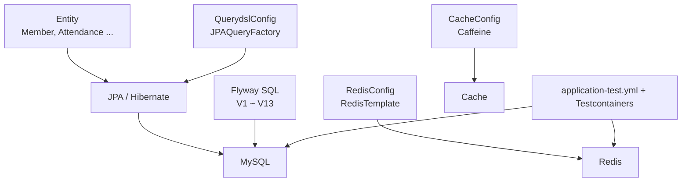
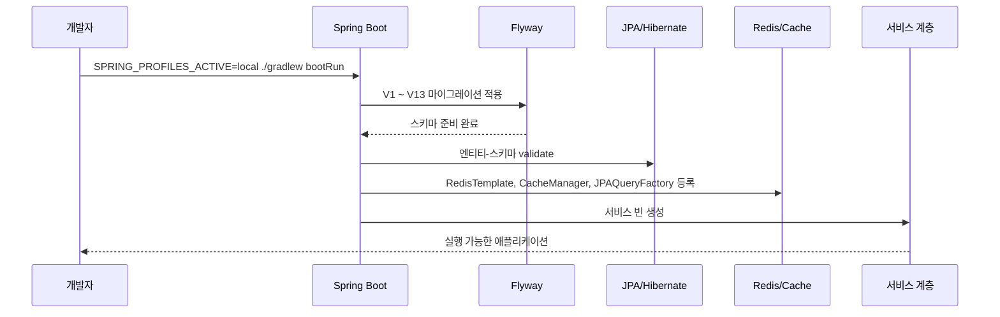
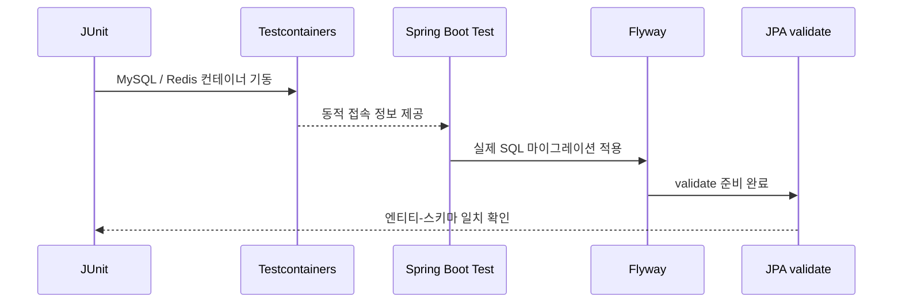

# [Spring Boot 포트폴리오] 05. JPA, Flyway, QueryDSL, Redis, Cache 공통 설정을 왜 이렇게 잡았는가

## 1. 이번 글에서 풀 문제

Spring Boot를 처음 공부할 때 데이터 접근 계층에서 가장 많이 헷갈리는 지점은 여기입니다.

- JPA가 있으면 DB 테이블도 알아서 관리해 주는 것 아닌가?
- 그럼 왜 Flyway를 또 써야 하지?
- Redis는 나중에 필요할 때 붙이면 되는 것 아닌가?
- Cache는 성능 이슈가 생긴 뒤에 붙여도 되는 것 아닌가?
- QueryDSL은 아직 복잡한 검색이 없는데 왜 초반에 넣었지?

Kindergarten ERP 프로젝트는 이 질문을 “나중에 생각하자”로 미루지 않았습니다.
오히려 초반에 공통 토대를 먼저 잡아 두고, 그 위에서 기능을 키우는 방식을 택했습니다.

이번 글에서 설명할 핵심 결론은 이렇습니다.

- JPA는 **엔티티와 영속성 컨텍스트**를 다룬다.
- Flyway는 **실제 스키마 변경 이력**을 다룬다.
- QueryDSL은 **타입 안전한 쿼리 확장 포인트**를 마련한다.
- Redis는 **세션, 토큰, rate limit 같은 짧은 상태**를 맡는다.
- Cache는 **읽기 빈도가 높은 계산 결과**를 줄인다.

즉, 이 다섯 가지는 경쟁 관계가 아니라 역할이 다릅니다.

이 글을 읽고 나면 아래 질문에 답할 수 있어야 합니다.

- 왜 `ddl-auto=create` 대신 `Flyway + validate`를 선택했는가?
- 왜 `BaseEntity`와 `@EnableJpaAuditing`을 초반에 넣었는가?
- 왜 Redis와 Cache 설정을 기능이 커지기 전에 공통 설정으로 잡았는가?
- 왜 테스트에서도 H2 대신 MySQL + Flyway 조합으로 검증해야 하는가?

## 2. 먼저 알아둘 개념

### 2-1. JPA

JPA는 자바 객체와 데이터베이스 테이블을 매핑해 주는 표준입니다.

쉽게 말하면

- `Member` 같은 자바 객체를 만들고
- `member` 테이블의 row와 연결하고
- 저장, 조회, 수정, 삭제를 객체 중심으로 다룰 수 있게 해 줍니다.

하지만 JPA는 “스키마 버전 관리 도구”는 아닙니다.

### 2-2. Flyway

Flyway는 SQL 파일 기반 DB 마이그레이션 도구입니다.

즉, 아래 같은 일을 담당합니다.

- 테이블 생성
- 컬럼 추가
- 인덱스 추가
- 데이터 이관
- 스키마 변경 이력 관리

`V1`, `V2`, `V3`처럼 버전이 쌓이는 구조라서, 운영형 프로젝트에 훨씬 적합합니다.

### 2-3. `ddl-auto=validate`

`spring.jpa.hibernate.ddl-auto=validate`는
“JPA가 스키마를 직접 만들지는 말고, 현재 엔티티와 DB 스키마가 맞는지만 확인하라”는 뜻입니다.

즉,

- 스키마 생성/수정: Flyway
- 엔티티-스키마 일치 여부 확인: JPA validate

로 역할을 분리한 것입니다.

### 2-4. Redis

Redis는 메모리 기반 key-value 저장소입니다.

이 프로젝트에서는 아래 같은 “짧게 살아야 하는 상태”에 잘 맞았습니다.

- JWT refresh token
- 세션 메타데이터
- 로그인 rate limit 카운터
- 알림 retry 상태

### 2-5. Cache

Cache는 자주 읽는 결과를 잠깐 저장해 두었다가 같은 계산을 다시 하지 않도록 해 주는 장치입니다.

이 프로젝트에서는 대시보드 통계처럼

- 여러 repository를 모아 계산해야 하고
- 짧은 시간 동안은 같은 결과를 재사용해도 되는 값

에 적용했습니다.

## 3. 이번 글에서 다룰 파일

```text
- build.gradle
- src/main/resources/application.yml
- src/main/resources/application-local.yml
- src/main/resources/application-prod.yml
- src/test/resources/application-test.yml
- src/main/resources/db/migration/V1__init_schema.sql
- src/main/resources/db/migration/V5__add_performance_indexes_for_dashboard_and_notepad.sql
- src/main/resources/db/migration/V8__normalize_member_social_accounts.sql
- src/main/resources/db/migration/V13__add_admission_workflow_attendance_requests_and_domain_audit.sql
- src/main/java/com/erp/global/config/JpaConfig.java
- src/main/java/com/erp/global/common/BaseEntity.java
- src/main/java/com/erp/global/config/QuerydslConfig.java
- src/main/java/com/erp/global/config/RedisConfig.java
- src/main/java/com/erp/global/config/CacheConfig.java
- src/main/java/com/erp/domain/member/entity/Member.java
- src/main/java/com/erp/domain/attendance/entity/Attendance.java
- src/main/java/com/erp/domain/dashboard/service/DashboardService.java
- src/main/java/com/erp/domain/auth/service/AuthSessionRegistryService.java
- src/test/java/com/erp/common/TestcontainersSupport.java
- src/test/java/com/erp/ErpApplicationTests.java
- docs/decisions/phase00_setup.md
- docs/decisions/phase15_testcontainers_integration_test_stack.md
```

이번 글은 “설정과 공통 인프라”가 주제이므로, 개별 비즈니스 기능보다 **기초 뼈대 파일**에 집중합니다.

## 4. 설계 구상

이 프로젝트의 데이터 접근 토대를 설계할 때 기준은 다섯 가지였습니다.

1. 엔티티와 스키마의 책임을 분리한다.
2. 운영에서 위험한 자동 스키마 변경은 막는다.
3. 나중에 쿼리가 복잡해질 것을 대비해 QueryDSL 진입점을 미리 둔다.
4. 인증/세션처럼 짧은 상태는 Redis로 분리한다.
5. 읽기 많은 계산은 Cache로 흡수한다.

이 구조를 한 장으로 그리면 아래와 같습니다.



핵심은 JPA 하나로 모든 문제를 해결하려 하지 않았다는 점입니다.

### 4-1. JPA는 객체 상태와 연관관계에 집중한다

예를 들어 [Member.java](../src/main/java/com/erp/domain/member/entity/Member.java)나 [Attendance.java](../src/main/java/com/erp/domain/attendance/entity/Attendance.java)는

- 어떤 필드가 필요한지
- 어떤 연관관계가 있는지
- 어떤 정적 팩토리 메서드와 비즈니스 메서드가 필요한지

를 표현합니다.

즉, 엔티티는 “테이블 구조 설명서”가 아니라 **상태와 행위를 가진 객체**입니다.

### 4-2. Flyway는 스키마 이력에 집중한다

반대로 SQL 마이그레이션은

- 어떤 테이블을 언제 만들었는지
- 어떤 컬럼과 인덱스를 언제 추가했는지
- 기존 데이터를 어떻게 새 구조로 옮겼는지

를 기록합니다.

이 두 역할을 섞지 않으면 스키마 drift를 줄일 수 있습니다.

### 4-3. QueryDSL은 “지금보다 미래”를 위한 투자였다

프로젝트 초반에는 복잡한 검색 조건이 많지 않았지만,
반/원생/출결/공지/신청으로 가면 동적 필터와 정렬이 늘어날 것이 보였습니다.

그래서 QueryDSL은 “당장 화려하게 쓰기 위해서”가 아니라
**타입 안전한 동적 쿼리 확장 포인트를 미리 열어 두기 위해** 넣었습니다.

### 4-4. Redis와 Cache는 나중에 붙인 것이 아니라 초반에 공통 설정으로 열어 뒀다

실제로 이 선택은 나중에 큰 도움이 됐습니다.

- Redis는 refresh token 저장, 세션 레지스트리, rate limit에 쓰였다.
- Cache는 대시보드 통계에 바로 연결됐다.

즉, 초반 공통 설정이 나중 기능 확장에서 재사용된 것입니다.

## 5. 코드 설명

### 5-1. `build.gradle`: 공통 인프라 의존성을 어디까지 초반에 넣을 것인가

[build.gradle](../build.gradle)의 핵심 의존성은 아래입니다.

```groovy
implementation 'org.springframework.boot:spring-boot-starter-data-jpa'
implementation 'org.springframework.boot:spring-boot-starter-data-redis'
implementation 'org.springframework.boot:spring-boot-starter-cache'
implementation 'com.querydsl:querydsl-jpa:5.0.0:jakarta'
implementation 'org.flywaydb:flyway-core'
implementation 'org.flywaydb:flyway-mysql'
runtimeOnly 'com.mysql:mysql-connector-j'
```

여기서 중요한 건 “기술을 많이 넣었다”가 아닙니다.
각각의 역할이 명확하다는 점입니다.

- `data-jpa`
  - 엔티티, repository, 트랜잭션 기반 DB 접근
- `data-redis`
  - Redis 연결과 `RedisTemplate`
- `starter-cache`
  - Spring Cache 추상화
- `querydsl-jpa`
  - 타입 안전한 동적 쿼리 확장 포인트
- `flyway-core`, `flyway-mysql`
  - MySQL 기준 마이그레이션 관리
- `mysql-connector-j`
  - 실제 MySQL 연결 드라이버

입문자 입장에서는 “기술을 붙일 때마다 책임을 하나씩 설명할 수 있는가”가 중요합니다.
설명할 수 없다면, 아직 넣을 시점이 아닐 가능성이 큽니다.

### 5-2. `application.yml`과 프로파일별 설정: JPA와 Flyway의 역할을 명확히 분리하기

이 프로젝트의 공통 설정은 [application.yml](../src/main/resources/application.yml)에 있습니다.

핵심 값은 아래입니다.

```yaml
spring:
  jpa:
    open-in-view: false
    properties:
      hibernate:
        default_batch_fetch_size: 100

  flyway:
    enabled: true
    baseline-on-migrate: true
    locations: classpath:db/migration
```

여기서 중요한 포인트는 세 가지입니다.

#### `open-in-view: false`

트랜잭션이 끝난 뒤 컨트롤러/뷰에서 LAZY 연관관계를 뒤늦게 건드리는 습관을 막습니다.

즉, “필요한 데이터는 서비스에서 명시적으로 조회하자”는 설계 원칙입니다.

#### `default_batch_fetch_size: 100`

연관 엔티티를 여러 개 가져올 때 N+1을 완화하기 위한 기본 안전장치입니다.

이 설정 하나로 모든 성능 문제가 해결되지는 않지만,
초반부터 “ORM이 자동으로 다 해주겠지”라고 방치하지 않았다는 점이 중요합니다.

#### `flyway.enabled: true`

스키마 변경을 JPA가 아니라 Flyway가 맡는다는 선언입니다.

그리고 local / prod / test는 각자 아래처럼 다르게 조정됩니다.

- [application-local.yml](../src/main/resources/application-local.yml)
  - `ddl-auto=validate`
  - `flyway.clean-disabled=false`
- [application-prod.yml](../src/main/resources/application-prod.yml)
  - `ddl-auto=none`
  - `flyway.clean-disabled=true`
- [application-test.yml](../src/test/resources/application-test.yml)
  - `ddl-auto=validate`
  - `flyway.enabled=true`

즉, 개발/테스트에서도 스키마 생성 책임은 Flyway에 주고,
JPA는 “이 엔티티와 현재 스키마가 맞는가?”만 확인하게 했습니다.

### 5-3. `JpaConfig`와 `BaseEntity`: 엔티티의 공통 규약을 먼저 만든다

[JpaConfig.java](../src/main/java/com/erp/global/config/JpaConfig.java)는 매우 짧습니다.

```java
@Configuration
@EnableJpaAuditing
public class JpaConfig {
}
```

짧지만 역할은 분명합니다.

- JPA Auditing 활성화
- `@CreatedDate`, `@LastModifiedDate`가 자동 동작하게 만들기

이 설정은 [BaseEntity.java](../src/main/java/com/erp/global/common/BaseEntity.java)와 연결됩니다.

핵심 필드는 두 개입니다.

- `createdAt`
- `updatedAt`

그리고 이 두 필드는 거의 모든 주요 엔티티의 공통 부모가 됩니다.

예를 들어 아래 엔티티들이 `BaseEntity`를 상속합니다.

- [Member.java](../src/main/java/com/erp/domain/member/entity/Member.java)
- [Attendance.java](../src/main/java/com/erp/domain/attendance/entity/Attendance.java)
- [Announcement.java](../src/main/java/com/erp/domain/announcement/entity/Announcement.java)
- [Notification.java](../src/main/java/com/erp/domain/notification/entity/Notification.java)

이 설계의 장점은 간단합니다.

- 생성/수정 시각 필드를 매번 중복 작성하지 않는다
- 시간 추적 규약이 모든 엔티티에 일관되게 들어간다
- 나중에 감사 로그, 운영 조회, 정렬 기준에서 재사용된다

### 5-4. `V1__init_schema.sql`: 초기 스키마는 SQL로 명시한다

[V1__init_schema.sql](../src/main/resources/db/migration/V1__init_schema.sql)은 이 프로젝트의 첫 번째 스키마입니다.

이 파일에서는 아래 테이블을 만듭니다.

- `kindergarten`
- `member`
- `classroom`
- `kid`
- `parent_kid`
- `attendance`
- `notepad`
- `notepad_read_confirm`
- `announcement`

입문자가 여기서 꼭 봐야 할 포인트는 세 가지입니다.

#### 첫 버전부터 외래키와 인덱스를 같이 만든다

예를 들어 `member.kindergarten_id`, `classroom.teacher_id`, `attendance.kid_id`는 처음부터 외래키로 연결돼 있습니다.

또한 아래처럼 인덱스도 함께 만듭니다.

```sql
CREATE INDEX idx_member_email ON member(email);
CREATE INDEX idx_attendance_kid_date ON attendance(kid_id, date);
CREATE INDEX idx_announcement_created ON announcement(created_at DESC);
```

즉, 스키마는 “일단 테이블만 만들고 나중에 인덱스 추가”가 아니라
**예상 조회 패턴까지 포함해 설계**한 것입니다.

#### JPA 엔티티와 SQL이 서로 맞물리게 설계한다

예를 들어 [Attendance.java](../src/main/java/com/erp/domain/attendance/entity/Attendance.java)는

- `@Table(name = "attendance", uniqueConstraints = ...)`
- `@ManyToOne(fetch = FetchType.LAZY)`
- `@Column(name = "date", nullable = false)`

처럼 실제 SQL 구조와 대응됩니다.

#### Soft delete 여부도 스키마에서 미리 고려한다

`member`, `classroom`, `kid`, `announcement` 같은 주요 테이블에는 `deleted_at` 컬럼이 들어 있습니다.

즉, 초반부터 물리 삭제가 아니라 soft delete 가능성을 설계에 넣은 것입니다.

### 5-5. 마이그레이션은 한 번으로 끝나지 않는다: `V5`, `V8`, `V13`

초기 스키마만 잘 만든다고 끝이 아닙니다.
진짜 중요한 건 **변화를 누적 관리하는 방식**입니다.

이 프로젝트의 마이그레이션은 현재 `V1`부터 `V13`까지 쌓여 있습니다.

대표 예시를 세 개만 보면 흐름이 보입니다.

#### [V5__add_performance_indexes_for_dashboard_and_notepad.sql](../src/main/resources/db/migration/V5__add_performance_indexes_for_dashboard_and_notepad.sql)

이 파일은 성능 개선을 위해 인덱스를 추가합니다.

즉, Flyway는 단순히 “테이블 생성기”가 아니라
운영 중 발견한 조회 패턴 최적화까지 이력으로 남기는 도구입니다.

#### [V8__normalize_member_social_accounts.sql](../src/main/resources/db/migration/V8__normalize_member_social_accounts.sql)

이 파일은 기존 `member` 테이블의 소셜 로그인 필드를 별도 `member_social_account` 테이블로 정규화합니다.

여기서 중요한 포인트는

- 새 테이블 생성
- unique index 생성
- 기존 데이터 `INSERT ... SELECT` 이관

까지 한 마이그레이션 안에서 처리했다는 점입니다.

즉, 스키마 변경과 데이터 이관을 같이 다룰 수 있습니다.

#### [V13__add_admission_workflow_attendance_requests_and_domain_audit.sql](../src/main/resources/db/migration/V13__add_admission_workflow_attendance_requests_and_domain_audit.sql)

이 파일은

- `classroom.capacity` 컬럼 추가
- `attendance_change_request` 테이블 추가
- `domain_audit_log` 테이블 추가

처럼 운영형 워크플로우 확장을 반영합니다.

즉, 마이그레이션 버전은 “프로젝트가 어떻게 성장했는가”의 연대기이기도 합니다.

### 5-6. `QuerydslConfig`: 아직 많이 안 써도, 진입점은 미리 열어 둔다

[QuerydslConfig.java](../src/main/java/com/erp/global/config/QuerydslConfig.java)는 `JPAQueryFactory` 빈 하나를 등록합니다.

핵심 메서드는 아래입니다.

- `jpaQueryFactory()`
  - `EntityManager`를 받아 `JPAQueryFactory`를 생성

그리고 [MemberRepositoryCustom.java](../src/main/java/com/erp/domain/member/repository/MemberRepositoryCustom.java), [MemberRepositoryImpl.java](../src/main/java/com/erp/domain/member/repository/MemberRepositoryImpl.java)에 커스텀 repository 확장 지점이 준비돼 있습니다.

정직하게 말하면, 현재 코드베이스에서 QueryDSL 활용도는 아직 높지 않습니다.
하지만 이건 오히려 입문자에게 중요한 교훈입니다.

**모든 준비를 당장 100% 활용할 필요는 없지만, 확장 포인트를 미리 열어 두면 이후 리팩터링 비용이 줄어든다**는 점입니다.

### 5-7. `RedisConfig`: 짧게 살아야 하는 상태를 관계형 DB에서 분리한다

[RedisConfig.java](../src/main/java/com/erp/global/config/RedisConfig.java)는 두 핵심 빈을 만듭니다.

- `redisConnectionFactory()`
- `redisTemplate()`

여기서 중요한 구현 포인트는 직렬화입니다.

- key: `StringRedisSerializer`
- value: `GenericJackson2JsonRedisSerializer`

즉, 키는 문자열로, 값은 JSON으로 다루게 했습니다.

이 설정은 나중에 [AuthSessionRegistryService.java](../src/main/java/com/erp/domain/auth/service/AuthSessionRegistryService.java)에서 바로 힘을 발휘합니다.

예를 들어 이 서비스의 핵심 메서드들은 아래입니다.

- `registerSession(...)`
- `rotateSession(...)`
- `getActiveSessions(...)`
- `revokeSession(...)`

이 메서드들은

- refresh token
- session metadata
- 만료 시간(TTL)

을 Redis에 저장하고 관리합니다.

즉, Redis를 “그냥 캐시”가 아니라 **세션 상태 저장소**로 활용한 것입니다.

### 5-8. `CacheConfig`: 계산 결과는 메모리 캐시로 짧게 보호한다

[CacheConfig.java](../src/main/java/com/erp/global/config/CacheConfig.java)는 Caffeine 기반 캐시 매니저를 등록합니다.

현재 설정은 아래 하나입니다.

- cache name: `dashboardStatistics`
- `expireAfterWrite(60초)`
- `maximumSize(500)`

이 캐시는 [DashboardService.java](../src/main/java/com/erp/domain/dashboard/service/DashboardService.java)와 연결됩니다.

핵심 메서드는 두 개입니다.

- `getDashboardStatistics(Kindergarten kindergarten)`
  - `@Cacheable`
- `evictDashboardStatisticsCache(Long kindergartenId)`
  - `@CacheEvict`

이 설계가 좋은 이유는 아래와 같습니다.

- 캐시 대상이 명확하다
- 무효화 지점도 서비스 메서드로 명시돼 있다
- “전체 캐시”가 아니라 읽기 많은 특정 계산만 캐시한다

즉, 캐시를 시스템 전체에 무분별하게 뿌리지 않고
**비용이 큰 읽기 한 지점에 좁게 적용**했습니다.

### 5-9. 테스트에서도 같은 전략을 유지한다: `application-test.yml` + `TestcontainersSupport`

이 부분이 취업 포트폴리오에서는 특히 중요합니다.

[application-test.yml](../src/test/resources/application-test.yml)을 보면

```yaml
spring:
  jpa:
    hibernate:
      ddl-auto: validate
  flyway:
    enabled: true
```

즉, 테스트에서도

- JPA가 스키마를 만들지 않고
- Flyway가 실제 마이그레이션을 적용하며
- 엔티티와 스키마 일치 여부는 validate로 확인합니다.

그리고 [TestcontainersSupport.java](../src/test/java/com/erp/common/TestcontainersSupport.java)는

- MySQL 8.0.36 컨테이너
- Redis 7 컨테이너
- `@DynamicPropertySource`

로 테스트 런타임을 실제 인프라에 가깝게 맞춥니다.

핵심 메서드는 `registerContainerProperties(...)`입니다.

이 메서드는

- `spring.datasource.*`
- `spring.flyway.*`
- `spring.data.redis.*`

속성을 컨테이너 값으로 주입합니다.

즉, 테스트에서도 “운영과 닮은 MySQL + Redis + Flyway” 조합을 강제한 것입니다.

## 6. 실제 흐름

이제 로컬 실행과 테스트 실행에서 실제로 어떤 순서로 동작하는지 보겠습니다.



### 로컬 실행 시

1. MySQL과 Redis는 Docker로 떠 있다.
2. Spring Boot가 시작된다.
3. Flyway가 `db/migration`의 SQL을 순서대로 적용한다.
4. Hibernate/JPA가 엔티티와 스키마가 맞는지 validate 한다.
5. `JpaConfig`, `QuerydslConfig`, `RedisConfig`, `CacheConfig`가 공통 빈을 등록한다.
6. 이후 서비스 계층이 이 빈들을 사용한다.

### 테스트 실행 시



이 흐름이 중요한 이유는, 테스트가 “가짜 스키마”가 아니라
**실제 마이그레이션 결과 위에서 돈다**는 점입니다.

## 7. 테스트로 검증하기

이번 편은 설정 글이지만, 이 프로젝트에서는 설정도 테스트 전략과 연결됩니다.

### 7-1. 컨텍스트 로드 테스트

[ErpApplicationTests.java](../src/test/java/com/erp/ErpApplicationTests.java)는 가장 단순한 테스트처럼 보이지만 의미가 큽니다.

- `@SpringBootTest`
- `@ActiveProfiles("test")`
- `extends TestcontainersSupport`

즉, 애플리케이션이

- MySQL Testcontainer
- Redis Testcontainer
- Flyway
- JPA validate

조합에서 실제로 컨텍스트를 올릴 수 있는지 확인합니다.

### 7-2. 통합 테스트 기반 클래스

[BaseIntegrationTest.java](../src/test/java/com/erp/common/BaseIntegrationTest.java)는

- `@SpringBootTest`
- `@ActiveProfiles("test")`
- `@Transactional`
- Redis flush
- 테스트 데이터 초기화

를 공통으로 제공합니다.

즉, 개별 기능 테스트도 결국 “실제 마이그레이션된 MySQL과 Redis” 위에서 실행됩니다.

### 7-3. 왜 H2 대신 이 방식을 택했는가

[phase15_testcontainers_integration_test_stack.md](../docs/decisions/phase15_testcontainers_integration_test_stack.md)에 정리된 이유가 명확합니다.

- H2는 MySQL과 SQL/DDL 차이가 있다
- `create-drop`은 편하지만 운영 스키마 기준 검증이 아니다
- Redis mock은 저장소 연동을 검증하지 못한다

즉, 테스트 신뢰도를 높이기 위해 설정 전략도 현실화한 것입니다.

## 8. 회고

이 단계에서 가장 중요한 교훈은 하나입니다.

**JPA를 도입했다고 해서 스키마 관리, 성능, 상태 저장, 캐시 전략까지 한 번에 해결되는 것은 아니다**는 점입니다.

그래서 이 프로젝트는 초반부터 역할을 이렇게 갈랐습니다.

- 객체 상태와 연관관계: JPA
- 스키마 변경 이력: Flyway
- 쿼리 확장 포인트: QueryDSL
- 짧은 상태 저장: Redis
- 읽기 최적화: Cache

그리고 나중에 프로젝트가 커지면서 이 토대가 실제로 재사용됐습니다.

- OAuth2 / JWT 세션 관리
- 로그인 rate limit
- 대시보드 캐싱
- 운영형 마이그레이션 누적
- MySQL/Redis Testcontainers 검증

정직하게 말하면 QueryDSL은 현재 코드에서 활용도가 아직 높지 않습니다.
하지만 이 사실도 숨길 필요는 없습니다.

오히려 “어떤 확장 포인트는 미리 열어 두었고, 어떤 것은 아직 활용을 넓혀 가는 중이다”라고 설명하는 편이 더 실무적입니다.

다음 글에서는 이렇게 깔아 둔 공통 토대 위에,
`global`과 `domain` 패키지 구조를 어떻게 나누고 공통 응답/예외 규약을 어떻게 세웠는지 설명하겠습니다.

## 9. 취업 포인트

이 글의 핵심은 기술 나열이 아닙니다.
면접에서는 아래처럼 설명하는 것이 더 좋습니다.

- “JPA와 Flyway의 책임을 분리해서 스키마 drift를 줄였습니다.”
- “local/test에서도 `ddl-auto=create` 대신 `Flyway + validate`를 유지해 운영과 가까운 검증을 하도록 설계했습니다.”
- “Redis와 Cache는 나중에 급히 붙인 게 아니라, 인증 상태와 읽기 최적화를 위해 초반 공통 설정으로 열어 두었습니다.”
- “Testcontainers로 MySQL/Redis를 실제로 띄워 테스트했기 때문에, 이 설정들이 문서용이 아니라 실제로 동작하는 토대라는 점을 설명할 수 있습니다.”

### 예상 질문

1. 왜 JPA만 쓰지 않고 Flyway를 같이 썼나요?
2. 왜 local에서도 `ddl-auto=update` 대신 `validate`를 썼나요?
3. Redis를 세션 저장소로 쓴 이유는 무엇인가요?
4. QueryDSL을 초반에 도입한 이유는 무엇인가요?
5. Cache를 어디에, 어떤 기준으로 적용했나요?

이 질문에 답할 수 있으면, 단순히 Spring Boot 기능을 붙인 수준이 아니라
**운영형 백엔드의 기초 토대를 설계한 경험**으로 말할 수 있습니다.

## 10. 시작 상태

- `02`, `03`, `04`까지 따라와서 프로젝트 뼈대, Docker 인프라, profile 전략이 준비돼 있어야 합니다.
- 이 글의 목표는 **DB/Redis를 실제로 쓰기 시작할 수 있는 공통 백엔드 기반**을 세우는 것입니다.

## 11. 이번 글에서 바뀌는 파일

```text
- 의존성 / 설정:
  - build.gradle
  - src/main/resources/application.yml
  - src/main/resources/application-local.yml
  - src/test/resources/application-test.yml
- 공통 config:
  - src/main/java/com/erp/global/config/JpaConfig.java
  - src/main/java/com/erp/global/config/QuerydslConfig.java
  - src/main/java/com/erp/global/config/RedisConfig.java
  - src/main/java/com/erp/global/config/CacheConfig.java
- 공통 엔티티 / 스키마:
  - src/main/java/com/erp/global/common/BaseEntity.java
  - src/main/resources/db/migration/V1__init_schema.sql
```

## 12. 구현 체크리스트

1. `build.gradle`에 JPA, Flyway, QueryDSL, Redis, Cache 관련 의존성을 추가합니다.
2. `BaseEntity`로 생성/수정/삭제 공통 필드를 정리합니다.
3. `V1__init_schema.sql`부터 마이그레이션 체계를 시작합니다.
4. JPA / QueryDSL / Redis / Cache 공통 설정 클래스를 만듭니다.
5. 테스트 환경도 별도 프로파일과 Testcontainers로 연결할 준비를 합니다.

## 13. 실행 / 검증 명령

```bash
./gradlew compileJava compileTestJava
./gradlew test --tests "com.erp.ErpApplicationTests"
```

성공하면 확인할 것:

- 애플리케이션과 테스트 코드가 함께 컴파일된다
- Flyway migration이 적용될 준비가 돼 있다
- JPA / Redis / Cache 설정 빈이 충돌 없이 올라온다

## 14. 글 종료 체크포인트

- `BaseEntity`와 migration 체계가 생겼다
- JPA, Flyway, QueryDSL, Redis, Cache의 역할을 각각 설명할 수 있다
- 테스트 환경도 나중에 Testcontainers로 현실화할 수 있는 기반이 생겼다

## 15. 자주 막히는 지점

- 증상: JPA 엔티티는 있는데 테이블이 기대대로 안 생김
  - 원인: Flyway와 JPA ddl-auto 책임을 동시에 헷갈린 경우가 많습니다
  - 확인할 것: 스키마 생성은 migration, 매핑 검증은 JPA라는 역할 분리를 다시 확인

- 증상: QueryDSL Q 클래스가 안 생김
  - 원인: annotation processor 설정이 빠졌거나 IDE/Gradle sync가 꼬였을 수 있습니다
  - 확인할 것: `build.gradle`의 QueryDSL processor 설정과 Gradle 재동기화 상태 확인
