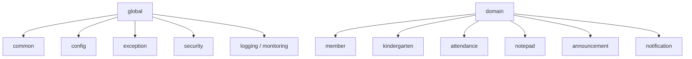
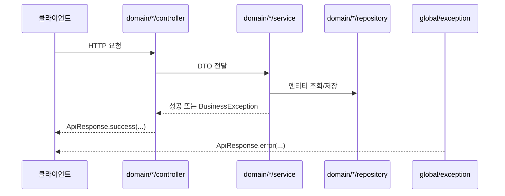

# [Spring Boot 포트폴리오] 06. `global` / `domain` 패키지 구조와 공통 응답, 예외 처리를 어떻게 잡았는가

## 1. 이번 글에서 풀 문제

Spring Boot 입문 프로젝트에서 기능을 빨리 붙이다 보면 코드가 이렇게 흐트러지기 쉽습니다.

- 컨트롤러마다 응답 형식이 다르다
- 예외 처리를 각 API에서 `try-catch`로 반복한다
- 공통 설정과 도메인 코드가 한 패키지에 섞인다
- 나중에 기능이 늘수록 파일을 어디 둬야 할지 헷갈린다

Kindergarten ERP는 초반부터 이 문제를 피하려고 구조를 두 갈래로 나눴습니다.

- `global/*`
  - 전역 규약과 설정
- `domain/*`
  - 실제 업무 기능

그리고 그 위에 아래 공통 규약을 먼저 세웠습니다.

- [ApiResponse.java](../src/main/java/com/erp/global/common/ApiResponse.java)
- [ErrorCode.java](../src/main/java/com/erp/global/exception/ErrorCode.java)
- [GlobalExceptionHandler.java](../src/main/java/com/erp/global/exception/GlobalExceptionHandler.java)
- [BaseEntity.java](../src/main/java/com/erp/global/common/BaseEntity.java)

이번 글의 목표는 “패키지를 이렇게 나눴다”가 아니라
**왜 이 구조가 프로젝트가 커질수록 더 중요해지는가**를 설명하는 것입니다.

## 2. 먼저 알아둘 개념

### 2-1. 관심사 분리

관심사 분리는 서로 다른 책임을 가진 코드를 분리하는 것입니다.

예를 들어

- 에러 응답 형식
- 보안 설정
- 로깅 설정
- 도메인 비즈니스 로직

은 모두 중요하지만 같은 종류의 코드가 아닙니다.

### 2-2. 공통 규약

공통 규약은 “모든 기능이 따르는 기본 규칙”입니다.

예를 들어

- 응답 형식은 항상 `ApiResponse<T>`
- 비즈니스 예외는 `BusinessException(ErrorCode)`
- 엔티티의 생성/수정 시간은 `BaseEntity`

처럼 정해 두면, 기능이 늘어도 코드 스타일이 무너지지 않습니다.

### 2-3. 도메인 중심 패키지

도메인 중심 패키지는 기술 레이어만으로 묶지 않고, 업무 기능 단위로 묶는 방식입니다.

예를 들어 이 프로젝트는 아래처럼 갑니다.

- `domain/member`
- `domain/kid`
- `domain/attendance`
- `domain/notepad`

각 도메인 아래에서 다시 `controller`, `service`, `repository`, `entity`, `dto`로 나눕니다.

## 3. 이번 글에서 다룰 파일

```text
- src/main/java/com/erp/global/common/ApiResponse.java
- src/main/java/com/erp/global/common/BaseEntity.java
- src/main/java/com/erp/global/exception/BusinessException.java
- src/main/java/com/erp/global/exception/ErrorCode.java
- src/main/java/com/erp/global/exception/GlobalExceptionHandler.java
- src/main/java/com/erp/global/config/*
- src/main/java/com/erp/global/security/*
- src/main/java/com/erp/domain/member/*
- src/main/java/com/erp/domain/attendance/*
- src/main/java/com/erp/domain/notepad/*
- docs/archive/legacy/project-idea.md
- docs/archive/legacy/project-plan.md
- docs/decisions/phase00_setup.md
```

## 4. 설계 구상

이 프로젝트의 패키지 구조는 아래 질문에서 출발했습니다.

1. 전역 규약과 업무 기능을 섞지 않으려면 어떻게 해야 할까?
2. 기능이 늘어도 “어디에 무엇을 둬야 하는지” 바로 보이게 하려면 어떻게 해야 할까?
3. 컨트롤러 / 서비스 / 리포지토리 구조를 유지하면서도 도메인 경계를 살리려면 어떻게 해야 할까?

그래서 최종적으로 아래 구조를 택했습니다.



핵심은 간단합니다.

- `global`은 모든 도메인이 공유하는 규칙
- `domain`은 각 업무 기능의 구현

입니다.

## 5. 코드 설명

### 5-1. `ApiResponse<T>`: 모든 API 응답을 같은 언어로 말하게 만들기

[ApiResponse.java](../src/main/java/com/erp/global/common/ApiResponse.java)의 역할은 아주 분명합니다.

- 성공 여부
- 데이터
- 메시지
- 에러 코드

를 하나의 형식으로 통일하는 것입니다.

핵심 메서드는 아래입니다.

- `success(T data)`
- `success()`
- `success(T data, String message)`
- `error(ErrorCode errorCode)`
- `error(ErrorCode errorCode, String message)`
- `error(ErrorCode errorCode, T data)`

이 구조가 좋은 이유는 프런트엔드와 테스트가 응답 형식을 예측할 수 있기 때문입니다.

### 5-2. `ErrorCode`: 문자열이 아니라 규격화된 에러 체계

[ErrorCode.java](../src/main/java/com/erp/global/exception/ErrorCode.java)는

- HTTP status
- 비즈니스 code
- message

를 함께 가집니다.

예를 들어

- `INVALID_CREDENTIALS`
- `ACCESS_DENIED`
- `CLASSROOM_CAPACITY_EXCEEDED`
- `APPLICATION_OFFER_EXPIRED`

처럼 도메인별 에러가 모두 enum으로 정리돼 있습니다.

즉, “문자열 메시지를 여기저기 흩뿌리지 않고”
에러 정책을 하나의 SSOT로 모은 것입니다.

### 5-3. `GlobalExceptionHandler`: 컨트롤러마다 try-catch를 반복하지 않기

[GlobalExceptionHandler.java](../src/main/java/com/erp/global/exception/GlobalExceptionHandler.java)는

- `handleBusinessException(...)`
- `handleValidationException(...)`
- `handleBindException(...)`
- `handleMethodNotSupported(...)`
- `handleAccessDenied(...)`
- `handleException(...)`

같은 메서드로 예외를 중앙 처리합니다.

이 구조 덕분에 서비스 계층은

- 실패하면 `throw new BusinessException(...)`

만 하면 되고, 응답 변환은 전역에서 맡습니다.

즉, 비즈니스 로직과 에러 응답 로직을 분리한 것입니다.

### 5-4. `BaseEntity`: 공통 필드는 모든 엔티티의 부모로 올린다

[BaseEntity.java](../src/main/java/com/erp/global/common/BaseEntity.java)는

- `createdAt`
- `updatedAt`

을 모든 주요 엔티티의 공통 부모로 제공합니다.

여기에 [JpaConfig.java](../src/main/java/com/erp/global/config/JpaConfig.java)의 `@EnableJpaAuditing`이 연결됩니다.

즉, 엔티티마다 생성/수정 시각을 중복 작성하지 않아도 됩니다.

### 5-5. `domain/*`는 기능 단위로 나누고, 내부에서 레이어를 나눈다

이 프로젝트는 기술 레이어만으로 전체를 나누지 않았습니다.

예를 들어 `member` 도메인을 보면 아래처럼 갑니다.

- `domain/member/controller`
- `domain/member/service`
- `domain/member/repository`
- `domain/member/entity`
- `domain/member/dto`

`attendance`, `notepad`, `announcement`도 같은 패턴을 따릅니다.

이 방식의 장점은 도메인별로 코드를 찾기 쉽다는 점입니다.

예를 들어 출결 기능을 보려면 `domain/attendance/*` 안만 보면 됩니다.

## 6. 실제 흐름

이 구조가 실제 요청 흐름에서 어떻게 작동하는지 보면 더 분명합니다.



여기서 중요한 점은,

- 도메인 로직은 `domain/*`
- 응답과 예외 규약은 `global/*`

로 분리된다는 것입니다.

## 7. 테스트로 검증하기

공통 규약은 테스트에서도 중요합니다.

예를 들어 API 통합 테스트들은 대부분 아래를 전제로 작성됩니다.

- 성공 시 `ApiResponse.success(...)`
- 실패 시 `ApiResponse.error(...)`
- 권한 오류면 `ErrorCode.ACCESS_DENIED`

즉, 공통 구조가 테스트의 기대값까지 단순하게 만들어 줍니다.

또한 [docs/decisions/phase00_setup.md](../docs/decisions/phase00_setup.md)에서도

- `ApiResponse<T>`
- `GlobalExceptionHandler`
- `BaseEntity`

를 초기에 먼저 만든 이유가 정리돼 있습니다.

## 8. 회고

입문 단계에서는 “일단 기능부터 붙이고 나중에 정리하자”는 유혹이 큽니다.

하지만 이 프로젝트는 그 반대로 갔습니다.

- 공통 응답
- 전역 예외 처리
- 공통 엔티티 규약
- 패키지 배치 기준

을 먼저 잡아 두고 나중 기능을 키웠습니다.

그 결과 기능이 커졌을 때도 구조가 덜 무너졌습니다.

## 9. 취업 포인트

이 글의 핵심은 화려한 기술이 아닙니다.
오히려 “처음부터 일관성 있는 구조를 잡을 줄 아는가”입니다.

면접에서는 이렇게 말할 수 있습니다.

- “전역 규약은 `global`, 업무 기능은 `domain`으로 나눴습니다.”
- “모든 API 응답을 `ApiResponse<T>`로 통일하고, 예외는 `BusinessException + ErrorCode + GlobalExceptionHandler` 체계로 정리했습니다.”
- “초기에는 조금 느려 보여도, 이 공통 규약 덕분에 이후 기능이 커져도 코드 일관성을 유지할 수 있었습니다.”

## 10. 시작 상태

- `02`~`05` 글까지 따라와서 프로젝트 부트스트랩, profile, JPA/Flyway/Redis 기반이 이미 있어야 합니다.
- 아직 기능을 많이 붙이기 전이라도, **응답 형식 / 예외 처리 / 공통 엔티티 규약 / 패키지 경계**는 먼저 정해야 합니다.
- 이 글의 목표는 기능 추가가 아니라, 이후 `07`~`26` 전체가 기대는 기본 규칙을 만드는 것입니다.

## 11. 이번 글에서 바뀌는 파일

```text
- 공통 응답 / 엔티티:
  - src/main/java/com/erp/global/common/ApiResponse.java
  - src/main/java/com/erp/global/common/BaseEntity.java
- 공통 예외:
  - src/main/java/com/erp/global/exception/BusinessException.java
  - src/main/java/com/erp/global/exception/ErrorCode.java
  - src/main/java/com/erp/global/exception/GlobalExceptionHandler.java
- 대표 도메인 구조 예시:
  - src/main/java/com/erp/domain/member/controller/MemberApiController.java
  - src/main/java/com/erp/domain/member/service/MemberService.java
  - src/main/java/com/erp/domain/member/repository/MemberRepository.java
- 결정 로그:
  - docs/decisions/phase00_setup.md
- 검증:
  - src/test/java/com/erp/ErpApplicationTests.java
  - src/test/java/com/erp/api/MemberApiIntegrationTest.java
```

## 12. 구현 체크리스트

1. `global`과 `domain` 패키지의 역할 경계를 먼저 정합니다.
2. `ApiResponse<T>`에 성공/실패 응답 팩토리 메서드를 만듭니다.
3. `BusinessException + ErrorCode + GlobalExceptionHandler` 체계를 맞춥니다.
4. `BaseEntity`에 공통 timestamp/soft delete 규칙을 둡니다.
5. 이후 도메인은 `domain/{controller,service,repository,entity,dto}` 패턴으로 맞춥니다.
6. 대표 API 테스트로 공통 응답과 예외 규약이 실제로 유지되는지 확인합니다.

## 13. 실행 / 검증 명령

```bash
./gradlew compileJava compileTestJava
./blog/scripts/checkpoint-06.sh
# 현재 완성 저장소 기준 안정 검증
./gradlew --no-daemon integrationTest
```

성공하면 확인할 것:

- `checkpoint-06.sh`가 통과해 공통 규약 파일과 핵심 패턴이 존재한다
- 이 시점의 코어 도메인 통합 스위트가 전체적으로 깨지지 않는다
- 애플리케이션이 현재 공통 규약 상태로 정상 기동한다
- 대표 API가 `ApiResponse<T>` 구조를 사용한다
- 비즈니스 예외가 `GlobalExceptionHandler`를 통해 일관된 포맷으로 응답된다

## 14. 산출물 체크리스트

- 새로 생긴 주요 클래스:
  - `ApiResponse`
  - `BaseEntity`
  - `BusinessException`
  - `ErrorCode`
  - `GlobalExceptionHandler`
- 대표 검증 대상:
  - `ErpApplicationTests`
  - `MemberApiIntegrationTest`
- 이후 모든 도메인이 따르는 패키지 규칙:
  - `domain/{controller,service,repository,entity,dto}`
  - `global/{common,config,exception,...}`

## 15. 글 종료 체크포인트

- `global`과 `domain`의 책임 경계를 말로 설명할 수 있다
- `ApiResponse`, `BusinessException`, `ErrorCode`, `GlobalExceptionHandler`가 한 세트로 동작한다
- 공통 규약이 이후 도메인 패키지 구조의 기준점이 된다
- “왜 기능보다 규약을 먼저 만들었는가”를 설명할 수 있다

## 16. 자주 막히는 지점

- 증상: 컨트롤러마다 응답 형식이 제각각이 된다
  - 원인: `ApiResponse<T>`를 공통 계약이 아니라 선택 사항처럼 썼을 수 있습니다
  - 확인할 것: 대표 controller가 raw entity/DTO를 직접 반환하지 않는지

- 증상: 예외는 던지는데 응답 포맷이 일정하지 않다
  - 원인: `BusinessException`과 `GlobalExceptionHandler`가 같은 규약을 보지 않을 수 있습니다
  - 확인할 것: `ErrorCode` status/code/message, `GlobalExceptionHandler` 매핑 로직
