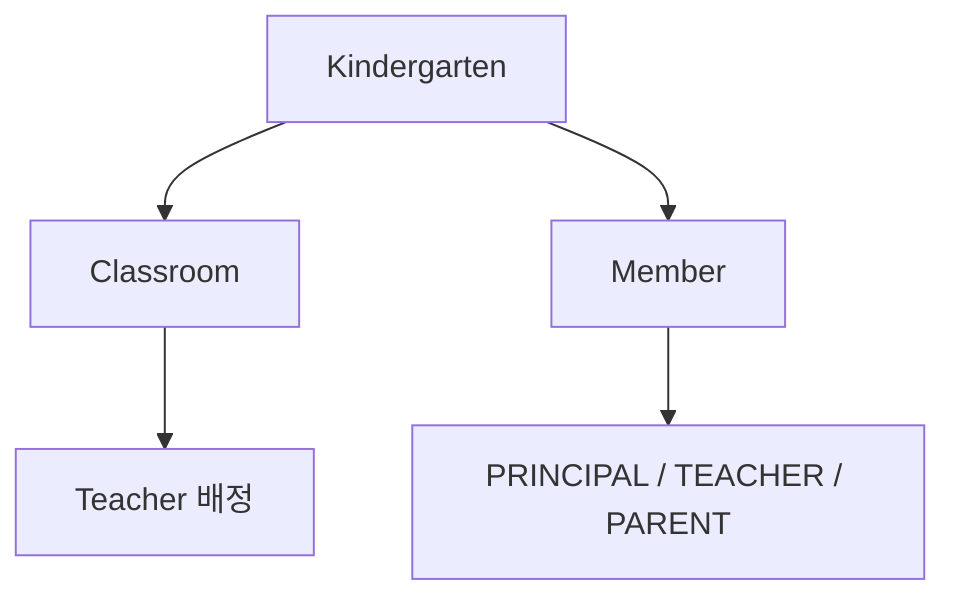
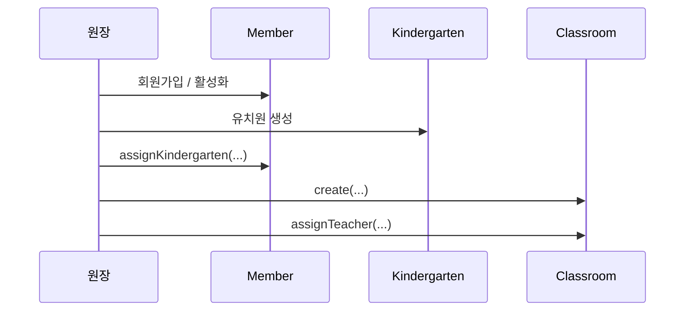

# [Spring Boot 포트폴리오] 07. `Member`, `Kindergarten`, `Classroom`으로 첫 관계를 어떻게 모델링했는가

## 1. 이번 글에서 풀 문제

도메인 모델링을 처음 할 때 가장 많이 하는 실수는 CRUD 화면 기준으로 엔티티를 나누는 것입니다.

예를 들어

- 회원 테이블
- 유치원 테이블
- 반 테이블

을 그냥 각각 독립적으로 만들고 끝내 버립니다.

하지만 Kindergarten ERP에서는 이 세 엔티티가 서로의 규칙을 만들어 냅니다.

- 회원은 역할을 가진다
- 회원은 유치원에 소속될 수 있다
- 반은 반드시 유치원에 속한다
- 반에는 담임 교사가 배정될 수 있다

즉, 이 세 엔티티는 단순 마스터 데이터가 아니라
**권한과 운영 흐름의 뼈대**입니다.

## 2. 먼저 알아둘 개념

### 2-1. 정적 팩토리 메서드

정적 팩토리 메서드는 `new` 대신 `create(...)` 같은 메서드로 객체를 만드는 방식입니다.

이 프로젝트에서는 거의 모든 핵심 엔티티가 이 방식을 씁니다.

장점은 생성 규칙을 한 곳에 모을 수 있다는 점입니다.

### 2-2. 연관관계

이 세 엔티티의 핵심 연관관계는 아래입니다.

- `Member -> Kindergarten`
- `Classroom -> Kindergarten`
- `Classroom -> Member(teacher)`

즉, 회원은 유치원에 소속되고, 반은 유치원과 교사에 연결됩니다.

### 2-3. Soft Delete

삭제를 바로 물리 삭제하지 않고 `deletedAt`을 남기는 방식입니다.

이 프로젝트에서는 `Member`, `Classroom`이 soft delete를 고려합니다.

### 2-4. 세 엔티티가 각각 무엇을 책임지는지 먼저 나누자

초보자는 `회원`, `유치원`, `반`을 모두 비슷한 마스터 테이블처럼 보기 쉽습니다.
하지만 실제 책임은 다릅니다.

| 엔티티 | 핵심 질문 | 이 글에서 맡긴 책임 |
|---|---|---|
| `Member` | 이 사용자는 누구이고 어떤 역할인가 | 역할, 상태, 소속, 인증 방식의 시작점 |
| `Kindergarten` | 이 사용자가 속한 운영 단위는 어디인가 | 테넌트 경계, 운영 시간, 기본 정보 |
| `Classroom` | 실제 아이와 교사가 모이는 단위는 어디인가 | 교사 배정, 정원, soft delete |

## 3. 이번 글에서 다룰 파일

```text
- src/main/java/com/erp/domain/member/entity/Member.java
- src/main/java/com/erp/domain/member/entity/MemberRole.java
- src/main/java/com/erp/domain/member/entity/MemberStatus.java
- src/main/java/com/erp/domain/kindergarten/entity/Kindergarten.java
- src/main/java/com/erp/domain/classroom/entity/Classroom.java
- src/main/java/com/erp/domain/member/service/MemberService.java
- src/main/java/com/erp/domain/classroom/service/ClassroomService.java
- src/test/java/com/erp/api/ClassroomApiIntegrationTest.java
- src/test/java/com/erp/api/MemberApiIntegrationTest.java
- docs/decisions/phase00_setup.md
- docs/decisions/phase41_admission_capacity_waitlist_workflow.md
```

## 4. 설계 구상

이 세 엔티티는 이 프로젝트의 “조직 구조”를 표현합니다.



핵심 설계 기준은 아래였습니다.

1. 역할은 `MemberRole` enum으로 제한한다
2. 회원은 유치원에 속할 수 있지만, 역할마다 쓰임새는 다르다
3. 반은 유치원 없이 존재할 수 없다
4. 반 정원과 교사 배정 규칙은 `Classroom`이 가진다

## 5. 코드 설명

### 5-1. `Member`: 이 프로젝트의 모든 사용자 시작점

[Member.java](../src/main/java/com/erp/domain/member/entity/Member.java)의 핵심 필드는 아래입니다.

- `email`
- `password`
- `name`
- `phone`
- `role`
- `status`
- `kindergarten`

핵심 생성 메서드는 두 개입니다.

- `create(...)`
  - 로컬 계정 생성
- `createSocial(...)`
  - 소셜 로그인 계정 생성

핵심 비즈니스 메서드는 아래입니다.

- `assignKindergarten(...)`
- `updateProfile(...)`
- `changePassword(...)`
- `activateMember()`
- `markPending()`
- `withdraw()`

즉, `Member`는 단순 회원 테이블이 아니라
인증 방식, 역할, 상태, 소속을 함께 관리하는 중심 엔티티입니다.

### 5-2. `Kindergarten`: 소속과 경계를 만드는 엔티티

[Kindergarten.java](../src/main/java/com/erp/domain/kindergarten/entity/Kindergarten.java)는

- `name`
- `address`
- `phone`
- `openTime`
- `closeTime`

을 가집니다.

핵심 메서드는 아래입니다.

- `create(...)`
- `update(...)`

언뜻 단순해 보이지만, 이 엔티티가 중요한 이유는
이후 거의 모든 접근 제어가 “같은 유치원 소속인가?” 기준으로 흘러가기 때문입니다.

즉, `Kindergarten`은 단순 마스터 데이터가 아니라
**테넌트 경계의 기준 엔티티**입니다.

### 5-3. `Classroom`: 유치원과 교사를 묶는 단위

[Classroom.java](../src/main/java/com/erp/domain/classroom/entity/Classroom.java)의 핵심 필드는 아래입니다.

- `kindergarten`
- `name`
- `ageGroup`
- `capacity`
- `teacher`
- `deletedAt`

핵심 생성/수정 메서드는 아래입니다.

- `create(kindergarten, name, ageGroup)`
- `create(kindergarten, name, ageGroup, capacity)`
- `update(...)`

핵심 비즈니스 메서드는 아래입니다.

- `assignTeacher(...)`
- `removeTeacher()`
- `remainingSeats(...)`
- `canResizeTo(...)`
- `softDelete()`

즉, `Classroom`은 단순 반 이름이 아니라

- 교사 배정
- 정원
- soft delete

규칙까지 품고 있습니다.

## 6. 실제 흐름

이 세 엔티티는 실제로 아래 순서로 연결됩니다.



즉, 이 구조가 먼저 있어야

- 교사 지원 승인
- 원생 반 배정
- 출결/알림장/일정 기능

이 자연스럽게 붙습니다.

## 7. 테스트로 검증하기

이 구조는 API 테스트에서도 바로 검증됩니다.

- `ClassroomApiIntegrationTest`
  - 반 생성, 수정, 교사 배정, 정원 관련 흐름
- `MemberApiIntegrationTest`
  - 회원 프로필, 비밀번호, 소셜/로컬 계정 흐름

즉, 도메인 모델이 실제 API 계약으로 바로 이어집니다.

또한 최근에는 [phase41_admission_capacity_waitlist_workflow.md](../docs/decisions/phase41_admission_capacity_waitlist_workflow.md)에서
`Classroom.capacity`가 waitlist/offer 워크플로우와도 연결됐습니다.

## 8. 회고

처음에는 `Classroom`에 정원이 없었습니다.
하지만 프로젝트가 운영형 워크플로우로 커지면서 정원이 반드시 필요해졌습니다.

이건 중요한 교훈입니다.

- 엔티티는 처음부터 완벽하지 않아도 된다
- 하지만 확장될 방향을 막아 두면 나중에 더 힘들어진다

`Classroom`이 유치원과 교사, 정원까지 함께 품고 있었기 때문에
나중에 waitlist 기능을 붙이기 훨씬 쉬웠습니다.

### 현재 구현의 한계

이 글 단계의 모델은 **조직 구조를 세우는 것**에 집중합니다.
즉, 같은 유치원 소속인지 강하게 검증하는 멀티테넌시 접근 정책은 아직 뒤 글에서 더 보강해야 합니다.
또 소셜 계정 lifecycle 같은 인증 확장은 `Member`가 시작점만 제공하고, 실제 정책은 후반 글에서 따로 닫습니다.

## 9. 취업 포인트

이 글에서 강조할 포인트는 아래입니다.

- “회원, 유치원, 반을 단순 테이블이 아니라 권한과 소속 구조의 시작점으로 모델링했습니다.”
- “`MemberRole`, `MemberStatus`를 enum으로 제한해 역할/상태 규칙을 코드에 녹였습니다.”
- “`Classroom`은 초기에 단순 반 관리였지만, 이후 정원과 배정 워크플로우 확장까지 고려할 수 있는 구조로 키웠습니다.”

### 9-1. 1문장 답변

- “`Member`, `Kindergarten`, `Classroom`을 단순 CRUD 테이블이 아니라 역할, 소속, 정원 규칙이 모이는 조직 구조의 뼈대로 모델링했습니다.”

### 9-2. 30초 답변

- “이 단계에서는 이후 모든 기능이 기대는 조직 구조를 먼저 세웠습니다. `Member`는 역할과 상태, 소속의 시작점이고, `Kindergarten`는 테넌트 경계 기준이며, `Classroom`은 교사 배정과 정원 규칙을 가진 운영 단위입니다. 그래서 나중에 원생 배정, 입학 대기열, 출결, 권한 검증을 모두 이 구조 위에 자연스럽게 얹을 수 있었습니다.”

### 9-3. 예상 꼬리 질문

- “왜 `Classroom`에 정원을 처음부터 넣었나요?”
- “왜 `Kindergarten`가 단순 마스터가 아니라 테넌트 경계인가요?”
- “회원 역할과 상태를 enum으로 둔 이유는 무엇인가요?”

## 10. 시작 상태

- `06` 글까지 따라와서 공통 규약과 패키지 구조가 잡혀 있어야 합니다.
- 이 글의 목표는 **회원, 유치원, 반을 별도 CRUD가 아니라 소속/권한 구조의 뼈대**로 세우는 것입니다.
- 이후 원생, 출석, 알림장, 지원 워크플로우는 모두 이 세 엔티티 위에 올라갑니다.

## 11. 이번 글에서 바뀌는 파일

```text
- 회원:
  - src/main/java/com/erp/domain/member/entity/Member.java
  - src/main/java/com/erp/domain/member/entity/MemberRole.java
  - src/main/java/com/erp/domain/member/entity/MemberStatus.java
  - src/main/java/com/erp/domain/member/controller/MemberApiController.java
- 유치원 / 반:
  - src/main/java/com/erp/domain/kindergarten/entity/Kindergarten.java
  - src/main/java/com/erp/domain/kindergarten/controller/KindergartenController.java
  - src/main/java/com/erp/domain/classroom/entity/Classroom.java
  - src/main/java/com/erp/domain/classroom/controller/ClassroomController.java
- 스키마:
  - src/main/resources/db/migration/V1__init_schema.sql
- 검증:
  - src/test/java/com/erp/api/MemberApiIntegrationTest.java
  - src/test/java/com/erp/api/KindergartenApiIntegrationTest.java
  - src/test/java/com/erp/api/ClassroomApiIntegrationTest.java
- 결정 로그:
  - docs/decisions/phase01_kindergarten.md
  - docs/decisions/phase02_member.md
  - docs/decisions/phase03_classroom.md
  - docs/decisions/phase41_admission_capacity_waitlist_workflow.md
```

## 12. 구현 체크리스트

1. `MemberRole`, `MemberStatus` enum으로 역할과 상태를 제한합니다.
2. `Member`에 생성, 프로필 수정, 비밀번호 변경, 유치원 배정 같은 핵심 메서드를 둡니다.
3. `Kindergarten`에 principal 연결과 기본 정보 수정 규칙을 넣습니다.
4. `Classroom`에 생성, 교사 배정, 정원, soft delete 규칙을 넣습니다.
5. 회원/유치원/반 API를 통해 소속 구조가 실제로 연결되게 만듭니다.
6. 통합 테스트로 생성, 수정, 배정, 정원 관련 흐름을 검증합니다.

## 13. 실행 / 검증 명령

```bash
./gradlew compileJava compileTestJava
./gradlew --no-daemon integrationTest
```

성공하면 확인할 것:

- 통합 스위트 안에서 `MemberApiIntegrationTest`, `KindergartenApiIntegrationTest`, `ClassroomApiIntegrationTest`가 함께 통과한다
- 회원이 역할/상태를 가진 상태로 생성된다
- 유치원과 principal 연결이 실제 엔티티 관계로 저장된다
- 반 생성, 수정, 교사 배정, 정원 규칙이 API 수준에서 동작한다

## 14. 산출물 체크리스트

- `Member`, `Kindergarten`, `Classroom` 엔티티와 관련 enum이 존재한다
- `MemberApiController`, `KindergartenController`, `ClassroomController`가 연결돼 있다
- `V1__init_schema.sql`에 기본 조직 구조 테이블이 존재한다
- `MemberApiIntegrationTest`, `KindergartenApiIntegrationTest`, `ClassroomApiIntegrationTest`가 통합 스위트에 포함된다

## 15. 글 종료 체크포인트

- 회원, 유치원, 반이 이후 모든 도메인의 소속 구조를 결정한다
- 역할/상태/정원 같은 제약이 엔티티 메서드에 반영돼 있다
- `Classroom`이 단순 이름 테이블이 아니라 운영 규칙을 가진 엔티티라는 점을 설명할 수 있다
- 이후 waitlist/offer 확장이 왜 `Classroom.capacity`와 자연스럽게 이어지는지 설명할 수 있다

## 16. 자주 막히는 지점

- 증상: 교사를 반에 배정했는데 같은 유치원 소속인지 설명이 불안하다
  - 원인: 소속 검증을 서비스나 정책 계층으로 끌어올리지 않았을 수 있습니다
  - 확인할 것: `Member.assignKindergarten(...)`, 관련 service 권한 검증

- 증상: 정원 변경이 쉽게 되지만 운영 시나리오와 안 맞는다
  - 원인: 현재 인원 수보다 작은 정원으로 줄이는 규칙이 없을 수 있습니다
  - 확인할 것: `Classroom.canResizeTo(...)`, 정원 변경 서비스 로직
