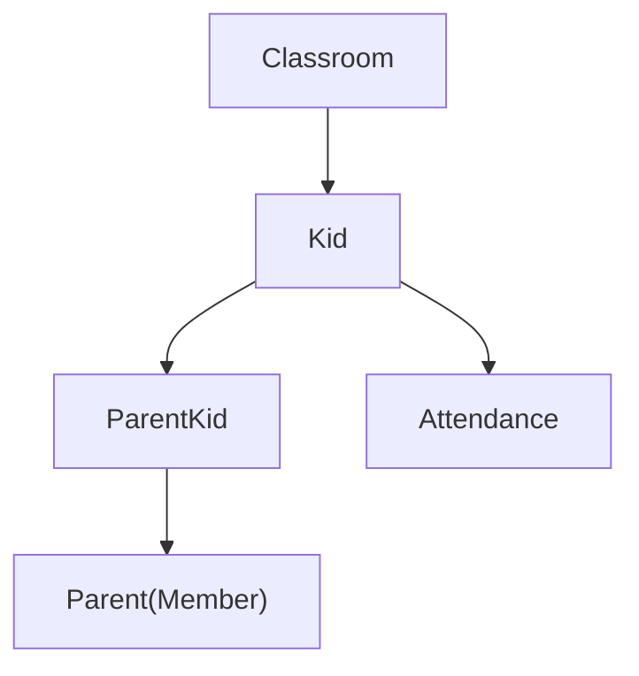
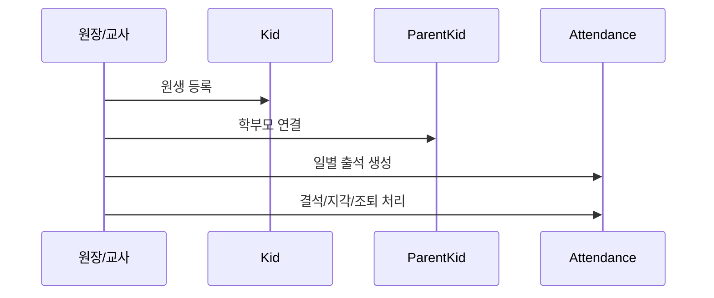

# [Spring Boot 포트폴리오] 08. `Kid`, `ParentKid`, `Attendance`로 첫 업무 Aggregate를 만드는 법

## 1. 이번 글에서 풀 문제

회원, 유치원, 반까지 만들었다고 해서 실제 서비스가 되는 것은 아닙니다.
이제 “업무”가 들어와야 합니다.

Kindergarten ERP에서 가장 먼저 업무 규칙이 강하게 드러나는 곳이 바로 이 세 엔티티입니다.

- `Kid`
- `ParentKid`
- `Attendance`

이 세 가지가 묶이면서 아래 문제가 생깁니다.

- 원생은 어느 반에 속하는가?
- 원생은 어떤 학부모와 연결되는가?
- 출석은 하루에 한 번만 있어야 하지 않는가?
- 결석/지각/조퇴 같은 상태는 어디서 관리해야 하는가?

즉, 이 단계부터는 “마스터 데이터”가 아니라
**업무 Aggregate**를 어떻게 설계할지가 중요해집니다.

## 2. 먼저 알아둘 개념

### 2-1. Aggregate

Aggregate는 함께 변경되고 함께 검증되어야 하는 객체 묶음이라고 이해하면 됩니다.

이 프로젝트에서는

- `Kid`
- `ParentKid`
- `Attendance`

가 강하게 연결됩니다.

### 2-2. 중간 엔티티

`ParentKid`는 단순 다대다 연결이 아니라,
관계의 의미(`FATHER`, `MOTHER`, `GUARDIAN` 등)를 담는 중간 엔티티입니다.

즉, `@ManyToMany`로 끝내지 않고 별도 엔티티로 승격시킨 것입니다.

### 2-3. 상태 enum

출석은 문자열이 아니라 enum으로 관리하는 편이 안전합니다.

이 프로젝트는 `AttendanceStatus`로 아래를 구분합니다.

- `PRESENT`
- `ABSENT`
- `LATE`
- `EARLY_LEAVE`
- `SICK_LEAVE`

### 2-4. 어떤 정보가 어디에 있어야 하는지 먼저 나누자

이 글은 “원생 기능” 하나를 만드는 것이 아니라, 서로 다른 책임을 가진 세 객체를 묶는 단계입니다.

| 객체 | 핵심 질문 | 맡긴 책임 |
|---|---|---|
| `Kid` | 아이 자체의 기본 정보와 소속은 무엇인가 | 반 배정, 보호자 연결 중심 |
| `ParentKid` | 어떤 보호자인가 | 관계 의미와 생성 시점 |
| `Attendance` | 그날 출결 상태는 무엇인가 | 날짜별 최종 출석 상태 |

## 3. 이번 글에서 다룰 파일

```text
- src/main/java/com/erp/domain/kid/entity/Kid.java
- src/main/java/com/erp/domain/kid/entity/ParentKid.java
- src/main/java/com/erp/domain/kid/entity/Relationship.java
- src/main/java/com/erp/domain/attendance/entity/Attendance.java
- src/main/java/com/erp/domain/attendance/entity/AttendanceStatus.java
- src/main/java/com/erp/domain/kid/service/KidService.java
- src/main/java/com/erp/domain/attendance/service/AttendanceService.java
- src/test/java/com/erp/api/KidApiIntegrationTest.java
- src/test/java/com/erp/api/AttendanceApiIntegrationTest.java
- docs/decisions/phase09_kid_management.md
- docs/decisions/phase04_attendance.md
```

## 4. 설계 구상

이 단계의 핵심 관계는 아래처럼 볼 수 있습니다.



설계 기준은 아래였습니다.

1. 원생은 반드시 반에 속한다
2. 학부모와 원생은 별도 관계 엔티티로 연결한다
3. 출석은 원생과 날짜 기준으로 유일해야 한다
4. 출석 상태 변경 메서드는 엔티티 안에 둔다

## 5. 코드 설명

### 5-1. `Kid`: 반 배정과 보호자 연결의 중심

[Kid.java](../src/main/java/com/erp/domain/kid/entity/Kid.java)의 핵심 필드는 아래입니다.

- `classroom`
- `name`
- `birthDate`
- `gender`
- `admissionDate`
- `deletedAt`
- `parents`

핵심 메서드는 아래입니다.

- `create(...)`
- `update(...)`
- `assignClassroom(...)`
- `addParent(...)`
- `removeParent(...)`
- `hasParent(...)`

즉, `Kid`는 단순 원생 정보가 아니라
반 소속과 보호자 연결의 중심 엔티티입니다.

### 5-2. `ParentKid`: 관계 자체를 도메인으로 올린다

[ParentKid.java](../src/main/java/com/erp/domain/kid/entity/ParentKid.java)는

- `kid`
- `parent`
- `relationship`
- `createdAt`

을 가집니다.

핵심 메서드는 아래입니다.

- `create(...)`
- `changeRelationship(...)`

이 구조가 좋은 이유는 `@ManyToMany`로는 담기 어려운 의미를 담을 수 있기 때문입니다.

- 단순 연결이 아니라 “어떤 보호자인가?”
- 연결 생성 시각은 언제인가?

즉, 관계도 하나의 도메인 정보로 다룹니다.

### 5-3. `Attendance`: 출석 상태를 엔티티 메서드로 다룬다

[Attendance.java](../src/main/java/com/erp/domain/attendance/entity/Attendance.java)의 핵심 필드는 아래입니다.

- `kid`
- `date`
- `status`
- `dropOffTime`
- `pickUpTime`
- `note`

핵심 생성 메서드는 아래입니다.

- `create(...)`
- `createDropOff(...)`

핵심 비즈니스 메서드는 아래입니다.

- `updateAttendance(...)`
- `recordDropOff(...)`
- `recordPickUp(...)`
- `markAbsent(...)`
- `markLate(...)`
- `markEarlyLeave(...)`
- `markSickLeave(...)`

즉, 출석 상태 전이 규칙을 서비스에 흩뿌리지 않고 엔티티 메서드로 모았습니다.

### 5-4. 날짜 유일성은 엔티티와 스키마 둘 다에서 보장한다

[Attendance.java](../src/main/java/com/erp/domain/attendance/entity/Attendance.java)는

```java
@Table(name = "attendance", uniqueConstraints = {
    @UniqueConstraint(columnNames = {"kid_id", "date"})
})
```

를 가집니다.

그리고 `V1__init_schema.sql`에서도 `UNIQUE KEY uk_kid_date (kid_id, date)`를 둡니다.

즉, “하루 한 원생 한 출석” 규칙을

- JPA 매핑
- 실제 DB 스키마

둘 다에서 잡은 것입니다.

## 6. 실제 흐름

이 세 엔티티는 실제 업무에서 아래처럼 움직입니다.



즉, 원생 관리와 출석 관리는 따로 떨어진 기능이 아니라
같은 Aggregate 안에서 자연스럽게 이어집니다.

## 7. 테스트로 검증하기

이 구조는 통합 테스트에서도 바로 검증됩니다.

- `KidApiIntegrationTest`
  - 원생 생성, 수정, 학부모 연결, 반 이동
- `AttendanceApiIntegrationTest`
  - 출석 생성, 수정, 결석/지각/조퇴 처리

또한 설계 의도는 아래 결정 로그와 연결됩니다.

- [phase09_kid_management.md](../docs/decisions/phase09_kid_management.md)
- [phase04_attendance.md](../docs/decisions/phase04_attendance.md)

즉, 도메인 모델, API, 테스트, 결정 로그가 한 방향을 봅니다.

## 8. 회고

이 단계에서 중요한 교훈은 두 가지입니다.

1. 단순 연결도 의미가 있으면 별도 엔티티로 올려야 한다
2. 상태 전이는 서비스보다 엔티티 메서드에 가까운 경우가 많다

`ParentKid`를 별도 엔티티로 만든 선택과
`Attendance` 안에 상태 변경 메서드를 둔 선택은 둘 다 이후 확장에 유리했습니다.

### 현재 구현의 한계

이 단계의 `Attendance`는 **확정 출결 데이터**에 집중합니다.
즉, 학부모가 요청하고 교사/원장이 승인하는 변경 요청 워크플로우는 아직 없습니다.
그 구조는 뒤에서 `AttendanceChangeRequest`를 따로 두면서 확장합니다.

## 9. 취업 포인트

이 글에서 면접에 연결할 수 있는 포인트는 아래입니다.

- “학부모-원생 관계를 단순 다대다가 아니라 의미를 가진 중간 엔티티로 모델링했습니다.”
- “출석은 원생+날짜 unique 규칙을 JPA와 DB 양쪽에서 보장했습니다.”
- “결석/지각/조퇴 같은 상태 전이를 엔티티 메서드에 모아 비즈니스 규칙을 응집시켰습니다.”

### 9-1. 1문장 답변

- “`Kid`, `ParentKid`, `Attendance`를 묶어 원생 소속, 보호자 관계, 날짜별 출결 상태를 하나의 업무 aggregate처럼 설계했습니다.”

### 9-2. 30초 답변

- “이 단계에서는 원생 관리가 단순 인적사항 CRUD가 아니라는 점에 집중했습니다. `Kid`는 반 배정과 보호자 연결의 중심이고, `ParentKid`는 관계 의미를 가진 중간 엔티티이며, `Attendance`는 하루 한 원생 한 출석 규칙과 상태 전이를 갖는 확정 데이터입니다. 그래서 이후 대시보드 출석률이나 출결 변경 요청도 이 모델을 깨지 않고 확장할 수 있습니다.”

### 9-3. 예상 꼬리 질문

- “왜 `ParentKid`를 `@ManyToMany`로 끝내지 않았나요?”
- “왜 출결 상태 변경을 서비스가 아니라 엔티티 메서드에 뒀나요?”
- “중복 출석을 어디서 막고 있나요?”

## 10. 시작 상태

- `07` 글까지 따라와서 회원, 유치원, 반 구조가 이미 있어야 합니다.
- 이 글의 목표는 **원생과 학부모 연결, 그리고 일별 출석 상태 전이**를 하나의 흐름으로 묶는 것입니다.
- 이후 알림장, 출결 변경 요청, 대시보드 출석률 계산도 이 모델 위에 올라갑니다.

## 11. 이번 글에서 바뀌는 파일

```text
- 원생 / 관계:
  - src/main/java/com/erp/domain/kid/entity/Kid.java
  - src/main/java/com/erp/domain/kid/entity/ParentKid.java
  - src/main/java/com/erp/domain/kid/controller/KidController.java
- 출석:
  - src/main/java/com/erp/domain/attendance/entity/Attendance.java
  - src/main/java/com/erp/domain/attendance/controller/AttendanceController.java
- 스키마:
  - src/main/resources/db/migration/V1__init_schema.sql
- 검증:
  - src/test/java/com/erp/api/KidApiIntegrationTest.java
  - src/test/java/com/erp/api/AttendanceApiIntegrationTest.java
- 결정 로그:
  - docs/decisions/phase04_attendance.md
  - docs/decisions/phase09_kid_management.md
```

## 12. 구현 체크리스트

1. `Kid`에 생성, 수정, 반 이동, 학부모 연결/해제 메서드를 둡니다.
2. `ParentKid`를 별도 엔티티로 두고 relationship 정보를 보존합니다.
3. `Attendance`에 `kid + date` unique 규칙을 JPA와 DB 양쪽에 둡니다.
4. 출석 상태 변경 메서드(`markAbsent`, `markLate`, `markEarlyLeave`, `markSickLeave`)를 엔티티에 둡니다.
5. 원생/출석 API를 만들어 교사와 원장이 실제로 관리할 수 있게 합니다.
6. 통합 테스트로 원생 생성/연결/반 이동과 출석 상태 전이를 검증합니다.

## 13. 실행 / 검증 명령

```bash
./gradlew compileJava compileTestJava
./gradlew --no-daemon integrationTest
```

성공하면 확인할 것:

- 통합 스위트 안에서 `KidApiIntegrationTest`, `AttendanceApiIntegrationTest`가 통과한다
- 원생 생성과 학부모 연결이 정상 동작한다
- 하루 한 원생 한 출석 규칙이 지켜진다
- 결석/지각/조퇴 같은 상태 전이가 API와 엔티티 규칙에 맞게 반영된다

## 14. 산출물 체크리스트

- `Kid`, `ParentKid`, `Attendance` 엔티티와 관련 enum이 존재한다
- `KidController`, `AttendanceController`가 연결돼 있다
- `V1__init_schema.sql`에 `kid_id + date` unique 규칙이 반영돼 있다
- `KidApiIntegrationTest`, `AttendanceApiIntegrationTest`가 통합 스위트에 포함된다

## 15. 글 종료 체크포인트

- `ParentKid`를 왜 별도 엔티티로 뒀는지 설명할 수 있다
- 출석 유일성 규칙이 JPA와 DB에 모두 반영돼 있다
- 상태 전이 메서드가 서비스가 아니라 엔티티에 모여 있다
- 이후 출결 변경 요청과 대시보드 출석률이 이 모델에 기대는 이유를 설명할 수 있다

## 16. 자주 막히는 지점

- 증상: 학부모-원생 관계를 단순 ID 목록처럼 다루게 된다
  - 원인: 관계 자체의 의미(`relationship`)를 무시하면 중간 엔티티로 올린 이유가 사라집니다
  - 확인할 것: `ParentKid.create(...)`, `Kid.addParent(...)`

- 증상: 하루 한 번만 출석이 들어가야 하는데 중복이 허용된다
  - 원인: JPA 매핑이나 DB unique key 둘 중 하나가 빠졌을 수 있습니다
  - 확인할 것: `Attendance`의 `@UniqueConstraint`, `V1__init_schema.sql`
