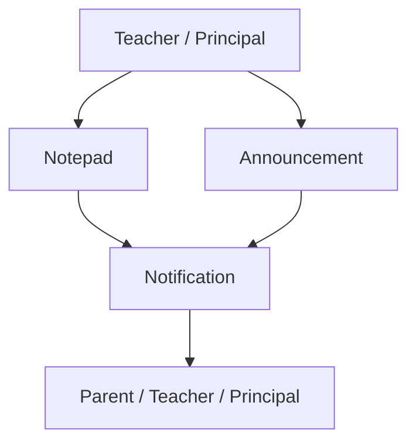
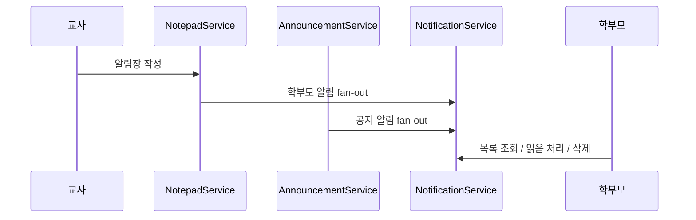

# [Spring Boot 포트폴리오] 09. 알림장, 공지, 알림으로 기능을 어떻게 확장했는가

## 1. 이번 글에서 풀 문제

원생과 출석까지 만들었다면 다음 질문이 생깁니다.

- 교사와 학부모는 어떻게 소통할까?
- 유치원 전체에 공지를 보내려면 무엇이 필요할까?
- 이벤트가 생겼을 때 사용자에게 어떻게 알려 줄까?

이 프로젝트는 이 문제를 세 도메인으로 풀었습니다.

- `Notepad`
- `Announcement`
- `Notification`

겉으로 보면 셋 다 “메시지”처럼 보입니다. 하지만 역할은 다릅니다.

- 알림장: 교사와 학부모의 일상 소통
- 공지사항: 유치원 전체 공지
- 알림: 시스템이 특정 사용자에게 보내는 이벤트

즉, 이 셋을 분리해야 도메인 규칙이 깔끔해집니다.

## 2. 먼저 알아둘 개념

### 2-1. 도메인별 메시지 성격 구분

모든 메시지를 하나의 테이블로 몰아넣으면 나중에 규칙이 섞입니다.

예를 들어

- 알림장은 읽음 확인이 중요하고
- 공지사항은 중요 공지와 조회수 집계가 중요하고
- 알림은 수신자별 읽음/삭제가 중요합니다

즉, 목적이 다르므로 도메인도 분리해야 합니다.

### 2-2. Fan-out

한 이벤트를 여러 사용자에게 퍼뜨리는 방식을 fan-out이라고 생각하면 됩니다.

이 프로젝트에서는

- 알림장 작성 시 여러 학부모에게 알림 전송
- 공지 작성 시 여러 역할 사용자에게 알림 전송

이 fan-out 패턴으로 이어집니다.

### 2-3. Soft Delete와 읽음 처리

사용자 알림은 보통 바로 물리 삭제하지 않고 soft delete를 사용합니다.  
또한 읽음 여부는 개별 사용자 상태로 관리해야 합니다.

## 3. 이번 글에서 다룰 파일

```text
- src/main/java/com/erp/domain/notepad/entity/Notepad.java
- src/main/java/com/erp/domain/notepad/service/NotepadService.java
- src/main/java/com/erp/domain/announcement/entity/Announcement.java
- src/main/java/com/erp/domain/announcement/service/AnnouncementService.java
- src/main/java/com/erp/domain/notification/entity/Notification.java
- src/main/java/com/erp/domain/notification/service/NotificationService.java
- src/test/java/com/erp/api/NotepadApiIntegrationTest.java
- src/test/java/com/erp/api/AnnouncementApiIntegrationTest.java
- src/test/java/com/erp/api/NotificationApiIntegrationTest.java
- docs/decisions/phase05_notepad.md
- docs/decisions/phase06_announcement.md
- docs/decisions/phase08_notification.md
```

## 4. 설계 구상

이 세 도메인의 관계는 아래처럼 볼 수 있습니다.



핵심 설계 기준은 아래였습니다.

1. 알림장은 범위가 있다: 전체 / 반 / 원생
2. 공지는 유치원 단위로 관리한다
3. 알림은 수신자 중심으로 관리한다
4. 소통 도메인에서 발생한 이벤트는 Notification으로 fan-out할 수 있어야 한다

## 5. 코드 설명

### 5-1. `Notepad`: 전체/반/원생 범위를 가진 알림장

[Notepad.java](/Users/alex/project/kindergarten_ERP/erp/src/main/java/com/erp/domain/notepad/entity/Notepad.java)의 핵심은 범위 분기입니다.

생성 메서드는 아래 세 개입니다.

- `createClassroomNotepad(...)`
- `createKidNotepad(...)`
- `createGlobalNotepad(...)`

그리고 범위를 확인하는 메서드도 따로 있습니다.

- `isClassroomNotepad()`
- `isKidNotepad()`
- `isGlobalNotepad()`

즉, 알림장은 “하나의 도메인”이지만 내부에 세 가지 발행 범위가 있습니다.

### 5-2. `NotepadService`: 생성과 알림 fan-out을 같이 다룬다

[NotepadService.java](/Users/alex/project/kindergarten_ERP/erp/src/main/java/com/erp/domain/notepad/service/NotepadService.java)의 핵심 메서드는 아래입니다.

- `createClassroomNotepad(...)`
- `createGlobalNotepad(...)`
- `createNotepad(...)`
- `getNotepadDetail(...)`

이 서비스의 중요한 포인트는 `notifyParentsAboutNotepad(...)`입니다.

즉, 알림장 저장만 하지 않고

- 원생별이면 해당 원생의 학부모
- 반별이면 반 소속 원생들의 학부모
- 전체면 해당 유치원 학부모들

에게 알림을 fan-out 합니다.

### 5-3. `Announcement`: 유치원 전체 공지와 중요 공지

[Announcement.java](/Users/alex/project/kindergarten_ERP/erp/src/main/java/com/erp/domain/announcement/entity/Announcement.java)의 핵심 생성 메서드는 아래입니다.

- `create(...)`
- `createImportant(...)`

핵심 비즈니스 메서드는 아래입니다.

- `update(...)`
- `setImportant(...)`
- `toggleImportant()`
- `incrementViewCount()`
- `softDelete()`

즉, 공지사항은 단순 게시글이 아니라

- 중요도
- 조회수
- soft delete

를 함께 다룹니다.

### 5-4. `AnnouncementService`: 공지 작성이 대시보드와 감사 로그까지 연결된다

[AnnouncementService.java](/Users/alex/project/kindergarten_ERP/erp/src/main/java/com/erp/domain/announcement/service/AnnouncementService.java)의 핵심 메서드는 아래입니다.

- `createAnnouncement(...)`
- `getAnnouncement(...)`
- `updateAnnouncement(...)`
- `deleteAnnouncement(...)`

특히 이 서비스는 아래와 연결됩니다.

- `notificationService.notifyWithLink(...)`
- `dashboardService.evictDashboardStatisticsCache(...)`
- `domainAuditLogService.record(...)`

즉, 공지사항은 단독 기능이 아니라

- 알림
- 대시보드
- 업무 감사 로그

와 연결된 허브 기능입니다.

### 5-5. `Notification`: 수신자 중심의 이벤트 박스

[Notification.java](/Users/alex/project/kindergarten_ERP/erp/src/main/java/com/erp/domain/notification/entity/Notification.java)의 핵심 생성 메서드는 아래입니다.

- `create(...)`
- `createWithRelatedEntity(...)`
- `createWithLink(...)`

핵심 상태 메서드는 아래입니다.

- `markAsRead()`
- `markAsUnread()`
- `softDelete()`

즉, 알림은 “어떤 이벤트가 누구에게 갔는가”를 표현하는 도메인입니다.

### 5-6. `NotificationService`: 내부 이벤트를 사용자 알림으로 바꾸는 계층

[NotificationService.java](/Users/alex/project/kindergarten_ERP/erp/src/main/java/com/erp/domain/notification/service/NotificationService.java)의 핵심 메서드는 아래입니다.

- `notify(...)`
- `notifyWithLink(...)`
- `notifyWithRelatedEntity(...)`
- `getNotifications(...)`
- `markAsRead(...)`
- `delete(...)`

즉, 다른 도메인이 직접 알림 엔티티를 만지지 않고  
NotificationService를 통해 사용자 알림으로 변환됩니다.

## 6. 실제 흐름

이 세 도메인은 아래처럼 이어집니다.



즉, “소통”과 “이벤트 전달”을 분리한 것입니다.

## 7. 테스트로 검증하기

관련 통합 테스트는 아래입니다.

- `NotepadApiIntegrationTest`
- `AnnouncementApiIntegrationTest`
- `NotificationApiIntegrationTest`

그리고 설계 의도는 아래 결정 로그에 남아 있습니다.

- [phase05_notepad.md](/Users/alex/project/kindergarten_ERP/erp/docs/decisions/phase05_notepad.md)
- [phase06_announcement.md](/Users/alex/project/kindergarten_ERP/erp/docs/decisions/phase06_announcement.md)
- [phase08_notification.md](/Users/alex/project/kindergarten_ERP/erp/docs/decisions/phase08_notification.md)

즉, 알림장/공지/알림이 단순 CRUD가 아니라  
실제 사용자 소통 흐름으로 검증되고 있습니다.

## 8. 회고

이 단계에서 중요한 교훈은 하나입니다.

**비슷해 보이는 기능도 목적이 다르면 도메인을 분리해야 한다**는 점입니다.

알림장, 공지, 알림을 하나로 뭉쳤다면

- 읽음 규칙
- 작성 권한
- 조회 범위
- fan-out 방식

이 다 섞였을 것입니다.

분리했기 때문에 이후 outbox, 감사 로그, 대시보드 같은 확장도 더 쉬워졌습니다.

## 9. 취업 포인트

면접에서는 이렇게 설명할 수 있습니다.

- “알림장, 공지, 알림을 모두 메시지로 보지 않고 목적별 도메인으로 분리했습니다.”
- “알림장과 공지 작성 이벤트는 NotificationService를 통해 사용자 알림으로 fan-out 되도록 설계했습니다.”
- “공지사항은 대시보드 캐시 무효화와 업무 감사 로그까지 연결되는 허브 기능으로 키웠습니다.”
