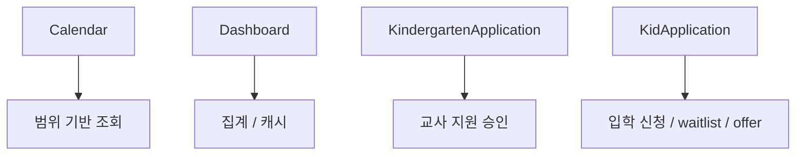
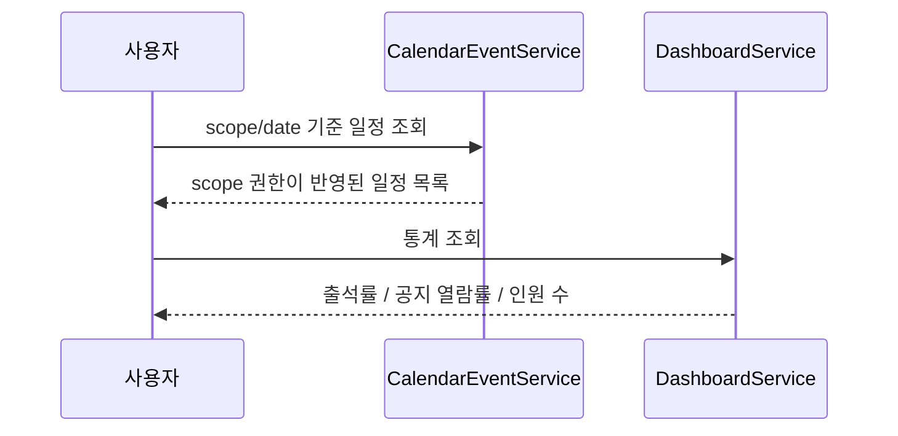
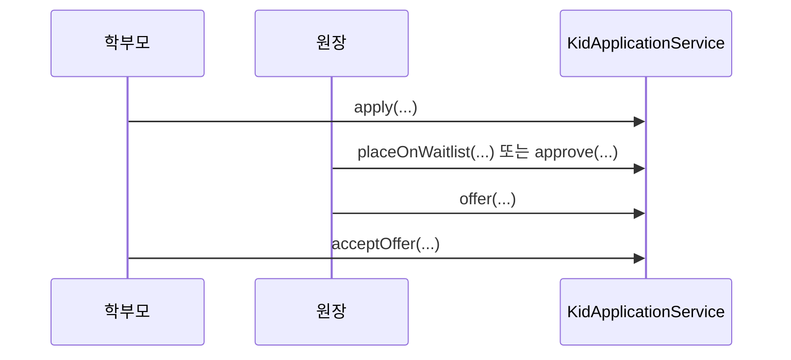

# [Spring Boot 포트폴리오] 10. 일정, 대시보드, 지원 워크플로우로 조회와 상태 전이를 넓히는 법

## 1. 이번 글에서 풀 문제

기본 CRUD가 어느 정도 만들어지면 프로젝트는 두 갈래로 확장됩니다.

1. 조회를 더 똑똑하게 만든다
2. 상태 전이를 더 현실적으로 만든다

Kindergarten ERP에서는 이 확장을 아래 도메인으로 풀었습니다.

- `Calendar`
- `Dashboard`
- `KidApplication`
- `KindergartenApplication`

즉, 이 단계부터는 단순 등록/수정이 아니라

- 범위 있는 일정 조회
- 통계 계산
- 교사 지원 승인/거절
- 학부모 입학 신청, 대기열, 제안, 만료

같은 **운영형 흐름**이 등장합니다.

## 2. 먼저 알아둘 개념

### 2-1. 조회 모델

대시보드는 원본 엔티티를 그대로 보여주는 기능이 아닙니다.  
여러 repository 결과를 조합해 요약 통계를 만드는 조회 모델입니다.

### 2-2. 상태 전이

지원서는 보통 단순 `PENDING / APPROVED / REJECTED`로 끝나지 않습니다.

이 프로젝트는 특히 학부모 입학 신청에서

- `PENDING`
- `WAITLISTED`
- `OFFERED`
- `APPROVED`
- `OFFER_EXPIRED`

같은 상태 전이를 다룹니다.

### 2-3. 범위 기반 캘린더

일정도 모두 같은 종류가 아닙니다.

- 유치원 전체 일정
- 반 일정
- 개인 일정

처럼 scope를 구분해야 권한과 조회가 자연스럽습니다.

## 3. 이번 글에서 다룰 파일

```text
- src/main/java/com/erp/domain/calendar/service/CalendarEventService.java
- src/main/java/com/erp/domain/dashboard/service/DashboardService.java
- src/main/java/com/erp/domain/kidapplication/service/KidApplicationService.java
- src/main/java/com/erp/domain/kindergartenapplication/service/KindergartenApplicationService.java
- src/main/resources/db/migration/V2__add_application_workflow.sql
- src/main/resources/db/migration/V4__create_calendar_events.sql
- src/main/resources/db/migration/V13__add_admission_workflow_attendance_requests_and_domain_audit.sql
- src/test/java/com/erp/api/CalendarApiIntegrationTest.java
- src/test/java/com/erp/api/DashboardApiIntegrationTest.java
- src/test/java/com/erp/api/KidApplicationApiIntegrationTest.java
- src/test/java/com/erp/api/KindergartenApplicationApiIntegrationTest.java
- docs/decisions/phase07_application.md
- docs/decisions/phase10_calendar.md
- docs/decisions/phase41_admission_capacity_waitlist_workflow.md
```

## 4. 설계 구상

이 네 도메인은 역할이 다르지만, “운영형 백엔드”라는 점에서 연결됩니다.



핵심 기준은 아래였습니다.

1. 일정은 scope 기반으로 조회한다
2. 대시보드는 계산 결과를 서비스가 조합한다
3. 교사 지원과 입학 신청은 각각 다른 상태 전이로 다룬다
4. 단순 승인/거절에서 멈추지 않고 실제 운영 흐름까지 모델링한다

## 5. 코드 설명

### 5-1. `CalendarEventService`: 범위가 있는 일정 시스템

[CalendarEventService.java](/Users/alex/project/kindergarten_ERP/erp/src/main/java/com/erp/domain/calendar/service/CalendarEventService.java)의 핵심 메서드는 아래입니다.

- `createEvent(...)`
- `getEvent(...)`
- `getEvents(...)`
- `updateEvent(...)`
- `deleteEvent(...)`

특히 이 서비스는 아래를 중요하게 다룹니다.

- `validateDateRange(...)`
- `validateRepeatRule(...)`
- `resolveScopeContext(...)`
- `validateViewPermission(...)`

즉, 일정 생성과 조회에서 날짜 검증, 반복 규칙, scope 권한을 같이 처리합니다.

### 5-2. `DashboardService`: 엔티티가 아니라 숫자를 만드는 서비스

[DashboardService.java](/Users/alex/project/kindergarten_ERP/erp/src/main/java/com/erp/domain/dashboard/service/DashboardService.java)의 핵심 메서드는 아래입니다.

- `getDashboardStatistics(...)`
- `evictDashboardStatisticsCache(...)`

그리고 내부 계산 메서드도 중요합니다.

- `calculateAttendanceRate(...)`
- `calculateAnnouncementReadRate(...)`
- `countActiveKidSchoolDays(...)`

즉, 대시보드는 단순히 `findAll()`해서 보여주는 기능이 아니라  
여러 repository 결과를 조합해 의미 있는 숫자를 만드는 계층입니다.

### 5-3. `KindergartenApplicationService`: 교사 지원 승인 흐름

[KindergartenApplicationService.java](/Users/alex/project/kindergarten_ERP/erp/src/main/java/com/erp/domain/kindergartenapplication/service/KindergartenApplicationService.java)의 핵심 메서드는 아래입니다.

- `apply(...)`
- `approve(...)`
- `reject(...)`
- `cancel(...)`
- `getPendingApplications(...)`

이 서비스는 교사 지원을 다루며,

- 원장 권한 검증
- 교사 상태 전환
- 유치원 배정
- 알림 발송
- 업무 감사 로그

까지 같이 처리합니다.

### 5-4. `KidApplicationService`: 단순 승인에서 waitlist/offer로 진화한 흐름

[KidApplicationService.java](/Users/alex/project/kindergarten_ERP/erp/src/main/java/com/erp/domain/kidapplication/service/KidApplicationService.java)의 핵심 메서드는 아래입니다.

- `apply(...)`
- `approve(...)`
- `placeOnWaitlist(...)`
- `offer(...)`
- `acceptOffer(...)`
- `reject(...)`

이 서비스가 중요한 이유는, 단순 승인/거절이 아니라  
실제 운영 시나리오를 반영했다는 점입니다.

- 정원이 차면 대기열
- 자리가 나면 offer
- 기한 안에 수락하면 승인
- 기한이 지나면 만료

즉, 백엔드다운 상태 머신 설계가 들어갑니다.

## 6. 실제 흐름

### 캘린더와 대시보드



### 지원 워크플로우



이 흐름이 중요한 이유는, 단순 CRUD보다 “상태 전이” 설명력이 훨씬 크기 때문입니다.

## 7. 테스트로 검증하기

관련 통합 테스트는 아래입니다.

- `CalendarApiIntegrationTest`
- `DashboardApiIntegrationTest`
- `KidApplicationApiIntegrationTest`
- `KindergartenApplicationApiIntegrationTest`

그리고 설계 변천은 아래 결정 로그와 연결됩니다.

- [phase07_application.md](/Users/alex/project/kindergarten_ERP/erp/docs/decisions/phase07_application.md)
- [phase10_calendar.md](/Users/alex/project/kindergarten_ERP/erp/docs/decisions/phase10_calendar.md)
- [phase41_admission_capacity_waitlist_workflow.md](/Users/alex/project/kindergarten_ERP/erp/docs/decisions/phase41_admission_capacity_waitlist_workflow.md)

즉, 이 단계는 “기능을 더 붙였다”가 아니라  
프로젝트가 진짜 운영 흐름을 다루기 시작한 단계입니다.

## 8. 회고

이 단계의 가장 큰 교훈은 아래입니다.

1. 조회는 단순 목록에서 끝나지 않는다
2. 현실 세계의 승인 흐름은 생각보다 상태가 많다

처음에는 지원 기능도 단순 승인/거절이면 충분해 보입니다.  
하지만 실제 운영 관점으로 가면 waitlist, offer expiry 같은 흐름이 필요해집니다.

즉, 이 단계부터 프로젝트가 “기능 구현 연습”에서  
“운영형 백엔드 설계 연습”으로 넘어갑니다.

## 9. 취업 포인트

면접에서는 이렇게 설명할 수 있습니다.

- “일정은 전체/반/개인 scope로 나눠 권한과 조회 범위를 함께 설계했습니다.”
- “대시보드는 여러 repository를 조합해 숫자를 만드는 조회 모델로 구현했습니다.”
- “입학 신청은 단순 승인/거절이 아니라 waitlist, offer, expiry까지 포함한 상태 전이로 모델링했습니다.”
- “교사 지원과 학부모 입학 신청을 분리해 서로 다른 워크플로우를 각각의 서비스로 관리했습니다.”

## 10. 시작 상태

- `09` 글까지 따라와서 핵심 운영 데이터가 이미 있어야 합니다.
- 이 글의 목표는 **단순 CRUD를 넘어 조회 모델과 상태 전이 워크플로우를 설계하는 것**입니다.
- 여기서 다루는 세 축은 서로 성격이 다릅니다.
  - 캘린더: 권한이 있는 일정 조회
  - 대시보드: 여러 데이터를 조합한 읽기 모델
  - 지원 워크플로우: 승인/대기열/offer 같은 상태 머신

## 11. 이번 글에서 바뀌는 파일

```text
- 캘린더:
  - src/main/java/com/erp/domain/calendar/entity/CalendarEvent.java
  - src/main/java/com/erp/domain/calendar/controller/CalendarEventController.java
  - src/main/java/com/erp/domain/calendar/service/CalendarEventService.java
  - src/main/resources/db/migration/V4__create_calendar_events.sql
- 대시보드:
  - src/main/java/com/erp/domain/dashboard/service/DashboardService.java
  - src/main/resources/db/migration/V5__add_performance_indexes_for_dashboard_and_notepad.sql
- 학부모 입학 신청:
  - src/main/java/com/erp/domain/kidapplication/entity/KidApplication.java
  - src/main/java/com/erp/domain/kidapplication/controller/KidApplicationController.java
  - src/main/java/com/erp/domain/kidapplication/service/KidApplicationService.java
  - src/main/resources/db/migration/V13__add_admission_workflow_attendance_requests_and_domain_audit.sql
- 교사 지원:
  - src/main/java/com/erp/domain/kindergartenapplication/entity/KindergartenApplication.java
  - src/main/java/com/erp/domain/kindergartenapplication/controller/KindergartenApplicationController.java
  - src/main/java/com/erp/domain/kindergartenapplication/service/KindergartenApplicationService.java
- 검증:
  - src/test/java/com/erp/api/CalendarApiIntegrationTest.java
  - src/test/java/com/erp/api/DashboardApiIntegrationTest.java
  - src/test/java/com/erp/api/KidApplicationApiIntegrationTest.java
  - src/test/java/com/erp/api/KindergartenApplicationApiIntegrationTest.java
- 결정 로그:
  - docs/decisions/phase07_application.md
  - docs/decisions/phase10_calendar.md
  - docs/decisions/phase18_dashboard_metric_redefinition.md
  - docs/decisions/phase41_admission_capacity_waitlist_workflow.md
```

## 12. 구현 체크리스트

1. `CalendarEvent`에 scope와 반복 일정 기준을 넣고 조회 권한을 설계합니다.
2. `DashboardService`에서 출석률, 공지 열람률, 인원 수 같은 읽기 모델을 만듭니다.
3. `KidApplication`에 waitlist, offer, approval, expiry 상태 전이를 넣습니다.
4. `KindergartenApplication`은 교사 지원에 맞는 별도 상태 전이로 분리합니다.
5. 필요한 인덱스와 스키마 변경을 migration으로 관리합니다.
6. 통합 테스트로 일정 조회, 대시보드 통계, 지원 상태 전이를 검증합니다.

## 13. 실행 / 검증 명령

```bash
./gradlew compileJava compileTestJava
./gradlew --no-daemon integrationTest
```

성공하면 확인할 것:

- 통합 스위트 안에서 `CalendarApiIntegrationTest`, `DashboardApiIntegrationTest`, `KidApplicationApiIntegrationTest`, `KindergartenApplicationApiIntegrationTest`가 통과한다
- 일정이 scope와 권한 기준으로 조회된다
- 대시보드 숫자가 현재 계산식 기준으로 정상 반환된다
- 학부모 입학 신청이 waitlist/offer/accept/expiry 흐름을 가진다
- 교사 지원은 별도 상태 머신으로 관리된다

## 14. 글 종료 체크포인트

- 캘린더, 대시보드, 지원 워크플로우가 서로 다른 조회/상태 모델이라는 점을 설명할 수 있다
- 읽기 모델과 상태 전이를 CRUD와 구분해 설명할 수 있다
- 입학 신청이 왜 단순 승인/거절로 끝나지 않는지 설명할 수 있다
- 이후 업무 감사 로그와 운영 콘솔이 이 흐름을 어떻게 증적화하는지 연결해 설명할 수 있다

## 15. 자주 막히는 지점

- 증상: 캘린더가 잘 보이는데 scope별 권한 설명이 약하다
  - 원인: 일정 저장 규칙만 보고 조회 범위 정책을 같이 설계하지 않았을 수 있습니다
  - 확인할 것: `CalendarEventService`, `CalendarApiIntegrationTest`

- 증상: 입학 신청이 결국 승인/거절 두 상태처럼만 구현된다
  - 원인: 현실 운영 흐름인 waitlist/offer/expiry를 모델에 올리지 않았을 수 있습니다
  - 확인할 것: `KidApplication.placeOnWaitlist(...)`, `offerSeat(...)`, `acceptOffer(...)`, `markOfferExpired()`
