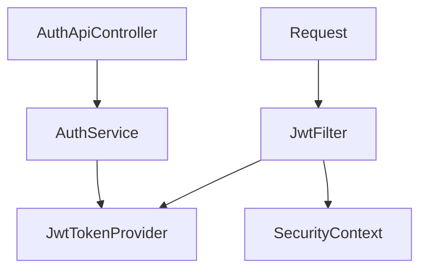
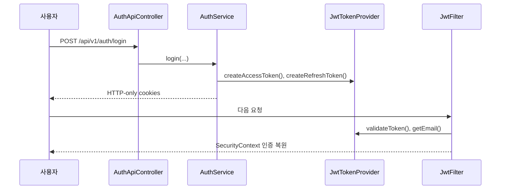

# [Spring Boot 포트폴리오] 12. `JwtTokenProvider`, `JwtFilter`, `AuthService`로 쿠키 JWT 흐름을 연결하기

## 1. 이번 글에서 풀 문제

기본 로그인 화면과 보안 체인을 붙였다면 다음 질문은 이것입니다.

- 로그인 성공 후 인증 상태를 어떻게 유지할까?
- Access Token과 Refresh Token은 어디서 만들까?
- 요청마다 쿠키에서 토큰을 꺼내 인증으로 바꾸는 작업은 누가 할까?

Kindergarten ERP는 이 문제를 아래 세 축으로 풀었습니다.

- `JwtTokenProvider`
- `JwtFilter`
- `AuthService`

이번 글은 “JWT를 붙였다”가 아니라  
**쿠키 기반 JWT 인증 흐름을 실제 요청 사이클에 연결하는 방법**을 설명합니다.

## 2. 먼저 알아둘 개념

### 2-1. Access Token / Refresh Token

- Access Token
  - 짧게 살아가는 인증 토큰
- Refresh Token
  - Access Token 재발급에 쓰는 더 긴 토큰

### 2-2. Authentication

Spring Security는 단순 토큰 문자열이 아니라  
`Authentication` 객체가 `SecurityContext`에 들어 있어야 “로그인된 사용자”로 인식합니다.

즉, 토큰을 읽어 `Authentication`으로 바꾸는 단계가 필요합니다.

### 2-3. HTTP-only Cookie

이 프로젝트는 JWT를 `Authorization` 헤더 대신 쿠키에 담습니다.

장점은 브라우저 기반 앱에서 관리가 편하다는 점이고,  
단점은 CSRF와 쿠키 보안 옵션을 더 신경 써야 한다는 점입니다.

## 3. 이번 글에서 다룰 파일

```text
- src/main/java/com/erp/global/security/jwt/JwtTokenProvider.java
- src/main/java/com/erp/global/security/jwt/JwtFilter.java
- src/main/java/com/erp/global/security/jwt/JwtProperties.java
- src/main/java/com/erp/domain/auth/service/AuthService.java
- src/main/java/com/erp/domain/auth/controller/AuthApiController.java
- src/test/java/com/erp/api/AuthApiIntegrationTest.java
- docs/decisions/phase17_jwt_refresh_session_rotation.md
```

## 4. 설계 구상

JWT 흐름의 책임은 아래처럼 나눴습니다.



핵심 기준은 아래였습니다.

1. 토큰 생성 규칙은 `JwtTokenProvider`에 모은다
2. 로그인/로그아웃/갱신 orchestration은 `AuthService`가 맡는다
3. 요청마다 인증 복원은 `JwtFilter`가 맡는다

## 5. 코드 설명

### 5-1. `JwtTokenProvider`: 토큰 생성과 파싱을 전담한다

[JwtTokenProvider.java](/Users/alex/project/kindergarten_ERP/erp/src/main/java/com/erp/global/security/jwt/JwtTokenProvider.java)의 핵심 메서드는 아래입니다.

- `createAccessToken(...)`
- `createRefreshToken(...)`
- `getEmail(...)`
- `getMemberId(...)`
- `getSessionId(...)`
- `getTokenType(...)`
- `validateToken(...)`
- `getRemainingValidity(...)`

핵심 포인트는 Access/Refresh를 따로 만들지만, 실제 생성 로직은 `createToken(...)`에 모아 둔 점입니다.

### 5-2. 토큰 claims에 무엇을 넣었는가

이 프로젝트의 토큰은 아래 정보를 담습니다.

- `subject(email)`
- `memberId`
- `role`
- `sessionId`
- `tokenType`
- `jti`

즉, 단순히 “누구인지”만이 아니라  
나중에 세션 레지스트리, rotation, revoke와 연결할 수 있는 정보를 같이 넣었습니다.

### 5-3. `AuthService.login()`: 로그인 성공 후 토큰을 발급한다

[AuthService.java](/Users/alex/project/kindergarten_ERP/erp/src/main/java/com/erp/domain/auth/service/AuthService.java)의 핵심 메서드는 아래입니다.

- `login(...)`
- `issueTokens(...)`
- `refreshAccessToken(...)`
- `logout(...)`

특히 `login(...)`은

1. 인증 시도
2. 회원 조회
3. 토큰 발급
4. 쿠키 추가

순으로 흐릅니다.

그리고 쿠키 추가는 `addCookie(...)`에서 처리합니다.

### 5-4. `JwtFilter`: 요청마다 쿠키를 읽어 인증으로 복원한다

[JwtFilter.java](/Users/alex/project/kindergarten_ERP/erp/src/main/java/com/erp/global/security/jwt/JwtFilter.java)의 핵심 메서드는 아래입니다.

- `doFilter(...)`
- `resolveToken(...)`
- `getAuthentication(...)`

흐름은 간단합니다.

1. 쿠키에서 Access Token 추출
2. 토큰 검증
3. 이메일로 사용자 조회
4. `Authentication` 객체 생성
5. `SecurityContext`에 저장

즉, 브라우저 요청이 들어올 때마다 “토큰 문자열 -> 로그인 사용자” 변환을 수행합니다.

## 6. 실제 흐름



## 7. 테스트로 검증하기

대표 검증은 `AuthApiIntegrationTest`입니다.

- 로그인 성공 시 쿠키 발급
- 잘못된 비밀번호면 `A001`
- 인증되지 않은 요청은 `401` 공통 포맷
- refresh 흐름 회귀 검증

또한 [phase17_jwt_refresh_session_rotation.md](/Users/alex/project/kindergarten_ERP/erp/docs/decisions/phase17_jwt_refresh_session_rotation.md)에서
이 JWT 구조가 이후 세션 레지스트리와 어떻게 연결되는지도 설명합니다.

## 8. 회고

초반 JWT 구현에서 가장 중요한 교훈은 아래입니다.

1. 토큰 생성과 인증 복원 책임을 분리해야 한다
2. `AuthService`는 토큰 라이브러리 사용처가 아니라 인증 오케스트레이터가 되어야 한다
3. 쿠키 기반 JWT는 필터와 보안 설정을 함께 봐야 한다

이 구조가 있었기 때문에 나중에 refresh rotation과 세션 관리도 무리 없이 얹을 수 있었습니다.

## 9. 취업 포인트

- “JWT 발급은 `JwtTokenProvider`, 인증 복원은 `JwtFilter`, 로그인 orchestration은 `AuthService`로 책임을 나눴습니다.”
- “토큰에 `sessionId`, `tokenType`, `jti`를 넣어 이후 세션 관리와 rotation으로 확장 가능한 구조를 먼저 만들었습니다.”
- “쿠키 기반 JWT를 택했기 때문에 CSRF와 쿠키 보안 설정까지 함께 설계했습니다.”

## 10. 시작 상태

- `11` 글까지 따라와서 회원가입/로그인 기본 API와 `SecurityConfig`가 있어야 합니다.
- 이 글의 목표는 **로그인 성공 후 JWT를 발급하고, 다음 요청에서 쿠키로 인증을 복원하는 흐름**을 완성하는 것입니다.

## 11. 이번 글에서 바뀌는 파일

```text
- 토큰 / 필터:
  - src/main/java/com/erp/global/security/jwt/JwtTokenProvider.java
  - src/main/java/com/erp/global/security/jwt/JwtFilter.java
- 인증 조율:
  - src/main/java/com/erp/domain/auth/service/AuthService.java
  - src/main/java/com/erp/domain/auth/controller/AuthApiController.java
  - src/main/java/com/erp/global/config/SecurityConfig.java
- 검증 파일:
  - src/test/java/com/erp/api/AuthApiIntegrationTest.java
  - docs/decisions/phase17_jwt_refresh_session_rotation.md
```

## 12. 구현 체크리스트

1. `JwtTokenProvider`에 access/refresh 토큰 생성과 파싱 책임을 모읍니다.
2. 토큰 claims에 `memberId`, `role`, `sessionId`, `tokenType`, `jti`를 넣습니다.
3. `AuthService.login()`에서 로그인 성공 후 쿠키 발급 흐름을 만듭니다.
4. `JwtFilter`가 요청마다 access token 쿠키를 읽고 `SecurityContext`를 복원하게 합니다.
5. `AuthApiIntegrationTest`로 로그인/인증/refresh 회귀를 검증합니다.

## 13. 실행 / 검증 명령

```bash
./gradlew test --tests "com.erp.api.AuthApiIntegrationTest"
./gradlew bootRun --args='--spring.profiles.active=local'
```

성공하면 확인할 것:

- 로그인 성공 시 HTTP-only access/refresh 쿠키가 발급된다
- 다음 요청에서 `JwtFilter`가 쿠키를 읽어 인증을 복원한다
- refresh 경로 회귀 테스트가 통과한다

## 14. 글 종료 체크포인트

- 토큰 생성 책임이 `JwtTokenProvider`로 분리돼 있다
- 요청 인증 복원 책임이 `JwtFilter`로 분리돼 있다
- 로그인 orchestration은 `AuthService`가 맡는다
- 브라우저 요청이 쿠키 기반으로 인증되는 최소 JWT 구조가 완성돼 있다

## 15. 자주 막히는 지점

- 증상: 로그인은 되는데 다음 요청이 계속 익명 사용자로 처리됨
  - 원인: `JwtFilter` 등록 순서나 access token 쿠키 이름이 맞지 않을 수 있습니다
  - 확인할 것: `SecurityConfig`의 필터 등록과 `JwtTokenProvider` 쿠키 이름 설정

- 증상: refresh 토큰까지 access 토큰처럼 처리됨
  - 원인: claim에 `tokenType`을 구분하지 않았거나 검증이 빠졌을 수 있습니다
  - 확인할 것: `JwtTokenProvider.getTokenType()` 또는 refresh 전용 검증 로직
