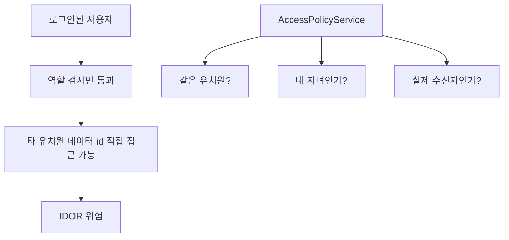
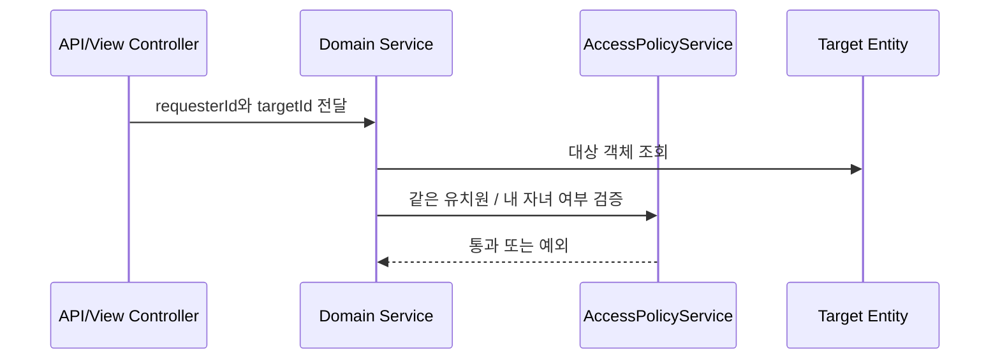

# [Spring Boot 포트폴리오] 13. 멀티테넌시 보안 문제를 어떻게 발견하고 고쳤는가

## 1. 이번 글에서 풀 문제

이 프로젝트에서 가장 중요한 리팩터링 중 하나는 기능 추가가 아니라 **보안 하드닝**이었습니다.

문제는 단순했습니다.

- 로그인은 되는데
- 역할 체크도 있는데
- 다른 유치원 데이터가 `id`만 알면 보일 수 있었다

즉, 전형적인 IDOR(Insecure Direct Object Reference) 위험이 있었습니다.

이 글에서는 왜 역할 기반 접근만으로는 부족했는지,
그리고 왜 `AccessPolicyService`를 서비스 계층 인가 SSOT로 올렸는지를 설명합니다.

## 2. 먼저 알아둘 개념

### 2-1. 역할 기반 인가

“원장은 가능, 학부모는 불가” 같은 규칙입니다.

이건 필요하지만 충분하지 않습니다.

### 2-2. 데이터 소속 기반 인가

같은 역할이라도 아래는 다릅니다.

- 내 유치원 데이터
- 다른 유치원 데이터
- 내 자녀 데이터
- 다른 학부모의 자녀 데이터

즉, 실제 서비스에서는 역할보다 데이터 관계가 더 중요할 때가 많습니다.

### 2-3. 서비스 계층 인가

컨트롤러에서만 권한을 막으면 API 경로가 달라지거나 서비스가 재사용될 때 빈틈이 생길 수 있습니다.

그래서 이 프로젝트는 인가 정책을 서비스 계층 공통 정책으로 끌어올렸습니다.

## 3. 이번 글에서 다룰 파일

```text
- src/main/java/com/erp/global/security/access/AccessPolicyService.java
- src/main/java/com/erp/domain/kid/service/KidService.java
- src/main/java/com/erp/domain/attendance/service/AttendanceService.java
- src/main/java/com/erp/domain/notepad/service/NotepadService.java
- src/main/java/com/erp/domain/announcement/service/AnnouncementService.java
- src/main/java/com/erp/domain/notification/service/NotificationService.java
- src/test/java/com/erp/api/KidApiIntegrationTest.java
- src/test/java/com/erp/api/AttendanceApiIntegrationTest.java
- src/test/java/com/erp/api/NotepadApiIntegrationTest.java
- src/test/java/com/erp/api/AnnouncementApiIntegrationTest.java
- src/test/java/com/erp/api/NotificationApiIntegrationTest.java
- docs/COMPLETED.md#archive-002
```

## 4. 설계 구상

이 문제의 핵심은 아래였습니다.



즉, 단순히 `hasRole("PARENT")` 같은 규칙만으로는
“이 학부모가 이 원생 데이터를 볼 수 있는가?”를 보장할 수 없었습니다.

## 5. 코드 설명

### 5-1. `AccessPolicyService`: 인가 정책을 한 곳으로 모은다

[AccessPolicyService.java](../src/main/java/com/erp/global/security/access/AccessPolicyService.java)의 핵심 메서드는 아래입니다.

- `getRequester(...)`
- `validateSameKindergarten(...)`
- `validateKidReadAccess(...)`
- `validateKidManageAccess(...)`
- `validateClassroomReadAccess(...)`
- `validateNotepadReadAccess(...)`
- `validateNotificationReceiverAccess(...)`

이 메서드들의 역할은 “역할 체크”가 아닙니다.
이미 로그인한 사용자가 **실제로 그 데이터에 접근 가능한 관계인지**를 검증하는 것입니다.

### 5-2. 왜 `read`와 `manage`를 나눴는가

예를 들어 학부모는 아래가 가능합니다.

- 내 자녀 알림장 읽기
- 내 자녀 출결 보기

하지만 아래는 불가능해야 합니다.

- 출결 수정
- 다른 학부모 자녀 데이터 읽기

그래서 `read`와 `manage`를 분리하지 않으면
권한 모델이 너무 거칠어집니다.

### 5-3. 서비스 계층에서 실제로 어떻게 쓰였는가

예를 들어 아래 서비스들이 `AccessPolicyService`를 직접 사용합니다.

- `KidService`
- `AttendanceService`
- `NotepadService`
- `AnnouncementService`
- `NotificationService`

즉, 인가 정책이 특정 컨트롤러에 박혀 있는 것이 아니라
도메인 서비스 안으로 내려가 있습니다.

### 5-4. 왜 컨트롤러가 아니라 서비스 계층에 뒀는가

이 프로젝트는

- API 컨트롤러
- View 컨트롤러
- HTMX 요청

이 모두 같은 서비스를 재사용합니다.

따라서 인가 정책을 컨트롤러마다 흩뿌리면 일관성이 깨질 수 있습니다.

서비스 계층으로 올리면 “어디서 호출하든 같은 정책”을 강제할 수 있습니다.

## 6. 실제 흐름



즉, 인가의 순서는 “로그인 여부 -> 역할 -> 실제 데이터 관계”입니다.

## 7. 테스트로 검증하기

이 작업의 핵심은 회귀 테스트입니다.

- `KidApiIntegrationTest`
  - 다른 유치원 원생 조회 차단
- `AttendanceApiIntegrationTest`
  - 다른 유치원 원생 출석 생성 차단
- `NotepadApiIntegrationTest`
  - 다른 유치원 학부모 알림장 열람 차단
- `AnnouncementApiIntegrationTest`
  - 다른 유치원 공지 조회 차단
- `NotificationApiIntegrationTest`
  - 타 유치원 수신자에게 알림 발송 차단

즉, “이론상 안전하다”가 아니라
실제 취약 시나리오를 실패 케이스로 고정했습니다.

## 8. 회고

이 작업은 취업 포트폴리오 관점에서 매우 중요합니다.

기능이 많아도 데이터 경계가 약하면
결국 “운영 감각 없는 CRUD 프로젝트”로 보이기 쉽습니다.

반대로 이런 보안 하드닝 작업은

- 서비스 계층 설계
- 권한 모델 이해
- 회귀 테스트 습관

을 모두 보여줍니다.

## 9. 취업 포인트

- “역할 기반 인증만으로는 IDOR를 막을 수 없어서, 데이터 소속 기반 인가를 서비스 계층 정책으로 올렸습니다.”
- “학부모는 내 자녀만, 교직원은 같은 유치원만 접근 가능하도록 `AccessPolicyService`를 SSOT로 만들었습니다.”
- “취약 시나리오를 통합 테스트 실패 케이스로 고정해 재발 가능성을 줄였습니다.”

## 10. 시작 상태

- `11`, `12` 글까지 따라와서 로그인과 JWT 인증이 동작해야 합니다.
- 핵심 도메인 API(`Kid`, `Attendance`, `Notepad`, `Announcement`, `Notification`)가 최소한 존재해야 합니다.
- 이 글의 목표는 **로그인한 사용자라면 다 볼 수 있었던 데이터 접근을 tenant/관계 기반으로 좁히는 것**입니다.

## 11. 이번 글에서 바뀌는 파일

```text
- 공통 인가 정책:
  - src/main/java/com/erp/global/security/access/AccessPolicyService.java
- 정책을 사용하는 서비스:
  - src/main/java/com/erp/domain/kid/service/KidService.java
  - src/main/java/com/erp/domain/attendance/service/AttendanceService.java
  - src/main/java/com/erp/domain/notepad/service/NotepadService.java
  - src/main/java/com/erp/domain/announcement/service/AnnouncementService.java
  - src/main/java/com/erp/domain/notification/service/NotificationService.java
- 검증 파일:
  - src/test/java/com/erp/api/KidApiIntegrationTest.java
  - src/test/java/com/erp/api/AttendanceApiIntegrationTest.java
  - src/test/java/com/erp/api/NotepadApiIntegrationTest.java
  - src/test/java/com/erp/api/AnnouncementApiIntegrationTest.java
  - src/test/java/com/erp/api/NotificationApiIntegrationTest.java
```

## 12. 구현 체크리스트

1. `AccessPolicyService`에 같은 유치원, 내 자녀, 실제 수신자 여부 같은 인가 규칙을 모읍니다.
2. 각 도메인 서비스가 requester 기반으로 정책 검사를 호출하게 바꿉니다.
3. 단순 `hasRole()`로는 막히지 않는 IDOR 시나리오를 다시 정리합니다.
4. 타 유치원 접근 차단 테스트를 기능별로 추가합니다.
5. 실패 케이스를 공통 `BusinessException` / `ErrorCode`로 유지합니다.

## 13. 실행 / 검증 명령

```bash
./gradlew test --tests "com.erp.api.KidApiIntegrationTest" --tests "com.erp.api.AttendanceApiIntegrationTest" --tests "com.erp.api.NotepadApiIntegrationTest" --tests "com.erp.api.AnnouncementApiIntegrationTest" --tests "com.erp.api.NotificationApiIntegrationTest"
```

성공하면 확인할 것:

- 다른 유치원 데이터 접근이 실패 케이스로 고정된다
- 학부모는 자기 자녀 범위만 읽을 수 있다
- 서비스 계층에서 동일 정책이 재사용된다

## 14. 글 종료 체크포인트

- 역할 기반 인증 위에 데이터 소속 기반 인가가 추가돼 있다
- `AccessPolicyService`가 인가 SSOT가 된다
- 주요 도메인 서비스가 requester 기반 검사를 수행한다
- 교차-유치원 접근 실패 테스트가 존재한다

## 15. 자주 막히는 지점

- 증상: 컨트롤러에서는 막았는데 다른 진입점에서 우회 가능함
  - 원인: 인가 정책이 서비스가 아니라 특정 컨트롤러에만 박혀 있을 수 있습니다
  - 확인할 것: 실제 검증 호출이 서비스 계층에 있는지 확인

- 증상: 같은 역할인데도 일부 데이터는 보여야 하고 일부는 막혀야 해서 헷갈림
  - 원인: 역할과 데이터 관계를 같은 개념으로 취급하면 정책이 거칠어집니다
  - 확인할 것: `read`와 `manage`, `같은 유치원`과 `내 자녀` 같은 관계 규칙을 분리했는지 확인
