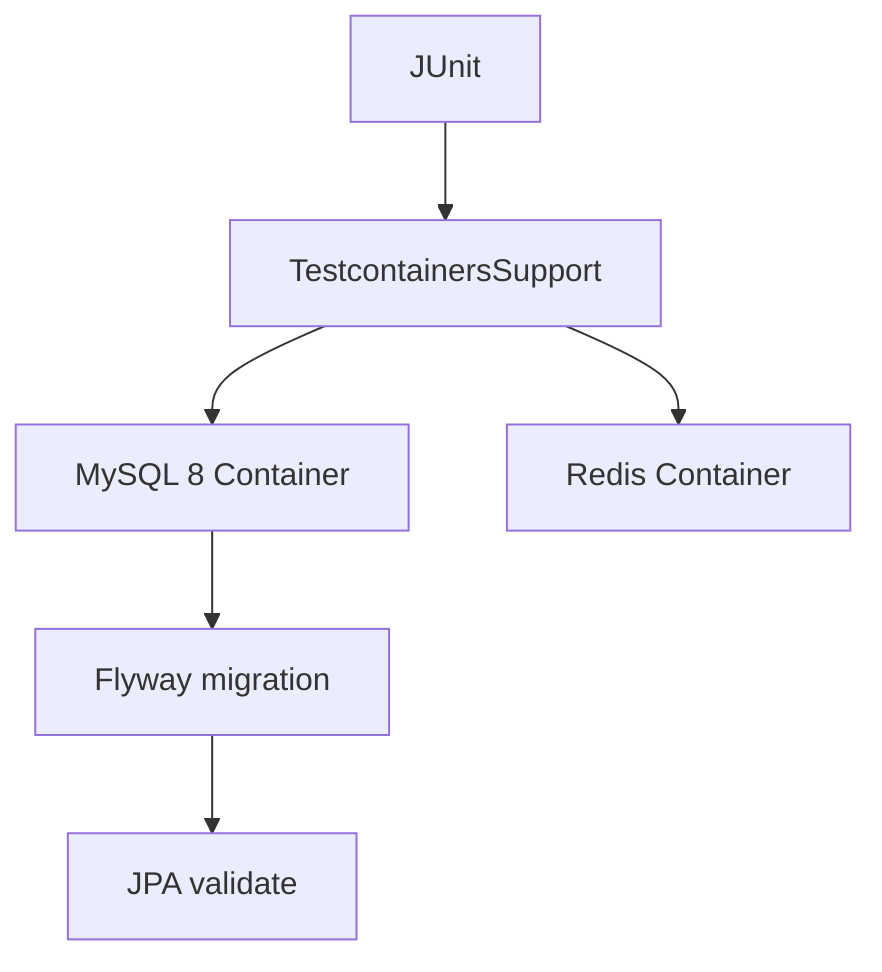
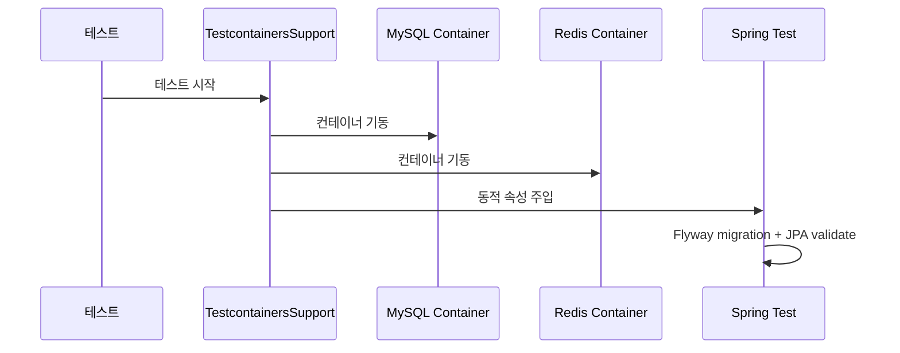

# [Spring Boot 포트폴리오] 14. 왜 H2가 아니라 Testcontainers를 붙였는가

## 1. 이번 글에서 풀 문제

테스트를 처음 붙일 때 많은 프로젝트가 이렇게 시작합니다.

- H2 메모리 DB
- `ddl-auto=create-drop`
- Redis는 mock

빠르고 편합니다. 하지만 이 프로젝트는 어느 순간 이 방식이 부족해졌습니다.

- 실제 운영 DB는 MySQL인데 테스트는 H2였다
- 실제 스키마는 Flyway가 관리하는데 테스트는 JPA가 만들었다
- 실제 인증은 Redis에 의존하는데 테스트는 mock이었다

즉, 테스트가 통과해도 운영에서 깨질 수 있는 구조였습니다.

## 2. 먼저 알아둘 개념

### 2-1. Testcontainers

Testcontainers는 테스트 실행 중 Docker 컨테이너를 띄워  
실제 인프라에 가까운 환경에서 검증하게 해 주는 도구입니다.

### 2-2. 운영과 닮은 테스트

포트폴리오에서 중요한 것은 테스트 개수보다  
“얼마나 믿을 수 있는 환경에서 검증했는가”입니다.

### 2-3. `Flyway + validate`

테스트에서도

- Flyway가 실제 스키마를 만들고
- JPA는 validate만 하는 구조

를 유지하면 엔티티-스키마 drift를 더 잘 잡을 수 있습니다.

## 3. 이번 글에서 다룰 파일

```text
- build.gradle
- src/test/resources/application-test.yml
- src/test/java/com/erp/common/TestcontainersSupport.java
- src/test/java/com/erp/common/BaseIntegrationTest.java
- src/test/java/com/erp/ErpApplicationTests.java
- docs/decisions/phase15_testcontainers_integration_test_stack.md
```

## 4. 설계 구상

이 단계의 기준은 단순했습니다.

1. 테스트 DB도 MySQL이어야 한다
2. 테스트 Redis도 실제 Redis여야 한다
3. 테스트 스키마도 Flyway가 만들어야 한다



## 5. 코드 설명

### 5-1. `build.gradle`: Testcontainers 의존성 추가

핵심 추가 의존성은 아래입니다.

- `org.testcontainers:testcontainers`
- `org.testcontainers:junit-jupiter`
- `org.testcontainers:mysql`

즉, 테스트 인프라를 코드로 올린 것입니다.

### 5-2. `application-test.yml`: 테스트도 validate를 유지한다

[application-test.yml](/Users/alex/project/kindergarten_ERP/erp/src/test/resources/application-test.yml)의 핵심은 아래입니다.

- `spring.jpa.hibernate.ddl-auto=validate`
- `spring.flyway.enabled=true`

즉, 테스트에서도 JPA가 스키마를 만들지 않습니다.

### 5-3. `TestcontainersSupport`: 동적 인프라 주입의 중심

[TestcontainersSupport.java](/Users/alex/project/kindergarten_ERP/erp/src/test/java/com/erp/common/TestcontainersSupport.java)의 핵심은 아래입니다.

- `MYSQL`
- `REDIS`
- `registerContainerProperties(...)`

이 메서드가

- datasource
- flyway
- redis

속성을 컨테이너 값으로 주입합니다.

### 5-4. `BaseIntegrationTest`: 통합 테스트 공통 기반

[BaseIntegrationTest.java](/Users/alex/project/kindergarten_ERP/erp/src/test/java/com/erp/common/BaseIntegrationTest.java)는

- 컨테이너 인프라 상속
- 테스트 데이터 초기화
- Redis flush
- 인증 헬퍼

를 공통으로 제공합니다.

즉, 개별 기능 테스트들이 모두 같은 현실적인 기반 위에서 돕니다.

## 6. 실제 흐름



## 7. 테스트로 검증하기

핵심 검증 파일은 아래입니다.

- `ErpApplicationTests`
  - 컨텍스트 로드
- `BaseIntegrationTest`
  - 모든 API 통합 테스트의 기반

그리고 결정 로그인 [phase15_testcontainers_integration_test_stack.md](/Users/alex/project/kindergarten_ERP/erp/docs/decisions/phase15_testcontainers_integration_test_stack.md)에
왜 H2를 버리고 이 구조로 갔는지 정리돼 있습니다.

## 8. 회고

Testcontainers는 H2보다 느립니다.  
하지만 이 프로젝트에서는 그 비용을 감수할 가치가 있었습니다.

이유는 단순합니다.

- 인증/세션이 Redis에 의존하고
- 스키마가 Flyway에 의존하고
- 운영 DB가 MySQL이기 때문입니다

즉, 현실과 다른 테스트는 빨라도 설득력이 약했습니다.

## 9. 취업 포인트

- “H2 대신 MySQL/Redis Testcontainers로 테스트를 현실화했습니다.”
- “테스트에서도 `Flyway + validate`를 유지해 엔티티와 스키마 drift를 검증했습니다.”
- “테스트 개수보다 운영과 닮은 검증 환경이 더 중요하다고 판단했습니다.”
