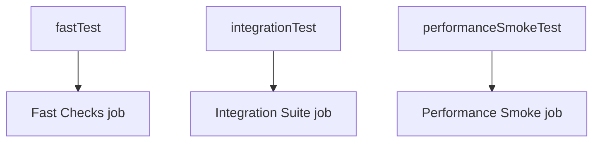
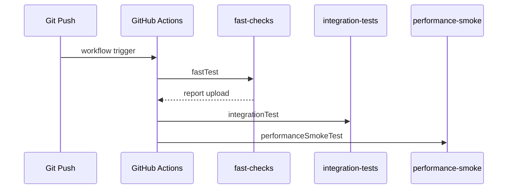

# [Spring Boot 포트폴리오] 15. GitHub Actions와 태그 기반 테스트 스위트를 어떻게 나눴는가

## 1. 이번 글에서 풀 문제

테스트가 늘어나면 다음 문제가 생깁니다.

- 모든 테스트를 매번 한 번에 돌리면 너무 느리다
- 빠른 테스트와 느린 테스트를 어떻게 나눌지 애매하다
- CI에서 어떤 순서로 돌려야 신뢰도와 속도를 둘 다 잡을 수 있을까?

Kindergarten ERP는 이 문제를 아래 두 축으로 풀었습니다.

- JUnit `@Tag`
- GitHub Actions job 분리

즉, 테스트를 “파일 경로”가 아니라 **의미**로 나누고,  
CI도 그 의미에 맞게 job을 분리했습니다.

## 2. 먼저 알아둘 개념

### 2-1. 테스트 분류

이 프로젝트는 테스트를 아래처럼 나눕니다.

- `fast`
- `integration`
- `performance`

### 2-2. CI job 분리

모든 테스트를 한 job에서 돌리는 대신

- 빠른 검증
- 통합 테스트
- 성능 smoke

를 분리하면 실패 지점을 더 빨리 파악할 수 있습니다.

### 2-3. Artifact

CI 실패 시에도 test report를 artifact로 올려 두면  
웹 UI에서 결과를 다시 확인하기 쉽습니다.

## 3. 이번 글에서 다룰 파일

```text
- build.gradle
- .github/workflows/ci.yml
- src/test/java/com/erp/ErpApplicationTests.java
- src/test/java/com/erp/api/AuthApiIntegrationTest.java
- src/test/java/com/erp/performance/AuditConsolePerformanceSmokeTest.java
- docs/decisions/phase16_github_actions_ci.md
- docs/decisions/phase19_ci_fast_integration_split.md
- docs/decisions/phase22_github_actions_node24_native_actions.md
- docs/decisions/phase44_tagged_ci_readiness_and_hiring_pack.md
```

## 4. 설계 구상

핵심 기준은 아래였습니다.

1. 테스트는 속도와 목적 기준으로 나눈다
2. CI는 빠른 실패를 먼저 반환해야 한다
3. 통합/성능 테스트는 Docker 가능 runner에서 돌린다



## 5. 코드 설명

### 5-1. `build.gradle`: 태그 기반 task 등록

[build.gradle](/Users/alex/project/kindergarten_ERP/erp/build.gradle)의 핵심 task는 아래입니다.

- `fastTest`
- `integrationTest`
- `performanceSmokeTest`

이 task들은 각각 `includeTags`를 사용합니다.

즉, 테스트를 파일 경로나 패키지가 아니라 **태그 의미**로 나눕니다.

### 5-2. 실제 테스트 태그 예시

예를 들어 아래처럼 나뉩니다.

- `ErpApplicationTests`
  - `@Tag("integration")`
- `AuthApiIntegrationTest`
  - `@Tag("integration")`
- `OAuth2AuthenticationSuccessHandlerTest`
  - `@Tag("fast")`
- `AuditConsolePerformanceSmokeTest`
  - `@Tag("performance")`

즉, 테스트 클래스 이름보다 목적이 더 중요합니다.

### 5-3. `.github/workflows/ci.yml`: CI를 3개 job으로 분리

[ci.yml](/Users/alex/project/kindergarten_ERP/erp/.github/workflows/ci.yml)의 핵심 job은 아래입니다.

- `fast-checks`
- `integration-tests`
- `performance-smoke`

그리고 각 job은 아래 명령을 수행합니다.

- `./gradlew --no-daemon fastTest`
- `./gradlew --no-daemon integrationTest`
- `./gradlew --no-daemon performanceSmokeTest`

### 5-4. 왜 fast -> integration 순서를 택했는가

빠른 테스트가 먼저 실패하면 통합 테스트까지 기다릴 필요가 없기 때문입니다.

즉, 개발 피드백 루프를 짧게 만들 수 있습니다.

## 6. 실제 흐름



## 7. 테스트로 검증하기

CI 자체는 GitHub Actions run에서 검증되고, 로컬에서도 아래처럼 나눠 실행할 수 있습니다.

```bash
./gradlew fastTest
./gradlew integrationTest
./gradlew performanceSmokeTest
```

결정 로그는 아래 흐름으로 이어집니다.

- `phase16_github_actions_ci`
- `phase19_ci_fast_integration_split`
- `phase22_github_actions_node24_native_actions`
- `phase44_tagged_ci_readiness_and_hiring_pack`

즉, CI도 한 번에 완성된 것이 아니라 점진적으로 고도화됐습니다.

## 8. 회고

이 단계에서 중요한 교훈은 아래입니다.

1. 테스트를 의미 없이 한 바구니에 넣지 말 것
2. CI는 “돌아간다”보다 “어디서 왜 실패했는지 빨리 보인다”가 중요하다

태그 기반 분리는 단순해 보이지만,  
프로젝트가 커질수록 테스트 전략 설명력이 훨씬 좋아집니다.

## 9. 취업 포인트

- “테스트를 `fast`, `integration`, `performance` 태그로 나눠 목적 기반 실행 전략을 만들었습니다.”
- “GitHub Actions도 3개 job으로 분리해 빠른 피드백과 현실적인 통합 검증을 같이 가져갔습니다.”
- “테스트가 많은 것보다, 어떻게 분류하고 언제 돌리는지가 더 중요하다고 생각했습니다.”
