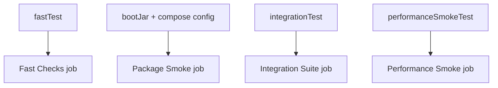
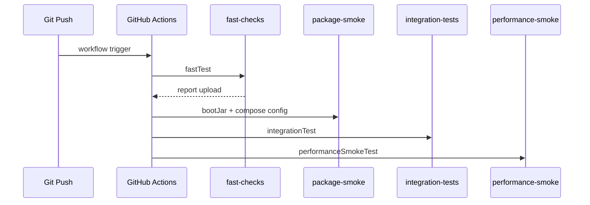

# [Spring Boot 포트폴리오] 15. GitHub Actions와 태그 기반 테스트 태스크/CI를 어떻게 나눴는가

## 1. 이번 글에서 풀 문제

테스트가 늘어나면 다음 문제가 생깁니다.

- 모든 테스트를 매번 한 번에 돌리면 너무 느리다
- 빠른 테스트와 느린 테스트를 어떻게 나눌지 애매하다
- CI에서 어떤 순서로 돌려야 신뢰도와 속도를 둘 다 잡을 수 있을까?

Kindergarten ERP는 이 문제를 아래 두 축으로 풀었습니다.

- JUnit `@Tag`
- GitHub Actions job 분리

즉, 테스트를 “파일 경로”가 아니라 **의미**로 나누고,
CI도 그 의미에 맞게 job을 분리했습니다.

## 2. 먼저 알아둘 개념

### 2-1. 테스트 분류

이 프로젝트는 테스트를 아래처럼 나눕니다.

- `fast`
- `integration`
- `performance`

### 2-2. CI job 분리

모든 테스트를 한 job에서 돌리는 대신

- 빠른 검증
- 통합 테스트
- 성능 smoke

를 분리하면 실패 지점을 더 빨리 파악할 수 있습니다.

### 2-3. Artifact

CI 실패 시에도 test report를 artifact로 올려 두면
웹 UI에서 결과를 다시 확인하기 쉽습니다.

### 2-4. 어떤 테스트를 어느 task에 넣을지 먼저 나누자

태그 전략은 “이 테스트가 어디 속하는가”를 먼저 정하면 이해가 쉽습니다.

| 분류 | 예시 | 기대 목적 |
|---|---|---|
| `fast` | 보안 핸들러, 순수 서비스 로직 | 빠른 피드백 |
| `integration` | API 통합 테스트, Testcontainers 기반 흐름 | 실제 스택 검증 |
| `performance` | 운영 콘솔/query budget smoke | 성능 회귀 감시 |

## 3. 이번 글에서 다룰 파일

```text
- build.gradle
- .github/workflows/ci.yml
- src/test/java/com/erp/ErpApplicationTests.java
- src/test/java/com/erp/api/AuthApiIntegrationTest.java
- src/test/java/com/erp/performance/AuditConsolePerformanceSmokeTest.java
- docs/COMPLETED.md#archive-002
- docs/COMPLETED.md#archive-003
- docs/COMPLETED.md#archive-005
```

## 4. 설계 구상

핵심 기준은 아래였습니다.

1. 테스트는 속도와 목적 기준으로 나눈다
2. CI는 빠른 실패를 먼저 반환해야 한다
3. 통합/성능 테스트는 Docker 가능 runner에서 돌린다



## 5. 코드 설명

### 5-1. `build.gradle`: 태그 기반 task 등록

[build.gradle](../build.gradle)의 핵심 task는 아래입니다.

- `fastTest`
- `integrationTest`
- `performanceSmokeTest`

이 task들은 각각 `includeTags`를 사용합니다.

즉, 테스트를 파일 경로나 패키지가 아니라 **태그 의미**로 나눕니다.

### 5-2. 실제 테스트 태그 예시

예를 들어 아래처럼 나뉩니다.

- `ErpApplicationTests`
  - `@Tag("integration")`
- `AuthApiIntegrationTest`
  - `@Tag("integration")`
- `OAuth2AuthenticationSuccessHandlerTest`
  - `@Tag("fast")`
- `AuditConsolePerformanceSmokeTest`
  - `@Tag("performance")`

즉, 테스트 클래스 이름보다 목적이 더 중요합니다.

### 5-3. `.github/workflows/ci.yml`: CI를 4개 job으로 분리

[ci.yml](../.github/workflows/ci.yml)의 핵심 job은 아래입니다.

- `fast-checks`
- `package-smoke`
- `integration-tests`
- `performance-smoke`

그리고 각 job은 아래 명령을 수행합니다.

- `./gradlew --no-daemon fastTest`
- `./gradlew --no-daemon bootJar`
- `./gradlew --no-daemon integrationTest`
- `./gradlew --no-daemon performanceSmokeTest`

### 5-4. 왜 fast -> integration 순서를 택했는가

빠른 테스트가 먼저 실패하면 통합 테스트까지 기다릴 필요가 없기 때문입니다.

즉, 개발 피드백 루프를 짧게 만들 수 있습니다.

## 6. 실제 흐름



## 7. 테스트로 검증하기

CI 자체는 GitHub Actions run에서 검증되고, 로컬에서도 아래처럼 나눠 실행할 수 있습니다.

```bash
./gradlew fastTest
./gradlew bootJar
./gradlew integrationTest
./gradlew performanceSmokeTest
```

결정 로그는 아래 흐름으로 이어집니다.

- `phase16_github_actions_ci`
- `phase19_ci_fast_integration_split`
- `phase22_github_actions_node24_native_actions`
- `phase44_tagged_ci_readiness_and_hiring_pack`
- `phase47_outbox_atomic_claim_and_ops_contract`

즉, CI도 한 번에 완성된 것이 아니라 점진적으로 고도화됐습니다.

## 8. 회고

이 단계에서 중요한 교훈은 아래입니다.

1. 테스트를 의미 없이 한 바구니에 넣지 말 것
2. CI는 “돌아간다”보다 “어디서 왜 실패했는지 빨리 보인다”가 중요하다
3. 테스트 통과와 배포 단위 생성은 다른 문제라서 `bootJar`와 compose config도 같이 검증할 것

태그 기반 분리는 단순해 보이지만,
프로젝트가 커질수록 테스트 전략 설명력이 훨씬 좋아집니다.

### 현재 구현의 한계

태그 기반 전략은 강력하지만, **태그를 빠뜨리면 테스트가 조용히 빠질 수 있다는 운영 규율 문제**가 있습니다.
그래서 새 테스트를 추가할 때 항상 어떤 task에 속하는지 같이 결정해야 하고, CI가 있다고 해서 로컬 빠른 피드백 루프를 대신할 수는 없습니다.

## 9. 취업 포인트

- “테스트를 `fast`, `integration`, `performance` 태그로 나눠 목적 기반 실행 전략을 만들었습니다.”
- “GitHub Actions도 `fast-checks`, `package-smoke`, `integration-tests`, `performance-smoke`로 나눠 빠른 피드백과 배포 단위 검증을 같이 가져갔습니다.”
- “테스트가 많은 것보다, 어떻게 분류하고 언제 돌리는지가 더 중요하다고 생각했습니다.”

### 9-1. 1문장 답변

- “테스트를 파일 경로가 아니라 `fast / integration / performance`라는 목적 기준 태그로 나누고, GitHub Actions도 같은 기준으로 job을 분리했습니다.”

### 9-2. 30초 답변

- “이 프로젝트는 테스트가 늘어나면서 속도와 신뢰도를 같이 잡아야 했습니다. 그래서 `build.gradle`에 `fastTest`, `integrationTest`, `performanceSmokeTest` task를 만들고, 각 테스트 클래스에 `@Tag`를 붙여 목적별로 분류했습니다. 그리고 GitHub Actions도 `fast-checks`, `package-smoke`, `integration-tests`, `performance-smoke`로 나눠, 빠른 실패는 빨리 보고 실행 가능한 bootJar와 compose config, 실제 통합 검증까지 같이 확인하게 했습니다.”

### 9-3. 예상 꼬리 질문

- “왜 패키지 경로 대신 태그를 택했나요?”
- “태그를 빼먹으면 어떻게 관리하나요?”
- “왜 performance smoke도 CI에 넣었나요?”
- “왜 package-smoke를 fast-checks와 따로 뒀나요?”

## 10. 시작 상태

- `14` 글까지 따라와서 Testcontainers 기반 통합 테스트가 동작해야 합니다.
- 최소한 `fast`, `integration`, `performance`로 나눌 대표 테스트 클래스가 있어야 합니다.
- 이 글의 목표는 **로컬 테스트 전략과 GitHub Actions 실행 전략을 같은 기준으로 맞추는 것**입니다.

## 11. 이번 글에서 바뀌는 파일

```text
- 테스트 task / 태그:
  - build.gradle
  - src/test/java/com/erp/global/security/oauth2/OAuth2AuthenticationSuccessHandlerTest.java
  - src/test/java/com/erp/api/AuthApiIntegrationTest.java
  - src/test/java/com/erp/performance/AuditConsolePerformanceSmokeTest.java
- CI:
  - .github/workflows/ci.yml
- 결정 로그:
  - docs/COMPLETED.md#archive-002
  - docs/COMPLETED.md#archive-003
```

## 12. 구현 체크리스트

1. `build.gradle`에 `fastTest`, `integrationTest`, `performanceSmokeTest` task를 등록합니다.
2. 각 task가 `includeTags` 기준으로 테스트를 집계하게 만듭니다.
3. 대표 테스트 클래스에 `@Tag("fast")`, `@Tag("integration")`, `@Tag("performance")`를 붙입니다.
4. `.github/workflows/ci.yml`에서 job을 분리해 각 task를 실행합니다.
5. `package-smoke`에서 `bootJar`와 compose config를 같이 검증합니다.
6. 로컬과 CI가 같은 task 이름을 쓰도록 맞춥니다.

## 13. 실행 / 검증 명령

```bash
./gradlew fastTest
./gradlew integrationTest
./gradlew performanceSmokeTest
```

성공하면 확인할 것:

- 태그 기준으로 각 테스트 묶음이 따로 실행된다
- 빠른 실패는 `fastTest`에서 먼저 잡힌다
- 실행 가능한 `bootJar`와 compose config는 `package-smoke`에서 먼저 확인된다
- 통합/성능 스모크는 Docker 가능한 환경에서 분리 실행된다

## 14. 산출물 체크리스트

- `build.gradle`에 `fastTest`, `integrationTest`, `performanceSmokeTest` task가 존재한다
- 대표 테스트 클래스에 `@Tag("fast")`, `@Tag("integration")`, `@Tag("performance")`가 붙어 있다
- `.github/workflows/ci.yml`이 fast / package / integration / performance job 구조를 사용한다
- 아티팩트 업로드가 실패 분석 경로로 연결돼 있다

## 15. 글 종료 체크포인트

- 테스트가 목적 기반 태그로 분류돼 있다
- `build.gradle`과 `ci.yml`이 같은 실행 전략을 공유한다
- fast / integration / performance smoke를 따로 돌릴 수 있다
- CI 실패 원인을 job 단위로 더 빨리 찾을 수 있다

## 16. 자주 막히는 지점

- 증상: 특정 테스트가 아무 task에서도 안 돈다
  - 원인: 클래스가 존재해도 `@Tag`가 없으면 분리 task에서 빠질 수 있습니다
  - 확인할 것: 해당 테스트 클래스의 `@Tag`와 `build.gradle includeTags` 설정

- 증상: 로컬에서는 되는데 CI integration/performance가 실패함
  - 원인: Docker availability나 runner 환경 차이 때문일 수 있습니다
  - 확인할 것: `.github/workflows/ci.yml`의 Docker 확인 단계와 Testcontainers 의존 task 실행 순서
