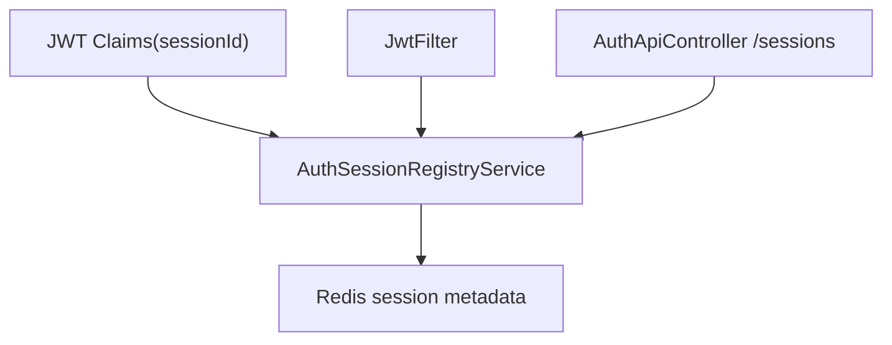
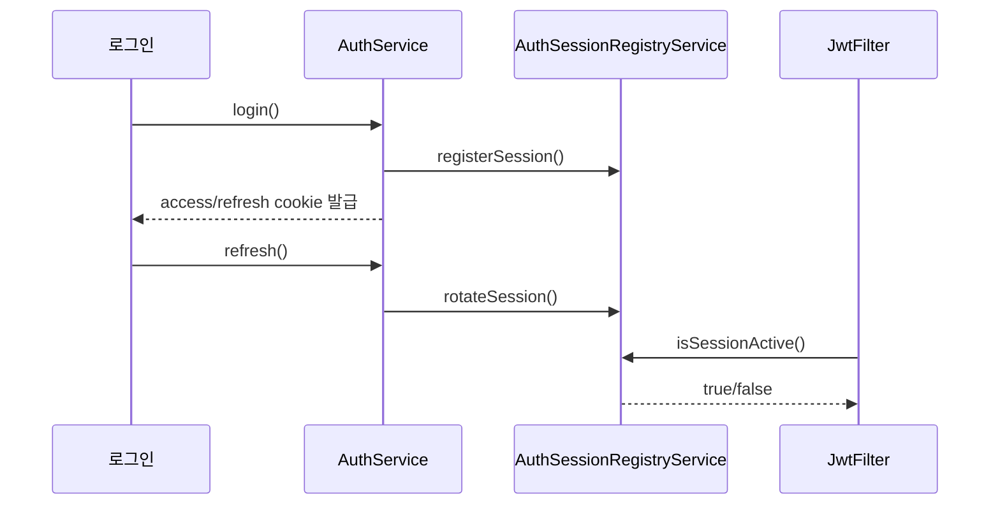

# [Spring Boot 포트폴리오] 16. Refresh rotation과 활성 세션 제어로 인증을 한 단계 올리기

## 1. 이번 글에서 풀 문제

기본 JWT 인증만으로는 다음 문제가 남습니다.

- 여러 기기 로그인은 어떻게 관리할까?
- 로그아웃해도 이미 발급된 Access Token은 바로 끊기지 않지 않나?
- 현재 어디서 로그인돼 있는지 사용자가 볼 수 있을까?

이 프로젝트는 이 문제를 아래 구조로 풀었습니다.

- `sessionId`를 JWT claims에 포함
- Redis 세션 레지스트리 도입
- refresh token rotation
- 활성 세션 목록 / 개별 세션 종료 API 제공

즉, JWT를 “단순 토큰 인증”에서 **운영 가능한 세션 시스템**으로 키운 것입니다.

## 2. 먼저 알아둘 개념

### 2-1. Refresh Rotation

refresh token을 쓸 때마다 새 refresh token으로 갈아끼우는 전략입니다.

장점은 탈취된 오래된 refresh token 재사용 위험을 줄일 수 있다는 점입니다.

### 2-2. 세션 레지스트리

이 프로젝트에서는 Redis에 세션 메타데이터를 저장합니다.

- sessionId
- signInMethod
- clientIp
- userAgent
- lastSeenAt
- expiresAt

즉, refresh token 저장소를 세션 레지스트리로 확장한 것입니다.

### 2-3. Access Token 즉시 revoke

서명만 검증하는 JWT 구조에서는 발급된 access token을 즉시 끊기 어렵습니다.

그래서 이 프로젝트는 필터 단계에서 Redis 세션 활성 여부까지 다시 확인합니다.

### 2-4. 세션이 어떻게 바뀌는지 표로 먼저 보자

이 글은 용어가 많아서, 먼저 상태 변화를 표로 보는 편이 이해하기 쉽습니다.

| 상황 | 서버가 하는 일 | 사용자가 느끼는 결과 |
|---|---|---|
| 로그인 성공 | `sessionId` 생성, Redis 세션 등록, access/refresh 발급 | 새 기기에서 로그인됨 |
| refresh 호출 | 기존 refresh 교체, 같은 세션 메타데이터 갱신 | 로그인 연장이 됨 |
| 특정 세션 종료 | 해당 `sessionId` revoke | 그 기기만 다시 로그인해야 함 |
| 다른 기기 세션 종료 | 현재 세션 제외 revoke | 내 기기만 남고 다른 기기는 끊김 |

## 3. 이번 글에서 다룰 파일

```text
- src/main/java/com/erp/domain/auth/service/AuthSessionRegistryService.java
- src/main/java/com/erp/global/security/jwt/JwtTokenProvider.java
- src/main/java/com/erp/global/security/jwt/JwtFilter.java
- src/main/java/com/erp/domain/auth/service/AuthService.java
- src/main/java/com/erp/domain/auth/controller/AuthApiController.java
- src/test/java/com/erp/api/AuthApiIntegrationTest.java
- docs/COMPLETED.md#archive-002
- docs/COMPLETED.md#archive-003
```

## 4. 설계 구상



핵심 기준은 아래였습니다.

1. 토큰마다 `sessionId`를 넣는다
2. Redis에 세션 메타데이터를 저장한다
3. refresh는 rotation한다
4. access token 검증도 세션 레지스트리에 묶는다

## 5. 코드 설명

### 5-1. `AuthSessionRegistryService`: 세션 저장소의 중심

[AuthSessionRegistryService.java](../src/main/java/com/erp/domain/auth/service/AuthSessionRegistryService.java)의 핵심 메서드는 아래입니다.

- `registerSession(...)`
- `rotateSession(...)`
- `touchSession(...)`
- `getActiveSessions(...)`
- `revokeSession(...)`
- `revokeOtherSessions(...)`

즉, 이 서비스는 refresh token 저장을 넘어
활성 세션 전체를 관리하는 역할을 맡습니다.

### 5-2. `JwtTokenProvider`: `sessionId`와 `tokenType`을 claims에 넣는다

[JwtTokenProvider.java](../src/main/java/com/erp/global/security/jwt/JwtTokenProvider.java)는

- `sessionId`
- `tokenType`
- `jti`

를 토큰에 넣습니다.

이 정보가 있어야 access token과 refresh token이
같은 세션 단위로 연결될 수 있습니다.

### 5-3. `JwtFilter`: access token도 Redis 세션 활성 여부를 확인한다

[JwtFilter.java](../src/main/java/com/erp/global/security/jwt/JwtFilter.java)의 핵심은 `doFilter(...)`입니다.

이 메서드는

1. 쿠키에서 access token 추출
2. 토큰 서명 검증
3. `memberId + sessionId` 추출
4. `authSessionRegistryService.isSessionActive(...)` 확인
5. 살아 있는 세션만 인증 복원

순으로 흐릅니다.

즉, 세션이 revoke되면 access token도 사실상 즉시 끊깁니다.

### 5-4. `AuthService`: issue, rotate, revoke를 하나의 흐름으로 묶는다

[AuthService.java](../src/main/java/com/erp/domain/auth/service/AuthService.java)의 핵심 메서드는 아래입니다.

- `issueTokens(...)`
- `refreshAccessToken(...)`
- `revokeSession(...)`
- `revokeOtherSessions(...)`

즉, 인증 서비스는 비밀번호 검사만이 아니라
세션이 생성되고 갱신되고 종료되는 전체 흐름을 관리하는 서비스가 됩니다.

### 5-5. `AuthApiController`: 사용자가 세션을 실제로 제어하게 한다

[AuthApiController.java](../src/main/java/com/erp/domain/auth/controller/AuthApiController.java)의 핵심 API는 아래입니다.

- `GET /api/v1/auth/sessions`
- `DELETE /api/v1/auth/sessions/{sessionId}`
- `DELETE /api/v1/auth/sessions/others`

즉, 세션 설계를 “백엔드 내부 구현”에서 끝내지 않고
사용자가 볼 수 있고 끌 수 있는 기능까지 닫았습니다.

## 6. 실제 흐름



## 7. 테스트로 검증하기

대표 검증은 `AuthApiIntegrationTest`입니다.

- 세션 목록 조회
- 특정 세션 종료
- 다른 기기 세션 일괄 종료
- rotation 후 토큰 교체

그리고 설계 의도는 아래 문서에 정리돼 있습니다.

- [phase17_jwt_refresh_session_rotation.md](../docs/COMPLETED.md#archive-002)
- [phase39_management_plane_and_active_session_control.md](../docs/COMPLETED.md#archive-003)

> 현재 구현의 한계
> 이 구조는 access token 자체를 DB에 저장하는 방식이 아니라, Redis에 저장된 세션 활성 여부에 의존합니다.
> 그래서 세션 revoke는 빨라지지만, 반대로 Redis가 인증 경로의 중요한 의존성이 됩니다.
> 이 때문에 readiness와 모니터링을 함께 보는 운영 구성이 뒤에서 필요해집니다.

## 8. 회고

이 단계에서 가장 중요한 교훈은 아래입니다.

**JWT를 stateless 문자열로만 보면 운영 제어가 약해진다**는 점입니다.

실서비스 감각을 보이려면

- 세션 목록
- 기기별 종료
- access token 즉시 revoke

까지 설명할 수 있어야 합니다.

## 9. 취업 포인트

- “JWT claims에 `sessionId`를 넣고 Redis 세션 레지스트리와 연결했습니다.”
- “refresh token rotation을 적용하고, 필터 단계에서 활성 세션 여부를 다시 확인해 access token revoke까지 보장했습니다.”
- “세션 설계를 사용자 기능(`/sessions`)까지 닫아서 운영 가능한 인증 구조를 만들었습니다.”

### 9-1. 1문장 답변

- “JWT를 단순 문자열이 아니라 `sessionId`를 가진 세션 시스템으로 확장해, rotation과 기기별 로그아웃까지 가능하게 만들었습니다.”

### 9-2. 30초 답변

- “기본 JWT만으로는 여러 기기 로그인과 즉시 로그아웃 제어가 약했습니다. 그래서 `sessionId`를 토큰 claims에 넣고 Redis 세션 레지스트리를 도입했습니다. refresh는 rotation하고, `JwtFilter`는 서명 검증 뒤에 세션 활성 여부까지 다시 봅니다. 그 결과 사용자가 세션 목록을 보고 특정 기기만 끊는 기능까지 제공할 수 있게 됐습니다.”

### 9-3. 예상 꼬리 질문

- “왜 refresh token 저장소를 세션 레지스트리로 확장했나요?”
- “access token을 어떻게 사실상 즉시 끊을 수 있나요?”
- “이 구조에서 Redis가 죽으면 인증은 어떻게 되나요?”

## 10. 시작 상태

- `12` 글까지 따라와서 cookie 기반 JWT 로그인/로그아웃/refresh가 동작해야 합니다.
- Redis가 실행 중이어야 합니다. 이 글의 핵심은 **refresh token을 단순 문자열이 아니라 세션 단위 자산으로 관리하는 것**입니다.
- 목표는 세 가지입니다.
  - refresh rotation
  - 활성 세션 목록 조회
  - 특정 세션 또는 다른 기기 세션 종료

## 11. 이번 글에서 바뀌는 파일

```text
- 토큰 / 필터:
  - src/main/java/com/erp/global/security/jwt/JwtTokenProvider.java
  - src/main/java/com/erp/global/security/jwt/JwtFilter.java
- 세션 레지스트리 / 인증 서비스:
  - src/main/java/com/erp/domain/auth/service/AuthService.java
  - src/main/java/com/erp/domain/auth/service/AuthSessionRegistryService.java
  - src/main/java/com/erp/domain/auth/dto/response/AuthSessionResponse.java
- API:
  - src/main/java/com/erp/domain/auth/controller/AuthApiController.java
- 검증:
  - src/test/java/com/erp/api/AuthApiIntegrationTest.java
- 결정 로그:
  - docs/COMPLETED.md#archive-002
  - docs/COMPLETED.md#archive-003
```

## 12. 구현 체크리스트

1. `JwtTokenProvider`에 `memberId`, `sessionId`, `tokenType` claim을 넣습니다.
2. `AuthSessionRegistryService`를 만들어 Redis에 refresh token과 세션 메타데이터를 저장합니다.
3. `AuthService.refreshAccessToken(...)`에서 rotation 시 이전 refresh token을 무효화하고 새 토큰을 재발급합니다.
4. `JwtFilter`에서 access token 처리 시 활성 세션 여부를 다시 확인하고, 필요하면 세션 last activity를 갱신합니다.
5. `AuthApiController`에 세션 목록 조회, 특정 세션 종료, 다른 세션 일괄 종료 API를 추가합니다.
6. `AuthApiIntegrationTest`로 세션 lifecycle이 실제로 닫히는지 확인합니다.

## 13. 실행 / 검증 명령

```bash
./gradlew compileJava compileTestJava
./gradlew --no-daemon integrationTest
```

관련 테스트만 빠르게 보고 싶다면 아래 명령을 추가로 쓸 수 있습니다.

```bash
./gradlew --no-daemon integrationTest --tests "com.erp.api.AuthApiIntegrationTest"
```

다만 일부 환경에서는 좁힌 `--tests` 실행이 불안정할 수 있으므로, 블로그 기준 안정 검증 경로는 전체 `integrationTest`입니다.

성공하면 확인할 것:

- refresh 후 이전 refresh token이 더 이상 유효하지 않다
- `/api/v1/auth/sessions`에서 현재 세션과 다른 기기 세션이 구분돼 보인다
- 특정 세션 종료 후 해당 세션 access token도 필터 단계에서 차단된다

## 14. 산출물 체크리스트

- `JwtTokenProvider`가 `memberId`, `sessionId`, `tokenType` claim을 담는다
- `AuthSessionRegistryService`가 Redis에 세션 메타데이터와 refresh token을 저장한다
- `AuthApiController`에 세션 목록 조회와 세션 종료 API가 있다
- `AuthService.refreshAccessToken(...)`가 refresh rotation을 수행한다
- `AuthApiIntegrationTest`가 refresh rotation과 세션 revoke를 검증한다

## 15. 글 종료 체크포인트

- access/refresh token이 둘 다 `sessionId`를 기준으로 묶인다
- Redis에서 세션 메타데이터와 refresh token을 함께 관리한다
- 사용자가 자신의 세션을 목록으로 보고 정리할 수 있다
- refresh rotation과 세션 revoke를 같은 설계로 설명할 수 있다

## 16. 자주 막히는 지점

- 증상: refresh rotation 뒤에도 이전 refresh token이 계속 먹는다
  - 원인: Redis에 저장된 refresh token을 교체하지 않았거나, `sessionId` 기준 비교가 빠졌을 수 있습니다
  - 확인할 것: `AuthService.refreshAccessToken(...)`, `AuthSessionRegistryService.rotateSession(...)`

- 증상: 세션 삭제 후에도 access token이 계속 통과한다
  - 원인: `JwtFilter`가 토큰 서명만 검증하고 활성 세션 조회를 하지 않을 수 있습니다
  - 확인할 것: `JwtFilter.doFilter(...)`, `AuthSessionRegistryService.isSessionActive(...)`
