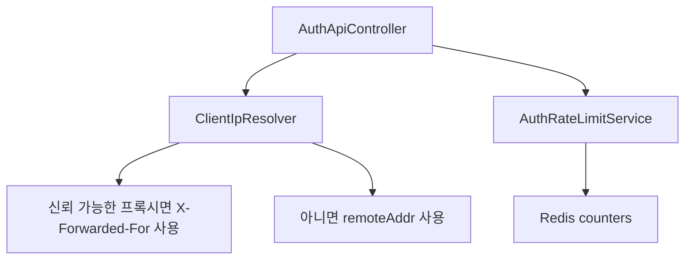
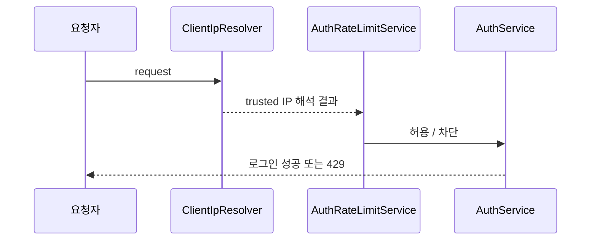

# [Spring Boot 포트폴리오] 17. 로그인 남용 방어: Rate Limit과 Client IP 신뢰 모델

## 1. 이번 글에서 풀 문제

인증이 동작한다고 끝이 아닙니다.
이제 “남용”을 막아야 합니다.

이 프로젝트에서 추가로 풀어야 했던 문제는 아래였습니다.

- 로그인 brute-force를 어떻게 줄일까?
- refresh 요청 폭주를 어떻게 막을까?
- `X-Forwarded-For` 헤더를 아무나 넣으면 rate limit을 우회하지 않을까?

이 문제를 해결하기 위해 아래 두 축을 추가했습니다.

- `AuthRateLimitService`
- `ClientIpResolver`

## 2. 먼저 알아둘 개념

### 2-1. Fixed Window Rate Limit

정해진 시간 창 안에서 요청 수를 제한하는 가장 단순한 방식입니다.

이 프로젝트는 설명 가능성과 구현 단순성을 위해 이 방식을 택했습니다.

### 2-2. IP와 이메일 두 축 제한

로그인 남용은 하나의 축만으로 막기 어렵습니다.

- IP만 보면 공유망 환경이 문제
- 이메일만 보면 여러 IP 분산 공격이 문제

그래서 이 프로젝트는 로그인에 대해 IP와 이메일 두 축을 같이 봅니다.

### 2-3. Trusted Proxy

`X-Forwarded-For`는 프록시가 붙여 주는 헤더지만,
아무 요청자나 임의로 넣을 수 있기 때문에 무조건 신뢰하면 안 됩니다.

즉, **어떤 프록시를 신뢰할지**를 코드로 정해야 합니다.

### 2-4. 어떤 요청을 어떤 기준으로 막을지 먼저 정하자

이 글은 구현보다 정책표를 먼저 이해하는 편이 훨씬 쉽습니다.

| 상황 | 보는 값 | 기대 결과 | 이유 |
|---|---|---|---|
| 로그인 실패 반복 | IP + 이메일 | `429` 또는 차단 | brute-force를 줄이기 위해 |
| refresh 요청 폭주 | IP | `429` 또는 차단 | 토큰 재발급 남용을 막기 위해 |
| 정상 로그인 성공 | 이메일 실패 카운터 | 초기화 | 정상 사용자가 누적 예산 때문에 막히지 않게 하기 위해 |
| `X-Forwarded-For` 포함 요청 | trusted proxy 여부 | trusted proxy일 때만 헤더 사용 | 헤더 스푸핑 우회를 막기 위해 |

## 3. 이번 글에서 다룰 파일

```text
- src/main/java/com/erp/domain/auth/service/AuthRateLimitService.java
- src/main/java/com/erp/global/security/ClientIpResolver.java
- src/main/java/com/erp/global/security/ClientIpProperties.java
- src/main/java/com/erp/domain/auth/controller/AuthApiController.java
- src/main/java/com/erp/domain/auth/service/AuthService.java
- src/test/java/com/erp/api/AuthApiIntegrationTest.java
- docs/COMPLETED.md#archive-002
```

## 4. 설계 구상



핵심 기준은 아래였습니다.

1. 로그인은 IP와 이메일 두 축을 본다
2. refresh는 IP 기준으로 제한한다
3. 성공 로그인은 이메일 실패 카운터를 지운다
4. forwarded header는 trusted proxy일 때만 믿는다
5. trusted proxy 목록이 비어 있으면 forwarded header를 전혀 신뢰하지 않는다

## 5. 코드 설명

### 5-1. `AuthRateLimitService`: 단순하지만 설명 가능한 제한

[AuthRateLimitService.java](../src/main/java/com/erp/domain/auth/service/AuthRateLimitService.java)의 핵심 메서드는 아래입니다.

- `validateLoginAllowed(...)`
- `recordLoginFailure(...)`
- `clearLoginFailures(...)`
- `validateRefreshAllowed(...)`
- `consumeSlot(...)`

로그인 정책은 아래입니다.

- IP: 10분에 15회
- 이메일: 10분에 5회

refresh 정책은 아래입니다.

- IP: 5분에 10회

### 5-2. 왜 성공 로그인 시 이메일 카운터를 지우는가

초기 정책은 성공 로그인도 누적 예산을 소모하는 문제가 있었습니다.

그래서 현재는

- 실패만 기록하고
- 성공하면 이메일 실패 카운터는 지웁니다

즉, 운영 UX까지 고려한 정책으로 다듬었습니다.

### 5-3. `ClientIpResolver`: 헤더 스푸핑을 그대로 믿지 않는다

[ClientIpResolver.java](../src/main/java/com/erp/global/security/ClientIpResolver.java)의 핵심 메서드는 아래입니다.

- `resolve(...)`
- `isTrustedProxy(...)`
- `extractForwardedFor(...)`
- `fallback(...)`

흐름은 아래입니다.

1. 먼저 `remoteAddr` 확인
2. trusted proxy가 아니면 그것만 사용
3. trusted proxy면 `X-Forwarded-For`, `X-Real-IP` 순으로 확인

즉, 헤더 자체보다 **신뢰 모델**이 핵심입니다.

### 5-4. `AuthApiController`와 `AuthService` 연결

[AuthApiController.java](../src/main/java/com/erp/domain/auth/controller/AuthApiController.java)는
로그인/refresh 진입 전에 `clientIpResolver.resolve(request)`를 통해 client IP를 확보합니다.

[AuthService.java](../src/main/java/com/erp/domain/auth/service/AuthService.java)는 이 값을 받아

- rate limit
- audit log
- anomaly alert

까지 한 흐름으로 처리합니다.

## 6. 실제 흐름



## 7. 테스트로 검증하기

대표 검증은 `AuthApiIntegrationTest`입니다.

- 로그인 연속 실패 시 `429`
- refresh 요청 연속 시 제한
- 성공 로그인 후 이메일 실패 카운터 초기화
- 신뢰하지 않는 프록시에서 forwarded header 스푸핑 우회 불가

그리고 설계 변천은 아래 문서로 이어집니다.

- [phase21_auth_rate_limit.md](../docs/COMPLETED.md#archive-002)
- [phase24_auth_client_ip_trust_model.md](../docs/COMPLETED.md#archive-002)
- [phase25_login_rate_limit_policy_refinement.md](../docs/COMPLETED.md#archive-002)

## 8. 회고

이 단계의 핵심 교훈은 아래입니다.

1. rate limit은 “있다”보다 “어떤 기준으로 계산하는가”가 중요하다
2. IP를 본다면 반드시 trust model을 같이 설계해야 한다

즉, 보안 기능은 체크리스트처럼 붙이는 것이 아니라
운영 환경을 가정하고 설계해야 합니다.

### 현재 구현의 한계

이 글의 rate limit은 **설명 가능성과 단순성**을 위해 fixed window를 택했습니다.
그래서 경계 시점에서는 sliding window나 token bucket보다 약간 거칠게 동작할 수 있습니다.
또 trusted proxy 모델도 결국 운영 프록시 구성이 바뀌면 설정을 같이 갱신해야 하므로, 인프라 토폴로지와 분리된 완전한 해법은 아닙니다.
대신 기본값은 fail-closed라서 trusted proxy 목록이 비어 있으면 `X-Forwarded-For`를 아예 사용하지 않는 쪽을 택했습니다.

## 9. 취업 포인트

- “Redis fixed-window rate limit으로 로그인과 refresh 남용을 제한했습니다.”
- “로그인 성공은 실패 예산에서 제외해 UX를 보정했고, refresh는 별도 정책으로 관리했습니다.”
- “`X-Forwarded-For`를 무조건 믿지 않고 trusted proxy 모델을 코드로 분리했습니다.”

### 9-1. 1문장 답변

- “로그인과 refresh를 Redis fixed-window rate limit으로 분리 관리하고, client IP는 trusted proxy일 때만 forwarded header를 신뢰하게 만들어 헤더 스푸핑 우회를 막았습니다.”

### 9-2. 30초 답변

- “이 단계에서는 인증 기능 위에 남용 방어를 올렸습니다. 로그인은 IP와 이메일 두 축으로, refresh는 IP 단일 축으로 제한하고, 성공 로그인 뒤에는 이메일 실패 카운터를 지워 정상 사용자가 불필요하게 막히지 않게 했습니다. 또 `ClientIpResolver`를 두어 trusted proxy일 때만 `X-Forwarded-For`를 읽게 해서, 단순 헤더 스푸핑으로 rate limit을 우회하지 못하게 했습니다.”

### 9-3. 예상 꼬리 질문

- “왜 sliding window나 token bucket 대신 fixed window를 택했나요?”
- “shared IP 환경에서는 오탐을 어떻게 설명하나요?”
- “reverse proxy 구성이 바뀌면 이 정책은 어떻게 같이 관리하나요?”

## 10. 시작 상태

- `16` 글까지 따라와서 세션 기반 JWT 인증과 refresh rotation이 동작해야 합니다.
- Redis가 실행 중이어야 하고, 로그인/refresh API가 이미 존재해야 합니다.
- 이 글의 목표는 **보안 장치를 더 붙이는 것**이 아니라, 인증 엔드포인트의 남용 방지와 IP 신뢰 모델을 운영 기준으로 정리하는 것입니다.

## 11. 이번 글에서 바뀌는 파일

```text
- rate limit:
  - src/main/java/com/erp/domain/auth/service/AuthRateLimitService.java
  - src/main/java/com/erp/domain/auth/service/AuthService.java
- client IP trust model:
  - src/main/java/com/erp/global/security/ClientIpResolver.java
  - src/main/java/com/erp/global/security/ClientIpProperties.java
  - src/main/resources/application.yml
- API 연결:
  - src/main/java/com/erp/domain/auth/controller/AuthApiController.java
- 검증:
  - src/test/java/com/erp/api/AuthApiIntegrationTest.java
- 결정 로그:
  - docs/COMPLETED.md#archive-002
```

## 12. 구현 체크리스트

1. `AuthRateLimitService`에 로그인과 refresh를 위한 별도 제한 정책을 둡니다.
2. 로그인은 `사전 확인 -> 실패 기록 -> 성공 시 이메일 실패 초기화` 순서로 흐르게 만듭니다.
3. `ClientIpProperties`로 trusted proxy 목록을 설정 파일에서 받습니다.
4. `ClientIpResolver`에서 trusted proxy일 때만 `X-Forwarded-For`, `X-Real-IP`를 신뢰하게 만듭니다.
5. `AuthApiController`에서 직접 헤더를 읽지 말고 `clientIpResolver.resolve(request)`를 사용합니다.
6. `AuthApiIntegrationTest`로 rate limit, 성공 로그인 초기화, 헤더 스푸핑 차단을 같이 검증합니다.

## 13. 실행 / 검증 명령

```bash
./gradlew compileJava compileTestJava
./gradlew --no-daemon integrationTest
```

관련 테스트만 빠르게 보고 싶다면 아래 명령을 추가로 쓸 수 있습니다.

```bash
./gradlew --no-daemon integrationTest --tests "com.erp.api.AuthApiIntegrationTest"
```

다만 블로그 기준 안정 검증 경로는 전체 `integrationTest`입니다.

성공하면 확인할 것:

- 로그인 실패 누적 시 `429`가 나온다
- 정상 로그인은 이메일 실패 카운터를 지운다
- 신뢰하지 않는 프록시에서 매번 다른 `X-Forwarded-For`를 보내도 우회되지 않는다

## 14. 산출물 체크리스트

- `AuthRateLimitService`가 로그인/refresh 제한 정책을 분리한다
- `ClientIpResolver`, `ClientIpProperties`가 trusted proxy 모델을 표현한다
- `AuthApiController`가 직접 헤더를 읽지 않고 resolver를 사용한다
- `AuthService`가 성공 로그인 시 이메일 실패 카운터를 초기화한다
- `AuthApiIntegrationTest`가 rate limit과 헤더 스푸핑 차단을 검증한다

## 15. 글 종료 체크포인트

- 로그인과 refresh가 서로 다른 rate limit 정책을 가진다
- 성공 로그인은 실패 예산을 소비하지 않는다
- IP 해석 로직이 컨트롤러 분기문이 아니라 별도 resolver로 분리돼 있다
- “헤더 값”이 아니라 “어떤 프록시를 신뢰할 것인가”를 설명할 수 있다

## 16. 자주 막히는 지점

- 증상: 정상 사용자도 몇 번 로그인하면 계속 막힌다
  - 원인: 성공 로그인 뒤 이메일 실패 카운터를 비우지 않았을 수 있습니다
  - 확인할 것: `AuthRateLimitService.clearLoginFailures(...)`, `AuthService.login(...)`

- 증상: 로컬에서는 헤더 테스트가 잘 되는데 운영 정책 설명이 불안하다
  - 원인: `X-Forwarded-For`를 무조건 신뢰하는 방식으로 구현했을 수 있습니다
  - 확인할 것: `ClientIpResolver.resolve(...)`, `ClientIpProperties.trustedProxies`
