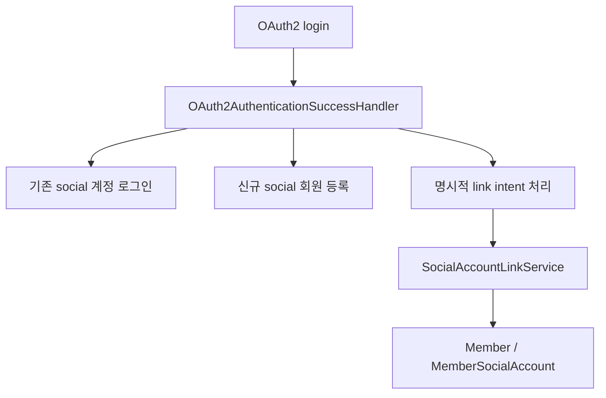

# [Spring Boot 포트폴리오] 18. OAuth2와 소셜 계정 lifecycle을 안전하게 설계하기

## 1. 이번 글에서 풀 문제

소셜 로그인은 처음 붙일 때는 쉬워 보입니다.

- 구글에서 정보 받아 오고
- 회원 없으면 가입시키고
- 있으면 로그인시키면 끝 아닌가?

하지만 실제로는 훨씬 복잡합니다.

- 기존 이메일 계정과 충돌하면 어떻게 할까?
- 로그인과 “소셜 계정 연결”은 같은 흐름일까?
- 소셜 계정을 해제할 때 마지막 로그인 수단이 사라지면 어떻게 할까?
- 같은 provider의 다른 계정으로 바꾸는 것은 허용할까?

Kindergarten ERP는 이 문제를 꽤 깊게 다뤘습니다.

- 자동 소셜 가입
- 명시적 소셜 계정 연결
- 로컬 비밀번호 bootstrap
- 안전한 unlink
- provider identity immutability

즉, 소셜 로그인 자체보다 **계정 lifecycle 정책**이 핵심이었습니다.

## 2. 먼저 알아둘 개념

### 2-1. 소셜 로그인과 소셜 연결은 다르다

- 소셜 로그인
  - 소셜 계정으로 즉시 인증
- 소셜 연결
  - 이미 로그인한 내 계정에 소셜 provider를 추가

이 둘을 같은 흐름으로 처리하면 정책이 꼬이기 쉽습니다.

### 2-2. 계정 충돌

소셜 provider가 준 이메일이 이미 로컬 계정과 충돌할 수 있습니다.

이때 자동으로 합치면 위험합니다.  
그래서 이 프로젝트는 자동 연결을 막고 충돌로 처리합니다.

### 2-3. 소셜 계정 불변성

같은 provider의 계정을 다른 계정으로 교체 가능하게 두면  
계정 탈취와 복구가 매우 어려워집니다.

그래서 이 프로젝트는 “같은 provider 교체 금지”를 정책으로 택했습니다.

## 3. 이번 글에서 다룰 파일

```text
- src/main/java/com/erp/global/security/oauth2/OAuth2AuthenticationSuccessHandler.java
- src/main/java/com/erp/global/security/oauth2/OAuth2LinkSessionService.java
- src/main/java/com/erp/domain/auth/controller/SocialAccountLinkController.java
- src/main/java/com/erp/domain/auth/service/SocialAccountLinkService.java
- src/main/java/com/erp/domain/member/entity/Member.java
- src/main/java/com/erp/domain/member/entity/MemberSocialAccount.java
- src/main/resources/db/migration/V8__normalize_member_social_accounts.sql
- src/main/resources/db/migration/V9__preserve_social_account_history.sql
- src/test/java/com/erp/global/security/oauth2/OAuth2AuthenticationSuccessHandlerTest.java
- src/test/java/com/erp/api/MemberApiIntegrationTest.java
- docs/decisions/phase27_oauth2_account_conflict_policy.md
- docs/decisions/phase28_explicit_social_account_linking.md
- docs/decisions/phase30_social_account_unlink_policy.md
- docs/decisions/phase31_member_social_account_normalization.md
- docs/decisions/phase32_social_provider_identity_immutability.md
```

## 4. 설계 구상



핵심 기준은 아래였습니다.

1. 로그인과 link intent를 구분한다
2. 이메일 충돌은 자동 연결하지 않는다
3. 소셜 계정은 별도 테이블로 정규화한다
4. unlink는 안전한 다른 로그인 수단이 있을 때만 허용한다
5. 같은 provider의 다른 계정으로 교체는 허용하지 않는다

## 5. 코드 설명

### 5-1. `OAuth2AuthenticationSuccessHandler`: 단순 redirect가 아니라 정책 엔진

[OAuth2AuthenticationSuccessHandler.java](/Users/alex/project/kindergarten_ERP/erp/src/main/java/com/erp/global/security/oauth2/OAuth2AuthenticationSuccessHandler.java)의 핵심 메서드는 아래입니다.

- `onAuthenticationSuccess(...)`
- `handleSocialLink(...)`
- `registerSocialMember(...)`
- `clearTemporaryOAuthSession(...)`
- `resolveRedirect(...)`
- `mapLinkErrorReason(...)`

즉, 이 핸들러는 단순 redirect 코드가 아니라

- 신규 소셜 가입
- 기존 소셜 로그인
- link intent 처리
- 충돌 차단
- 감사 로그

를 한 번에 다룹니다.

### 5-2. 왜 이메일 충돌 시 자동 연결하지 않았는가

이 프로젝트는 이메일 충돌 시 `SocialAccountConflictException`으로 처리합니다.

이유는 간단합니다.

- 이미 존재하는 로컬 계정을 자동 연결하면 위험하다
- 사용자가 정말 같은 사람인지 보장할 수 없다

즉, 편의보다 안전을 택했습니다.

### 5-3. `SocialAccountLinkService`: 연결/해제 정책은 서비스에서 강제한다

[SocialAccountLinkService.java](/Users/alex/project/kindergarten_ERP/erp/src/main/java/com/erp/domain/auth/service/SocialAccountLinkService.java)의 핵심 메서드는 아래입니다.

- `linkSocialAccount(...)`
- `unlinkSocialAccount(...)`

이 서비스는 아래 정책을 강제합니다.

- 이미 다른 계정에 연결된 provider는 link 불가
- 같은 provider의 다른 identity로 교체 불가
- 마지막 로그인 수단이 사라지는 unlink 불가

### 5-4. `MemberSocialAccount`: 소셜 계정을 별도 테이블로 정규화한다

[MemberSocialAccount.java](/Users/alex/project/kindergarten_ERP/erp/src/main/java/com/erp/domain/member/entity/MemberSocialAccount.java)는

- `provider`
- `providerId`
- `unlinkedAt`

을 가집니다.

핵심 메서드는 아래입니다.

- `create(...)`
- `isActive()`
- `unlink()`
- `relink()`

즉, 소셜 계정은 더 이상 `member` 테이블의 부속 컬럼이 아니라  
독립적인 도메인 엔티티가 됩니다.

### 5-5. `V8`, `V9`: 스키마도 lifecycle에 맞게 진화한다

- `V8__normalize_member_social_accounts.sql`
  - `member_social_account` 테이블 생성
  - 기존 소셜 데이터 backfill
- `V9__preserve_social_account_history.sql`
  - unlink 이력 보존을 위한 `unlinked_at`

즉, 정책 변경이 코드에서만 끝나지 않고 DB 구조까지 따라갑니다.

## 6. 실제 흐름

```mermaid
sequenceDiagram
    participant User as 사용자
    participant OAuth as OAuth2AuthenticationSuccessHandler
    participant Link as SocialAccountLinkService
    participant Member as MemberSocialAccount

    User->>OAuth: 소셜 로그인 성공
    OAuth->>OAuth: 일반 로그인인지 link intent인지 분기
    OAuth->>Link: linkSocialAccount() 또는 가입/로그인
    Link->>Member: provider binding 저장/검증
```

## 7. 테스트로 검증하기

대표 테스트는 아래입니다.

- `OAuth2AuthenticationSuccessHandlerTest`
  - 이메일 충돌 차단
  - link intent 성공
  - provider replacement 차단
- `MemberApiIntegrationTest`
  - 소셜 연결/해제
  - 로컬 비밀번호 bootstrap

관련 결정 로그도 연속적으로 이어집니다.

- `phase27` 충돌 정책
- `phase28` 명시적 연결
- `phase30` 안전한 해제
- `phase31` 정규화
- `phase32` provider 불변성

즉, 이 기능은 한 번에 완성된 것이 아니라 정책을 점진적으로 다듬은 결과입니다.

## 8. 회고

소셜 로그인은 “붙였다”로 끝나면 생각보다 약합니다.

정말 중요한 질문은 아래입니다.

- 충돌은 어떻게 다루는가?
- 연결과 로그인은 어떻게 구분하는가?
- 마지막 로그인 수단 보호는 어떻게 하는가?
- 같은 provider 교체는 허용하는가?

이 프로젝트는 바로 이 지점을 깊게 다뤘기 때문에  
포트폴리오 설명력이 훨씬 좋아졌습니다.

## 9. 취업 포인트

- “소셜 로그인 자체보다 계정 lifecycle 정책을 더 중요하게 봤습니다.”
- “이메일 충돌은 자동 연결하지 않고, 명시적 소셜 연결 플로우를 따로 만들었습니다.”
- “소셜 계정을 별도 테이블로 정규화하고, unlink 이력과 provider 불변성을 보장했습니다.”
