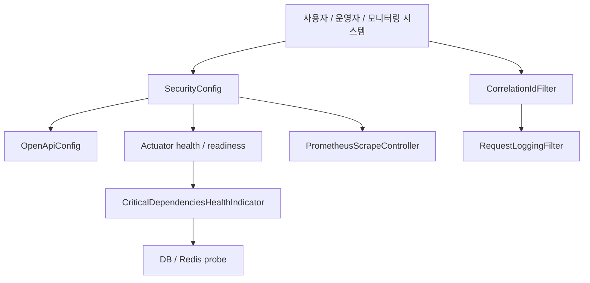
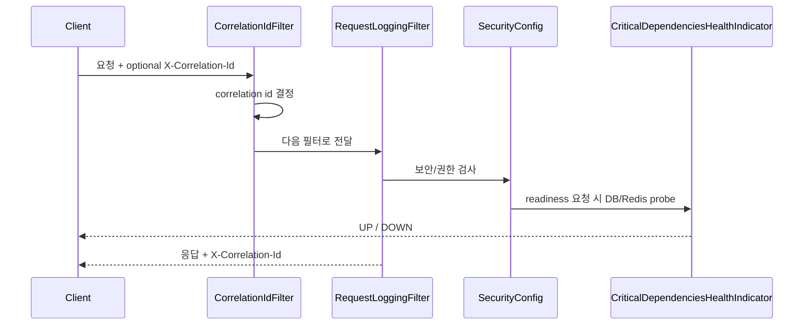

# [Spring Boot 포트폴리오] 20. OpenAPI, 관리면, 관측성을 한 번에 설계하기

## 1. 이번 글에서 풀 문제

백엔드 프로젝트가 어느 정도 커지면 이런 질문을 받습니다.

- API 계약은 어디서 보나요?
- 서비스가 살아 있는지는 어떻게 확인하나요?
- DB나 Redis가 죽었을 때 readiness는 어떻게 반응하나요?
- 요청 하나를 로그에서 어떻게 추적하나요?

이 질문에 대답하지 못하면 기능이 많아도  
“운영 준비가 덜 된 프로젝트”처럼 보이기 쉽습니다.

Kindergarten ERP는 이 문제를 아래 네 묶음으로 풀었습니다.

1. OpenAPI / Swagger
2. management surface 노출 정책
3. Actuator health / readiness / Prometheus
4. correlation id + structured request logging

## 2. 먼저 알아둘 개념

### 2-1. OpenAPI는 문서가 아니라 계약이다

정적 문서를 따로 만들 수도 있지만, 시간이 지나면 쉽게 틀어집니다.  
실행 중인 서버가 직접 API 계약을 내보내게 만드는 편이 더 낫습니다.

### 2-2. liveness와 readiness는 다르다

- liveness
  - 프로세스가 죽었는가?
- readiness
  - 지금 트래픽을 받아도 되는가?

DB/Redis가 죽었다고 해서 JVM 프로세스가 죽은 것은 아닙니다.  
그래서 둘을 분리해야 합니다.

### 2-3. 관리면(management surface)은 “열 것”과 “닫을 것”을 정해야 한다

OpenAPI, health, Prometheus는 유용하지만  
무조건 다 공개하면 정보 노출이 됩니다.

그래서 이 프로젝트는 설정값으로 노출 범위를 조절하게 만들었습니다.

## 3. 이번 글에서 다룰 파일

```text
- src/main/java/com/erp/global/config/OpenApiConfig.java
- src/main/java/com/erp/global/config/SecurityConfig.java
- src/main/java/com/erp/global/security/ManagementSurfaceProperties.java
- src/main/java/com/erp/global/security/RoleRedirectInterceptor.java
- src/main/java/com/erp/global/monitoring/CriticalDependenciesHealthIndicator.java
- src/main/java/com/erp/global/monitoring/PrometheusRegistryConfig.java
- src/main/java/com/erp/global/monitoring/PrometheusScrapeController.java
- src/main/java/com/erp/global/logging/CorrelationIdFilter.java
- src/main/java/com/erp/global/logging/RequestLoggingFilter.java
- src/test/java/com/erp/integration/ObservabilityIntegrationTest.java
- docs/decisions/phase34_operability_observability_baseline.md
- docs/decisions/phase36_api_contract_observability_demo.md
- docs/decisions/phase39_management_plane_and_active_session_control.md
- docs/decisions/phase44_tagged_ci_readiness_and_hiring_pack.md
```

## 4. 설계 구상



핵심 기준은 아래였습니다.

1. API 계약은 코드와 같이 배포한다
2. 공개 경로는 SecurityConfig와 MVC interceptor를 동시에 맞춘다
3. readiness는 실제 핵심 의존성 상태를 반영한다
4. 모든 요청은 correlation id로 추적 가능하게 만든다

## 5. 코드 설명

### 5-1. `OpenApiConfig`: 실행 중인 API 계약 만들기

[OpenApiConfig.java](/Users/alex/project/kindergarten_ERP/erp/src/main/java/com/erp/global/config/OpenApiConfig.java)의 핵심 메서드는 아래입니다.

- `apiV1GroupedOpenApi()`
- `kindergartenErpOpenApi(...)`

여기서 하는 일은 단순합니다.

- `/api/v1/**`만 묶어 `api-v1` 그룹 생성
- 제목, 버전, 설명 지정
- JWT cookie 기반 인증 구조를 `cookieAuth`로 문서화

입문자 관점에서 중요한 점은, OpenAPI도 결국 `@Bean`으로 등록되는  
일반적인 Spring 설정이라는 것입니다.

### 5-2. `SecurityConfig`: management surface를 공개/보호하는 기준점

[SecurityConfig.java](/Users/alex/project/kindergarten_ERP/erp/src/main/java/com/erp/global/config/SecurityConfig.java)의 핵심은 `securityFilterChain(...)`과 `buildPublicEndpoints()`입니다.

`buildPublicEndpoints()`는 아래 경로를 설정 기반으로 조절합니다.

- `/swagger-ui.html`
- `/swagger-ui/**`
- `/v3/api-docs`
- `/actuator/prometheus`

여기서 [ManagementSurfaceProperties.java](/Users/alex/project/kindergarten_ERP/erp/src/main/java/com/erp/global/security/ManagementSurfaceProperties.java)가 같이 동작합니다.

- `publicApiDocs`
- `exposePrometheusOnAppPort`

즉 OpenAPI와 Prometheus를 무조건 공개하지 않고,  
프로퍼티로 노출 정책을 제어합니다.

### 5-3. `RoleRedirectInterceptor`: Security 설정만 열어서는 끝나지 않는다

많은 입문자가 놓치는 지점이 여기입니다.

Spring Security에서 경로를 열어도,  
MVC interceptor가 다시 `/login`으로 보내면 결과적으로 접근이 막힙니다.

[RoleRedirectInterceptor.java](/Users/alex/project/kindergarten_ERP/erp/src/main/java/com/erp/global/security/RoleRedirectInterceptor.java)의

- `isInfrastructurePath(...)`

는 아래 경로를 예외 처리합니다.

- `/swagger-ui`
- `/v3/api-docs`
- `/actuator/health`
- `/actuator/info`
- `/actuator/prometheus`

즉 이 프로젝트는 **보안 필터 체인과 뷰 인터셉터를 함께 맞춰야 한다**는 점을 실제 코드로 보여줍니다.

### 5-4. `CriticalDependenciesHealthIndicator`: readiness를 실제 의존성 상태로 연결

[CriticalDependenciesHealthIndicator.java](/Users/alex/project/kindergarten_ERP/erp/src/main/java/com/erp/global/monitoring/CriticalDependenciesHealthIndicator.java)의 핵심 메서드는 아래입니다.

- `health()`
- `probeDatabase()`
- `probeRedis()`

이 클래스는

- DataSource로 DB 연결 확인
- RedisConnectionFactory로 `PING` 확인

을 수행하고, 둘 다 살아 있을 때만 `UP`을 반환합니다.

즉 readiness는 그냥 “엔드포인트 켜짐”이 아니라  
**핵심 외부 의존성이 실제로 응답하는가**를 묻습니다.

### 5-5. `PrometheusRegistryConfig`와 `PrometheusScrapeController`

[PrometheusRegistryConfig.java](/Users/alex/project/kindergarten_ERP/erp/src/main/java/com/erp/global/monitoring/PrometheusRegistryConfig.java)는  
Micrometer Prometheus registry를 등록합니다.

[PrometheusScrapeController.java](/Users/alex/project/kindergarten_ERP/erp/src/main/java/com/erp/global/monitoring/PrometheusScrapeController.java)는

- registry가 있을 때만
- 앱 포트 노출이 허용된 경우에만

`/actuator/prometheus`를 제공합니다.

즉 “Prometheus 의존성을 넣었다”가 아니라  
**조건부로 안전하게 노출하는 경로**까지 설계한 것입니다.

### 5-6. `CorrelationIdFilter`와 `RequestLoggingFilter`

[CorrelationIdFilter.java](/Users/alex/project/kindergarten_ERP/erp/src/main/java/com/erp/global/logging/CorrelationIdFilter.java)의 핵심은 아래입니다.

- `shouldNotFilter(...)`
- `doFilterInternal(...)`
- `resolveCorrelationId(...)`

이 필터는

- 요청 헤더의 `X-Correlation-Id`를 재사용하거나
- 없으면 UUID를 생성하고
- MDC와 응답 헤더에 넣습니다

[RequestLoggingFilter.java](/Users/alex/project/kindergarten_ERP/erp/src/main/java/com/erp/global/logging/RequestLoggingFilter.java)는  
요청이 끝난 뒤 아래 정보를 key=value 형태로 남깁니다.

- `method`
- `uri`
- `status`
- `durationMs`
- `clientIp`

즉 “로그를 많이 남긴다”가 아니라  
**나중에 추적 가능한 최소 정보만 구조적으로 남긴다**는 철학입니다.

## 6. 실제 흐름



## 7. 테스트로 검증하기

대표 테스트는 [ObservabilityIntegrationTest.java](/Users/alex/project/kindergarten_ERP/erp/src/test/java/com/erp/integration/ObservabilityIntegrationTest.java)입니다.

이 테스트는 아래를 확인합니다.

- `/actuator/health` 공개 접근
- `/actuator/health/readiness` 활성화
- critical dependency가 죽었을 때 readiness는 `DOWN`
- 같은 상황에서도 liveness는 `UP`
- `/actuator/prometheus`에서 `erp_auth_events_total` 노출
- Swagger UI / OpenAPI JSON 접근 가능
- `X-Correlation-Id` echo

즉 이 영역은 “설정 파일만 추가한 기능”이 아니라  
실제로 회귀 테스트가 붙은 운영 기능입니다.

## 8. 회고

이 글에서 가장 중요한 메시지는 하나입니다.

**운영성은 나중에 붙는 부가 기능이 아니라, 설계 단계에서 경로와 정책을 함께 잡아야 하는 영역**이라는 점입니다.

특히 초보자가 많이 놓치는 포인트는 아래입니다.

- OpenAPI는 켜기만 하면 끝이 아니다
- health endpoint도 liveness/readiness 질문이 다르다
- 보안 경로는 SecurityConfig와 interceptor를 같이 봐야 한다
- 로그는 많이 남기는 것이 아니라, 추적 가능한 형식으로 남겨야 한다

## 9. 취업 포인트

- “OpenAPI, health, Prometheus, correlation id를 따로따로 붙인 것이 아니라 관리면이라는 하나의 설계 문제로 묶어 다뤘습니다.”
- “readiness는 실제 DB/Redis probe를 반영하고, liveness와 분리해 검증했습니다.”
- “문서/메트릭 공개 경로는 SecurityConfig와 RoleRedirectInterceptor를 같이 점검해 운영 노출 정책까지 맞췄습니다.”
