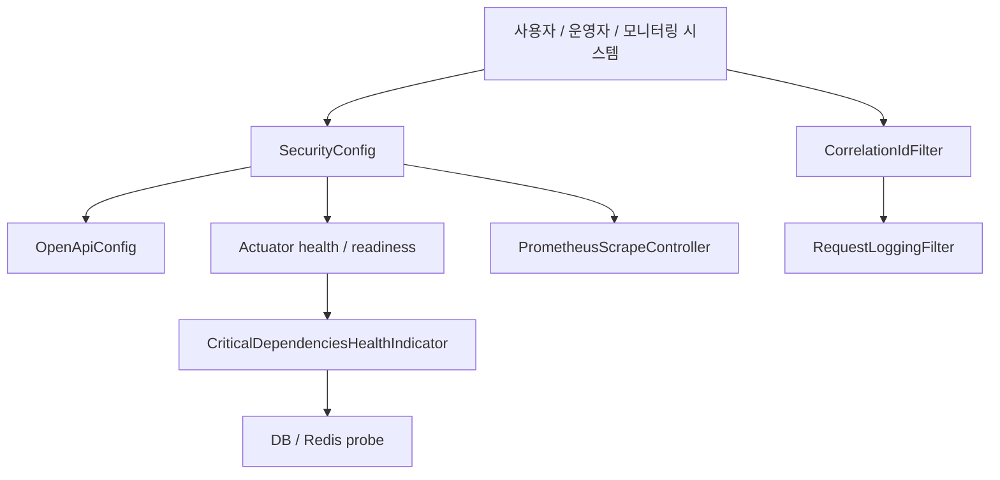
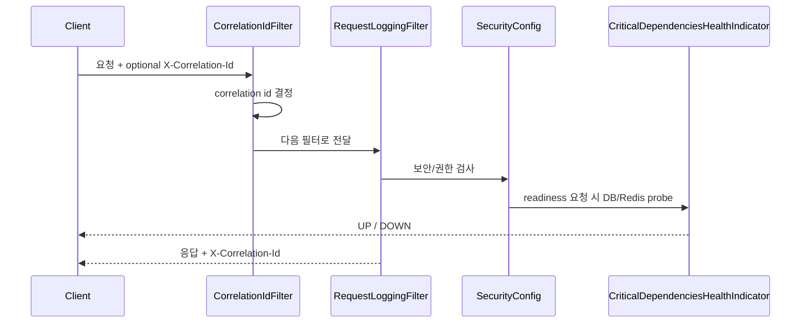

# [Spring Boot 포트폴리오] 20. OpenAPI, 관리면, 관측성을 한 번에 설계하기

## 1. 이번 글에서 풀 문제

백엔드 프로젝트가 어느 정도 커지면 이런 질문을 받습니다.

- API 계약은 어디서 보나요?
- 서비스가 살아 있는지는 어떻게 확인하나요?
- DB나 Redis가 죽었을 때 readiness는 어떻게 반응하나요?
- 요청 하나를 로그에서 어떻게 추적하나요?

이 질문에 대답하지 못하면 기능이 많아도
“운영 준비가 덜 된 프로젝트”처럼 보이기 쉽습니다.

Kindergarten ERP는 이 문제를 아래 네 묶음으로 풀었습니다.

1. OpenAPI / Swagger
2. management surface 노출 정책
3. Actuator health / readiness / Prometheus
4. correlation id + structured request logging

## 2. 먼저 알아둘 개념

### 2-1. OpenAPI는 문서가 아니라 계약이다

정적 문서를 따로 만들 수도 있지만, 시간이 지나면 쉽게 틀어집니다.
실행 중인 서버가 직접 API 계약을 내보내게 만드는 편이 더 낫습니다.

### 2-2. liveness와 readiness는 다르다

- liveness
  - 프로세스가 죽었는가?
- readiness
  - 지금 트래픽을 받아도 되는가?

DB/Redis가 죽었다고 해서 JVM 프로세스가 죽은 것은 아닙니다.
그래서 둘을 분리해야 합니다.

### 2-3. 관리면(management surface)은 “열 것”과 “닫을 것”을 정해야 한다

OpenAPI, health, Prometheus는 유용하지만
무조건 다 공개하면 정보 노출이 됩니다.

그래서 이 프로젝트는 **기본은 닫고, local/demo에서만 명시적으로 연다**는 원칙으로 노출 범위를 조절하게 만들었습니다.

### 2-4. 엔드포인트별 기대 노출 정책을 먼저 표로 보자

운영 문서는 용어보다 “무엇을 누구에게 열 것인가”를 먼저 이해해야 합니다.

| 경로 | 누가 쓰는가 | 기대 정책 | 이유 |
|---|---|---|---|
| `/swagger-ui.html`, `/v3/api-docs` | 개발자 / 면접관 | 기본 비활성화, local/demo에서만 명시적 공개 | API 계약 확인용 |
| `/actuator/health` | 로드밸런서 / 운영자 | 제한적으로 공개 가능 | 프로세스 생존 확인용 |
| `/actuator/health/readiness` | 오케스트레이터 / 운영자 | 의존성 상태 반영 | 트래픽 수신 가능 여부 판단용 |
| `/actuator/prometheus` | Prometheus | 기본 비활성화, local/demo 또는 내부 management plane에서만 노출 | 수집 시스템 전용 |
| 일반 업무 페이지/API | 사용자 | 인증/권한 필요 | 운영 면과 업무 면은 분리해야 하기 때문 |

## 3. 이번 글에서 다룰 파일

```text
- src/main/java/com/erp/global/config/OpenApiConfig.java
- src/main/java/com/erp/global/config/SecurityConfig.java
- src/main/java/com/erp/global/security/ManagementSurfaceProperties.java
- src/main/java/com/erp/global/security/RoleRedirectInterceptor.java
- src/main/java/com/erp/global/monitoring/CriticalDependenciesHealthIndicator.java
- src/main/java/com/erp/global/monitoring/PrometheusRegistryConfig.java
- src/main/java/com/erp/global/monitoring/PrometheusScrapeController.java
- src/main/java/com/erp/global/logging/CorrelationIdFilter.java
- src/main/java/com/erp/global/logging/RequestLoggingFilter.java
- src/test/java/com/erp/integration/ObservabilityIntegrationTest.java
- docs/decisions/phase34_operability_observability_baseline.md
- docs/decisions/phase36_api_contract_observability_demo.md
- docs/decisions/phase39_management_plane_and_active_session_control.md
- docs/decisions/phase44_tagged_ci_readiness_and_hiring_pack.md
```

## 4. 설계 구상



핵심 기준은 아래였습니다.

1. API 계약은 코드와 같이 배포한다
2. 공개 경로는 SecurityConfig와 MVC interceptor를 동시에 맞춘다
3. readiness는 실제 핵심 의존성 상태를 반영한다
4. 모든 요청은 correlation id로 추적 가능하게 만든다

## 5. 코드 설명

### 5-1. `OpenApiConfig`: 실행 중인 API 계약 만들기

[OpenApiConfig.java](../src/main/java/com/erp/global/config/OpenApiConfig.java)의 핵심 메서드는 아래입니다.

- `apiV1GroupedOpenApi()`
- `kindergartenErpOpenApi(...)`

여기서 하는 일은 단순합니다.

- `/api/v1/**`만 묶어 `api-v1` 그룹 생성
- 제목, 버전, 설명 지정
- JWT cookie 기반 인증 구조를 `cookieAuth`로 문서화

입문자 관점에서 중요한 점은, OpenAPI도 결국 `@Bean`으로 등록되는
일반적인 Spring 설정이라는 것입니다.

### 5-2. `SecurityConfig`: management surface를 공개/보호하는 기준점

[SecurityConfig.java](../src/main/java/com/erp/global/config/SecurityConfig.java)의 핵심은 `securityFilterChain(...)`과 `buildPublicEndpoints()`입니다.

`buildPublicEndpoints()`는 아래 경로를 설정 기반으로 조절합니다.

- `/swagger-ui.html`
- `/swagger-ui/**`
- `/v3/api-docs`
- `/actuator/prometheus`

여기서 [ManagementSurfaceProperties.java](../src/main/java/com/erp/global/security/ManagementSurfaceProperties.java)가 같이 동작합니다.

- `publicApiDocs`
- `exposePrometheusOnAppPort`

즉 OpenAPI와 Prometheus를 무조건 공개하지 않고,
프로퍼티로 노출 정책을 제어합니다. 중요한 점은 **기본값이 false**라는 것입니다.

### 5-3. `RoleRedirectInterceptor`: Security 설정만 열어서는 끝나지 않는다

많은 입문자가 놓치는 지점이 여기입니다.

Spring Security에서 경로를 열어도,
MVC interceptor가 다시 `/login`으로 보내면 결과적으로 접근이 막힙니다.

[RoleRedirectInterceptor.java](../src/main/java/com/erp/global/security/RoleRedirectInterceptor.java)의

- `isInfrastructurePath(...)`

는 아래 경로를 예외 처리합니다.

- `/swagger-ui`
- `/v3/api-docs`
- `/actuator/health`
- `/actuator/info`
- `/actuator/prometheus`

즉 이 프로젝트는 **보안 필터 체인과 뷰 인터셉터를 함께 맞춰야 한다**는 점을 실제 코드로 보여줍니다.

### 5-4. `CriticalDependenciesHealthIndicator`: readiness를 실제 의존성 상태로 연결

[CriticalDependenciesHealthIndicator.java](../src/main/java/com/erp/global/monitoring/CriticalDependenciesHealthIndicator.java)의 핵심 메서드는 아래입니다.

- `health()`
- `probeDatabase()`
- `probeRedis()`

이 클래스는

- DataSource로 DB 연결 확인
- RedisConnectionFactory로 `PING` 확인

을 수행하고, 둘 다 살아 있을 때만 `UP`을 반환합니다.

즉 readiness는 그냥 “엔드포인트 켜짐”이 아니라
**핵심 외부 의존성이 실제로 응답하는가**를 묻습니다.

### 5-5. `PrometheusRegistryConfig`와 `PrometheusScrapeController`

[PrometheusRegistryConfig.java](../src/main/java/com/erp/global/monitoring/PrometheusRegistryConfig.java)는
Micrometer Prometheus registry를 등록합니다.

[PrometheusScrapeController.java](../src/main/java/com/erp/global/monitoring/PrometheusScrapeController.java)는

- registry가 있을 때만
- 앱 포트 노출이 허용된 경우에만

`/actuator/prometheus`를 제공합니다.

즉 “Prometheus 의존성을 넣었다”가 아니라
**조건부로 안전하게 노출하는 경로**까지 설계한 것입니다.

### 5-6. `CorrelationIdFilter`와 `RequestLoggingFilter`

[CorrelationIdFilter.java](../src/main/java/com/erp/global/logging/CorrelationIdFilter.java)의 핵심은 아래입니다.

- `shouldNotFilter(...)`
- `doFilterInternal(...)`
- `resolveCorrelationId(...)`

이 필터는

- 요청 헤더의 `X-Correlation-Id`를 재사용하거나
- 없으면 UUID를 생성하고
- MDC와 응답 헤더에 넣습니다

[RequestLoggingFilter.java](../src/main/java/com/erp/global/logging/RequestLoggingFilter.java)는
요청이 끝난 뒤 아래 정보를 key=value 형태로 남깁니다.

- `method`
- `uri`
- `status`
- `durationMs`
- `clientIp`

즉 “로그를 많이 남긴다”가 아니라
**나중에 추적 가능한 최소 정보만 구조적으로 남긴다**는 철학입니다.

## 6. 실제 흐름



## 7. 테스트로 검증하기

대표 테스트는 [ObservabilityIntegrationTest.java](../src/test/java/com/erp/integration/ObservabilityIntegrationTest.java)입니다.

이 테스트는 아래를 확인합니다.

- `/actuator/health` 공개 접근
- `/actuator/health/readiness` 활성화
- critical dependency가 죽었을 때 readiness는 `DOWN`
- 같은 상황에서도 liveness는 `UP`
- 기본 설정에서는 Swagger/OpenAPI와 app-port Prometheus가 닫혀 있음
- 명시적 opt-in property를 켠 별도 테스트에서 Swagger/OpenAPI와 Prometheus가 열림
- `X-Correlation-Id` echo

즉 이 영역은 “설정 파일만 추가한 기능”이 아니라
실제로 회귀 테스트가 붙은 운영 기능입니다.

## 8. 회고

이 글에서 가장 중요한 메시지는 하나입니다.

**운영성은 나중에 붙는 부가 기능이 아니라, 설계 단계에서 경로와 정책을 함께 잡아야 하는 영역**이라는 점입니다.

특히 초보자가 많이 놓치는 포인트는 아래입니다.

- OpenAPI는 켜기만 하면 끝이 아니다
- health endpoint도 liveness/readiness 질문이 다르다
- 보안 경로는 SecurityConfig와 interceptor를 같이 봐야 한다
- 로그는 많이 남기는 것이 아니라, 추적 가능한 형식으로 남겨야 한다

### 현재 구현의 한계

이 글의 관리면은 **설정값으로 노출 범위를 조절하는 방식**입니다.
즉 프로덕션에서 더 강한 격리가 필요하다면 management 전용 포트 분리나 별도 네트워크 레벨 보호까지 갈 수 있습니다.
이 글은 그 전 단계로, 한 애플리케이션 안에서 공개/보호 정책과 readiness 개념을 먼저 정리하는 데 초점을 둡니다.

## 9. 취업 포인트

- “OpenAPI, health, Prometheus, correlation id를 따로따로 붙인 것이 아니라 관리면이라는 하나의 설계 문제로 묶어 다뤘습니다.”
- “readiness는 실제 DB/Redis probe를 반영하고, liveness와 분리해 검증했습니다.”
- “문서/메트릭 공개 경로는 SecurityConfig와 RoleRedirectInterceptor를 같이 점검해 운영 노출 정책까지 맞췄습니다.”

### 9-1. 1문장 답변

- “OpenAPI, health, Prometheus, correlation id를 따로 붙이지 않고 관리면이라는 하나의 설계 문제로 묶고, 공개 정책과 readiness를 코드/테스트로 같이 관리했습니다.”

### 9-2. 30초 답변

- “이 단계에서는 API 계약, 상태 확인, 메트릭 수집, 요청 추적을 하나의 관리면으로 설계했습니다. `OpenApiConfig`로 실행 중인 API 계약을 제공하고, `SecurityConfig`와 `RoleRedirectInterceptor`로 공개 경로를 통제하며, `CriticalDependenciesHealthIndicator`로 DB/Redis 상태를 readiness에 반영했습니다. 또 `CorrelationIdFilter`, `RequestLoggingFilter`로 요청 추적 기준을 맞춰 운영자가 실제로 장애를 따라갈 수 있게 했습니다.”

### 9-3. 예상 꼬리 질문

- “왜 liveness와 readiness를 굳이 나눴나요?”
- “왜 SecurityConfig만이 아니라 interceptor까지 같이 봐야 하나요?”
- “프로덕션에서 management 전용 포트를 분리하지 않은 이유는 무엇인가요?”

## 10. 시작 상태

- 인증과 감사 로그까지 갖춘 뒤, 이제 **운영자가 시스템 상태를 보고 추적하는 면**을 만들 단계입니다.
- 이 글은 기능 API를 하나 더 만드는 글이 아니라, 아래를 하나의 관리면으로 묶는 글입니다.
  - OpenAPI
  - health / readiness
  - Prometheus metrics
  - correlation id / request logging

## 11. 이번 글에서 바뀌는 파일

```text
- OpenAPI / 공개 경로:
  - src/main/java/com/erp/global/config/OpenApiConfig.java
  - src/main/java/com/erp/global/config/SecurityConfig.java
  - src/main/java/com/erp/global/security/RoleRedirectInterceptor.java
- health / metrics:
  - src/main/java/com/erp/global/monitoring/CriticalDependenciesHealthIndicator.java
  - src/main/java/com/erp/global/monitoring/PrometheusRegistryConfig.java
  - src/main/java/com/erp/global/monitoring/PrometheusScrapeController.java
  - src/main/resources/application.yml
- request tracing:
  - src/main/java/com/erp/global/logging/CorrelationIdFilter.java
  - src/main/java/com/erp/global/logging/RequestLoggingFilter.java
  - src/main/resources/logback-spring.xml
- 검증:
  - src/test/java/com/erp/integration/ObservabilityIntegrationTest.java
- 결정 로그:
  - docs/decisions/phase34_operability_observability_baseline.md
  - docs/decisions/phase36_api_contract_observability_demo.md
  - docs/decisions/phase39_management_plane_and_active_session_control.md
  - docs/decisions/phase44_tagged_ci_readiness_and_hiring_pack.md
```

## 12. 구현 체크리스트

1. `OpenApiConfig`로 `/v3/api-docs`, `/swagger-ui.html` 문서를 생성합니다.
2. `SecurityConfig`와 `RoleRedirectInterceptor`에서 공개 경로와 인프라 경로 정책을 같이 정리합니다.
3. `CriticalDependenciesHealthIndicator`로 DB/Redis 상태를 readiness에 연결합니다.
4. `PrometheusRegistryConfig`, `PrometheusScrapeController`로 메트릭 수집 경로를 노출합니다.
5. `CorrelationIdFilter`, `RequestLoggingFilter`로 요청 추적 정보를 구조적으로 남깁니다.
6. `ObservabilityIntegrationTest`로 health, readiness, metrics, correlation id를 검증합니다.

## 13. 실행 / 검증 명령

```bash
./gradlew compileJava compileTestJava
./gradlew --no-daemon integrationTest
```

관련 테스트만 빠르게 보고 싶다면 아래 명령을 추가로 사용할 수 있습니다.

```bash
./gradlew --no-daemon integrationTest --tests "com.erp.integration.ObservabilityIntegrationTest"
```

다만 블로그 기준 안정 검증 경로는 전체 `integrationTest`입니다.

성공하면 확인할 것:

- `/actuator/health`와 `/actuator/health/readiness`가 의도한 정책으로 노출된다
- dependency 장애 시 readiness만 `DOWN`이 된다
- `/actuator/prometheus`에서 주요 메트릭을 읽을 수 있다
- 응답 헤더에 `X-Correlation-Id`가 포함된다

## 14. 산출물 체크리스트

- `OpenApiConfig`가 `/api/v1/**` 기준 OpenAPI 문서를 제공한다
- `SecurityConfig`, `RoleRedirectInterceptor`가 관리면 공개 경로 정책을 함께 맞춘다
- `CriticalDependenciesHealthIndicator`가 DB/Redis probe를 readiness에 반영한다
- `CorrelationIdFilter`, `RequestLoggingFilter`가 추적 가능한 요청 로그를 남긴다
- `ObservabilityIntegrationTest`가 health/readiness/metrics/correlation id를 검증한다

## 15. 글 종료 체크포인트

- OpenAPI, health, metrics, request tracing을 하나의 운영 설계로 설명할 수 있다
- readiness와 liveness의 질문 차이를 코드와 테스트로 보여줄 수 있다
- 공개 경로 정책이 보안 설정과 인터셉터에서 동시에 맞춰져 있다
- 로그가 “많이 남는가”가 아니라 “나중에 추적 가능한가” 기준으로 설계돼 있다

## 16. 자주 막히는 지점

- 증상: Swagger는 열리는데 페이지 진입 시 예상치 못한 리다이렉트가 발생한다
  - 원인: `SecurityConfig` 허용 경로와 `RoleRedirectInterceptor` 인프라 경로 규칙이 어긋났을 수 있습니다
  - 확인할 것: `SecurityConfig.buildPublicEndpoints()`, `RoleRedirectInterceptor.isInfrastructurePath(...)`

- 증상: readiness와 liveness가 둘 다 같은 결과만 낸다
  - 원인: 의존성 probe를 readiness group에만 연결하지 않았을 수 있습니다
  - 확인할 것: `CriticalDependenciesHealthIndicator`, `application.yml`의 management health 설정
