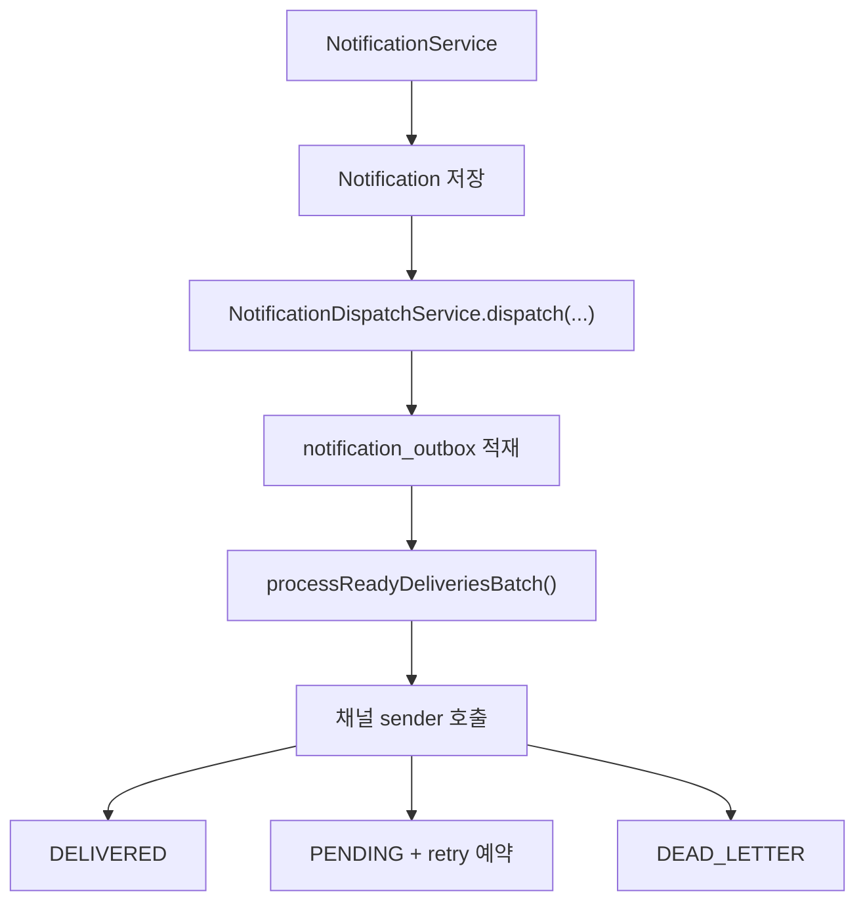
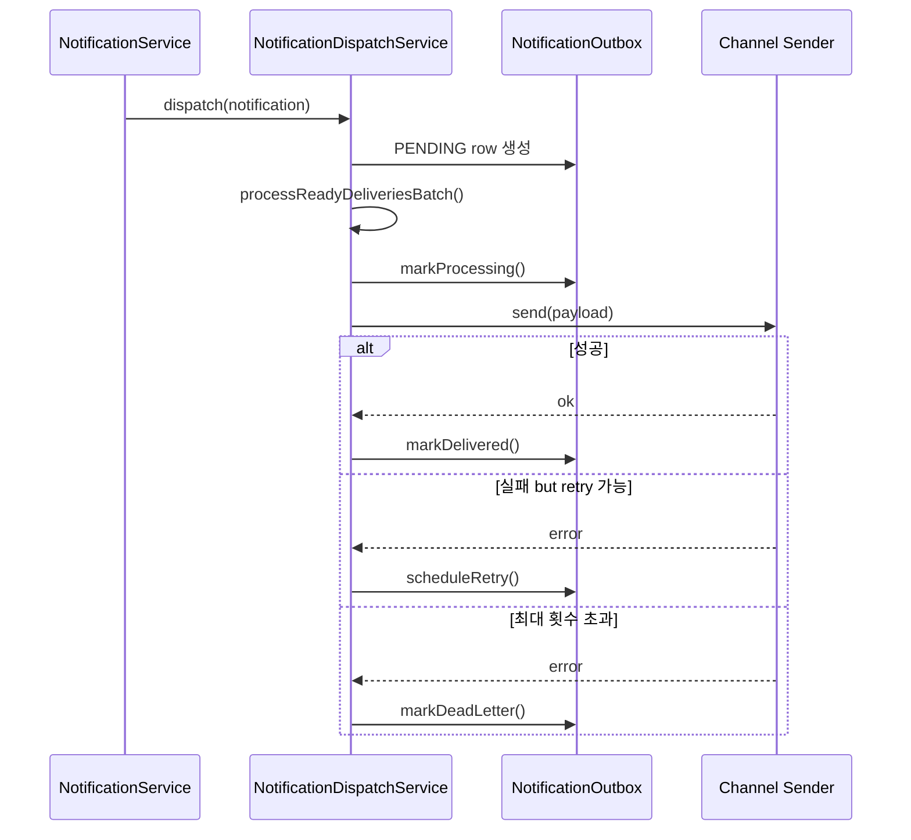

# [Spring Boot 포트폴리오] 21. 알림 전달을 Outbox, Retry, Dead-letter로 바꾸기

## 1. 이번 글에서 풀 문제

알림 기능은 구현 초기에 보통 이렇게 만듭니다.

1. `notification` 테이블에 저장
2. 바로 외부 웹훅이나 메일 호출
3. 실패하면 로그만 남김

처음에는 동작하지만, 운영에서는 금방 문제가 드러납니다.

- 외부 채널이 잠깐 죽으면 알림이 사라진다
- 재시도 정책이 없다
- 전달 실패를 운영자가 추적할 수 없다
- 보안 이벤트를 incident 채널로 보내기도 어렵다

Kindergarten ERP는 이 문제를 `notification_outbox` 패턴으로 풀었습니다.

## 2. 먼저 알아둘 개념

### 2-1. “알림 생성”과 “외부 전달”은 다른 책임이다

앱 내부 알림이 생성됐다는 사실과
Slack, webhook, push, email이 성공했다는 사실은 다릅니다.

이 둘을 한 트랜잭션으로 묶으면
느린 외부 시스템이 핵심 비즈니스 흐름을 망칠 수 있습니다.

### 2-2. Outbox 패턴

Outbox 패턴은 핵심 데이터 저장 뒤,
“나중에 전달해야 할 작업”을 별도 테이블에 적재하는 방식입니다.

즉 이 프로젝트에서는

- `notification`
  - 사용자에게 알림이 생겼다
- `notification_outbox`
  - 외부 채널로 전달할 작업이 생겼다

로 책임을 분리합니다.

### 2-3. Dead-letter

여러 번 재시도해도 계속 실패하면
“더 이상 자동 재시도하지 않는 최종 실패 상태”가 필요합니다.

그래야 운영자가 놓치지 않습니다.

### 2-4. 상태 전이를 표로 먼저 보자

Outbox는 글로 읽으면 복잡해 보이지만, 실제로는 아래 표 하나로 이해할 수 있습니다.

| 상황 | outbox 상태 | 의미 |
|---|---|---|
| 알림 저장 직후 | `PENDING` | 아직 외부 채널로 보내지지 않음 |
| worker가 집음 | `PROCESSING` | 지금 보내는 중 |
| 외부 채널 성공 | `DELIVERED` | 전달 완료 |
| 외부 채널 실패, 재시도 가능 | 다시 `PENDING` | 나중에 다시 시도 |
| 외부 채널 실패, 재시도 소진 | `DEAD_LETTER` | 운영자가 봐야 하는 최종 실패 |

## 3. 이번 글에서 다룰 파일

```text
- src/main/java/com/erp/domain/notification/entity/NotificationOutbox.java
- src/main/java/com/erp/domain/notification/repository/NotificationOutboxRepository.java
- src/main/java/com/erp/domain/notification/service/NotificationDispatchService.java
- src/main/java/com/erp/domain/notification/service/NotificationDeliveryPolicyService.java
- src/main/java/com/erp/domain/notification/service/channel/NotificationChannel.java
- src/test/java/com/erp/integration/NotificationOutboxIntegrationTest.java
- src/test/java/com/erp/integration/NotificationOutboxRetryIntegrationTest.java
- src/test/java/com/erp/integration/NotificationOutboxClaimConcurrencyIntegrationTest.java
- docs/COMPLETED.md#archive-003
- docs/COMPLETED.md#archive-005
```

## 4. 설계 구상



핵심 기준은 아래였습니다.

1. 앱 내부 알림 저장은 빠르게 끝낸다
2. 외부 전달은 outbox row로 분리한다
3. 채널 선택은 정책 서비스에서 결정한다
4. 실패는 warn 로그가 아니라 상태 전이로 남긴다

## 5. 코드 설명

### 5-1. `NotificationOutbox`: 전달 작업을 표현하는 엔티티

[NotificationOutbox.java](../src/main/java/com/erp/domain/notification/entity/NotificationOutbox.java)는
아래 상태를 가집니다.

- `channel`
- `status`
- `attemptCount`
- `maxAttempts`
- `nextAttemptAt`
- `processingStartedAt`
- `deliveredAt`
- `deadLetteredAt`
- `lastError`

핵심 메서드는 아래입니다.

- `create(...)`
- `markProcessing(...)`
- `markDelivered(...)`
- `scheduleRetry(...)`
- `markDeadLetter(...)`
- `canRetry()`
- `toPayload()`

즉 이 엔티티는 단순 보조 테이블이 아니라
**전달 작업의 상태 머신**입니다.

### 5-2. `NotificationDispatchService`: worker 역할까지 담당한다

[NotificationDispatchService.java](../src/main/java/com/erp/domain/notification/service/NotificationDispatchService.java)의 핵심 메서드는 아래입니다.

- `dispatch(Notification notification)`
- `dispatch(List<Notification> notifications)`
- `processReadyDeliveriesOnSchedule()`
- `processReadyDeliveriesBatch()`
- `claimReadyDeliveries(...)`
- `processClaimedDelivery(...)`
- `enqueueNotifications(...)`

초보자가 꼭 봐야 할 포인트는 아래입니다.

#### `dispatch(...)`는 외부 전송이 아니라 큐 적재

이름만 보면 바로 보내는 것처럼 보이지만,
실제로는 `enqueueNotifications(...)`를 통해 outbox row를 만듭니다.

즉 이 단계의 책임은 “보내기”가 아니라 “보낼 작업 등록”입니다.

#### `processReadyDeliveriesBatch()`

이 메서드는 worker 진입점입니다.

1. `claimReadyDeliveries(...)`로 ready batch 선택
2. outbox ID 단위로 새 트랜잭션에서 처리
3. `processClaimedDelivery(...)`에서 sender 호출

여기서 `executeInNewTransaction(...)`을 쓰는 이유는
각 outbox row 처리를 서로 격리하기 위해서입니다.

이번 배치에서는 여기서 한 단계 더 나아가,
claim 자체를 MySQL 8 `FOR UPDATE SKIP LOCKED`로 원자화했습니다.

즉 멀티 인스턴스 환경에서도 같은 `PENDING` row를 두 worker가 동시에 집지 않도록 바꿨습니다.

### 5-3. `claimReadyDeliveries(...)`: stale processing까지 회수하면서 원자적으로 claim한다

이 메서드는 두 단계로 조회합니다.

1. `PENDING`이고 `nextAttemptAt <= now`인 row를 `FOR UPDATE SKIP LOCKED`로 claim
2. 없으면 오래된 `PROCESSING` row를 같은 방식으로 reclaim

즉 worker가 죽거나 중간에 멈춘 row도
다시 회수할 수 있게 설계했습니다.

중요한 점은 “조회 후 나중에 상태를 바꾸는 것”이 아니라,
**claim용 SELECT와 `PROCESSING` 전이를 같은 트랜잭션 안에서 끝낸다**는 것입니다.

### 5-4. `processClaimedDelivery(...)`: 성공, 재시도, dead-letter

성공하면:

- `markDelivered(now)`

실패하면:

- 아직 여유가 있으면 `scheduleRetry(...)`
- 더 이상 안 되면 `markDeadLetter(...)`

이 구조가 중요한 이유는
실패를 “로그에만 남기는 부수효과”가 아니라
**도메인 상태 변화**로 승격시켰기 때문입니다.

### 5-5. `NotificationDeliveryPolicyService`: 어떤 채널로 보낼지 결정

[NotificationDeliveryPolicyService.java](../src/main/java/com/erp/domain/notification/service/NotificationDeliveryPolicyService.java)의 핵심 메서드는 아래입니다.

- `resolveReceiverChannels(...)`
- `resolveIncidentChannels(...)`
- `resolveChannels(...)`

즉 channel 분기 로직을 `NotificationService`나 controller에 두지 않고,
정책 서비스로 분리했습니다.

예를 들어 `AUTH_ANOMALY_DETECTED` 같은 타입은

- principal in-app 알림
- incident webhook

으로 여러 채널에 퍼뜨릴 수 있습니다.

### 5-6. `NotificationOutboxRepository`: worker가 실제로 의존하는 조회 규칙

[NotificationOutboxRepository.java](../src/main/java/com/erp/domain/notification/repository/NotificationOutboxRepository.java)의 핵심 메서드는 아래입니다.

- `findByStatusAndNextAttemptAtLessThanEqualOrderByNextAttemptAtAscIdAsc(...)`
- `findByStatusAndProcessingStartedAtLessThanEqualOrderByProcessingStartedAtAscIdAsc(...)`
- `findByNotificationIdOrderByIdAsc(...)`

즉 repository도 CRUD가 아니라
**worker가 어떤 순서로 잡아 가야 하는지**를 표현합니다.

> 현재 구현의 한계
> 현재 구현은 claim 단계는 원자화했지만, downstream webhook/email까지 exactly-once를 보장하지는 않습니다.
> 즉 같은 outbox row를 두 worker가 동시에 집는 문제는 줄였지만, 외부 시스템 자체가 idempotent하지 않다면 외부 레벨 중복까지 완전히 없애는 것은 별도 과제입니다.
> 면접에서는 “DB claim은 `FOR UPDATE SKIP LOCKED`로 막았고, 다음 단계는 downstream idempotency key 또는 메시지 브로커 검토”라고 설명하면 됩니다.

## 6. 실제 흐름



## 7. 테스트로 검증하기

대표 테스트는 아래입니다.

- [NotificationOutboxIntegrationTest.java](../src/test/java/com/erp/integration/NotificationOutboxIntegrationTest.java)
  - outbox 적재 후 성공 시 `DELIVERED`
- [NotificationOutboxRetryIntegrationTest.java](../src/test/java/com/erp/integration/NotificationOutboxRetryIntegrationTest.java)
  - 실패 반복 시 `DEAD_LETTER`
- [NotificationOutboxClaimConcurrencyIntegrationTest.java](../src/test/java/com/erp/integration/NotificationOutboxClaimConcurrencyIntegrationTest.java)
  - 동시에 두 worker가 batch를 처리해도 같은 outbox가 한 번만 claim되는지 확인

이 테스트가 좋은 이유는 외부 채널을 모킹하면서도
outbox 상태 전이를 끝까지 검증한다는 점입니다.

즉 “웹훅 호출했다”가 아니라
**실패했을 때 시스템이 어떻게 행동하는지**를 본다는 것입니다.

## 8. 회고

Outbox를 처음 보면 구조가 복잡해 보일 수 있습니다.
하지만 실제로는 시스템 책임을 더 명확하게 나눈 것입니다.

- 앱 내부 알림 저장
- 외부 전달 정책 결정
- 비동기 worker 처리
- 실패/재시도/최종 포기

이 분리가 되면 나중에 incident webhook, email, push를 추가할 때도
핵심 비즈니스 코드가 덜 흔들립니다.

## 9. 취업 포인트

- “알림 저장과 외부 전달을 분리해, 느린 외부 채널이 핵심 트랜잭션을 망치지 않게 했습니다.”
- “실패는 warn 로그가 아니라 `PENDING -> DELIVERED / DEAD_LETTER` 상태 전이로 남겼습니다.”
- “채널 선택은 `NotificationDeliveryPolicyService`로 분리해 incident webhook 같은 운영 채널 확장을 쉽게 만들었습니다.”

### 9-1. 1문장 답변

- “알림 저장과 외부 전달을 분리하고, 실패를 상태 전이로 남기는 outbox 구조로 바꿨습니다.”

### 9-2. 30초 답변

- “처음에는 알림 저장 직후 외부 채널을 바로 호출하면 되지만, 운영에서는 실패 복구가 어렵습니다. 그래서 내부 알림 생성과 외부 전달을 `notification_outbox`로 분리했습니다. 지금은 worker가 `FOR UPDATE SKIP LOCKED`로 `PENDING` row를 원자적으로 claim하고, 성공하면 `DELIVERED`, 실패하면 재시도나 `DEAD_LETTER`로 전이합니다. 덕분에 incident webhook 같은 운영 채널도 같은 구조로 확장할 수 있습니다.”

### 9-3. 예상 꼬리 질문

- “왜 외부 채널 호출을 원래 트랜잭션 안에서 하지 않았나요?”
- “재시도와 dead-letter는 어떤 기준으로 나누나요?”
- “멀티 인스턴스로 커지면 claim 동시성은 어떻게 보강할 건가요?”

## 10. 시작 상태

- 앱 내부 알림 기능은 이미 존재하고, 인증 이상 징후 같은 운영 이벤트도 발생시킬 수 있어야 합니다.
- 이 글의 목표는 **알림을 보냈다**가 아니라, **실패해도 복구 가능한 전달 구조를 만든다**는 것입니다.
- 따라서 전제는 다음과 같습니다.
  - 알림 엔티티와 알림 생성 흐름이 이미 있다
  - 외부 채널 호출은 실패할 수 있다고 가정한다

## 11. 이번 글에서 바뀌는 파일

```text
- 스키마 / 엔티티:
  - src/main/resources/db/migration/V12__add_notification_outbox.sql
  - src/main/java/com/erp/domain/notification/entity/NotificationOutbox.java
  - src/main/java/com/erp/domain/notification/entity/NotificationDeliveryStatus.java
- 정책 / worker:
  - src/main/java/com/erp/domain/notification/service/NotificationDispatchService.java
  - src/main/java/com/erp/domain/notification/service/NotificationDeliveryPolicyService.java
  - src/main/java/com/erp/domain/notification/repository/NotificationOutboxRepository.java
  - src/main/java/com/erp/domain/notification/config/NotificationDeliveryProperties.java
- 채널 구현:
  - src/main/java/com/erp/domain/notification/service/channel/NotificationChannelSender.java
  - src/main/java/com/erp/domain/notification/service/channel/AppNotificationSender.java
  - src/main/java/com/erp/domain/notification/service/channel/EmailNotificationSender.java
  - src/main/java/com/erp/domain/notification/service/channel/IncidentWebhookNotificationSender.java
- 검증:
  - src/test/java/com/erp/integration/NotificationOutboxIntegrationTest.java
  - src/test/java/com/erp/integration/NotificationOutboxRetryIntegrationTest.java
  - src/test/java/com/erp/integration/NotificationOutboxClaimConcurrencyIntegrationTest.java
- 결정 로그:
  - docs/COMPLETED.md#archive-003
  - docs/COMPLETED.md#archive-005
```

## 12. 구현 체크리스트

1. `notification_outbox` 테이블과 상태 enum을 추가합니다.
2. `NotificationDispatchService`에서 알림 저장과 외부 채널 전달을 분리합니다.
3. outbox worker가 `PENDING` 건을 `FOR UPDATE SKIP LOCKED`로 claim하고 처리하도록 만듭니다.
4. 실패 시 재시도 간격과 최대 시도 횟수를 기준으로 `scheduleRetry()` 또는 `markDeadLetter()`를 수행합니다.
5. `NotificationDeliveryPolicyService`에서 수신자 채널과 incident 채널 선택 규칙을 분리합니다.
6. 통합 테스트로 성공 시 `DELIVERED`, 반복 실패 시 `DEAD_LETTER`까지 검증합니다.

## 13. 실행 / 검증 명령

```bash
./gradlew compileJava compileTestJava
./gradlew --no-daemon integrationTest
```

관련 테스트만 빠르게 확인하고 싶다면 아래처럼 좁혀 실행할 수 있습니다.

```bash
./gradlew --no-daemon integrationTest \
  --tests "com.erp.integration.NotificationOutboxIntegrationTest" \
  --tests "com.erp.integration.NotificationOutboxRetryIntegrationTest" \
  --tests "com.erp.integration.NotificationOutboxClaimConcurrencyIntegrationTest"
```

다만 outbox 구간은 일부 환경에서 좁힌 `--tests` 실행 시 Gradle XML result writer 충돌이 재현되므로, 블로그 기준 안정 검증 경로는 전체 `integrationTest`입니다.

성공하면 확인할 것:

- 알림 저장 직후 outbox row가 생성된다
- 동시에 두 worker가 돌아도 같은 row는 한 번만 claim된다
- 성공한 채널은 `DELIVERED`로 끝난다
- 반복 실패는 재시도 후 `DEAD_LETTER`로 남는다

## 14. 산출물 체크리스트

- `V12__add_notification_outbox.sql`과 `NotificationOutbox` 엔티티가 존재한다
- `NotificationDispatchService`가 알림 저장과 외부 전송을 분리한다
- outbox claim은 MySQL 8 `FOR UPDATE SKIP LOCKED` 기반으로 원자화된다
- `NotificationDeliveryPolicyService`가 채널 선택 규칙을 담당한다
- 이메일 / incident webhook sender가 같은 채널 인터페이스를 구현한다
- `NotificationOutboxIntegrationTest`, `NotificationOutboxRetryIntegrationTest`, `NotificationOutboxClaimConcurrencyIntegrationTest`가 상태 전이를 검증한다

## 15. 글 종료 체크포인트

- 핵심 트랜잭션과 외부 채널 호출이 분리돼 있다
- outbox 상태 전이와 atomic claim으로 전달 결과를 설명할 수 있다
- 채널 선택 규칙이 비즈니스 서비스 내부 분기문으로 흩어져 있지 않다
- incident webhook 같은 운영 채널을 같은 구조로 확장할 수 있다

## 16. 자주 막히는 지점

- 증상: 외부 채널 실패가 알림 생성 API 자체를 깨뜨린다
  - 원인: outbox 적재와 외부 전송을 같은 즉시 호출로 처리했을 수 있습니다
  - 확인할 것: `NotificationDispatchService.dispatch(...)`, `enqueueNotifications(...)`

- 증상: 실패가 발생해도 상태가 계속 `PROCESSING`에 머문다
  - 원인: worker timeout, retry scheduling, dead-letter 분기 중 하나가 빠졌을 수 있습니다
  - 확인할 것: `processReadyDeliveriesBatch()`, `processClaimedDelivery(...)`, `resolveRetryDelay(...)`
