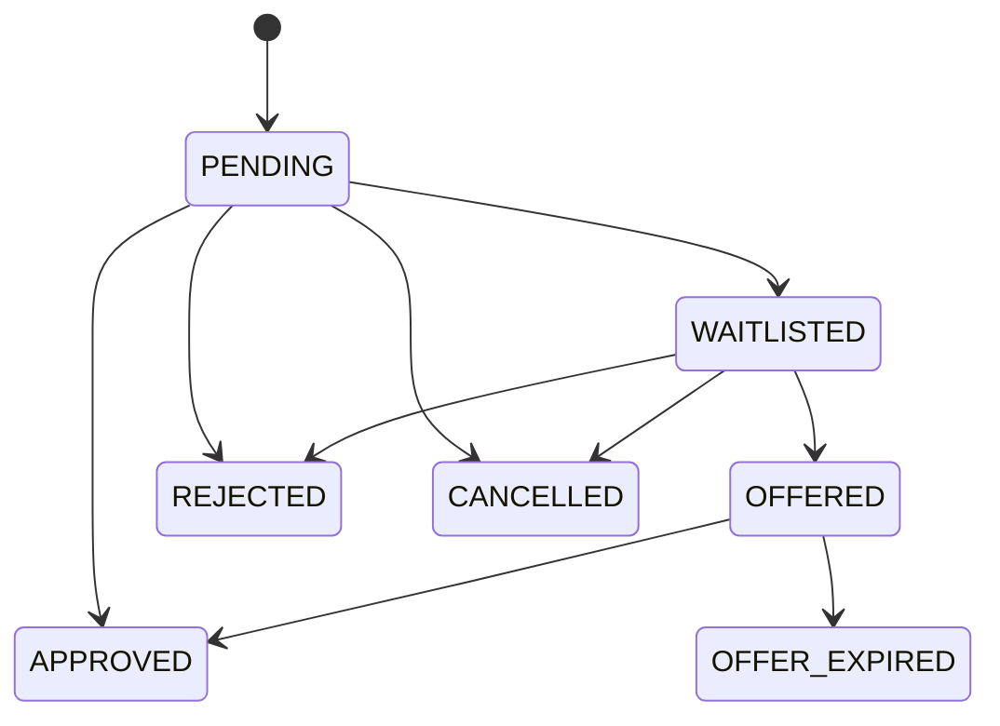
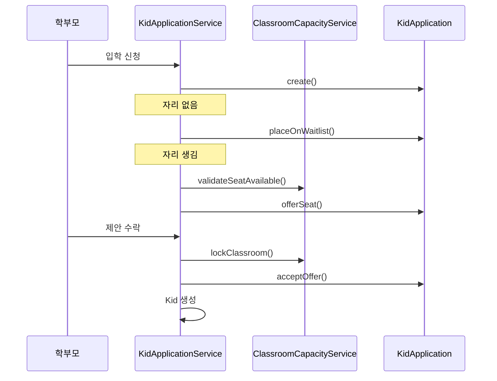

# [Spring Boot 포트폴리오] 22. 반 정원, 대기열, 입학 제안 워크플로우 설계하기

## 1. 이번 글에서 풀 문제

입학 신청 기능을 단순 CRUD로 만들면 보통 이렇게 됩니다.

- 신청 생성
- 원장이 승인
- 원생 생성

하지만 실제 유치원 운영을 생각하면 이 흐름은 너무 단순합니다.

- 반 정원이 꽉 차 있으면?
- 당장은 자리가 없지만 대기열에 넣어야 한다면?
- 나중에 자리가 생기면 입학 제안을 보내야 한다면?
- 제안이 일정 시간 내 수락되지 않으면?

Kindergarten ERP는 이 문제를  
**정원(capacity) + 대기열(waitlist) + 제안(offer) + 만료(expiry)** 모델로 풀었습니다.

## 2. 먼저 알아둘 개념

### 2-1. “정원”은 화면 정보가 아니라 제약 조건이다

`현재 몇 명인가`를 보여주는 것과  
`더 받을 수 있는가`를 판단하는 것은 다릅니다.

정원은 단순 표시값이 아니라  
도메인 규칙을 막는 제약 조건이어야 합니다.

### 2-2. 상태 전이로 생각해야 한다

입학 신청은 단순히 `PENDING -> APPROVED`가 아닙니다.

이 프로젝트는 아래 상태를 가집니다.

- `PENDING`
- `WAITLISTED`
- `OFFERED`
- `APPROVED`
- `OFFER_EXPIRED`
- `REJECTED`
- `CANCELLED`

### 2-3. “예약된 자리”도 정원 계산에 포함해야 한다

이미 원생으로 등록된 아이만 세면 부족합니다.  
입학 제안을 받고 아직 수락 대기 중인 자리는 사실상 예약석입니다.

그래서 이 프로젝트는

- 재원 아동 수
- 활성 offer 수

를 함께 계산합니다.

## 3. 이번 글에서 다룰 파일

```text
- src/main/java/com/erp/domain/classroom/entity/Classroom.java
- src/main/java/com/erp/domain/classroom/service/ClassroomCapacityService.java
- src/main/java/com/erp/domain/kidapplication/entity/KidApplication.java
- src/main/java/com/erp/domain/kidapplication/entity/ApplicationStatus.java
- src/main/java/com/erp/domain/kidapplication/service/KidApplicationService.java
- src/main/resources/db/migration/V13__add_admission_workflow_attendance_requests_and_domain_audit.sql
- src/test/java/com/erp/api/KidApplicationApiIntegrationTest.java
- src/test/java/com/erp/api/ClassroomApiIntegrationTest.java
- src/test/java/com/erp/api/KidApiIntegrationTest.java
- docs/decisions/phase41_admission_capacity_waitlist_workflow.md
```

## 4. 설계 구상



핵심 기준은 아래였습니다.

1. 정원 검사는 별도 서비스에서 공통화한다
2. 반 정원은 재원 아동 수 + 활성 offer 수로 계산한다
3. 입학 신청은 상태 전이 메서드가 직접 자기 상태를 바꾼다
4. offer 만료는 스케줄러가 처리한다

## 5. 코드 설명

### 5-1. `Classroom`: 정원 규칙을 갖는 엔티티

[Classroom.java](/Users/alex/project/kindergarten_ERP/erp/src/main/java/com/erp/domain/classroom/entity/Classroom.java)는  
이제 단순히 반 이름만 갖는 엔티티가 아닙니다.

이 글에서 주목할 메서드는 아래입니다.

- `remainingSeats(...)`
- `canResizeTo(...)`

즉 정원 관련 계산 일부를 엔티티 자신이 책임집니다.

초보자는 서비스에 모든 계산을 몰아넣기 쉽지만,  
반 자체의 규칙이라면 엔티티로 일부 끌고 오는 편이 읽기 좋습니다.

### 5-2. `ClassroomCapacityService`: 정원 계산을 공통 규칙으로 만든다

[ClassroomCapacityService.java](/Users/alex/project/kindergarten_ERP/erp/src/main/java/com/erp/domain/classroom/service/ClassroomCapacityService.java)의 핵심 메서드는 아래입니다.

- `lockClassroom(...)`
- `summarize(...)`
- `validateSeatAvailable(...)`
- `validateCapacityReduction(...)`

여기서 가장 중요한 메서드는 `summarize(...)`입니다.

이 메서드는

- `kidRepository.countByClassroomIdAndDeletedAtIsNull(...)`
- `kidApplicationRepository.countActiveOffersByAssignedClassroomId(...)`

를 사용해

- 실제 재원 수
- 예약된 offer 수
- 남은 자리 수

를 모두 계산합니다.

즉 정원 계산이 여러 서비스에 흩어지지 않고 한 곳에 모입니다.

### 5-3. `KidApplication`: 신청 엔티티가 직접 상태 전이를 가진다

[KidApplication.java](/Users/alex/project/kindergarten_ERP/erp/src/main/java/com/erp/domain/kidapplication/entity/KidApplication.java)의 핵심 메서드는 아래입니다.

- `placeOnWaitlist(...)`
- `offerSeat(...)`
- `acceptOffer(...)`
- `markOfferExpired()`
- `approveDirect(...)`

이 설계가 좋은 이유는  
“어떤 상태에서 어떤 상태로 갈 수 있는가”가 서비스가 아니라  
엔티티 메서드 이름으로 드러난다는 점입니다.

즉 상태 전이 규칙이 코드에서 읽힙니다.

### 5-4. `KidApplicationService.approve(...)`: 좌석이 있으면 바로 승인

[KidApplicationService.java](/Users/alex/project/kindergarten_ERP/erp/src/main/java/com/erp/domain/kidapplication/service/KidApplicationService.java)의
`approve(...)`는 아래 순서로 동작합니다.

1. 신청서 잠금 조회
2. 처리자 검증
3. 반 조회
4. `classroomCapacityService.validateSeatAvailable(...)`
5. 실제 `Kid` 생성
6. `application.approveDirect(...)`

즉 정원이 충분하면  
전통적인 “바로 승인” 흐름도 여전히 지원합니다.

### 5-5. `placeOnWaitlist(...)`와 `offer(...)`

자리가 없거나 운영 정책상 대기열로 둘 때는 `placeOnWaitlist(...)`를 사용합니다.

나중에 자리가 생기면 `offer(...)`가 아래를 수행합니다.

1. 반 잠금/검증
2. 다시 정원 확인
3. `offerExpiresAt` 계산
4. `application.offerSeat(...)`

여기서 `offerExpiresAt`를 명시적으로 저장하는 것이 중요합니다.

그래야 “언제까지 답해야 하는가”가 도메인 데이터가 됩니다.

### 5-6. `acceptOffer(...)`: 학부모가 수락할 때만 최종 원생 생성

`acceptOffer(...)`는 아주 중요합니다.

이 메서드는

- parent 본인인지 확인
- 제안 만료 여부 확인
- 반을 다시 잠그고
- 실제 `Kid`를 생성한 뒤
- `application.acceptOffer(...)`

를 수행합니다.

즉 제안을 보냈다고 바로 입학 완료가 아니라,  
**수락 시점에만 확정 aggregate를 만든다**는 점이 핵심입니다.

### 5-7. `expireOffers()`: 스케줄러로 만료 처리

`KidApplicationService.expireOffers()`는 `@Scheduled`로 주기 실행됩니다.

이 메서드는

- 만료된 `OFFERED` 신청 조회
- `markOfferExpired()`
- 보호자 알림
- 시스템 감사 로그

를 수행합니다.

초보자가 배우기 좋은 포인트는  
“시간 기반 상태 변화도 백엔드가 책임질 수 있다”는 점입니다.

## 6. 실제 흐름



## 7. 테스트로 검증하기

대표 테스트는 아래입니다.

- [KidApplicationApiIntegrationTest.java](/Users/alex/project/kindergarten_ERP/erp/src/test/java/com/erp/api/KidApplicationApiIntegrationTest.java)
  - waitlist / offer / accept / expire
- [ClassroomApiIntegrationTest.java](/Users/alex/project/kindergarten_ERP/erp/src/test/java/com/erp/api/ClassroomApiIntegrationTest.java)
  - 정원 변경 검증
- [KidApiIntegrationTest.java](/Users/alex/project/kindergarten_ERP/erp/src/test/java/com/erp/api/KidApiIntegrationTest.java)
  - 정원 초과 차단이나 실제 원생 생성 연동 검증

이 테스트들이 중요한 이유는  
단순 JSON 응답이 아니라 **상태 전이와 좌석 규칙**을 검증하기 때문입니다.

## 8. 회고

이 기능은 CRUD로 보면 복잡해 보입니다.  
하지만 실제 운영 문제를 그대로 옮겨 보면 오히려 더 자연스럽습니다.

- 자리가 없으면 대기열
- 자리가 나면 제안
- 일정 시간 안에 수락 안 하면 만료

즉 코드가 복잡해진 것이 아니라,  
도메인 현실을 더 정확히 반영한 것입니다.

## 9. 취업 포인트

- “정원은 단순 표시값이 아니라 재원 수 + 활성 offer 수를 함께 보는 실제 제약으로 설계했습니다.”
- “입학 신청을 단일 승인 버튼이 아니라 `WAITLISTED -> OFFERED -> APPROVED / OFFER_EXPIRED` 상태 머신으로 모델링했습니다.”
- “스케줄러와 정원 잠금, 재검증을 통해 시간 기반 상태 변화까지 백엔드 책임으로 닫았습니다.”

## 10. 시작 상태

- `07`, `10` 글까지 따라와서 `Classroom.capacity`와 입학 신청 기본 흐름이 이미 있어야 합니다.
- 이 글의 목표는 **정원을 숫자 필드에서 실제 운영 제약으로 끌어올리고, 입학 신청을 waitlist/offer 기반 상태 머신으로 바꾸는 것**입니다.
- 핵심은 두 가지입니다.
  - 좌석 가능 여부를 매번 재계산하고 잠그는 것
  - 제안(offer)과 최종 승인(approved)을 분리하는 것

## 11. 이번 글에서 바뀌는 파일

```text
- 정원 계산:
  - src/main/java/com/erp/domain/classroom/service/ClassroomCapacityService.java
  - src/main/java/com/erp/domain/classroom/entity/Classroom.java
- 입학 신청 상태 머신:
  - src/main/java/com/erp/domain/kidapplication/entity/KidApplication.java
  - src/main/java/com/erp/domain/kidapplication/controller/KidApplicationController.java
  - src/main/java/com/erp/domain/kidapplication/service/KidApplicationService.java
- 스키마:
  - src/main/resources/db/migration/V13__add_admission_workflow_attendance_requests_and_domain_audit.sql
- 검증:
  - src/test/java/com/erp/api/KidApplicationApiIntegrationTest.java
  - src/test/java/com/erp/api/ClassroomApiIntegrationTest.java
  - src/test/java/com/erp/api/KidApiIntegrationTest.java
- 결정 로그:
  - docs/decisions/phase41_admission_capacity_waitlist_workflow.md
```

## 12. 구현 체크리스트

1. `ClassroomCapacityService`에서 현재 재원 수와 활성 offer 수를 함께 계산합니다.
2. `KidApplication`에 `WAITLISTED`, `OFFERED`, `APPROVED`, `OFFER_EXPIRED` 상태 전이를 넣습니다.
3. `KidApplicationService.offer(...)`에서 제안 만료 시각과 좌석 재검증을 같이 처리합니다.
4. `acceptOffer(...)`에서만 실제 `Kid`를 생성해 입학을 확정합니다.
5. `expireOffers()` 스케줄러로 시간 기반 만료를 처리합니다.
6. 통합 테스트로 waitlist, offer, accept, expire와 정원 규칙을 검증합니다.

## 13. 실행 / 검증 명령

```bash
./gradlew compileJava compileTestJava
./blog/scripts/checkpoint-22.sh
# 현재 완성 저장소 기준 안정 검증
./gradlew --no-daemon integrationTest
```

성공하면 확인할 것:

- `checkpoint-22.sh`가 통과해 정원/대기열/offer 산출물이 맞는다
- 통합 스위트 안에서 `KidApplicationApiIntegrationTest`, `ClassroomApiIntegrationTest`, `KidApiIntegrationTest`가 통과한다
- 좌석 계산이 현재 재원 수와 활성 offer를 함께 반영한다
- 입학 신청이 waitlist/offer/accept/expire 흐름을 가진다

## 14. 산출물 체크리스트

- 새로 생긴 migration:
  - `V13__add_admission_workflow_attendance_requests_and_domain_audit.sql`
- 새로 생긴 주요 클래스:
  - `ClassroomCapacityService`
  - `KidApplicationWorkflowProperties`
  - `WaitlistKidApplicationRequest`
  - `OfferKidApplicationRequest`
  - `AcceptKidApplicationOfferRequest`
- 대표 검증 대상:
  - `KidApplicationApiIntegrationTest`
  - `ClassroomApiIntegrationTest`
  - `KidApiIntegrationTest`

## 15. 글 종료 체크포인트

- 정원이 단순 표시값이 아니라 운영 제약이라는 점을 설명할 수 있다
- offer와 최종 승인 사이에 별도 상태가 필요한 이유를 설명할 수 있다
- 시간 기반 상태 변화도 스케줄러와 감사 로그로 닫을 수 있다
- 실제 원생 생성 시점을 왜 `acceptOffer(...)`에 두는지 설명할 수 있다

## 16. 자주 막히는 지점

- 증상: 자리는 하나인데 offer를 여러 건 보내게 된다
  - 원인: 현재 재원 수만 보고 활성 offer 수를 좌석 계산에 반영하지 않았을 수 있습니다
  - 확인할 것: `ClassroomCapacityService.summarize(...)`, `validateSeatAvailable(...)`

- 증상: offer를 보냈는데 만료/수락 후 상태가 꼬인다
  - 원인: 실제 입학 확정 시점과 제안 시점을 같은 이벤트로 취급했을 수 있습니다
  - 확인할 것: `KidApplication.offerSeat(...)`, `acceptOffer(...)`, `markOfferExpired()`
