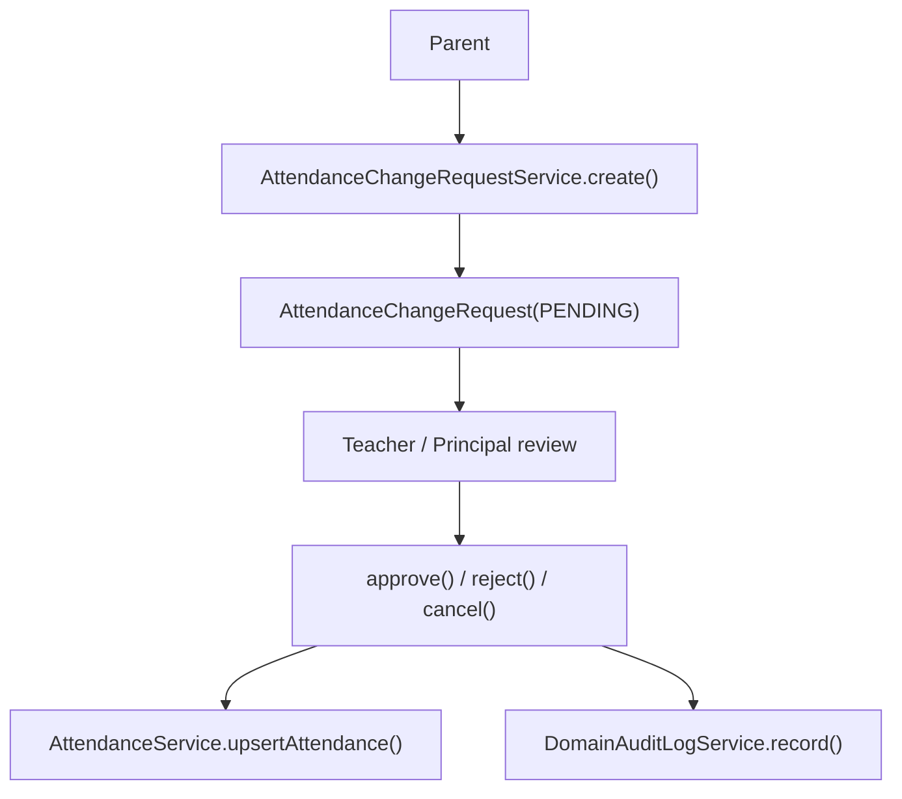
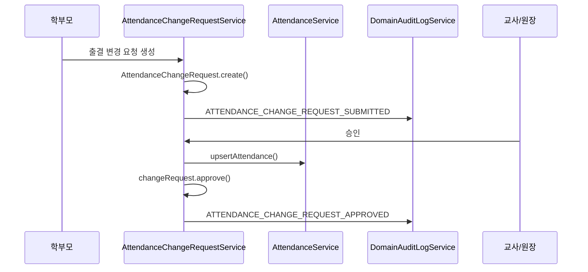

# [Spring Boot 포트폴리오] 23. 출결 변경 요청과 업무 감사 로그를 함께 설계하기

## 1. 이번 글에서 풀 문제

학부모가 출결을 수정할 수 있는 기능을 만든다고 가정해 봅시다.

가장 쉬운 구현은 이렇습니다.

- 학부모가 직접 `Attendance`를 수정

하지만 이 방식은 문제가 많습니다.

- 승인 흔적이 남지 않는다
- 누가 바꿨는지 추적하기 어렵다
- 교사/원장 검토 흐름이 없다
- 잘못 바꾸면 원본 상태가 바로 오염된다

Kindergarten ERP는 이 문제를  
`Attendance`와 `AttendanceChangeRequest`를 분리해서 풀었습니다.  
그리고 중요한 상태 변화는 `domain_audit_log`에 남기도록 설계했습니다.

## 2. 먼저 알아둘 개념

### 2-1. “최종 상태”와 “승인 전 요청”은 다른 aggregate다

- `Attendance`
  - 최종 확정된 출결 데이터
- `AttendanceChangeRequest`
  - 아직 검토 중인 요청 데이터

이 둘을 분리하면 승인 흐름을 안전하게 만들 수 있습니다.

### 2-2. 업무 감사 로그는 인증 감사 로그와 목적이 다르다

- 인증 감사 로그
  - 로그인, refresh, 소셜 연결
- 업무 감사 로그
  - 입학 승인, 출결 요청 승인, 공지 수정/삭제

즉 “누가 무엇을 했는가”라는 질문은 같지만  
보는 사람과 분석 목적이 다릅니다.

### 2-3. 감사 로그는 마지막에 덧붙이는 것이 아니라 상태 전이와 같이 가야 한다

상태 전이 직후 같은 트랜잭션에서 감사 로그를 남겨야  
증적이 비지 않습니다.

## 3. 이번 글에서 다룰 파일

```text
- src/main/java/com/erp/domain/attendance/entity/AttendanceChangeRequest.java
- src/main/java/com/erp/domain/attendance/service/AttendanceChangeRequestService.java
- src/main/java/com/erp/domain/attendance/controller/AttendanceChangeRequestController.java
- src/main/java/com/erp/domain/attendance/controller/AttendanceChangeRequestViewController.java
- src/main/resources/templates/attendance/requests.html
- src/main/java/com/erp/domain/domainaudit/entity/DomainAuditLog.java
- src/main/java/com/erp/domain/domainaudit/service/DomainAuditLogService.java
- src/main/java/com/erp/domain/domainaudit/service/DomainAuditLogQueryService.java
- src/main/java/com/erp/domain/domainaudit/controller/DomainAuditLogController.java
- src/main/java/com/erp/domain/domainaudit/controller/DomainAuditLogViewController.java
- src/main/resources/templates/domainaudit/audit-logs.html
- src/test/java/com/erp/api/AttendanceChangeRequestApiIntegrationTest.java
- src/test/java/com/erp/api/DomainAuditApiIntegrationTest.java
- docs/decisions/phase42_attendance_change_request_workflow.md
- docs/decisions/phase43_domain_audit_log.md
```

## 4. 설계 구상



핵심 기준은 아래였습니다.

1. 학부모는 최종 출결을 직접 수정하지 못한다
2. 먼저 요청 aggregate를 만든다
3. 승인 시점에만 최종 `Attendance`를 갱신한다
4. 상태 변화는 `domain_audit_log`에 함께 남긴다

## 5. 코드 설명

### 5-1. `AttendanceChangeRequest`: 요청 자체가 상태를 가진다

[AttendanceChangeRequest.java](/Users/alex/project/kindergarten_ERP/erp/src/main/java/com/erp/domain/attendance/entity/AttendanceChangeRequest.java)의 핵심 메서드는 아래입니다.

- `create(...)`
- `approve(...)`
- `reject(...)`
- `cancel()`
- `isPending()`

즉 이 엔티티는 단순 DTO 저장소가 아니라  
`PENDING -> APPROVED / REJECTED / CANCELLED` 상태 전이를 직접 갖습니다.

특히 `ensurePending()`으로  
이미 처리된 요청을 다시 처리하지 못하게 막습니다.

### 5-2. `AttendanceChangeRequestService.create(...)`: 학부모 요청 생성

[AttendanceChangeRequestService.java](/Users/alex/project/kindergarten_ERP/erp/src/main/java/com/erp/domain/attendance/service/AttendanceChangeRequestService.java)의
`create(...)`는 아래 순서로 동작합니다.

1. requester 조회
2. 학부모 역할인지 확인
3. 대상 원아 접근 권한 확인
4. 같은 날짜에 이미 pending 요청이 있는지 확인
5. `AttendanceChangeRequest.create(...)`
6. 교사/원장에게 알림
7. `domainAuditLogService.record(...)`

여기서 중요한 점은  
요청 생성과 감사 로그 기록이 같은 흐름으로 묶여 있다는 점입니다.

### 5-3. `approve(...)`: 최종 `Attendance`는 승인 시점에만 반영

이 메서드는 이 기능의 핵심입니다.

`approve(...)`는 아래를 수행합니다.

1. `findByIdForUpdate(...)`로 요청 잠금
2. reviewer 권한 검증
3. 요청 데이터를 `AttendanceRequest`로 변환
4. `attendanceService.upsertAttendance(...)` 호출
5. 생성/수정된 attendance ID 조회
6. `changeRequest.approve(...)`
7. 학부모 알림
8. 업무 감사 로그 기록

즉 승인 전까지는 확정 출결이 변하지 않습니다.

### 5-4. `reject(...)`, `cancel(...)`

`reject(...)`와 `cancel(...)`도 같은 철학을 따릅니다.

- 단순 상태값 변경이 아니라
- 권한 검증
- 상태 전이
- 감사 로그 기록

을 같이 수행합니다.

즉 “요청 처리”는 언제나 증적과 함께 갑니다.

### 5-5. `DomainAuditLog`: 업무 상태 전이 기록 전용 엔티티

[DomainAuditLog.java](/Users/alex/project/kindergarten_ERP/erp/src/main/java/com/erp/domain/domainaudit/entity/DomainAuditLog.java)는 아래 정보를 담습니다.

- `kindergartenId`
- `actorId`
- `actorName`
- `actorRole`
- `action`
- `targetType`
- `targetId`
- `summary`
- `metadataJson`

이 설계의 장점은 아래입니다.

- 사람이 읽는 요약(`summary`)
- 기계가 읽는 상세 정보(`metadataJson`)

를 동시에 가질 수 있다는 점입니다.

### 5-6. `DomainAuditLogService`: 기록은 여기서 통일

[DomainAuditLogService.java](/Users/alex/project/kindergarten_ERP/erp/src/main/java/com/erp/domain/domainaudit/service/DomainAuditLogService.java)의 핵심 메서드는 아래입니다.

- `record(...)`
- `recordSystem(...)`

`record(...)`는 사용자 행위를 기록하고,  
`recordSystem(...)`는 스케줄러 같은 시스템 행위를 기록할 때 씁니다.

예를 들어 입학 제안 만료처럼  
사람이 직접 누르지 않은 사건도 감사 로그에 남길 수 있습니다.

### 5-7. `DomainAuditLogQueryService`와 운영 화면

[DomainAuditLogQueryService.java](/Users/alex/project/kindergarten_ERP/erp/src/main/java/com/erp/domain/domainaudit/service/DomainAuditLogQueryService.java)의 핵심 메서드는 아래입니다.

- `getAuditLogsForPrincipal(...)`
- `exportAuditLogsCsvForPrincipal(...)`

[DomainAuditLogController.java](/Users/alex/project/kindergarten_ERP/erp/src/main/java/com/erp/domain/domainaudit/controller/DomainAuditLogController.java)는

- `/api/v1/domain-audit-logs`
- `/api/v1/domain-audit-logs/export`

를 제공하고,

[DomainAuditLogViewController.java](/Users/alex/project/kindergarten_ERP/erp/src/main/java/com/erp/domain/domainaudit/controller/DomainAuditLogViewController.java)와  
[audit-logs.html](/Users/alex/project/kindergarten_ERP/erp/src/main/resources/templates/domainaudit/audit-logs.html)은
원장용 운영 콘솔을 제공합니다.

즉 업무 감사 로그도 저장에서 끝나지 않고  
조회와 export까지 닫힙니다.

## 6. 실제 흐름



## 7. 테스트로 검증하기

대표 테스트는 아래입니다.

- [AttendanceChangeRequestApiIntegrationTest.java](/Users/alex/project/kindergarten_ERP/erp/src/test/java/com/erp/api/AttendanceChangeRequestApiIntegrationTest.java)
  - 학부모 요청 생성
  - 교사/원장 승인/거절
  - 권한 실패
- [DomainAuditApiIntegrationTest.java](/Users/alex/project/kindergarten_ERP/erp/src/test/java/com/erp/api/DomainAuditApiIntegrationTest.java)
  - principal 범위 조회
  - CSV export

즉 이 기능은 화면이 아니라  
상태 전이와 감사 기록을 통합 테스트로 고정합니다.

## 8. 회고

이 기능의 핵심은 출결 수정 화면이 아닙니다.  
핵심은 아래 분리입니다.

- 요청 aggregate와 확정 aggregate 분리
- 사용자 행위와 시스템 기록 분리
- 업무 감사와 인증 감사 분리

이 분리가 되어야 나중에

- 승인 정책 변경
- 알림 추가
- 관리자 조회 추가

가 훨씬 쉬워집니다.

## 9. 취업 포인트

- “학부모가 최종 `Attendance`를 직접 바꾸지 못하게 하고, 승인 전 요청 aggregate를 별도로 뒀습니다.”
- “출결 요청 승인/거절/취소를 모두 상태 전이와 감사 로그로 남겨 운영 책임 추적이 가능하게 했습니다.”
- “업무 감사 로그를 인증 감사 로그와 분리해 보안 사건과 비즈니스 사건의 조회 목적을 분명히 나눴습니다.”
