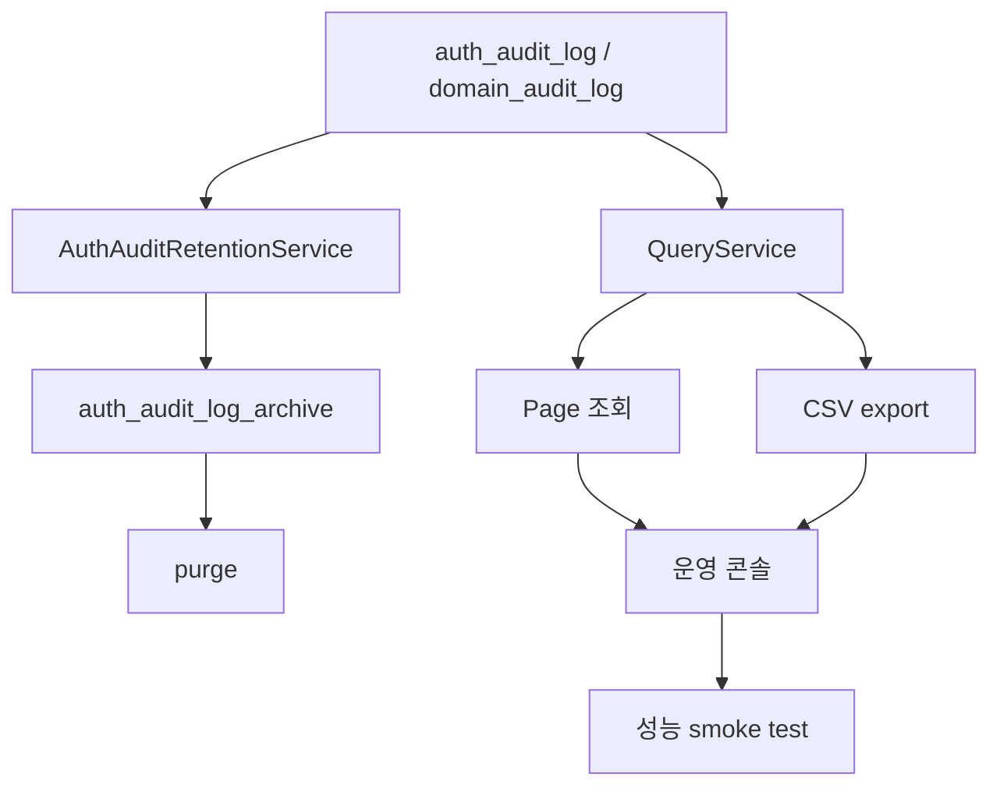
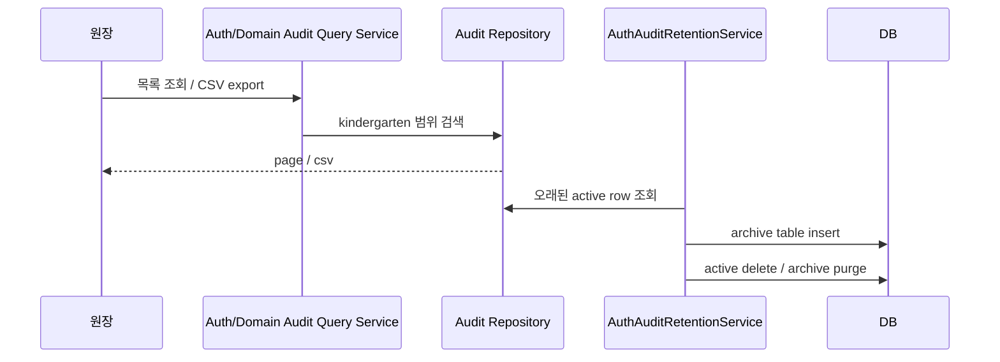

# [Spring Boot 포트폴리오] 24. 감사 로그를 운영 도구로 키우기: 조회, CSV, 보관 정책, 성능

## 1. 이번 글에서 풀 문제

감사 로그를 저장하기 시작하면 다음 질문이 바로 따라옵니다.

- 로그가 계속 쌓이면 어떻게 할까?
- 원장이 화면에서 바로 볼 수 있어야 하지 않을까?
- CSV로 export해서 외부 분석 도구에 넣을 수 있어야 하지 않을까?
- 운영 콘솔 조회가 느려지면 어떡하지?

즉 “로그를 남긴다” 다음 단계는  
**로그를 운영 도구로 쓸 수 있게 만드는 것**입니다.

Kindergarten ERP는 이 단계를 아래 네 축으로 정리했습니다.

1. auth audit / domain audit 조회 API
2. 원장용 운영 콘솔과 CSV export
3. auth audit retention / archive / purge
4. 운영 콘솔 query budget 성능 smoke

## 2. 먼저 알아둘 개념

### 2-1. 로그 저장과 로그 운영은 다른 문제다

저장은 쓰기(write) 문제이고,  
운영 도구는 읽기(read) 문제입니다.

그래서 아래를 따로 설계해야 합니다.

- 쓰기 시 어떤 값을 기록할지
- 읽기 시 어떤 조건으로 검색할지
- 오래된 데이터를 언제 정리할지

### 2-2. active log와 archive log를 나누는 이유

최근 로그는 자주 조회합니다.  
오래된 로그는 가끔만 봅니다.

둘을 같은 테이블에 계속 쌓아 두면  
활성 조회 비용이 점점 커질 수 있습니다.

그래서 이 프로젝트는 auth audit에 대해

- `auth_audit_log`
- `auth_audit_log_archive`

를 분리합니다.

### 2-3. 운영 콘솔도 성능 검증이 필요하다

초보 프로젝트는 사용자 API 성능만 보지만,  
실무에서는 관리자 화면도 중요한 운영 경로입니다.

원장이 매번 보는 감사 로그 목록/CSV export가 느리면  
그 역시 운영 문제입니다.

## 3. 이번 글에서 다룰 파일

```text
- src/main/java/com/erp/domain/authaudit/service/AuthAuditLogQueryService.java
- src/main/java/com/erp/domain/authaudit/service/AuthAuditRetentionService.java
- src/main/java/com/erp/domain/authaudit/repository/AuthAuditLogRepository.java
- src/main/java/com/erp/domain/domainaudit/service/DomainAuditLogQueryService.java
- src/main/java/com/erp/domain/domainaudit/repository/DomainAuditLogRepository.java
- src/main/java/com/erp/domain/authaudit/controller/AuthAuditLogController.java
- src/main/java/com/erp/domain/domainaudit/controller/DomainAuditLogController.java
- src/test/java/com/erp/integration/AuthAuditRetentionIntegrationTest.java
- src/test/java/com/erp/performance/AuditConsolePerformanceSmokeTest.java
- docs/decisions/phase37_auth_audit_export_alerting_dashboard.md
- docs/decisions/phase38_auth_audit_retention_and_denormalization.md
- docs/decisions/phase43_domain_audit_log.md
- docs/decisions/phase44_tagged_ci_readiness_and_hiring_pack.md
```

## 4. 설계 구상



핵심 기준은 아래였습니다.

1. 운영 조회는 tenant 범위를 빠르게 계산할 수 있어야 한다
2. export는 화면 필터와 같은 조건을 재사용해야 한다
3. auth audit는 장기 운영을 위해 archive/purge 정책을 가져야 한다
4. 운영 콘솔도 query budget을 테스트로 고정해야 한다

## 5. 코드 설명

### 5-1. `AuthAuditLogRepository`: tenant 기준 검색으로 단순화

[AuthAuditLogRepository.java](/Users/alex/project/kindergarten_ERP/erp/src/main/java/com/erp/domain/authaudit/repository/AuthAuditLogRepository.java)의 핵심 메서드는 아래입니다.

- `searchByKindergartenId(...)`
- `searchAllByKindergartenId(...)`

중요한 점은 이 repository가 더 이상  
매번 `member -> kindergarten` join으로 tenant를 계산하지 않는다는 것입니다.

그 이유는 write-time에 `kindergartenId`를 비정규화해 기록했기 때문입니다.

이 결정 덕분에 principal 조회는 아래처럼 단순해집니다.

- tenant 조건
- 이벤트 조건
- 결과 조건
- provider 조건
- 이메일 키워드
- 기간

### 5-2. `AuthAuditLogQueryService`: 목록과 export를 한 서비스에 모은다

[AuthAuditLogQueryService.java](/Users/alex/project/kindergarten_ERP/erp/src/main/java/com/erp/domain/authaudit/service/AuthAuditLogQueryService.java)의 핵심 메서드는 아래입니다.

- `getAuditLogsForPrincipal(...)`
- `exportAuditLogsCsvForPrincipal(...)`

이 서비스는 먼저 principal의 kindergarten을 확인한 뒤  
repository 검색 메서드를 호출합니다.

그리고 export에서는 `toCsv(...)`를 통해 바로 CSV 문자열을 만듭니다.

이 설계가 좋은 이유는 아래와 같습니다.

- 화면 필터와 export 조건이 어긋나지 않는다
- controller는 얇게 유지된다
- auth/domain audit 모두 비슷한 패턴으로 읽힌다

### 5-3. `DomainAuditLogQueryService`: 업무 감사 로그도 같은 운영 패턴으로

[DomainAuditLogQueryService.java](/Users/alex/project/kindergarten_ERP/erp/src/main/java/com/erp/domain/domainaudit/service/DomainAuditLogQueryService.java)도 동일한 구조를 가집니다.

- `getAuditLogsForPrincipal(...)`
- `exportAuditLogsCsvForPrincipal(...)`

즉 이 프로젝트는 auth audit와 domain audit를 목적은 분리하되,  
운영 도구 관점에서는 같은 사용성을 제공하려고 맞췄습니다.

### 5-4. `AuthAuditRetentionService`: 오래된 인증 로그를 archive로 이동

[AuthAuditRetentionService.java](/Users/alex/project/kindergarten_ERP/erp/src/main/java/com/erp/domain/authaudit/service/AuthAuditRetentionService.java)의 핵심 메서드는 아래입니다.

- `runScheduledRetention()`
- `executeRetention()`
- `archiveEligibleLogs(...)`
- `purgeArchivedLogs(...)`
- `insertArchiveRows(...)`
- `deleteRows(...)`

이 서비스는 아래 정책을 수행합니다.

1. 일정 기간이 지난 active log를 archive table로 이동
2. archive table에서 더 오래된 row를 purge

초보자가 특히 배울 포인트는 아래입니다.

- 보관 정책도 서비스로 코드화할 수 있다
- 큰 테이블을 한 번에 지우지 않고 batch 처리할 수 있다
- archive와 purge를 각각 다른 시점 기준으로 가져갈 수 있다

### 5-5. `AuthAuditRetentionIntegrationTest`: 보관 정책도 테스트한다

[AuthAuditRetentionIntegrationTest.java](/Users/alex/project/kindergarten_ERP/erp/src/test/java/com/erp/integration/AuthAuditRetentionIntegrationTest.java)는 아래를 검증합니다.

- 오래된 active row가 archive table로 이동하는가
- 오래된 archive row가 purge되는가

즉 retention은 운영 문서에만 적힌 약속이 아니라  
실제 테스트로 보장되는 정책입니다.

### 5-6. `AuditConsolePerformanceSmokeTest`: 운영 화면도 query budget을 가진다

[AuditConsolePerformanceSmokeTest.java](/Users/alex/project/kindergarten_ERP/erp/src/test/java/com/erp/performance/AuditConsolePerformanceSmokeTest.java)는
아래 두 경로를 검증합니다.

- auth audit list / export
- domain audit list / export

핵심은 “빨라야 한다”는 추상적 말이 아니라  
**예상 쿼리 예산 안에 들어오는가**를 테스트로 잡아 둔다는 점입니다.

예를 들어 auth audit list는

- principal lookup
- page query
- count query

정도의 예산 안에 있어야 한다는 기준을 둡니다.

## 6. 실제 흐름



## 7. 테스트로 검증하기

대표 테스트는 아래입니다.

- [AuthAuditRetentionIntegrationTest.java](/Users/alex/project/kindergarten_ERP/erp/src/test/java/com/erp/integration/AuthAuditRetentionIntegrationTest.java)
  - archive / purge
- [AuditConsolePerformanceSmokeTest.java](/Users/alex/project/kindergarten_ERP/erp/src/test/java/com/erp/performance/AuditConsolePerformanceSmokeTest.java)
  - auth/domain audit list/export query budget

즉 이 영역은 운영 문서를 넘어

- 데이터 lifecycle
- 운영 화면 성능

까지 테스트로 닫았습니다.

## 8. 회고

감사 로그를 운영 도구로 만들면서 느낀 점은 아래입니다.

- 로그는 오래 쌓이는 데이터라서 lifecycle이 필요하다
- 관리자 화면도 결국 제품의 일부라서 성능 검증이 필요하다
- write-time 설계와 read-time 설계는 별개로 최적화해야 한다

이 단계까지 오면 감사 로그는 더 이상 부가 기능이 아닙니다.  
서비스 운영을 설명하는 중심 축이 됩니다.

## 9. 취업 포인트

- “감사 로그를 저장하는 것에서 끝내지 않고, 조회/CSV export/보관 정책/성능 smoke까지 운영 도구로 키웠습니다.”
- “auth audit는 `kindergartenId` 비정규화와 archive table로 장기 운영 비용을 낮췄습니다.”
- “운영자 콘솔도 query budget 테스트를 붙여 사용자 API와 같은 수준으로 회귀를 관리했습니다.”

## 10. 시작 상태

- `19`, `23` 글까지 따라와서 auth audit와 domain audit가 이미 저장/조회 가능한 상태여야 합니다.
- 이 글의 목표는 **감사 로그를 저장용 테이블에서 실제 운영 도구로 끌어올리는 것**입니다.
- 핵심은 세 가지입니다.
  - principal 범위 조회 / CSV export
  - retention / archive / purge
  - 운영 콘솔 성능 smoke

## 11. 이번 글에서 바뀌는 파일

```text
- auth audit 조회 / retention:
  - src/main/java/com/erp/domain/authaudit/service/AuthAuditLogQueryService.java
  - src/main/java/com/erp/domain/authaudit/service/AuthAuditRetentionService.java
  - src/main/java/com/erp/domain/authaudit/controller/AuthAuditLogController.java
  - src/main/resources/db/migration/V11__denormalize_auth_audit_log_and_add_retention_archive.sql
- domain audit 조회:
  - src/main/java/com/erp/domain/domainaudit/service/DomainAuditLogQueryService.java
  - src/main/java/com/erp/domain/domainaudit/controller/DomainAuditLogController.java
  - src/main/java/com/erp/domain/domainaudit/controller/DomainAuditLogViewController.java
- 검증:
  - src/test/java/com/erp/api/AuthAuditApiIntegrationTest.java
  - src/test/java/com/erp/api/DomainAuditApiIntegrationTest.java
  - src/test/java/com/erp/integration/AuthAuditRetentionIntegrationTest.java
  - src/test/java/com/erp/performance/AuditConsolePerformanceSmokeTest.java
- 결정 로그:
  - docs/decisions/phase35_auth_audit_query_api.md
  - docs/decisions/phase37_auth_audit_export_alerting_dashboard.md
  - docs/decisions/phase38_auth_audit_retention_and_denormalization.md
  - docs/decisions/phase44_tagged_ci_readiness_and_hiring_pack.md
```

## 12. 구현 체크리스트

1. auth/domain audit 조회를 principal 범위로 제한하고 CSV export를 제공합니다.
2. `auth_audit_log`에 `kindergarten_id`를 비정규화해 조회 비용을 낮춥니다.
3. `AuthAuditRetentionService`로 active -> archive -> purge 정책을 구현합니다.
4. 운영 화면과 export가 큰 데이터에서도 견딜 수 있게 query budget을 정합니다.
5. `AuditConsolePerformanceSmokeTest`로 list/export 성능을 회귀 검증합니다.
6. retention과 export가 실제 운영 규칙으로 동작하는지 통합 테스트로 확인합니다.

## 13. 실행 / 검증 명령

```bash
./gradlew compileJava compileTestJava
./blog/scripts/checkpoint-24.sh
# 현재 완성 저장소 기준 안정 검증
./gradlew --no-daemon integrationTest
./gradlew --no-daemon performanceSmokeTest
```

성공하면 확인할 것:

- `checkpoint-24.sh`가 통과해 retention/export/performance 산출물이 맞는다
- 통합 스위트 안에서 `AuthAuditApiIntegrationTest`, `DomainAuditApiIntegrationTest`, `AuthAuditRetentionIntegrationTest`가 통과한다
- `performanceSmokeTest`에서 `AuditConsolePerformanceSmokeTest`가 통과한다
- 감사 로그가 조회, export, retention까지 운영 도구로 닫혀 있다

## 14. 산출물 체크리스트

- 새로 생긴 migration:
  - `V10__create_auth_audit_log.sql`
  - `V11__denormalize_auth_audit_log_and_add_retention_archive.sql`
- 새로 생긴 주요 클래스:
  - `AuthAuditLogController`
  - `AuthAuditRetentionService`
  - `AuthAuditLogQueryService`
  - `DomainAuditLogController`
  - `AuditConsolePerformanceSmokeTest`
- 대표 검증 대상:
  - `AuthAuditApiIntegrationTest`
  - `DomainAuditApiIntegrationTest`
  - `AuthAuditRetentionIntegrationTest`
  - `AuditConsolePerformanceSmokeTest`

## 15. 글 종료 체크포인트

- 감사 로그의 write 경로와 read/retention 경로를 따로 설명할 수 있다
- auth audit와 domain audit가 각각 다른 운영 질문에 답한다는 점을 설명할 수 있다
- retention 정책이 문서 약속이 아니라 테스트된 코드라는 점을 설명할 수 있다
- 운영 콘솔에도 query budget이라는 성능 기준을 둘 수 있다고 설명할 수 있다

## 16. 자주 막히는 지점

- 증상: 감사 로그 조회는 되는데 장기 운영 비용 설명이 약하다
  - 원인: 조회 API만 만들고 archive/purge lifecycle을 설계하지 않았을 수 있습니다
  - 확인할 것: `AuthAuditRetentionService.executeRetention()`, `V11__...`

- 증상: 운영 콘솔이 기능은 되는데 성능 근거가 없다
  - 원인: list/export를 운영 도구가 아닌 단순 관리자 화면으로 취급했을 수 있습니다
  - 확인할 것: `AuditConsolePerformanceSmokeTest`, 쿼리 예산 기준
