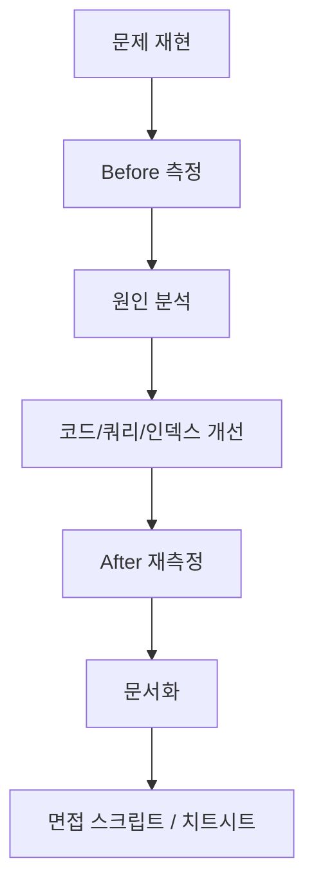
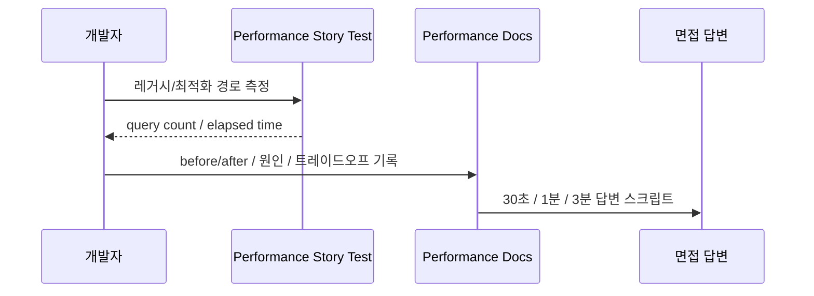

# [Spring Boot 포트폴리오] 25. 성능 개선을 코드가 아니라 스토리로 설명하는 방법

## 1. 이번 글에서 풀 문제

성능 개선은 많은 입문자에게 가장 어렵습니다.

- 뭘 측정해야 하지?
- 빨라진 걸 어떻게 증명하지?
- 캐시부터 붙이면 되는 건가?
- 면접에서는 어떤 순서로 말해야 하지?

Kindergarten ERP는 성능 개선을 단순 최적화 작업이 아니라
**포트폴리오 스토리**로 만들기 위해 별도 문서와 테스트 체계를 쌓았습니다.

핵심 메시지는 한 문장입니다.

> 처음엔 느렸고, 원인을 좁혀서, 설계를 바꿨고, 다시 측정해 실제로 빨라졌다.

## 2. 먼저 알아둘 개념

### 2-1. 성능 개선은 “기술 나열”보다 “증거 흐름”이 중요하다

면접에서 좋은 답변은 보통 아래 순서를 가집니다.

1. 문제 재현
2. 개선 전 측정
3. 원인 분석
4. 개선
5. 개선 후 재측정

이 흐름이 없으면
Redis, 인덱스, 캐시 같은 기술을 많이 써도 설득력이 떨어집니다.

### 2-2. 평균보다 상위 지연이 중요할 때가 많다

사용자는 “항상 느리다”보다
“가끔 버벅인다”를 더 많이 느낍니다.

그래서 p95, p99, query count 같은 지표가 중요합니다.

### 2-3. 성능 문서도 SSOT가 필요하다

이 프로젝트는 성능 관련 문서를 코드와 분리하지 않고
`docs/portfolio/performance`에 모아 포트폴리오 서사로 정리했습니다.

## 3. 이번 글에서 다룰 파일

```text
- src/test/java/com/erp/performance/NotepadPerformanceStoryTest.java
- src/test/java/com/erp/performance/DashboardPerformanceStoryTest.java
- docs/portfolio/performance/README.md
- docs/portfolio/performance/00-portfolio-storytelling-roadmap.md
- docs/portfolio/performance/01-baseline-measurement-report.md
- docs/portfolio/performance/03-notepad-readcount-nplusone.md
- docs/portfolio/performance/04-dashboard-stats.md
- docs/portfolio/performance/05-index-tuning-dashboard-notepad.md
- docs/portfolio/performance/20-performance-story-script.md
- docs/portfolio/performance/22-code-test-evidence-map.md
- docs/portfolio/performance/23-one-page-interview-cheatsheet.md
```

## 4. 설계 구상



핵심 기준은 아래였습니다.

1. 같은 시나리오에서 before/after를 비교한다
2. query count와 elapsed time을 함께 본다
3. 개선은 한 번에 다 하지 않고 단계별로 분리한다
4. 테스트와 문서를 1:1로 연결한다

## 5. 코드 설명

### 5-1. `NotepadPerformanceStoryTest`: N+1 제거를 숫자로 증명

[NotepadPerformanceStoryTest.java](../src/test/java/com/erp/performance/NotepadPerformanceStoryTest.java)의 핵심 메서드는 아래입니다.

- `compareLegacyVsOptimizedReadCountFlow()`
- `prepareNotepads(...)`
- `legacyLoad(...)`
- `measure(...)`

이 테스트는 같은 데이터셋을 준비한 뒤,

- 레거시 방식
- 최적화 방식

을 각각 실행하고 Hibernate statistics로 query count를 셉니다.

즉 “N+1 없앴다”는 말을 감이 아니라
**레거시 경로와 비교한 숫자**로 보여줍니다.

### 5-2. `DashboardPerformanceStoryTest`: 집계 쿼리와 캐시 무효화를 함께 본다

[DashboardPerformanceStoryTest.java](../src/test/java/com/erp/performance/DashboardPerformanceStoryTest.java)의 핵심 메서드는 아래입니다.

- `compareLegacyVsOptimizedDashboardStatistics()`
- `dashboardCacheHit_ReducesQueries()`
- `dashboardCacheEvictedOnAttendanceWrite()`
- `dashboardCacheEvictedOnAnnouncementWrite()`

이 테스트가 좋은 이유는 단순히 “조회 빨라짐”만 보지 않고,

- 레거시 vs 최적화
- cache miss vs cache hit
- 쓰기 후 cache eviction

까지 확인하기 때문입니다.

즉 성능 개선을 읽기 최적화와 쓰기 일관성까지 포함한 설계 문제로 다룹니다.

### 5-3. `measure(...)`: 반복 가능한 측정 함수 만들기

두 테스트 모두 `measure(...)` 패턴을 가집니다.

1. persistence context clear
2. statistics clear
3. 시계 시작
4. 액션 실행
5. elapsed / query count 수집

초보자가 꼭 배울 점은
측정 코드도 재현 가능해야 한다는 점입니다.

한 번 빨랐다는 경험담보다
같은 함수로 반복 측정 가능한 구조가 훨씬 좋습니다.

### 5-4. 성능 문서 폴더 자체가 포트폴리오다

[docs/portfolio/performance/README.md](../docs/portfolio/performance/README.md)는
성능 스토리의 원칙을 정의합니다.

특히 아래 순서를 고정한 점이 중요합니다.

1. 재현 시나리오 정의
2. 개선 전 측정
3. 원인 분석
4. 개선안 적용
5. 개선 후 재측정
6. 트레이드오프 정리

이 철학 아래에서

- [03-notepad-readcount-nplusone.md](../docs/portfolio/performance/03-notepad-readcount-nplusone.md)
- [04-dashboard-stats.md](../docs/portfolio/performance/04-dashboard-stats.md)
- [05-index-tuning-dashboard-notepad.md](../docs/portfolio/performance/05-index-tuning-dashboard-notepad.md)

이 단계별로 이어집니다.

### 5-5. `20-performance-story-script.md`: 면접용 답변도 미리 설계한다

[20-performance-story-script.md](../docs/portfolio/performance/20-performance-story-script.md)는
기술 설명이 아니라 실제 답변 스크립트입니다.

예를 들어 아래 숫자를 한 흐름으로 정리합니다.

- Notepad 목록: queries `22 -> 4`, elapsed `15ms -> 4ms`
- Dashboard 통계: queries `13 -> 10 -> 5`, elapsed `14ms -> 5ms -> 2~9ms`

즉 성능 개선도 결국 **설명 가능성**이 중요합니다.

### 5-6. `22-code-test-evidence-map`과 `23-one-page-interview-cheatsheet`

이 두 문서는 성능 이야기를 마무리해 줍니다.

- 코드와 테스트가 어떤 문서를 뒷받침하는지 연결
- 면접 직전에 볼 1장 요약본 제공

즉 성능 개선도 “코드만 잘 짠다”로 끝내지 않고
증거 구조까지 정리했습니다.

## 6. 실제 흐름



## 7. 테스트로 검증하기

대표 테스트는 아래입니다.

- [NotepadPerformanceStoryTest.java](../src/test/java/com/erp/performance/NotepadPerformanceStoryTest.java)
  - N+1 제거 증명
- [DashboardPerformanceStoryTest.java](../src/test/java/com/erp/performance/DashboardPerformanceStoryTest.java)
  - 집계 쿼리, 캐시, 무효화, 인덱스 효과 검증

그리고 문서 쪽에서는

- baseline
- 개선 단계
- 스크립트
- 치트시트

까지 이어져 있습니다.

즉 성능은 “테스트만 있음”도 아니고 “문서만 있음”도 아닙니다.
둘이 함께 있어야 포트폴리오가 됩니다.

## 8. 회고

이 프로젝트에서 성능 개선은 기술보다 순서가 더 중요했습니다.

- 캐시부터 붙이지 않기
- 먼저 N+1 제거
- 그다음 집계 쿼리 전환
- 마지막에 인덱스 튜닝

이 순서로 가야 각 단계의 효과를 분리해서 설명할 수 있습니다.

그리고 바로 그 점이 면접에서 큰 차이를 만듭니다.

## 9. 취업 포인트

- “성능 개선을 한 번의 대수술이 아니라, 재현 -> 측정 -> 개선 -> 재측정의 반복 가능한 프로세스로 진행했습니다.”
- “`NotepadPerformanceStoryTest`, `DashboardPerformanceStoryTest`로 before/after를 코드 수준에서 증명했습니다.”
- “성능 결과를 성능 문서, 면접 스크립트, 치트시트까지 연결해 포트폴리오 스토리로 압축했습니다.”

## 10. 시작 상태

- 기능, 보안, 테스트, 운영성까지 어느 정도 올라온 뒤에 이 글을 읽는 것이 맞습니다.
- 이 글의 목표는 **성능 개선을 단일 팁 모음이 아니라 재현 가능한 포트폴리오 서사로 정리하는 것**입니다.
- 따라서 출발점은 “느린 곳이 있다”가 아니라 아래 절차를 코드와 문서로 같이 갖추는 것입니다.
  - 재현 시나리오
  - 개선 전 수치
  - 개선 후 수치
  - 트레이드오프 설명

## 11. 이번 글에서 바뀌는 파일

```text
- 성능 테스트:
  - src/test/java/com/erp/performance/NotepadPerformanceStoryTest.java
  - src/test/java/com/erp/performance/DashboardPerformanceStoryTest.java
- 성능 문서:
  - docs/portfolio/performance/03-notepad-readcount-nplusone.md
  - docs/portfolio/performance/04-dashboard-stats.md
  - docs/portfolio/performance/05-index-tuning-dashboard-notepad.md
  - docs/portfolio/performance/20-performance-story-script.md
  - docs/portfolio/performance/22-code-test-evidence-map.md
  - docs/portfolio/performance/23-one-page-interview-cheatsheet.md
```

## 12. 구현 체크리스트

1. 느린 시나리오를 테스트로 재현합니다.
2. 개선 전 쿼리 수와 응답 시간을 남깁니다.
3. N+1 제거, 집계 쿼리 개선, 캐시, 인덱스를 순서대로 적용합니다.
4. 동일 시나리오로 개선 후 수치를 다시 측정합니다.
5. 문서에 before/after, 원인, 선택 이유, 트레이드오프를 남깁니다.
6. 면접용 스크립트와 치트시트까지 연결해 설명 경로를 만듭니다.

## 13. 실행 / 검증 명령

```bash
./gradlew compileJava compileTestJava
./gradlew --no-daemon performanceSmokeTest
```

성공하면 확인할 것:

- `performanceSmokeTest` 안에서 `NotepadPerformanceStoryTest`, `DashboardPerformanceStoryTest`가 통과한다
- 느린 시나리오와 개선 후 수치를 코드와 문서 양쪽에서 설명할 수 있다
- 성능 결과가 면접 답변 자료까지 이어진다

## 14. 산출물 체크리스트

- `NotepadPerformanceStoryTest`, `DashboardPerformanceStoryTest`가 존재한다
- 성능 개선 근거 문서가 `docs/portfolio/performance/` 아래에 정리돼 있다
- before/after 수치와 트레이드오프를 담은 면접용 스크립트가 있다
- `performanceSmokeTest` task가 실제로 성능 스토리 검증을 묶는다

## 15. 글 종료 체크포인트

- 성능 개선을 “기술 목록”이 아니라 “재현 가능한 프로세스”로 설명할 수 있다
- before/after 수치가 코드 테스트와 문서에 동시에 남아 있다
- 왜 N+1 제거 -> 집계 쿼리 -> 캐시/인덱스 순서였는지 설명할 수 있다
- 면접에서 30초/1분/3분 버전으로 같은 이야기를 압축해 말할 수 있다

## 16. 자주 막히는 지점

- 증상: 성능 개선은 했는데 무엇이 얼마나 좋아졌는지 말하기 어렵다
  - 원인: baseline 없이 최적화부터 적용했을 수 있습니다
  - 확인할 것: performance story test의 before/after 기록, 성능 문서의 숫자

- 증상: 캐시를 넣었는데 설명이 오히려 불안하다
  - 원인: N+1이나 집계 쿼리 문제를 먼저 해결하지 않고 캐시부터 붙였을 수 있습니다
  - 확인할 것: 문서에 적힌 개선 순서와 실제 코드 변경 순서
