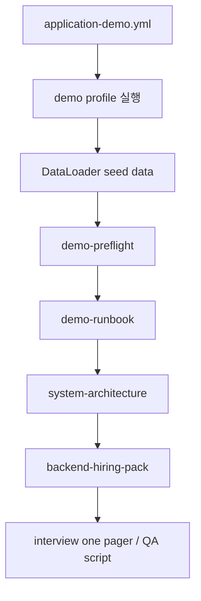
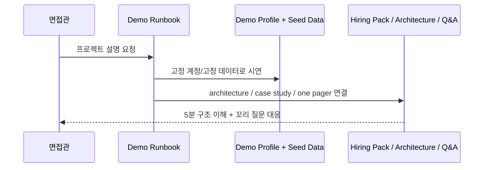

# [Spring Boot 포트폴리오] 26. 데모, 아키텍처, 면접 패키지까지 묶어 프로젝트를 완성하기

## 1. 이번 글에서 풀 문제

좋은 프로젝트를 만드는 것과
좋은 프로젝트를 **보여 주는 것**은 다릅니다.

실제로 취업 준비에서는 아래 문제가 자주 생깁니다.

- 코드와 기능은 많은데 어디부터 보여줘야 할지 모른다
- 시연 당일 어떤 계정으로 무엇을 눌러야 할지 헷갈린다
- 아키텍처 설명이 길어지고 산만해진다
- 면접 질문에 답할 때 자료가 흩어져 있다

Kindergarten ERP는 마지막 단계에서 이 문제를
별도 문서 패키지로 정리했습니다.

- demo profile
- demo seed data
- architecture SSOT
- hiring pack
- interview one pager / Q&A

즉 프로젝트를 **개발**하는 단계에서 끝내지 않고,
**전달 가능한 포트폴리오**로 마무리했습니다.

## 2. 먼저 알아둘 개념

### 2-1. 데모는 실행 환경이 고정돼야 한다

면접 자리에서 “로컬에서 잘 됐는데요”는 거의 의미가 없습니다.

데모는 아래가 고정돼야 합니다.

- 어떤 profile로 실행하는가
- 어떤 계정으로 로그인하는가
- 어떤 화면을 어떤 순서로 보여줄 것인가

### 2-2. 아키텍처 문서는 길게 쓰는 것보다 진입점이 중요하다

면접관이 모든 phase 문서를 순서대로 읽지는 않습니다.
그래서 “지금 이 프로젝트를 5분 안에 이해하려면 무엇부터 읽어야 하는가”를 설계해야 합니다.

### 2-3. 포트폴리오 문서도 SSOT가 필요하다

문서가 많을수록 오히려 혼란이 생길 수 있습니다.
그래서 active 문서 묶음이 필요합니다.

## 3. 이번 글에서 다룰 파일

```text
- src/main/resources/application-demo.yml
- src/main/java/com/erp/global/config/DataLoader.java
- docs/portfolio/demo/demo-preflight.md
- docs/portfolio/demo/demo-runbook.md
- docs/portfolio/architecture/system-architecture.md
- docs/portfolio/hiring-pack/backend-hiring-pack.md
- docs/portfolio/interview/interview_one_pager.md
- docs/portfolio/interview/interview_qa_script.md
- docs/portfolio/case-studies/auth-incident-response.md
- docs/decisions/phase36_api_contract_observability_demo.md
- docs/decisions/phase44_tagged_ci_readiness_and_hiring_pack.md
```

## 4. 설계 구상



핵심 기준은 아래였습니다.

1. 데모 시작 명령과 계정을 고정한다
2. 시연 전 체크리스트와 실제 시연 순서를 분리한다
3. 아키텍처 문서는 현재 기준 SSOT로 압축한다
4. 채용 담당자가 읽을 문서 순서를 직접 설계한다

## 5. 코드와 문서 설명

### 5-1. `application-demo.yml`: 데모 전용 시작점을 만든다

[application-demo.yml](../src/main/resources/application-demo.yml)은
아주 크지 않은 파일이지만 역할이 중요합니다.

여기서 데모 모드에 필요한 설정을 분리해
아래 실행 명령을 고정합니다.

```bash
./gradlew bootRun --args='--spring.profiles.active=demo'
```

즉 면접 시연 시작점을
개발용 `local`과 구분된 하나의 이름으로 만들었습니다.

### 5-2. `DataLoader`: 데모를 위한 실제 데이터 준비

[DataLoader.java](../src/main/java/com/erp/global/config/DataLoader.java)는
`local` profile에서 시드 데이터를 넣습니다.

`demo` profile은 `local` 그룹을 포함하므로, 실제 시연에서도 같은 시드 데이터를 그대로 사용합니다.

이 파일에서 중요한 메서드는 아래입니다.

- `run(...)`
- `createKindergarten(...)`
- `createMember(...)`
- `createClassroom(...)`
- `createKidsForClassroom(...)`
- `createAttendance(...)`
- `createNotepad(...)`
- `createAnnouncement(...)`
- `createAuthAuditLog(...)`

초보자가 꼭 봐야 할 점은
더미 데이터도 그냥 무작위가 아니라 **시연 시나리오를 위해 설계된 데이터**라는 점입니다.

예를 들어 이 시드 데이터는 아래를 바로 보여줄 수 있게 돕습니다.

- principal / teacher / parent 계정
- 출석 데이터
- 알림장 / 공지
- 인증 감사 로그

실제로 바로 써야 하는 계정은 아래처럼 고정해 두는 편이 좋습니다.

- principal: `principal@test.com / test1234!`
- teacher: `teacher1@test.com / test1234!`
- parent: `parent1@test.com / test1234!`

즉 demo 데이터는 테스트 편의가 아니라
프로젝트 설명력을 위한 자산입니다.

### 5-3. `demo-preflight.md`: 시연 직전 체크리스트

[demo-preflight.md](../docs/portfolio/demo/demo-preflight.md)는
시연 직전에 확인해야 할 것을 정리합니다.

- Docker 실행 여부
- 앱 실행 명령
- 접속 주소
- 데모 계정
- 반드시 확인할 데이터
- 실패 시 백업 플랜

이 문서가 중요한 이유는
시연 실패 확률을 줄여 주기 때문입니다.

### 5-4. `demo-runbook.md`: 실제 5분 시연 순서를 고정한다

[demo-runbook.md](../docs/portfolio/demo/demo-runbook.md)는
아래 순서를 제안합니다.

1. Swagger/OpenAPI
2. 별도 브라우저나 시크릿 창의 parent 계정으로 요청 하나 생성
3. principal 계정으로 `/applications/pending`, `/attendance-requests`에서 승인 흐름 시연
4. `/domain-audit-logs`, `/audit-logs`에서 증적 확인
5. readiness, Prometheus, Grafana, CI

즉 무엇을 먼저 보여줄지까지 설계합니다.

이렇게 하면 면접 자리에서 생각보다 훨씬 침착하게 설명할 수 있습니다.

### 5-5. `system-architecture.md`: 현재 프로젝트를 한 장으로 설명하는 SSOT

[system-architecture.md](../docs/portfolio/architecture/system-architecture.md)는
이 프로젝트의 현재 아키텍처를 압축한 문서입니다.

여기서 특히 좋은 점은

- Security layer
- Domain services
- MySQL / Redis
- Outbox
- Audit
- Prometheus / Grafana

를 한 장에서 보여준다는 점입니다.

즉 기능 목록보다 구조 이야기를 먼저 시작할 수 있습니다.

### 5-6. `backend-hiring-pack.md`: 채용 담당자를 위한 시작 문서

[backend-hiring-pack.md](../docs/portfolio/hiring-pack/backend-hiring-pack.md)는
“이 프로젝트를 왜 봐야 하는가”부터 시작합니다.

그리고 아래 문서 순서를 안내합니다.

1. 시스템 아키텍처
2. 데모 preflight
3. 데모 runbook
4. auth incident case study
5. interview one pager

이 문서가 중요한 이유는
문서가 많아졌을 때 **읽는 순서 자체를 설계**했기 때문입니다.

### 5-7. `interview_one_pager`와 `interview_qa_script`

[interview_one_pager.md](../docs/portfolio/interview/interview_one_pager.md)는
핵심 역량을 한 장으로 압축합니다.

[interview_qa_script.md](../docs/portfolio/interview/interview_qa_script.md)는
예상 질문에 대한 짧은 답변과 꼬리 질문 포인트를 정리합니다.

즉,

- 소개 자료
- 상세 답변 자료

를 각각 따로 둡니다.

### 5-8. `auth-incident-response.md`: 대표 사례 하나를 깊게 설명한다

[auth-incident-response.md](../docs/portfolio/case-studies/auth-incident-response.md)는
보안 사건 하나를 케이스 스터디로 묶습니다.

이 문서가 좋은 이유는
여러 기능을 흩어 설명하지 않고,

- 로그인 실패 기록
- anomaly 탐지
- 알림
- outbox
- 메트릭
- 콘솔 조회

를 하나의 이야기로 연결해 주기 때문입니다.

## 6. 실제 흐름



## 7. 테스트로 검증하기

이 글은 직접적인 단위 테스트보다
“문서와 실행 환경이 실제 코드와 맞는가”를 중요하게 봅니다.

그래도 코드 근거는 분명합니다.

- `application-demo.yml`
- `DataLoader`
- Swagger/OpenAPI 경로
- audit console 경로
- health/readiness 경로

즉 문서가 코드와 동떨어진 슬라이드가 아니라
실행 가능한 시스템 위에 서 있습니다.

## 8. 회고

많은 개인 프로젝트가 여기서 멈춥니다.

- 코드 있음
- 기능 있음
- 테스트 조금 있음

하지만 취업용 포트폴리오는 그 다음 단계가 더 중요합니다.

- 어떻게 실행할 것인가
- 어떤 순서로 보여줄 것인가
- 어떤 문서를 먼저 읽게 할 것인가
- 어떤 질문에 어떻게 답할 것인가

이 단계까지 가야 비로소
프로젝트가 “개발 결과물”에서 “전달 가능한 포트폴리오”로 바뀝니다.

## 9. 취업 포인트

- “`demo` profile, seed data, preflight, runbook을 분리해 시연 실패 확률을 낮췄습니다.”
- “아키텍처 SSOT, hiring pack, interview one pager, Q&A 스크립트까지 만들어 설명 경로를 설계했습니다.”
- “코드 작성에서 끝나지 않고, 면접관이 이해하는 순서까지 설계한 것이 이 프로젝트 마감 단계의 핵심입니다.”

## 10. 시작 상태

- 기능과 운영 문서가 충분히 쌓인 뒤에야 이 글이 의미가 있습니다.
- 이 글의 목표는 **프로젝트를 잘 만드는 것에서 끝나지 않고, 면접관이 이해하기 쉬운 순서로 전달하는 것**입니다.
- 따라서 코드를 더 쓰기보다, 실행 환경과 설명 경로를 같이 정리합니다.

## 11. 이번 글에서 바뀌는 파일

```text
- demo 실행 환경:
  - src/main/resources/application-demo.yml
  - src/main/java/com/erp/global/config/DataLoader.java
- 인터뷰 / 아키텍처 문서:
  - docs/portfolio/architecture/system-architecture.md
  - docs/portfolio/hiring-pack/backend-hiring-pack.md
  - docs/portfolio/demo/demo-preflight.md
  - docs/portfolio/demo/demo-runbook.md
  - docs/portfolio/interview/interview_one_pager.md
  - docs/portfolio/interview/interview_qa_script.md
  - docs/portfolio/case-studies/auth-incident-response.md
- 관련 코드 근거:
  - src/main/java/com/erp/global/config/OpenApiConfig.java
  - src/main/java/com/erp/global/monitoring/CriticalDependenciesHealthIndicator.java
```

## 12. 구현 체크리스트

1. `demo` profile과 seed data를 고정해 시연 시나리오를 재현 가능하게 만듭니다.
2. preflight 문서로 Docker, 계정, URL, 점검 순서를 정리합니다.
3. runbook에 실제 시연 순서와 화면 전환 순서를 적습니다.
4. architecture 문서와 hiring pack으로 읽기 시작점을 만듭니다.
5. interview one pager와 Q&A script로 예상 질문 대응 자료를 만듭니다.
6. 대표 사례 문서(`auth-incident-response`)로 여러 기능을 하나의 이야기로 묶습니다.

## 13. 실행 / 검증 명령

```bash
docker compose -f docker/docker-compose.yml up -d
./gradlew compileJava compileTestJava
./blog/scripts/checkpoint-26.sh
./gradlew --no-daemon integrationTest
./gradlew bootRun --args='--spring.profiles.active=demo'
```

수동으로 확인할 것:

- `principal@test.com / test1234!`로 로그인 후 `/swagger-ui.html`
- `teacher1@test.com / test1234!` 또는 `parent1@test.com / test1234!` 계정 로그인 가능 여부
- `/applications/pending`
- `/attendance-requests`
- `/domain-audit-logs`
- `/audit-logs`
- `/actuator/health/readiness`

시연 종료 후 정리:

```bash
# 앱 실행 터미널에서
Ctrl+C

# Docker 정리
docker compose -f docker/docker-compose.yml down
docker compose -f docker/docker-compose.monitoring.yml down
```

## 14. 산출물 체크리스트

- 새로 생긴 설정/시드:
  - `application-demo.yml`
  - `DataLoader`
- 새로 생긴 문서:
  - `demo-preflight.md`
  - `demo-runbook.md`
  - `system-architecture.md`
  - `backend-hiring-pack.md`
  - `interview_one_pager.md`
  - `interview_qa_script.md`
  - `auth-incident-response.md`
- 대표 수동 검증 대상:
  - `/swagger-ui.html`
  - `/applications/pending`
  - `/attendance-requests`
  - `/domain-audit-logs`
  - `/audit-logs`
  - `/actuator/health/readiness`

## 15. 글 종료 체크포인트

- demo profile과 seed data로 시연 재현성을 확보했다
- 아키텍처 문서와 hiring pack이 읽기 시작점을 제공한다
- interview one pager와 Q&A script가 꼬리 질문 대응 자료로 이어진다
- “무엇을 만들었는가”뿐 아니라 “어떤 순서로 보여줄 것인가”까지 설계했다고 설명할 수 있다

## 16. 자주 막히는 지점

- 증상: 데모 문서는 있는데 실제 화면과 계정이 자주 어긋난다
  - 원인: demo profile, seed data, runbook을 따로 관리하지 않았을 수 있습니다
  - 확인할 것: `application-demo.yml`, `DataLoader`, `demo-preflight.md`, `demo-runbook.md`

- 증상: 문서는 많은데 면접관이 어디부터 읽어야 할지 모른다
  - 원인: architecture SSOT와 hiring pack 같은 시작점 문서가 없을 수 있습니다
  - 확인할 것: `system-architecture.md`, `backend-hiring-pack.md`, `interview_one_pager.md`
