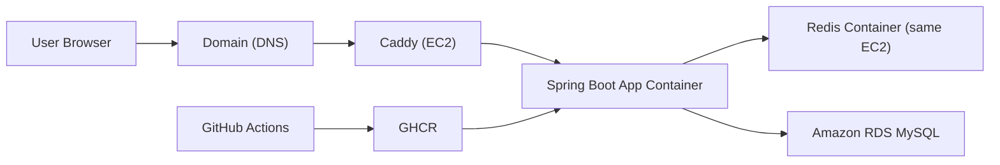

# Kindergarten ERP 배포 가이드

이 문서는 **초보자도 이 파일 하나만 보고** Kindergarten ERP를 실제 인터넷에 배포할 수 있도록 정리한 배포 SSOT입니다.

기준일: **2026-03-30 (KST)**

이 문서가 다루는 범위는 아래와 같습니다.

- 어떤 배포 방식을 선택할지
- 왜 그 방식이 스프링부트 백엔드 취업 포트폴리오에 유리한지
- 계정 생성부터 첫 배포까지의 순서
- AWS, GitHub, Google, Kakao에서 무엇을 설정해야 하는지
- 배포 후 점검, 운영, 백업, 롤백 방법
- 시나리오별 비용 추정

이 프로젝트의 현재 운영 전제는 아래 문서/설정을 따릅니다.

- `prod`는 fail-closed 입니다.
- `SPRING_PROFILES_ACTIVE`를 명시하지 않으면 부팅을 허용하지 않습니다.
- Swagger/OpenAPI는 `prod`에서 닫혀 있어야 합니다.
- JWT 쿠키는 `prod`에서 `secure=true` 입니다.
- Redis는 인증의 critical dependency 입니다.

관련 SSOT:

- [환경 변수 계약](./env-contract.md)
- [개발자 가이드](./developer-guide.md)
- [프로덕션 설정](../../src/main/resources/application-prod.yml)
- [공통 설정](../../src/main/resources/application.yml)
- [CI](../../.github/workflows/ci.yml)

---

## 1. 결론부터: 어떤 방식으로 배포할까

이 프로젝트에는 아래 구성이 가장 적합합니다.

**추천안**

- 앱 서버: `AWS EC2 t4g.small`
- DB: `Amazon RDS MySQL db.t4g.micro`
- Redis: `EC2 내부 Docker 컨테이너`
- 리버스 프록시/HTTPS: `Caddy`
- 자동 배포: `GitHub Actions -> GHCR -> EC2 SSH 배포`

이 구성을 추천하는 이유는 단순합니다.

1. **취업 관점에서 설명할 포인트가 많습니다.**
   - EC2
   - RDS
   - reverse proxy
   - HTTPS/TLS
   - private DB access
   - CI/CD
   - health/readiness
   - rollback

2. **비용이 과하지 않습니다.**
   - Redis를 ElastiCache로 분리하지 않고 EC2 내부에 두면 월 비용을 많이 줄일 수 있습니다.

3. **현재 저장소와 잘 맞습니다.**
   - 이미 `prod` profile, Flyway, Docker Compose, health/readiness, split CI가 준비되어 있습니다.

4. **초보자도 구현 가능한 수준입니다.**
   - Kubernetes/ECS/EKS 없이도 충분히 “운영형 백엔드 포트폴리오”로 보입니다.

---

## 2. 왜 이 방식이 취업에 유리한가

면접관 입장에서 좋은 포인트는 “어떤 기술을 썼는가”보다 “왜 그 구성을 골랐고 어떤 트레이드오프를 관리했는가”입니다.

이 배포 방식은 아래 질문에 답하기 좋습니다.

- 왜 앱과 DB를 분리했나요?
- 왜 Redis는 managed가 아니라 self-host 했나요?
- 왜 `prod`에서 Swagger를 닫았나요?
- health/readiness는 어떻게 나눴나요?
- Flyway 마이그레이션이 배포에 어떤 영향을 주나요?
- 배포 실패 시 롤백은 어떻게 하나요?
- 운영 비용을 어떻게 통제했나요?

이 프로젝트는 원래부터 아래 운영형 포인트가 강점입니다.

- JWT cookie + Redis 세션/refresh 관리
- audit log
- notification outbox
- readiness + critical dependencies
- Testcontainers 기반 통합 테스트
- GitHub Actions split CI

즉, 배포도 “그냥 URL 하나 띄운 프로젝트”가 아니라 **운영을 의식한 백엔드 포트폴리오**로 정리하는 것이 맞습니다.

---

## 3. 이번 가이드의 목표 아키텍처



핵심 원칙은 아래와 같습니다.

- 외부 공개 포트는 `80`, `443`만 엽니다.
- Spring Boot `8080`, management `9091`, Redis `6379`, MySQL `3306`은 인터넷에 직접 노출하지 않습니다.
- DB는 RDS로 분리합니다.
- Redis는 비용 절감을 위해 앱 서버 내부에 둡니다.
- TLS 종료는 Caddy가 맡습니다.
- 배포는 GitHub Actions가 Docker 이미지를 빌드해 GHCR에 올리고, EC2가 그 이미지를 pull해서 재기동합니다.

---

## 4. 시나리오별 비용 예상

아래 비용은 **서울 리전(ap-northeast-2)**, **730시간/월**, **부가세/도메인 비용 제외**, **2026-03-30 기준 공식 가격/공식 가격 파일 기준 추정**입니다.

### 4.1 추천안 비용

| 구성 | 금액(월) | 설명 |
|---|---:|---|
| EC2 `t4g.small` | 약 `$15.18` | 앱 + Redis + Caddy 실행 |
| RDS MySQL `db.t4g.micro` | 약 `$18.25` | 운영 DB |
| RDS 스토리지 `20GB` | 약 `$2.62` | gp 계열 스토리지 추정 |
| 합계 | **약 `$36.05`** | 가장 추천 |

이 구성이 가장 균형이 좋습니다.

- 앱은 EC2 한 대에서 충분히 시작 가능
- DB는 managed라서 백업/복구 부담 감소
- Redis는 self-host로 비용 절감

### 4.2 더 싼 학습용/데모용

| 구성 | 금액(월) | 설명 |
|---|---:|---|
| Lightsail `2GB` | `$12` | 앱 + MySQL + Redis를 한 서버에 모두 올리는 최소안 |
| Lightsail `4GB` | `$24` | 데모 안정성을 더 높인 버전 |

이 방식은 가장 싸지만, 아래 단점이 큽니다.

- 앱/DB/Redis가 한 서버에 모두 들어감
- 장애가 나면 전부 같이 죽음
- 면접에서 “운영 분리” 포인트가 약함

즉, **학습용/임시 시연용**으로는 괜찮지만, **취업 포트폴리오 주력 배포**로는 추천하지 않습니다.

### 4.3 운영 편의성을 더 높인 버전

| 구성 | 금액(월) | 설명 |
|---|---:|---|
| 추천안 합계 | `$36.05` | 기준 |
| ElastiCache `cache.t4g.micro` 추가 | `+$17.52` | Redis managed 전환 |
| 합계 | **약 `$53.57`** | 운영성은 좋아지지만 비쌈 |

이 버전은 Redis까지 managed로 올려서 운영은 편해집니다. 대신 포트폴리오 초기 단계에서는 비용이 꽤 올라갑니다.

### 4.4 면접에서 말하기 좋은 비용 멘트

`처음에는 EC2 + RDS + self-host Redis로 월 36달러 수준에서 운영했고, Redis managed 전환 시 약 54달러까지 올라가는 걸 계산해 비용과 운영성의 균형을 선택했습니다.`

### 4.5 도메인 비용

도메인은 별도입니다.

- 보통 연 `$10 ~ $20` 수준이 일반적입니다.
- 이 문서에서는 특정 등록업체를 추천하지 않습니다.

중요한 점은 하나입니다.

- **`prod`는 secure cookie를 사용하므로, 실제 운영 배포에는 HTTPS 가능한 도메인이 사실상 필수입니다.**

---

## 5. 시작하기 전에 알아둘 사실

이 저장소는 아래까지는 이미 준비돼 있습니다.

- `prod` profile
- Flyway migration
- Docker Compose 기반 로컬 인프라
- monitoring overlay
- GitHub Actions CI

이번 작업 기준으로 아래 배포 자산은 저장소에 이미 포함되어 있습니다.

- 루트 `Dockerfile`
- 루트 `.dockerignore`
- `deploy/docker-compose.prod.yml`
- `deploy/Caddyfile`
- `deploy/.env.prod.example`
- `.github/workflows/cd.yml`

그래서 이 문서는 아래 두 가지 역할을 같이 합니다.

1. 배포 절차 가이드
2. 저장소에 포함된 배포 파일 설명

---

## 6. 전체 순서 한눈에 보기

1. GitHub 저장소와 브랜치 상태를 정리한다.
2. AWS 계정을 만들고 보안 기본 설정을 끝낸다.
3. 도메인을 준비한다.
4. Google/Kakao OAuth 앱을 만든다.
5. AWS에 EC2와 RDS를 만든다.
6. EC2에 Docker와 Compose를 설치한다.
7. 운영용 환경 파일과 Compose 파일을 올린다.
8. GHCR에 이미지를 올릴 수 있게 GitHub Actions를 설정한다.
9. 첫 배포를 실행한다.
10. health/readiness, 로그인, OAuth, DB 연결을 검증한다.
11. 운영 체크리스트와 백업/롤백 절차를 정리한다.

---

## 7. 계정 생성과 사전 준비

### 7.1 GitHub

준비할 것:

- GitHub 계정
- 이 저장소를 올릴 GitHub repository
- GitHub Actions 사용 가능 상태

확인할 것:

- `main` 브랜치 기준 CI가 깨지지 않아야 합니다.
- 배포는 `main` push 기준으로 거는 것이 가장 단순합니다.

### 7.2 AWS

AWS에서는 아래를 순서대로 합니다.

1. AWS root 계정을 만듭니다.
2. root에 MFA를 반드시 켭니다.
3. Billing 예산 알림을 먼저 만듭니다.
4. IAM 관리자 사용자를 따로 만듭니다.
5. 이후 작업은 root 대신 IAM 사용자로 합니다.

초보자 기준 최소 권장값:

- 예산 알림: `USD 20`, `USD 40`, `USD 60`
- 리전: `ap-northeast-2 (Seoul)` 고정

왜 서울 리전을 추천하나:

- 한국 사용자 시연에 유리
- latency 설명이 쉽다
- 면접 데모에서도 자연스럽다

### 7.3 도메인

도메인은 반드시 준비하는 것을 권장합니다.

이유:

- `prod`는 secure cookie 사용
- Google/Kakao OAuth redirect URI 설정 필요
- Caddy 자동 HTTPS 발급 필요

예시:

- `erp.yourdomain.com`
- `kindergarten-erp.yourdomain.com`

이 문서에서는 예시 도메인을 아래처럼 쓰겠습니다.

- `erp.example.com`

### 7.4 Google OAuth

이 프로젝트는 `prod`에서 아래 값이 필요합니다.

- `GOOGLE_CLIENT_ID`
- `GOOGLE_CLIENT_SECRET`

Google 쪽에서 반드시 맞춰야 할 값:

- Authorized redirect URI:
  - `https://erp.example.com/login/oauth2/code/google`
- Authorized JavaScript origin:
  - `https://erp.example.com`

### 7.5 Kakao OAuth

이 프로젝트는 `prod`에서 아래 값이 필요합니다.

- `KAKAO_CLIENT_ID`
- `KAKAO_CLIENT_SECRET`

Kakao 쪽에서 반드시 맞춰야 할 값:

- Redirect URI:
  - `https://erp.example.com/login/oauth2/code/kakao`
- 사이트 도메인:
  - `https://erp.example.com`

---

## 8. AWS에서 무엇을 만들 것인가

이번 가이드에서 만들 리소스는 아래와 같습니다.

| 리소스 | 이름 예시 | 목적 |
|---|---|---|
| EC2 | `erp-prod-ec2` | 앱 서버 |
| Elastic IP | `erp-prod-eip` | 고정 공인 IP |
| Security Group | `erp-prod-ec2-sg` | EC2 인바운드 제어 |
| RDS MySQL | `erp-prod-db` | 운영 DB |
| Security Group | `erp-prod-rds-sg` | RDS 접근 제어 |

---

## 9. AWS 리소스 생성 가이드

### 9.1 EC2 Security Group 만들기

이름:

- `erp-prod-ec2-sg`

인바운드 규칙:

| 포트 | 소스 | 이유 |
|---|---|---|
| `22` | 내 현재 공인 IP | SSH 접속 |
| `80` | `0.0.0.0/0` | HTTP -> HTTPS 리디렉션 및 인증서 발급 |
| `443` | `0.0.0.0/0` | HTTPS 서비스 |

열지 말아야 하는 포트:

- `8080`
- `9091`
- `6379`
- `3306`

### 9.2 RDS Security Group 만들기

이름:

- `erp-prod-rds-sg`

인바운드 규칙:

| 포트 | 소스 | 이유 |
|---|---|---|
| `3306` | `erp-prod-ec2-sg` | EC2에서만 MySQL 접속 허용 |

포인트:

- IP가 아니라 **EC2 Security Group**을 source로 거는 것이 맞습니다.

### 9.3 EC2 만들기

권장 스펙:

- 인스턴스 타입: `t4g.small`
- OS: `Ubuntu 24.04 LTS ARM64`
- 스토리지: `30GB gp3`
- 보안 그룹: `erp-prod-ec2-sg`

왜 ARM64를 추천하나:

- Graviton이 가격 대비 효율이 좋습니다.
- Java 21, Redis, Caddy, 공식 Docker 이미지 대부분이 ARM64를 지원합니다.

주의:

- ARM이 불안하면 x86 계열로 바꿀 수 있습니다.
- 다만 비용이 더 올라갈 수 있습니다.

인스턴스 생성 시 같이 할 일:

- key pair 생성 후 `.pem` 다운로드
- Elastic IP 생성 후 EC2에 연결

Elastic IP를 쓰는 이유:

- 재부팅/재생성 후에도 DNS를 안정적으로 유지하기 쉽습니다.

### 9.4 RDS MySQL 만들기

권장 스펙:

- 엔진: `MySQL`
- 템플릿: `Free tier`가 아니라도 괜찮음, 대신 수동으로 아래 값 맞춤
- 인스턴스 클래스: `db.t4g.micro`
- 스토리지: `20GB`
- 배포 옵션: `Single-AZ`
- Public access: `No`
- VPC: EC2와 같은 VPC
- Security Group: `erp-prod-rds-sg`

생성 시 입력할 값 예시:

- DB identifier: `erp-prod-db`
- initial DB name: `erp_db`
- master username: `erpadmin`
- master password: 강한 비밀번호

권장 운영 옵션:

- automated backup: `7 days`
- minor version auto upgrade: `on`
- deletion protection: `on`

RDS가 생성되면 아래를 기록합니다.

- endpoint
- port
- DB name
- username

예시:

```text
Endpoint: erp-prod-db.xxxxx.ap-northeast-2.rds.amazonaws.com
Port: 3306
DB Name: erp_db
Username: erpadmin
```

---

## 10. EC2 서버 최초 세팅

로컬 터미널에서 SSH 권한부터 맞춥니다.

```bash
chmod 400 ~/Downloads/erp-prod-key.pem
ssh -i ~/Downloads/erp-prod-key.pem ubuntu@<EC2_PUBLIC_IP>
```

### 10.1 Docker 설치

Ubuntu 기준:

```bash
sudo apt update
sudo apt install -y ca-certificates curl gnupg git

sudo install -m 0755 -d /etc/apt/keyrings
curl -fsSL https://download.docker.com/linux/ubuntu/gpg | sudo gpg --dearmor -o /etc/apt/keyrings/docker.gpg
sudo chmod a+r /etc/apt/keyrings/docker.gpg

echo \
  "deb [arch=$(dpkg --print-architecture) signed-by=/etc/apt/keyrings/docker.gpg] https://download.docker.com/linux/ubuntu \
  $(. /etc/os-release && echo $VERSION_CODENAME) stable" | \
  sudo tee /etc/apt/sources.list.d/docker.list > /dev/null

sudo apt update
sudo apt install -y docker-ce docker-ce-cli containerd.io docker-buildx-plugin docker-compose-plugin

sudo usermod -aG docker $USER
newgrp docker

docker version
docker compose version
```

### 10.2 배포 디렉토리 준비

```bash
sudo mkdir -p /opt/kindergarten-erp
sudo chown -R $USER:$USER /opt/kindergarten-erp
cd /opt/kindergarten-erp
mkdir -p deploy
```

이 디렉토리에 둘 파일:

- `deploy/docker-compose.prod.yml`
- `deploy/Caddyfile`
- `deploy/.env.prod`

---

## 11. 배포 파일 구성

저장소에 아래 파일을 추가하거나, 최소한 서버에 직접 만들어야 합니다.

| 파일 | 역할 |
|---|---|
| `Dockerfile` | Spring Boot 앱 이미지 빌드 |
| `.dockerignore` | 빌드 컨텍스트 최적화 |
| `deploy/docker-compose.prod.yml` | 앱/Redis/Caddy 실행 |
| `deploy/Caddyfile` | HTTPS와 reverse proxy |
| `deploy/.env.prod` | 운영 환경 변수 |
| `.github/workflows/cd.yml` | 자동 배포 |

이 문서 맨 아래에 템플릿을 제공합니다.

---

## 12. 운영 환경 변수 작성

`deploy/.env.prod`는 절대 Git에 커밋하지 마세요.

필수 변수:

```bash
APP_IMAGE=ghcr.io/<YOUR_GITHUB_USERNAME>/kindergarten-erp:latest

SPRING_PROFILES_ACTIVE=prod
SERVER_FORWARD_HEADERS_STRATEGY=framework

JWT_SECRET=<openssl rand -base64 64 결과>

DB_URL=jdbc:mysql://<RDS_ENDPOINT>:3306/erp_db?serverTimezone=Asia/Seoul&characterEncoding=UTF-8&useUnicode=true
DB_USERNAME=erpadmin
DB_PASSWORD=<RDS 비밀번호>

REDIS_HOST=redis
REDIS_PORT=6379
REDIS_PASSWORD=<강한 비밀번호>

MANAGEMENT_SERVER_PORT=9091
MANAGEMENT_SERVER_ADDRESS=0.0.0.0

GOOGLE_CLIENT_ID=<google client id>
GOOGLE_CLIENT_SECRET=<google client secret>
KAKAO_CLIENT_ID=<kakao client id>
KAKAO_CLIENT_SECRET=<kakao client secret>
```

선택 변수:

```bash
NOTIFICATION_INCIDENT_WEBHOOK=
NOTIFICATION_EMAIL_FROM=no-reply@erp.example.com
NOTIFICATION_PUSH_WEBHOOK=
NOTIFICATION_APP_WEBHOOK=
```

### 12.1 JWT 시크릿 생성

로컬에서 아래 명령으로 생성합니다.

```bash
openssl rand -base64 64
```

### 12.2 왜 `SERVER_FORWARD_HEADERS_STRATEGY=framework`를 넣나

이 프로젝트는 reverse proxy 뒤에서 동작합니다.

이 값을 넣는 이유:

- `https` 원본 스킴 인식
- secure cookie/OAuth redirect URI 인식 안정화

---

## 13. Caddy와 HTTPS

이 가이드는 Caddy를 사용합니다.

이유:

- 설정이 단순함
- Let's Encrypt 자동 발급/갱신
- 초보자도 관리 쉬움

도메인 DNS가 EC2 Elastic IP를 가리킨 뒤에 Caddy를 올려야 합니다.

DNS 예시:

| 레코드 | 값 |
|---|---|
| `A` | `erp.example.com -> <EC2 Elastic IP>` |

`www`를 따로 쓰지 않으면 굳이 만들 필요 없습니다.

---

## 14. Google OAuth 설정

Google Cloud에서 해야 할 핵심은 두 개입니다.

1. OAuth consent screen 구성
2. Web application client 생성

반드시 맞춰야 하는 값:

- Authorized JavaScript origin
  - `https://erp.example.com`
- Authorized redirect URI
  - `https://erp.example.com/login/oauth2/code/google`

실수 포인트:

- `http`로 넣지 말 것
- trailing slash 혼동하지 말 것
- 도메인 변경 시 client를 다시 수정해야 함

---

## 15. Kakao OAuth 설정

Kakao Developers에서 해야 할 핵심은 아래입니다.

1. 애플리케이션 생성
2. Kakao Login 활성화
3. Redirect URI 등록
4. Client Secret 발급

반드시 맞춰야 하는 값:

- Site URL:
  - `https://erp.example.com`
- Redirect URI:
  - `https://erp.example.com/login/oauth2/code/kakao`

실수 포인트:

- 도메인과 redirect URI가 일치하지 않음
- `prod` 환경 변수에는 REST API Key/Client Secret 대응 값을 넣어야 함

---

## 16. 서버에 파일 올리기

배포용 파일을 로컬에서 만든 뒤 서버로 복사합니다.

예시:

```bash
scp -i ~/Downloads/erp-prod-key.pem deploy/docker-compose.prod.yml ubuntu@<EC2_PUBLIC_IP>:/opt/kindergarten-erp/deploy/
scp -i ~/Downloads/erp-prod-key.pem deploy/Caddyfile ubuntu@<EC2_PUBLIC_IP>:/opt/kindergarten-erp/deploy/
scp -i ~/Downloads/erp-prod-key.pem deploy/.env.prod ubuntu@<EC2_PUBLIC_IP>:/opt/kindergarten-erp/deploy/
```

서버에서 확인:

```bash
ssh -i ~/Downloads/erp-prod-key.pem ubuntu@<EC2_PUBLIC_IP>
cd /opt/kindergarten-erp/deploy
ls -la
```

---

## 17. 첫 수동 배포

자동 배포를 붙이기 전에 **한 번은 수동 배포**를 해보는 것이 좋습니다.

이유:

- 네트워크 문제인지
- 환경 변수 문제인지
- 이미지 문제인지
- OAuth 문제인지

를 분리해서 보기 쉽습니다.

### 17.1 첫 배포 전에 GHCR 이미지 준비

가장 쉬운 방법은 로컬에서 먼저 `Dockerfile`을 추가하고 GitHub Actions로 이미지를 push하게 만드는 것입니다.

자동 배포를 붙이기 전 수동 방식:

1. GitHub에 `Dockerfile`, `.dockerignore`를 올린다.
2. Actions 또는 로컬 Docker build로 이미지를 GHCR에 push한다.
3. 서버에서 `APP_IMAGE`를 해당 이미지 태그로 맞춘다.

### 17.2 서버에서 실행

```bash
cd /opt/kindergarten-erp/deploy
docker compose --env-file .env.prod -f docker-compose.prod.yml pull
docker compose --env-file .env.prod -f docker-compose.prod.yml up -d
docker compose --env-file .env.prod -f docker-compose.prod.yml ps
```

로그 확인:

```bash
docker compose --env-file .env.prod -f docker-compose.prod.yml logs -f app
docker compose --env-file .env.prod -f docker-compose.prod.yml logs -f caddy
```

---

## 18. 첫 배포 검증 체크리스트

### 18.1 서버 내부 점검

```bash
curl http://127.0.0.1:9091/actuator/health/readiness
docker compose --env-file .env.prod -f docker-compose.prod.yml ps
docker compose --env-file .env.prod -f docker-compose.prod.yml logs --tail=200 app
```

정상 기대값:

- readiness가 `UP`
- Flyway 오류 없음
- Redis 연결 오류 없음
- MySQL 연결 오류 없음

### 18.2 외부 점검

브라우저에서 확인:

- `https://erp.example.com`
- 로그인 페이지
- principal 계정 로그인
- 교사/학부모 계정 로그인
- Google/Kakao 로그인 버튼

추가 확인:

- secure cookie가 HTTPS에서만 발급되는지
- Caddy 인증서가 정상 발급됐는지
- OAuth redirect가 정확히 돌아오는지

### 18.3 이 프로젝트에서 꼭 보는 항목

- `prod`에서 Swagger가 닫혀 있는지
- management 포트가 외부에서 안 보이는지
- Redis가 외부 포트로 노출되지 않는지
- RDS가 public access가 아닌지

---

## 19. GitHub Actions 자동 배포 붙이기

자동 배포 구조는 아래와 같습니다.

1. `main`에 push
2. GitHub Actions가 Docker 이미지 빌드
3. GHCR에 push
4. SSH로 EC2 접속
5. 서버에서 새 이미지 pull
6. `docker compose up -d`
7. readiness 확인

### 19.1 GitHub Secrets

Repository Secrets에 아래 값을 넣습니다.

| 이름 | 설명 |
|---|---|
| `DEPLOY_HOST` | EC2 Elastic IP 또는 도메인 |
| `DEPLOY_USER` | 보통 `ubuntu` |
| `DEPLOY_SSH_KEY` | `.pem` 파일 내용 |
| `DEPLOY_PATH` | `/opt/kindergarten-erp/deploy` |
| `GHCR_USERNAME` | GitHub username |
| `GHCR_READ_TOKEN` | 서버에서 GHCR 이미지를 pull할 때 사용할 token |

초보자 권장:

- `GHCR_READ_TOKEN`은 `read:packages` 권한이 있는 GitHub PAT로 준비합니다.
- 운영 서버에서는 이 토큰으로 `docker login ghcr.io`를 수행한 뒤 이미지를 pull합니다.
- 실제 배포 workflow는 `deploy/docker-compose.prod.yml`, `deploy/Caddyfile`도 서버로 동기화합니다.

### 19.2 배포 전략

처음에는 `latest` 태그만 써도 됩니다.

하지만 더 좋은 방식은 아래입니다.

- `latest`
- `${GITHUB_SHA}`

이렇게 두 태그를 같이 밀어두면 롤백이 쉬워집니다.

---

## 20. 운영 체크리스트

### 20.1 매일

- GitHub Actions 배포 성공 여부 확인
- `docker compose ps` 확인
- 최근 에러 로그 확인

### 20.2 매주

- RDS 저장공간 증가량 확인
- EC2 디스크 사용량 확인
- OAuth 로그인 실제 테스트 1회
- TLS 인증서 갱신 상태 확인

### 20.3 매월

- AWS 비용 확인
- budget alarm 발동 여부 확인
- 불필요한 Docker image prune
- 오래된 수동 스냅샷 정리

### 20.4 배포 전

- CI green
- 수동 DB snapshot
- 환경 변수 변경 여부 확인
- Flyway migration 영향도 확인

---

## 21. 백업 전략

최소 권장 백업은 아래입니다.

### 21.1 DB

- RDS automated backup: `7일`
- 주요 배포 전 manual snapshot: `반드시`

### 21.2 서버

- EC2는 앱 무상태에 가깝게 유지
- 핵심 상태는 RDS와 Redis에만 두기
- Redis는 세션/캐시 성격이므로 영속 절대 중요 데이터로 사용하지 않기

### 21.3 환경 변수

- `.env.prod`는 Git에 올리지 않기
- 암호 관리자 또는 안전한 개인 저장소에 백업

---

## 22. 롤백 전략

가장 쉬운 롤백 방식은 **이전 이미지 태그로 되돌리는 것**입니다.

### 22.1 전제

`APP_IMAGE`가 `.env.prod`에 들어 있어야 합니다.

예시:

```bash
APP_IMAGE=ghcr.io/alex/kindergarten-erp:latest
```

### 22.2 롤백 절차

1. GitHub Actions 또는 GHCR에서 마지막 정상 커밋 SHA를 확인
2. `.env.prod`의 `APP_IMAGE`를 이전 SHA 태그로 변경
3. 아래 명령 실행

```bash
cd /opt/kindergarten-erp/deploy
docker compose --env-file .env.prod -f docker-compose.prod.yml pull
docker compose --env-file .env.prod -f docker-compose.prod.yml up -d
curl http://127.0.0.1:9091/actuator/health/readiness
```

예시:

```bash
APP_IMAGE=ghcr.io/alex/kindergarten-erp:9f6ab2c
```

---

## 23. 장애 대응 순서

배포 후 접속이 안 되면 아래 순서로 봅니다.

1. DNS가 EC2 IP를 가리키는가
2. `80/443` security group이 열려 있는가
3. Caddy 컨테이너가 떠 있는가
4. 앱 컨테이너가 떠 있는가
5. `readiness`가 `UP`인가
6. Redis 연결이 되는가
7. RDS 연결이 되는가
8. OAuth redirect URI가 배포 도메인과 일치하는가

자주 나는 문제와 원인:

| 증상 | 원인 후보 |
|---|---|
| HTTPS 인증서 발급 실패 | DNS 전파 미완료, 80/443 미개방 |
| 로그인 후 세션 이상 | HTTPS 아님, secure cookie 문제 |
| OAuth 로그인 실패 | redirect URI mismatch |
| 앱 부팅 실패 | 필수 env 누락 |
| readiness DOWN | DB/Redis 연결 문제 |
| 배포 직후 502 | 앱이 아직 부팅 중 |

---

## 24. 규모가 커지면 무엇을 바꿔야 하나

지금은 아래까지만 해도 충분합니다.

- EC2 1대
- RDS 1대
- Redis self-host

하지만 다음 단계에서는 아래를 고려합니다.

1. Redis를 ElastiCache로 이동
2. EC2를 Auto Scaling/ECS로 이동
3. CloudWatch 알람 추가
4. WAF/CDN 추가
5. 별도 모니터링 서버 또는 managed observability 도입

즉, **처음부터 과하게 가지 말고, 지금 단계에서는 설명 가능한 구조를 먼저 완성하는 것이 맞습니다.**

---

## 25. 이 프로젝트에 딱 맞는 최종 추천

정리하면 아래처럼 가면 됩니다.

### 1단계: 가장 먼저

- AWS 계정 생성
- root MFA
- budget alarm
- IAM 관리자 사용자 생성

### 2단계: 배포 전 준비

- 도메인 준비
- Google/Kakao OAuth 앱 생성
- 저장소의 `Dockerfile`, `deploy/docker-compose.prod.yml`, `deploy/Caddyfile`, `.github/workflows/cd.yml` 검토

### 3단계: 인프라 생성

- EC2 `t4g.small`
- RDS `db.t4g.micro`
- Security Group 구성
- Elastic IP 연결

### 4단계: 첫 배포

- 서버에 Docker 설치
- `.env.prod` 작성
- GHCR 이미지 pull
- `docker compose up -d`
- readiness 확인

### 5단계: 운영 안정화

- GitHub Actions CD 연결
- manual snapshot 습관화
- 비용/로그/헬스체크 정기 확인

---

## 26. 초보자를 위한 현실적인 조언

처음 배포에서 가장 자주 막히는 것은 코드가 아닙니다.

- DNS
- HTTPS
- OAuth redirect URI
- 환경 변수 누락
- Security Group

그래서 아래 원칙대로 하면 됩니다.

1. **자동 배포보다 수동 배포를 먼저 성공시킨다.**
2. **도메인과 HTTPS를 먼저 맞춘다.**
3. **OAuth는 redirect URI를 복붙으로 정확히 맞춘다.**
4. **DB는 self-host하지 말고 RDS로 분리한다.**
5. **Redis만 self-host해서 비용을 줄인다.**

이 순서가 초보자에게 가장 덜 위험하고, 면접에서도 가장 설명하기 좋습니다.

---

## 27. 템플릿: Dockerfile

```dockerfile
FROM eclipse-temurin:21-jdk-jammy AS builder

WORKDIR /app

COPY gradlew .
COPY gradle gradle
COPY build.gradle .
COPY settings.gradle* ./
COPY src src

RUN chmod +x gradlew
RUN ./gradlew --no-daemon bootJar

FROM eclipse-temurin:21-jre-jammy

WORKDIR /app

COPY --from=builder /app/build/libs/*.jar app.jar

EXPOSE 8080
EXPOSE 9091

ENTRYPOINT ["java", "-jar", "/app/app.jar"]
```

---

## 28. 템플릿: .dockerignore

```gitignore
.git
.github
.gradle
build
out
docker/.env
deploy/.env.prod
*.iml
.idea
.DS_Store
```

---

## 29. 템플릿: deploy/docker-compose.prod.yml

```yaml
services:
  app:
    image: ${APP_IMAGE}
    container_name: kindergarten-erp-app
    restart: unless-stopped
    env_file:
      - .env.prod
    ports:
      - "127.0.0.1:8080:8080"
      - "127.0.0.1:9091:9091"
    depends_on:
      - redis
    networks:
      - erp-network

  redis:
    image: redis:7-alpine
    container_name: kindergarten-erp-redis
    restart: unless-stopped
    command: sh -c "redis-server --appendonly yes --requirepass $$REDIS_PASSWORD"
    env_file:
      - .env.prod
    ports:
      - "127.0.0.1:6379:6379"
    volumes:
      - redis-data:/data
    networks:
      - erp-network

  caddy:
    image: caddy:2
    container_name: kindergarten-erp-caddy
    restart: unless-stopped
    depends_on:
      - app
    ports:
      - "80:80"
      - "443:443"
    volumes:
      - ./Caddyfile:/etc/caddy/Caddyfile:ro
      - caddy-data:/data
      - caddy-config:/config
    networks:
      - erp-network

volumes:
  redis-data:
  caddy-data:
  caddy-config:

networks:
  erp-network:
    driver: bridge
```

---

## 30. 템플릿: deploy/Caddyfile

```caddyfile
erp.example.com {
    encode gzip zstd

    header {
        X-Content-Type-Options nosniff
        X-Frame-Options SAMEORIGIN
        Referrer-Policy strict-origin-when-cross-origin
    }

    reverse_proxy app:8080
}
```

`erp.example.com`은 반드시 자신의 도메인으로 바꾸세요.

---

## 31. 템플릿: deploy/.env.prod.example

```bash
APP_IMAGE=ghcr.io/<YOUR_GITHUB_USERNAME>/kindergarten-erp:latest

SPRING_PROFILES_ACTIVE=prod
SERVER_FORWARD_HEADERS_STRATEGY=framework

JWT_SECRET=<generate me>

DB_URL=jdbc:mysql://<RDS_ENDPOINT>:3306/erp_db?serverTimezone=Asia/Seoul&characterEncoding=UTF-8&useUnicode=true
DB_USERNAME=erpadmin
DB_PASSWORD=<db password>

REDIS_HOST=redis
REDIS_PORT=6379
REDIS_PASSWORD=<redis password>

MANAGEMENT_SERVER_PORT=9091
MANAGEMENT_SERVER_ADDRESS=0.0.0.0

GOOGLE_CLIENT_ID=<google client id>
GOOGLE_CLIENT_SECRET=<google client secret>
KAKAO_CLIENT_ID=<kakao client id>
KAKAO_CLIENT_SECRET=<kakao client secret>

NOTIFICATION_INCIDENT_WEBHOOK=
NOTIFICATION_EMAIL_FROM=no-reply@erp.example.com
NOTIFICATION_PUSH_WEBHOOK=
NOTIFICATION_APP_WEBHOOK=
```

---

## 32. 템플릿: .github/workflows/cd.yml

```yaml
name: Backend CD

on:
  push:
    branches:
      - main
  workflow_dispatch:

permissions:
  contents: read
  packages: write

jobs:
  deploy:
    runs-on: ubuntu-latest

    steps:
      - name: Checkout
        uses: actions/checkout@v5

      - name: Set up Docker Buildx
        uses: docker/setup-buildx-action@v3

      - name: Log in to GHCR
        uses: docker/login-action@v3
        with:
          registry: ghcr.io
          username: ${{ github.actor }}
          password: ${{ secrets.GITHUB_TOKEN }}

      - name: Extract metadata
        id: meta
        uses: docker/metadata-action@v5
        with:
          images: ghcr.io/${{ github.repository_owner }}/kindergarten-erp
          tags: |
            type=raw,value=latest
            type=sha

      - name: Build and push image
        uses: docker/build-push-action@v6
        with:
          context: .
          push: true
          tags: ${{ steps.meta.outputs.tags }}
          labels: ${{ steps.meta.outputs.labels }}

      - name: Configure SSH key
        env:
          DEPLOY_SSH_KEY: ${{ secrets.DEPLOY_SSH_KEY }}
          DEPLOY_HOST: ${{ secrets.DEPLOY_HOST }}
        run: |
          mkdir -p ~/.ssh
          printf '%s\n' "$DEPLOY_SSH_KEY" > ~/.ssh/id_rsa
          chmod 600 ~/.ssh/id_rsa
          ssh-keyscan -H "$DEPLOY_HOST" >> ~/.ssh/known_hosts

      - name: Sync deploy assets
        env:
          DEPLOY_USER: ${{ secrets.DEPLOY_USER }}
          DEPLOY_HOST: ${{ secrets.DEPLOY_HOST }}
          DEPLOY_PATH: ${{ secrets.DEPLOY_PATH }}
        run: |
          ssh "$DEPLOY_USER@$DEPLOY_HOST" "mkdir -p '$DEPLOY_PATH'"
          scp deploy/docker-compose.prod.yml deploy/Caddyfile "$DEPLOY_USER@$DEPLOY_HOST:$DEPLOY_PATH/"

      - name: Deploy on server
        env:
          DEPLOY_USER: ${{ secrets.DEPLOY_USER }}
          DEPLOY_HOST: ${{ secrets.DEPLOY_HOST }}
          DEPLOY_PATH: ${{ secrets.DEPLOY_PATH }}
          GHCR_USERNAME: ${{ secrets.GHCR_USERNAME }}
          GHCR_READ_TOKEN: ${{ secrets.GHCR_READ_TOKEN }}
          IMAGE_TAG: ghcr.io/${{ github.repository_owner }}/kindergarten-erp:${{ github.sha }}
        run: |
          ssh "$DEPLOY_USER@$DEPLOY_HOST" \
            "export APP_IMAGE='$IMAGE_TAG' GHCR_USERNAME='$GHCR_USERNAME' GHCR_READ_TOKEN='$GHCR_READ_TOKEN'; \
             cd '$DEPLOY_PATH'; \
             echo \"\$GHCR_READ_TOKEN\" | docker login ghcr.io -u \"\$GHCR_USERNAME\" --password-stdin; \
             docker compose --env-file .env.prod -f docker-compose.prod.yml pull; \
             docker compose --env-file .env.prod -f docker-compose.prod.yml up -d; \
             curl -f http://127.0.0.1:9091/actuator/health/readiness"
```

이 워크플로우는 가장 단순한 버전입니다.

추후 개선 포인트:

- deploy 전 DB snapshot 자동화
- 실패 시 자동 롤백
- Slack/Discord 배포 알림

---

## 33. 참고 출처

가격/공식 문서 기준:

- [AWS Lightsail Pricing](https://aws.amazon.com/lightsail/pricing/)
- [AWS Lightsail vs Elastic Beanstalk vs EC2 결정 가이드](https://docs.aws.amazon.com/ko_kr/decision-guides/latest/lightsail-elastic-beanstalk-ec2/lightsail-elastic-beanstalk-ec2.pdf)
- [AWS EC2 서울 리전 가격 파일](https://pricing.us-east-1.amazonaws.com/offers/v1.0/aws/AmazonEC2/current/ap-northeast-2/index.json)
- [AWS RDS 서울 리전 가격 파일](https://pricing.us-east-1.amazonaws.com/offers/v1.0/aws/AmazonRDS/current/ap-northeast-2/index.json)
- [AWS ElastiCache 서울 리전 가격 파일](https://pricing.us-east-1.amazonaws.com/offers/v1.0/aws/AmazonElastiCache/current/ap-northeast-2/index.json)
- [Railway Pricing](https://docs.railway.com/pricing)
- [Fly.io Pricing](https://fly.io/docs/about/pricing/)

OAuth/플랫폼 공식 문서:

- [Google Identity Documentation](https://developers.google.com/identity)
- [Kakao Developers](https://developers.kakao.com/)
- [Amazon EC2 Documentation](https://docs.aws.amazon.com/ec2/)
- [Amazon RDS Documentation](https://docs.aws.amazon.com/rds/)

---

## 34. 마지막 한 줄 정리

이 프로젝트의 첫 운영 배포는 **`EC2 + RDS + Redis self-host + Caddy + GitHub Actions CD`**가 가장 현실적이고, 비용 대비 설명력도 가장 좋습니다.
