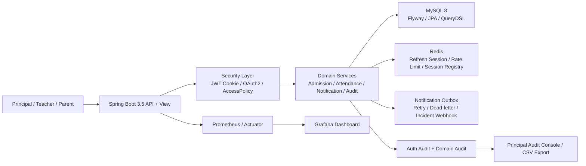

# System Architecture

이 문서는 현재 포트폴리오 기준의 아키텍처 SSOT입니다.

## 1. 한눈에 보는 구조

## 2. 핵심 설계 포인트

- 멀티테넌시 경계는 컨트롤러가 아니라 서비스 계층의 `requesterId` 검증과 `AccessPolicyService`로 강제합니다.
- 인증은 JWT cookie 기반 stateless이지만, refresh token과 access session registry는 Redis에 저장해 세션 단위 제어를 가능하게 했습니다.
- 운영형 워크플로우는 CRUD 대신 상태 전이로 모델링했습니다.
  - 입학: `PENDING -> WAITLISTED -> OFFERED -> APPROVED / OFFER_EXPIRED`
  - 출결 변경: `PENDING -> APPROVED / REJECTED / CANCELLED`
- 감사 로그는 목적별로 분리했습니다.
  - `auth_audit_log`: 로그인/refresh/소셜 연결 같은 보안 사건
  - `domain_audit_log`: 입학/출결/공지 같은 업무 상태 전이
- 외부 알림 전달은 동기 호출이 아니라 `notification_outbox`로 비동기화해 retry/dead-letter를 보장합니다.

## 3. 요청 흐름

### 인증/세션

1. 사용자가 로그인하면 access/refresh token이 cookie로 발급됩니다.
2. refresh token과 세션 메타데이터는 Redis에 저장됩니다.
3. 로그인 실패는 `auth_audit_log`에 남고, 임계치 초과 시 principal alert와 incident webhook fan-out이 발생합니다.

### 운영 워크플로우

1. 학부모 입학 신청은 정원 상태에 따라 waitlist 또는 offer 대상으로 전환됩니다.
2. 학부모 출결 변경 요청은 `AttendanceChangeRequest` aggregate에 저장됩니다.
3. 교사/원장의 승인 시점에만 최종 `Attendance`가 반영됩니다.
4. 주요 상태 전이는 `domain_audit_log`와 principal console에 남습니다.

## 4. 운영/검증 체계

- MySQL/Redis Testcontainers + Flyway로 통합 테스트를 수행합니다.
- CI는 `fastTest`, `integrationTest`, `performanceSmokeTest`로 분리합니다.
- readiness probe는 `criticalDependencies`를 통해 DB/Redis 의존성을 반영하고, liveness와 분리합니다.
- Prometheus/Grafana로 auth event와 운영 메트릭을 확인할 수 있습니다.

## 5. 면접에서 말할 문장

`단순 CRUD 구조가 아니라, 권한 경계 -> 상태 전이 -> 감사 추적 -> 운영 관측성 -> 실환경 테스트까지 연결되는 백엔드 구조로 다듬었습니다.`
