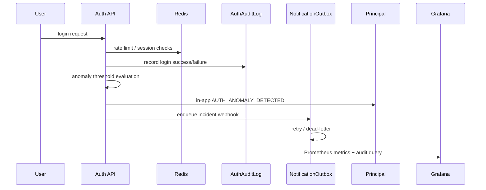

# Auth Incident Response Case Study

이 문서는 인증 이상 징후 대응 흐름의 케이스 스터디 SSOT입니다.

## 문제

초기 구조는 로그인 실패를 애플리케이션 로그에만 남기고 끝났습니다. 이 상태에서는 반복 실패가 발생해도 운영자가 바로 인지하기 어렵고, 사후 분석 근거도 약했습니다.

## 바꾼 구조

## 구성 요소

- `auth_audit_log`: 로그인/refresh/소셜 연결 성공·실패 저장
- `AuthAnomalyAlertService`: 반복 실패 threshold, cooldown 관리
- `notification_outbox`: 외부 incident channel 비동기 전달
- Prometheus/Grafana: `erp_auth_events_total` 기반 운영 지표
- principal console: auth audit 조회와 CSV export
- Redis: refresh/session/rate-limit/auth anomaly cooldown의 핵심 의존성

## 왜 이렇게 했는가

- 탐지와 전달을 분리해야 외부 채널 실패가 로그인 요청 자체를 망치지 않습니다.
- outbox claim은 MySQL 8의 `FOR UPDATE SKIP LOCKED`로 가져가 멀티 인스턴스에서도 같은 incident row를 중복 발송하지 않게 했습니다.
- 보안 사건은 UI, export, metrics 세 경로로 봐야 대응 속도와 사후 분석이 모두 가능합니다.
- `auth_audit_log`와 `domain_audit_log`를 분리해야 보안 사건과 업무 책임을 섞지 않게 됩니다.

## 면접 포인트

- `로그만 남긴 것이 아니라, 저장 -> 알림 -> 외부 incident -> 메트릭 -> export 흐름을 닫았습니다.`
- `실패 경로는 outbox retry/dead-letter와 atomic claim으로 분리했고, 로그인 자체는 가능한 한 빨리 끝나도록 했습니다.`
- `Redis는 단순 캐시가 아니라 auth 경로의 critical dependency라서 readiness에도 반영했습니다.`
- `readiness/liveness 분리와 태그 기반 Gradle test task + CI job 분리까지 포함해 운영 관점으로 설명할 수 있습니다.`
